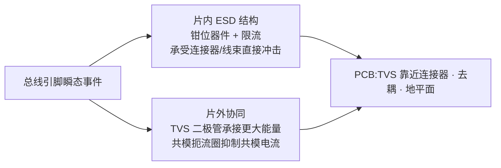

# ESD 与总线保护参数设计要点

## 模块职责

总线引脚必须扛住静电放电、总线短路、抛负载与瞬态;保护设计同时不能拖垮正常通信(寄生电容、漏电、延迟)。核心矛盾:**高压耐压** vs **低压核心器件** vs **高速信号质量**。

## 参数设计要点表

| 参数 | 符号 | 规格参考 | 设计要点 |
| --- | --- | --- | --- |
| 一般最大额定值 | VCAN_H/L | −27 ~ +40 V(ISO 11898-2:2024 表 2) | 直流故障不损坏;分压/钳位按单脚 40 V 设计 |
| 扩展最大额定值 | VCAN_H/L | −58 ~ +58 V(可选) | 更高规格 OEM 要求;器件耐压升级 |
| 差分最大额定值 | VDiff | −5 ~ +10 V(表 2) | 单脚组合不保证;差模路径单独评估 |
| 未加电漏电流 | ICAN_H/L | ≤ ±10 µA(表 11) | 睡眠开关断开分压网络;高温漏电重点 |
| 输入电阻匹配 | mR | ±0.03 | 分压支路匹配,共模→差模抑制 |
| 器件级 ESD(HBM) | — | ≥ ±8 kV(CANH/CANL,AEC-Q100-002) | 焊盘 ESD 单元 + 二级保护 |
| 器件级 ESD(IEC) | — | ±6~8 kV(IEC 61000-4-2) | 系统级更强,配合外部 TVS |
| 总线瞬态 | — | ISO 7637-2 / 抛负载 | 串阻 + 钳位 + 外部 TVS 协同 |

## "80V 耐压"先明确口径

| 定义 | 含义 | 设计差异 |
| --- | --- | --- |
| 单脚对 GND ±40 V | 每脚 ±40 V,两脚差分最大 80 V | 分压/钳位按单脚 40 V 设计 |
| 单脚对 GND ±80 V | 每脚绝对耐压 80 V | 分压比、器件耐压、钳位全面升级 |
| 差分 ±80 V | CANH−CANL 最大 80 V(一脚 40 V、一脚 −40 V) | 差模路径承受 80 V,单脚仍按 40 V |
| 瞬态(ISO 7637) | 短时脉冲 | 允许短时超 DC 规格,靠串阻+钳位+TVS |

## 输入衰减器与 80V 耐压

直接连接总线的输入网络是保护的第一道闸(详见[接收比较器设计要点](receiver.md)):

| 方案 | 分压比 | 说明 |
| --- | --- | --- |
| 纯分压 | 8:1 ~ 16:1 | 80 V → 5~10 V;比例大导致电阻面积、漏电、失调增大 |
| 分压 + 钳位 | 4:1 ~ 8:1 | 钳位把内部节点限制在电源轨 ±0.7 V,分压比放宽 |
| 两级保护 | 串阻 → 钳位 → 分压 | 第一级泄放瞬态电流,第二级保护比较器,抗 ESD/抛负载更稳 |

钳位二极管方向:CANH/CANL 内部节点到 VCC 与 GND 各一个;瞬态电流由串阻限制,节点电压钉在电源轨附近。**注意钳位结电容进入输入 RC,影响 8 Mbit/s 采样点。**

## 器件与工艺要点

- **高压器件**:输入网络与输出级高压串联管用 LDMOS/DMOS;80 V 规格建议器件 BV ≥ 100 V,考虑漏源间距、场板与 ESD 注入。
- **电阻**:耐压足够、温漂小的 poly/高阻层;大阻值电阻在高温高压下漏电与电压系数不可忽略。
- **钳位器件**:二极管、齐纳或 ggNMOS;击穿电压、漏电、寄生电容三者平衡。
- **睡眠开关**:睡眠时用高压开关断开分压网络,把总线漏电流降到 µA 级。
- **未上电行为**:总线引脚高阻、漏电小,不影响网络上其他已供电节点。

## 片内/片外防护分工

- 片内结构承担器件级 HBM/CDM/IEC;系统级(ISO 10605/SAE J2962-2,加电空气放电 ±15 kV 级)通常需要外部 TVS。
- TVS 钳位电压建议低于收发器总线引脚绝对最大值(典型 58~70 V);**TVS 寄生电容会劣化高速回波损耗与边沿**,选型时与芯片输入电容统筹。

## ESD 与闩锁

- 两级保护:焊盘级 ESD 单元主泄放 + 内部第二级钳位保护比较器栅氧,两级之间用串阻隔离。
- 高压域最易闩锁:所有井加足够 well tie / substrate tie、guard ring,避免寄生 SCR 导通。
- 版图:高压节点与低压节点留足够 spacing;高压走线不要与敏感比较器输入平行长距离走线。

## 验证清单

| 项目 | 方法 |
| --- | --- |
| 直流耐压 | 单脚 ±40 V(或 ±80 V)长时间浸泡,测漏电与功能 |
| 短路故障 | 单脚短路 VBAT/GND/VCC,另一脚正常通信;四类短路组合 |
| 瞬态 | ISO 7637-2 脉冲、抛负载、IEC 62228 发射/抗扰 |
| ESD | HBM/CDM、IEC 61000-4-2(±8 kV/±15 kV 接触/空气) |
| 高温漏电 | 150 °C 下总线引脚漏电流与分压网络漏电 |
| 高速功能 | 8 Mbit/s 下输入网络 RC 对位宽、采样点的影响 |
| 匹配 | 分压比与电阻匹配对阈值、CMR、EMC 的影响 |

## 常见陷阱

- **把最大额定值当工作范围**:−27~+40 V 是"不损坏"的静态极限,不是工作范围,需留故障余量。
- **HBM 与 IEC 数值直接比较**:放电网络不同(100 pF/1.5 kΩ vs 150 pF/330 Ω),不可横向比较。
- **TVS 越大越好**:寄生电容劣化高速信号,需钳位能力与电容折衷。
- **忽略闩锁**:80 V 高压域寄生 SCR 是流片后"莫名其妙失效"的高发原因。

## 参见

- [接收比较器参数设计要点](receiver.md)(输入衰减网络)
- 知识库:[ESD 保护与共模抑制](../knowledge/transceiver-design/esd-common-mode.md)、[SIC 设计专题·设计篇](../knowledge/sic-design/design.md)
- 厂商资料:[TI SLVAFC1(ESD 防护)](../resources/_entries/vendors/ti-slvafc1.md)、[NXP AH1308(应用提示)](../resources/_entries/vendors/nxp-ah1308.md)、[TCAN1462-Q1](../resources/_entries/vendors/ti-tcan1462-q1.md)
- 词条:[ESD](../glossary/esd.md)、[AEC-Q100](../glossary/aec-q100.md)、[共模扼流圈](../glossary/common-mode-choke.md)
