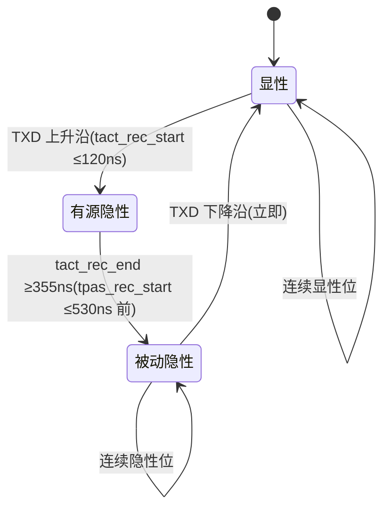

# 输出级参数设计要点

## 模块职责

输出级把 **TXD** 数字信号转换为 CANH/CANL 差分总线电平,并承担:显性强制驱动、隐性高阻释放、边沿斜率控制、SIC 三态阻抗切换、发送路径延迟 tTX。它是"把控制器逻辑变成总线物理"的最后一公里,也是 SIC 性能的核心。

## 参数设计要点表

| 参数 | 符号 | 规格(Set C / 器件级) | 设计要点 |
| --- | --- | --- | --- |
| 显性 CAN_H 单端电压 | VCAN_H | +2.75 ~ +4.5 V(RL=50~65 Ω) | 上拉支路驱动电流与电源轨设计;过高推高共模、劣化 Vsym |
| 显性 CAN_L 单端电压 | VCAN_L | +0.5 ~ +2.25 V | 下拉支路对称;与 VCAN_H 共同决定 VDiff |
| 正常负载差分电压 | VDiff | +1.5 ~ +3.0 V | 驱动电流 × 负载电阻;建议目标 2.0 V 附近 |
| 仲裁期间差分电压 | VDiff | +1.5 ~ +5.0 V(RL=2240 Ω,32 节点) | 多节点同时显性时单节点负载变小,输出不能失控 |
| 驱动电流 | ICAN_H / ICAN_L | ≤ 115 mA(单端) | 输出管尺寸、导通电阻、灌/拉对称 |
| 驱动对称性 | Vsym_vcc / Vsym_vrec | 0.9 ~ 1.1 | 上下支路电流镜像精度,直接影响 EMC 发射 |
| 显性输入电阻 | Ri(dom) | 典型 ≤ 30 Ω(单端) | 低阻强制驱动;与短路保护折衷 |
| 有源隐性差分阻抗 | RDIFF_act_rec | 75 ~ 133 Ω | 阻尼 vs 总线负载折衷,建议可编程/校准 |
| 显性→隐性窗口 | tact_rec_start / end | ≤120 ns / ≥355 ns | SIC 控制逻辑时序,见[sic-control](sic-control.md) |
| 被动隐性开始 | tpas_rec_start | ≤ 530 ns | 高阻切换必须 glitch-free |
| TXD→总线延迟 | tprop(TXD_BUS) | ≤ 80 ns | 预驱动 + 输出级,计入[tLoop 预算](timing-budget.md) |
| 发送隐性位宽偏差 | ΔtBit(Bus) | −10 ~ +10 ns | 边沿整形对称性,建议目标 ±6 ns |
| TXD 显性超时 | tto(dom)TXD | 0.8 ~ 9 ms(器件级) | TXD 卡显性时关断驱动器,失效安全 |

## 三态阻抗架构

| 相位 | 输出阻抗 | 驱动行为 | 设计要点 |
| --- | --- | --- | --- |
| 显性 | 低(约 50 Ω 量级) | 强制驱动差分 | 大电流、低 Ron、对称灌/拉、可承受总线故障 |
| 有源隐性 | 75~133 Ω(RDIFF_act_rec) | 主动向隐性放电 | 阻抗精确可控、可编程/校准覆盖 PVT |
| 被动隐性 | 约 60 kΩ | 高阻,总线自然放电 | 高阻漏电小、与仲裁兼容 |

## 关键设计点

### 1. 驱动电流与电平建立

- 显性差分电压 = 驱动电流 × 并联负载(两端 60 Ω 终端 = 60 Ω 差分,实际含节点输入电阻)。按 VDiff ≥ 1.5 V、负载 50~65 Ω 反推最小驱动电流(约 30 mA 量级以上,实际器件更高)。
- CANH/CANL 两路必须对称:上拉与下拉支路电流镜像精度决定 Vsym_vcc(0.9~1.1);不对称直接表现为共模发射(FM/AM 频段)。
- 输出管要能承受总线对电源/地短路、负压(ISO 7637)等故障,常配高压/负压保护串联管(见[ESD 与总线保护](esd-protection.md))。

### 2. 斜率控制与 EMC

- 斜率(限制 dV/dt)压低高频分量与反射幅度,是控制传导发射的基本手段;但 5 Mbit/s 位时间仅 200 ns,边沿不能占用过多位时间。
- 分段斜率(Microchip US11539548B2 思路):主驱动器分成 N 个并联小驱动器,禁用信号经串联延迟线逐级到达,边沿切成多段缓变;不改变总线差分阻抗。
- 驱动对称性 Vsym_vcc 与斜率控制共同决定 EMC 表现;高速数据相位下斜率是 EMC、振铃、时序三者的共同折衷点。

### 3. SIC 有源隐性阻抗

- RDIFF_act_rec 75~133 Ω 窗口:阻抗过低过度加载总线(仲裁相位多位同时驱动时显性位必须能覆盖隐性位),过高失去阻尼作用。
- 实现:主驱动级之外的辅助驱动支路(约 100 Ω 量级),配合 SIC 控制逻辑按时序接入/关断。
- **必须可编程/校准**:工艺角与温度会使电阻漂移,建议留校准位,流片后按实测调整。
- 有源→被动切换必须 glitch-free;TXD 变 LOW 必须立即切回显性(仲裁兼容,不能有迟滞窗口)。

### 4. TXD 输入与失效安全

- TXD 输入带迟滞、内部上拉/下拉保证失效安全(引脚悬空时不会把总线卡在显性)。
- **TXD 显性超时保护(DTO)**:TXD 持续显性超过 tto(dom)TXD(0.8~9 ms)时关断驱动器释放总线,防止控制器故障拖垮网络;恢复条件(TXD 回隐性)后自动恢复。

## 常见陷阱

- **误区:显性差分电压越大越好** —— 表 5 同时约束 VCAN_H/VCAN_L/VDiff,推得过高会劣化共模对称性与 EMC。
- **误区:有源隐性窗口越长越好** —— 窗口超出 530 ns 会占用仲裁相位、妨碍显性覆盖;按网络长度可编程才是正解。
- **误区:斜率只影响 EMC** —— 斜率同时决定采样点稳定度与反射幅度,高速下是时序问题。
- **误区:输出级只做低压器件** —— 总线故障(−27~+40 V 甚至 ±58 V)下输出管必须耐压,高压串联管与 ESD 结构要一起设计。

## 参见

- [参数集与规格基线](parameter-sets.md) / [时序链路预算](timing-budget.md)
- [SIC 控制逻辑设计要点](sic-control.md) / [振铃抑制电路设计要点](ring-suppression.md)
- 知识库:[输出级:差分驱动与显性/隐性电平](../knowledge/transceiver-design/output-stage.md)、[SIC 设计专题·设计篇](../knowledge/sic-design/design.md)
- 专利全文:[US9606948B2 隐性抵消](../resources/full-text/us9606948b2-recessive-nulling.md)、[US11539548B2 阻抗匹配+斜率控制](../resources/full-text/us11539548b2-microchip-sic.md)
- 厂商资料:[NXP TJA1463 数据手册全文](../resources/full-text/tja1463-datasheet.md)、[TI SLLA581 白皮书全文](../resources/full-text/slla581-white-paper.md)
