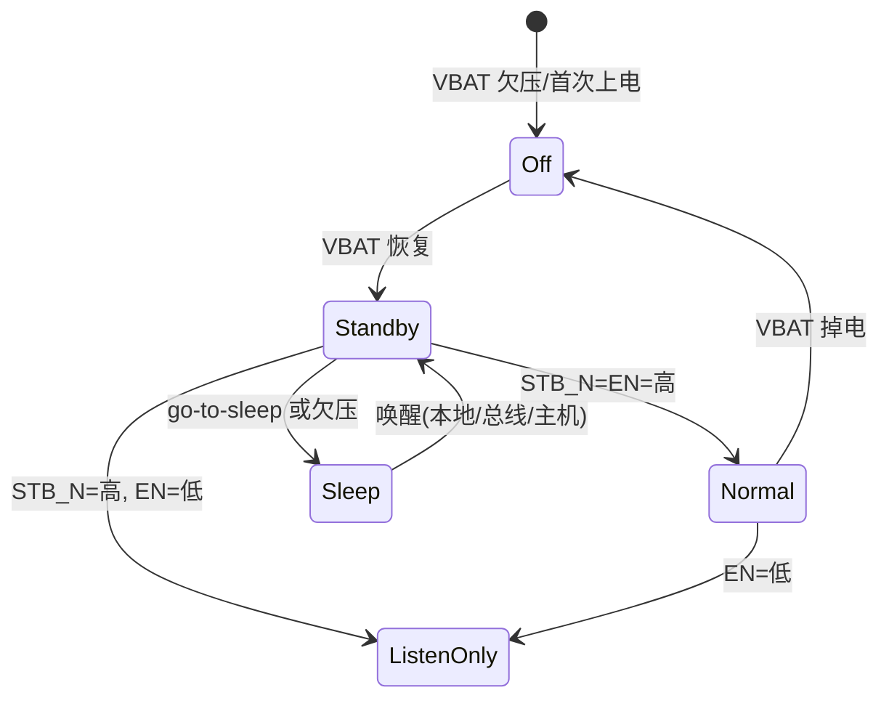
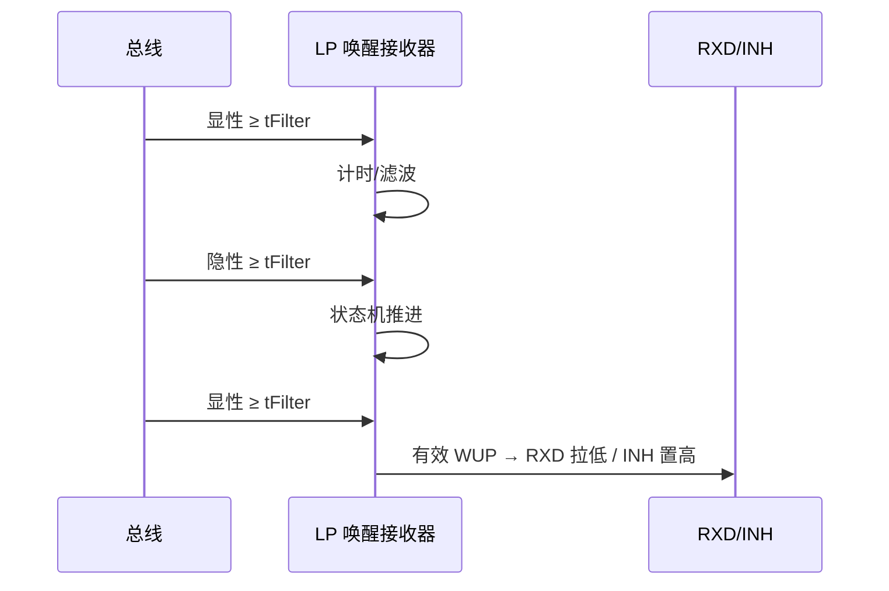

# 电源管理、模式控制与唤醒设计要点

## 模块职责

电源管理(UVLO、VIO 电平转换)、模式状态机(Normal/Standby/Sleep/Listen-only)与唤醒检测(WUP/WUF)共同决定收发器的**低功耗行为、失效安全与车规可用性**。对模拟 IC 工程师,这一模块的难点在低功耗模拟(唤醒比较器、定时器)与模式切换的毛刺控制。

## 参数设计要点表

| 参数/功能 | 规格参考 | 设计要点 |
| --- | --- | --- |
| 欠压保护 UVLO | VCC/VIO 阈值典型值以器件手册为准 | 阈值迟滞、上电/掉电时序,防模式抖动 |
| VIO 电平转换 | 支持 1.8/3.3/5 V MCU | RXD 输出级随 VIO;低 VIO 延迟增大(计入 tLoop) |
| Standby 电流 | µA 级(整机约 40 µA 量级) | LP 比较器弱反型/占空比机制 |
| Sleep 电流 | 更低(µA 以下量级) | 分压网络断开、唤醒比较器独立供电 |
| 唤醒滤波 tFilter | 长 0.5~5.0 µs / 短 0.15~1.8 µs | 抗噪 vs 唤醒可靠性;模拟定时器覆盖工艺角 |
| 唤醒超时 tWake | 800 µs ~ 10 ms(可选) | 总线持续活动检测 |
| WUP | 显性 ≥ tFilter → 隐性 ≥ tFilter → 显性 ≥ tFilter | 三段时序状态机,防误唤醒 |
| WUF(选择性唤醒) | 按帧 ID 过滤 | 需要接收器解析帧头,功耗更高 |
| CAN FD passive | 睡眠节点忽略无关 FD 帧 | 部分网络节点的关键能力,防误唤醒 |
| TXD 显性超时 DTO | 0.8~9 ms(器件级) | 控制器故障时释放总线 |
| 总线显性超时 | tto(dom)bus 0.8~9 ms(器件级) | 总线卡显性故障检测 + 诊断输出 |

## 模式状态机

!!! note "器件差异"
    不同器件的模式引脚与状态机不同(如 TJA1463 的 STB_N/EN、TCAN1462 的 STB/INH),设计时以具体数据手册为准;上表是典型结构。

## 唤醒时序(WUP)

## 关键设计点

### 1. 低功耗唤醒接收器

- LP 比较器结构:衰减器 → 共栅放大器 → 偏移产生 → 滤波判定;共栅级在低压域完成电平搬移,适合宽共模、大摆幅输入。
- 功耗与带宽折衷:WUP 是 µs 级慢信号,LP 通路不需要高速,把带宽做窄换取功耗与抗扰。
- 滤波窗口 min/max 决定抗噪与唤醒可靠性:窗口太宽误唤醒,太窄漏唤醒;模拟定时器(RC/电流源)必须覆盖工艺角与温度。
- 防误唤醒:WUP 状态机要求"显性→隐性→显性"三段都满足时序,任意一段不满足即复位。

### 2. 选择性唤醒(WUF)与 CAN FD passive

- WUF 按帧 ID 过滤:睡眠节点需要解析帧头(仲裁场),接收器需在低功耗下工作一段时间,功耗高于纯 WUP。
- **CAN FD passive**:部分网络节点在 Sleep 时必须能识别并忽略网络上无关的 CAN FD 帧(EDL 隐性),否则会被总线活动误唤醒;未实现 CAN FD passive 是选择性唤醒方案的常见坑。

### 3. UVLO 与上电/掉电

- UVLO 阈值需迟滞,避免电源在阈值附近抖动导致模式反复切换。
- 冷启动、VIO 欠压、VCC 关断不能产生虚假唤醒请求;RXD 输出使能依赖 VIO。
- 上电顺序:VCC/VIO/VBAT 不同组合下,总线引脚不能出现短暂错误驱动(显性毛刺)。

### 4. 故障诊断与失效安全

- TXD 显性超时(DTO)与总线显性超时检测:超时后释放总线/报故障,经 ERR_N 等引脚轮询诊断。
- 过温保护(TSD)、欠压保护与总线故障保护联动:进入保护时输出状态必须确定(高阻/隐性)。
- 本地故障(TXD-RXD 短路、总线持续显性)的检测电路要避免误报(毛刺滤波)。

## 常见陷阱

- **未做 CAN FD passive**:睡眠节点被无关 FD 帧误唤醒,整车静态电流超标。
- **滤波窗口不覆盖工艺角**:tFilter 漂移出 ISO 窗口,量产批次误唤醒/漏唤醒。
- **VIO 低电压延迟漏算**:1.8 V VIO 下 RXD 延迟增大,时序预算要复核。
- **模式切换毛刺**:Normal↔Standby 切换瞬间 RXD/总线输出毛刺,需要消隐/去抖。

## 参见

- [接收比较器参数设计要点](receiver.md)(LP 比较器)/ [时序链路预算](timing-budget.md)
- 知识库:[SIC 设计专题·原理篇](../knowledge/sic-design/principle.md)(唤醒机制 §4.5)、[ESD 保护与共模抑制](../knowledge/transceiver-design/esd-common-mode.md)(模式状态机)
- 教程:[CAN FD 位定时配置实战](../tutorials/06-bit-timing-config.md)
- 厂商资料:[TJA1463 数据手册全文](../resources/full-text/tja1463-datasheet.md)、[TCAN1462-Q1](../resources/_entries/vendors/ti-tcan1462-q1.md)、[NXP TJA1464(ASIL B)](../resources/_entries/vendors/nxp-tja1464.md)
