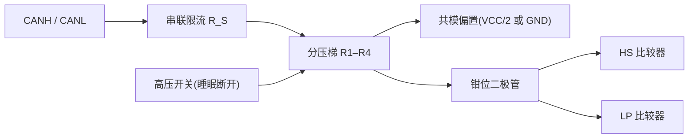

# 接收比较器参数设计要点

## 模块职责

接收比较器把 CANH/CANL 差分电压恢复为 **RXD** 逻辑电平。收发器通常有两条接收通路:**HS 比较器**(Normal/Silent 实时接收)与 **LP 比较器**(Standby/Sleep 低功耗唤醒)。两者共用总线引脚与输入网络,输出经 MUX 选择。

## HS 比较器参数设计要点表

| 参数 | 符号 | 规格参考 | 设计要点 |
| --- | --- | --- | --- |
| 显性阈值 | VIT+ | ≥ 0.9 V(形式化);器件典型中心 ~0.7 V | 输入失调、分压失配、温漂都会移动阈值 |
| 隐性阈值 | VIT− | ≤ 0.5 V | 与显性阈值构成迟滞窗口 |
| 迟滞 | VHYS | 100~200 mV(器件级) | 覆盖失调+噪声,又不能吃掉显性电平裕量 |
| 共模输入范围 | VCM | −12 ~ +12 V(表 7/8 条件) | 输入衰减网络把内部节点限制在低压域 |
| 单端输入电阻 | RSE | 6~50 kΩ;匹配 mR ±0.03 | 两脚失配把共模转差模 |
| 差分输入电阻 | RDIFF | 12~100 kΩ(被动隐性) | 总线负载与带宽折衷 |
| 输入电容 | Ci(cm)/Ci(dif) | ≤30 pF / ≤15 pF(器件级) | 与 TVS 寄生电容统筹,影响高速响应 |
| 接收延迟 | tprop(BUS_RXD) | ≤ 110 ns(Set C) | 输入网络 + 比较器 + RXD 输出级 |
| 接收对称性 | ΔtRec | −20 ~ +15 ns | 比较器群延迟对称,直接消耗采样裕量 |
| 未上电漏电 | ICAN_H/L | ≤ ±10 µA(表 11) | 断电节点不拖垮已供电网络 |

## 输入衰减网络:80V 耐压的起点

总线引脚必须承受 −27~+40 V(扩展 ±58 V)甚至单脚 ±40 V/差分 80 V 的故障场景,而比较器核心工作在低压域。输入衰减网络承担电压缩放、共模搬移、输入阻抗定义、瞬态限流与漏电控制:

| 设计参数 | 权衡 |
| --- | --- |
| 分压比 8:1~16:1 | 比例大 → 电阻面积/漏电/失调增大;比例小 → 钳位压力大 |
| 串联电阻 R_S | 大 → RC 延迟影响 8 Mbit/s;小 → 钳位电流大 |
| 钳位电平 | 必须低于输入器件耐压,且不影响正常信号摆幅 |
| 电阻匹配 ±1%~3% | 失配把共模噪声转差模,阈值漂移、EMC 变差 |
| 睡眠开关 | 睡眠/未上电断开分压网络,漏电 ≤ µA 级 |

!!! tip "输入网络带宽"
    输入网络(串阻 + 分压 + 钳位电容 + 寄生)形成 RC 低通,建议 −3 dB 带宽 ≥ 50~100 MHz,并检查 125 ns 位时间下的位宽失真。

## 比较器核心设计点

### 阈值与迟滞

- 标准形式化限值:隐性 ≤ +0.5 V、显性 ≥ +0.9 V(表 7/8);实际器件翻转点典型 ~0.7 V,留有裕量。
- 迟滞在阈值附近引入判决窗口(上升沿/下降沿不同判决点),抑制振铃与噪声引起的比较器抖动;TJA1463 保证差分迟滞 ≥ 100 mV。
- 迟滞宽度是"抗噪"与"误判/时序裕量"的折衷:过宽改变有效采样边界,过窄抗扰不足。

### 共模抑制的两个层次

1. **宽共模输入级**:四象限输入电路(Infineon US10042807B2 思路)——以电流为输入、共模电流补偿差分电流,宽共模摆幅下保持对称。
2. **引脚电容/电阻平衡**:CANH/CANL 寄生电容不平衡会把共模瞬态转成差分扰动(ISO 共模抑制测试失败的根因),需把两脚电容配平到约 10 pF 内、电阻匹配 mR ±0.03。

### 延迟与对称性

- 比较器传播延迟不对称(上升/下降、温度/电压漂移)反映在 ΔtRec(−20~+15 ns)与 tRX(≤110 ns),限制 TDC 精度与数据相位速率。
- 输入网络 RC 与比较器带宽共同决定群延迟;滤波/消隐逻辑的延迟也要对称。
- RXD 输出级随 VIO 电压变化(1.8 V VIO 下延迟显著增大),低 VIO 设计留裕量。

### OOB 判别(CAN XL 兼容)

FAST/多协议场景需要 **OOB(Out-of-Bounds)比较器** + 状态机:对差分电压做超范围判别,只在确认对应协议电平后向 RXD 输出信令,避免把 CAN XL 电平误报为 CAN FD 毛刺。表 A.7 窗口:OOB 低态 −8.0~−0.45 V、高态 −0.25~+8.0 V。

## LP 比较器(唤醒接收器)设计要点

| 参数 | 说明 | 设计要点 |
| --- | --- | --- |
| 静态电流 | µA 级(Standby 总电流约 40 µA 量级) | 弱反型/亚阈值区或占空比机制 |
| 阈值 | Standby 400~1150 mV(比 Normal 宽) | 容忍低功耗比较器更大失调 |
| 滤波时间 | tWK_FILTER 在 ISO short/long 窗口内 | 抗噪 vs 唤醒可靠性;模拟定时器覆盖工艺角与温度 |
| 输出 | 有效 WUP 后 RXD 拉低、INH 置高 | 与模式控制联动 |
| 结构 | 衰减器 → 共栅放大 → 偏移产生 → 滤波判定 | 共栅级在低压域完成电平搬移 |

- 防误唤醒:WUP 滤波 + 状态机要求"显性→隐性→显性"三段都满足时序,任意一段不满足即复位。
- 冷启动/VIO 欠压/VCC 关断不能产生虚假唤醒请求;RXD 输出使能依赖 VIO。

## 常见陷阱

- **阈值不是固定 0.7 V**:0.7 V 是典型值,合规边界是 0.5/0.9 V,设计分析用范围两端。
- **共模范围不只是输入级电路**:引脚电容/电阻不平衡是共模→差模转换的物理根因,版图对称是前提。
- **迟滞不是越大越好**:与振铃周期和位时间匹配设计。
- **输入网络不是"分压就完事"**:RC 带宽、钳位结电容、睡眠漏电、匹配度要一起验证,尤其 8 Mbit/s。

## 参见

- [时序链路预算](timing-budget.md) / [ESD 与总线保护设计要点](esd-protection.md)
- 知识库:[接收比较器:阈值、共模范围与迟滞](../knowledge/transceiver-design/receiver-comparator.md)、[ESD 保护与共模抑制](../knowledge/transceiver-design/esd-common-mode.md)
- 专利:[US10042807B2 四象限输入](../resources/_entries/patents/us10042807b2.md)、[US7113759B2 电容平衡](../resources/_entries/patents/us7113759b2.md)、[US11588662B1 OOB 判别](../resources/_entries/patents/us11588662b1.md)
- 厂商资料:[TCAN1462-Q1 数据手册](../resources/_entries/vendors/ti-tcan1462-q1.md)、[TJA1463 数据手册全文](../resources/full-text/tja1463-datasheet.md)
