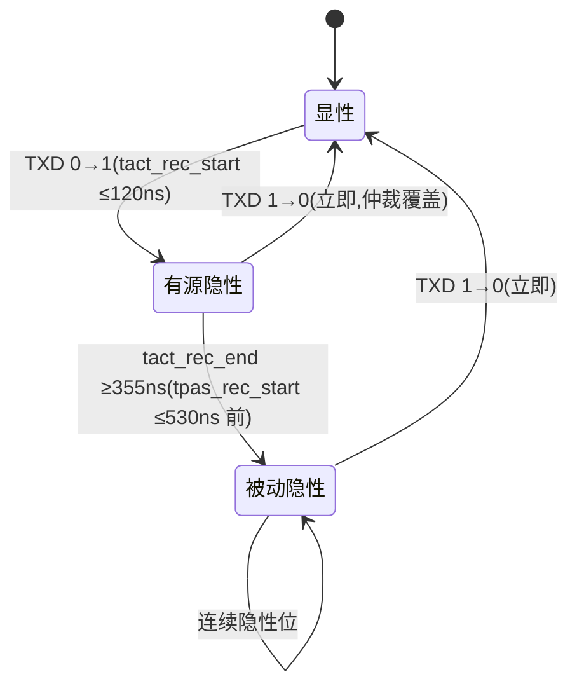

# SIC 控制逻辑参数设计要点

## 模块职责

SIC 控制逻辑检测 **TXD 显性→隐性边沿**,生成有源隐性(active recessive)窗口,并控制输出级在"显性 → 有源隐性 → 被动隐性"三态之间按时序切换。它决定 SIC 是否真正改善信号,也决定芯片在仲裁/混用网络中的兼容性。

## 参数设计要点表

| 参数 | 符号 | 规格(Set C) | 设计要点 |
| --- | --- | --- | --- |
| 有源隐性开始时间 | tact_rec_start | ≤ 120 ns | 边沿检测 + 控制通路延迟;建议目标 ≤ 90 ns |
| 有源隐性结束时间 | tact_rec_end | ≥ 355 ns | 有源驱动最短保持;建议目标 380~430 ns(留 PVT 裕量) |
| 被动隐性开始时间 | tpas_rec_start | ≤ 530 ns | 切回高阻最晚时刻;建议目标 ≤ 490 ns |
| 有源隐性差分阻抗 | RDIFF_act_rec | 75 ~ 133 Ω | 与输出级协同,建议可编程/校准 |
| 切换单调性 | — | 无毛刺(glitch-free) | 阻抗切换不得产生输出电压跳变 |
| 仲裁覆盖 | — | TXD 变 LOW 立即回显性 | 有源隐性相位可被显性立即中断(仲裁兼容) |
| 窗口可编程性 | — | 按网络长度微调 | 建议寄存器位 + 校准;默认值满足 Set C |

## 状态机与窗口

关键窗口数值(ISO 11898-2:2024 Set C,自 TXD 上升沿 50% 阈值起测):

| 事件 | 时刻 | 含义 |
| --- | --- | --- |
| t = 0 | TXD 上升沿 | SIC 控制逻辑开始计时 |
| ≤ 120 ns | tact_rec_start | 输出级必须进入有源隐性(低阻主动放电) |
| ≥ 355 ns | tact_rec_end | 有源隐性至少保持到此刻 |
| ≤ 530 ns | tpas_rec_start | 最晚切回约 60 kΩ 被动隐性 |

!!! note "与位时间的关系"
    5 Mbit/s 数据相位位时间 200 ns,有源隐性覆盖整个隐性位;仲裁相位(如 1 Mbit/s,位时间 1 µs)多位同时发送时,显性位必须能覆盖隐性位——因此窗口上限(530 ns)会限制仲裁速率与网络长度。

## 关键设计点

### 1. 边沿检测

- 检测 TXD 上升沿的延迟直接进入 tact_rec_start;建议用高速比较/施密特输入,检测通路延迟目标 ≤ 30~40 ns。
- 必须抗 TXD 抖动:短于最小脉宽的毛刺不应触发窗口(与控制器时序协调)。

### 2. 窗口定时

- 窗口由片上定时器产生(电流源 + 电容 / 数字计数器),必须覆盖工艺角与温度:建议 tact_rec_end 设计目标 380~430 ns、tpas_rec_start ≤ 490 ns,保证全温全角落在 355~530 ns 合规窗口内。
- 连续隐性位(如 5D1R 位模式)只需在显性→隐性边沿触发一次;连续显性→显性不触发。

### 3. 阻抗切换

- 有源隐性支路与主驱动级并联;接入/断开必须 glitch-free(避免开关瞬态造成输出电压跳变,反而引入振铃)。
- 阻抗切换的建立时间影响 tact_rec_start 达标;建议预驱动整形 + 辅助支路分段导通。
- RDIFF_act_rec 建议可编程/校准:覆盖 PVT 的同时,可按网络特征(短 stub / 长 stub)微调阻尼强度。

### 4. 仲裁覆盖与混用兼容

- 有源隐性相位中 TXD 变 LOW,必须在极短时间内切回显性(显性位覆盖隐性位是仲裁的前提)。
- 与普通 CAN FD 收发器混用时,SIC 节点有源隐性窗口不能"挡住"其他节点的显性驱动;窗口上限 530 ns 与网络传播延迟共同决定混用网络的仲裁约束。
- 若采用 RX 侧振铃滤波(而非 TX 侧有源隐性),需要明确的滤波启动窗口与采样点时序,并验证与不支持 SIC 的节点混用(见[振铃抑制电路设计要点](ring-suppression.md))。

## 常见陷阱

- **窗口过短**:振铃未衰减完就释放,5 Mbit/s 下采样点仍在振荡区。
- **窗口过长**:占空比失真、挤占位时间、妨碍仲裁覆盖;长窗口不是"更 SIC"。
- **只做定时不做校准**:PVT 下窗口漂移出 355~530 ns 合规区。
- **切换有毛刺**:阻抗切换瞬间的电流/电压跳变本身就是新的振铃源。

## 参见

- [输出级参数设计要点](output-stage.md) / [振铃抑制电路设计要点](ring-suppression.md) / [参数集与规格基线](parameter-sets.md)
- 知识库:[SIC 设计专题·原理篇](../knowledge/sic-design/principle.md)(有源隐性机制)、[SIC 设计专题·设计篇](../knowledge/sic-design/design.md)
- 教程:[SIC 是什么](../tutorials/07-what-is-sic.md)、[振铃抑制原理与测量](../tutorials/08-ringing-suppression.md)
- 资源:[TJA1463 数据手册全文](../resources/full-text/tja1463-datasheet.md)、[TI SLLA581 白皮书全文](../resources/full-text/slla581-white-paper.md)
