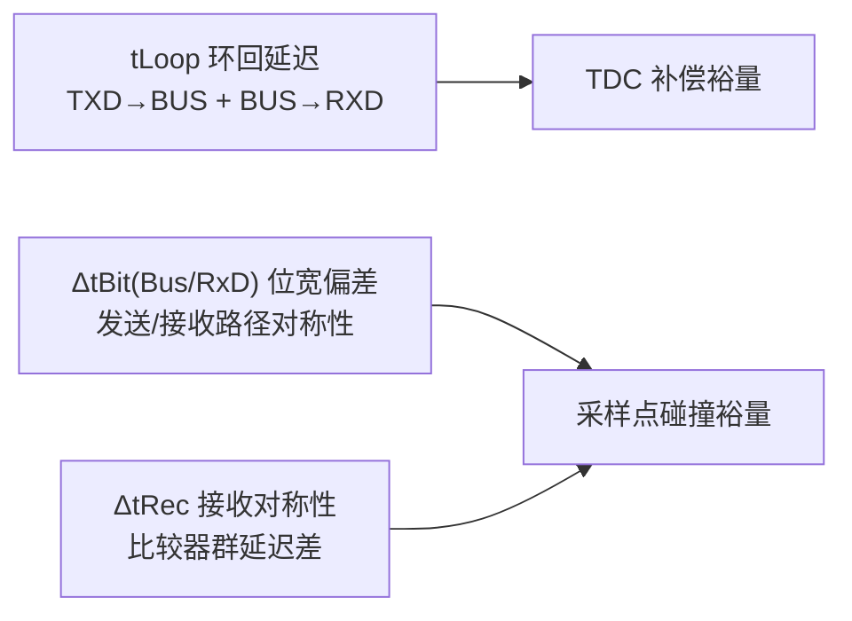
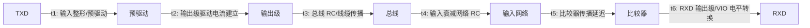
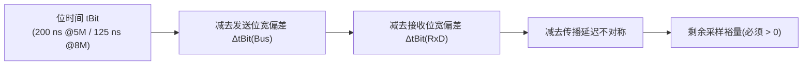

# 时序链路预算

## 为什么先做预算

数据相位 5 Mbit/s 时位时间 200 ns、8 Mbit/s 时约 125 ns。收发器环回延迟与位宽偏差直接进入采样裕量:预算不清晰,模块设计得再好,整颗芯片的时序也会超差。预算的三大组成:

## Set C 预算表

| 预算项 | 符号 | 规格 | 建议设计目标 | 主要贡献模块 |
| --- | --- | --- | --- | --- |
| TXD→总线延迟 | tprop(TXD_BUS) | ≤ 80 ns | ≤ 70 ns | 预驱动、输出级、加速隐性电路 |
| 总线→RXD 延迟 | tprop(BUS_RXD) | ≤ 110 ns | ≤ 95 ns | 输入网络、比较器、RXD 输出级 |
| 环回延迟 | tLoop | ≤ 190 ns | ≤ 170 ns | 上述两项之和 + 版图/封装 |
| 发送隐性位宽偏差 | ΔtBit(Bus) | −10 ~ +10 ns | ±6 ns | 输出级边沿、SIC 窗口时序 |
| 接收位宽偏差 | ΔtBit(RxD) | −30 ~ +20 ns | ±15 ns | 比较器上升/下降延迟差 |
| 接收时序对称性 | ΔtRec | −20 ~ +15 ns | ±12 ns | 比较器群延迟、输入网络 RC |

!!! tip "设计目标怎么定"
    规格是"最坏情况仍然合规",设计目标 = 规格再留 20~30% 余量,并覆盖:工艺角(SS/TT/FF)、温度(−40~150 °C 结温)、电源(±5~10%)、封装与版图寄生。

## 环回延迟拆分

设计要点:

- **t1/t2** 由预驱动整形与输出级驱动能力决定;加速隐性电路(如 recessive nulling)的启动窗口会额外贡献路径延迟,必须计入 tLoop 最坏情况。
- **t4** 是常被低估的一项:输入分压/衰减网络(串阻 + 钳位电容 + 寄生)形成 RC 低通,带宽不足会同时增大延迟与不对称,建议输入网络 −3 dB 带宽 ≥ 50~100 MHz(对应 8 Mbit/s)。
- **t5/t6** 随 VIO 电压变化明显(1.8 V VIO 下 RXD 延迟可能比 3.3 V 大),低 VIO 设计要在预算中留差。
- **版图与封装**:绑定线、ESD 结构寄生、电源去耦不足导致的开关抖动都会进入 tLoop;预算表中应单列"版图/封装"项(建议 ≥ 10 ns)。

## 位宽对称性与采样点

采样点碰撞分析(Adamson 2020 思路):最坏情况采样裕量 = 位时间 − 发送节点 ΔtBit(Bus) − 接收节点 ΔtBit(RxD) − 传播延迟差。SIC 把 ΔtBit(Bus) 从常规 CAN FD 的 −65~+30 ns 收紧到 −10~+10 ns,是数据速率上限突破的关键。

## TDC 与预算的关系

- 数据相位位时间 ≤ 1000 ns 时应启用 TDC;控制器以 **SSP = 实测环回延迟 + 可编程偏移**采样回读位。
- 环回延迟越接近规格上限、随 PVT 漂移越大,TDC 补偿越吃力;把 tLoop 设计目标压到 ≤ 170 ns 是为了给控制器 SSP 留裕量。
- 收发器数据手册给出的 tLoop 是特定条件下的值(RL=60 Ω、C2=100 pF、CRXD=15 pF),设计验证必须按该条件测量,再外推到用户网络。
- 详见[知识库·TDC](../knowledge/bit-timing/tdc.md)与[教程 04:BRS 与 TDC](../tutorials/04-brs-tdc.md)。

## 常见陷阱

- **只测典型值,不测全温全角**:tLoop 与 ΔtBit 在 SS/高温下最容易超差;流片后按 −40/25/150 °C 三温 + 多片抽样测量。
- **把数据手册典型值当设计目标**:典型值通常是 TT/25 °C,规格最大/最小值才是合规边界。
- **忽略输入网络 RC**:8 Mbit/s 下输入网络带宽不足会"吃掉"比较器过驱动,延迟与对称性同时恶化。
- **VIO 低电压场景漏算**:1.8 V VIO 下 RXD 延迟显著增大,产品若支持 1.8 V MCU,预算必须按 1.8 V 复核。

## 参见

- [参数集与规格基线](parameter-sets.md)
- 知识库:[位定时与同步](../knowledge/bit-timing/index.md)、[收发器延迟补偿 TDC](../knowledge/bit-timing/tdc.md)、[相位裕度](../knowledge/bit-timing/phase-margin.md)、[传播延迟对称性](../glossary/propagation-delay-symmetry.md)
- 教程:[BRS 与 TDC](../tutorials/04-brs-tdc.md)、[收发器传播延迟对称性](../tutorials/09-delay-symmetry.md)
- 资源:[CiA 601-1(延迟对称性数值)](../resources/_entries/standards/cia-601-1-physical-interface.md)、[Adamson 2020 论文](../resources/_entries/papers/2020-adamson-5mbps-networks.md)
