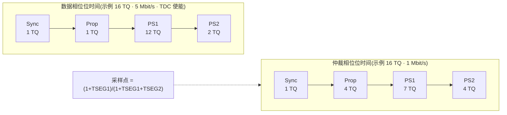
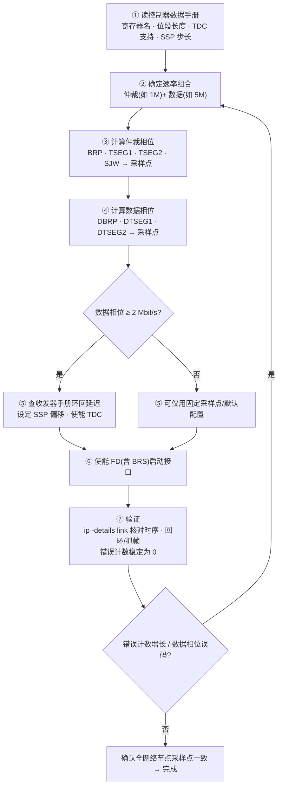
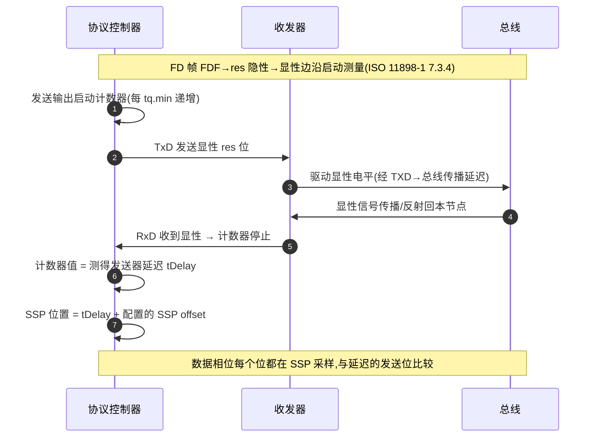

## 概述

CAN FD 控制器通过**寄存器**承载位定时与 TDC 配置:一套**仲裁相位**位定时参数(预分频、TSEG1/TSEG2、SJW)决定采样点位置,一套**数据相位**参数(DBRP、DTSEG1/DTSEG2、TDC 开关与 SSP 偏移)决定 BRS 后的高速位流如何采样。寄存器名与字段布局因控制器型号而异,本页说明**概念与配置逻辑**;具体地址/字段以所使用控制器的数据手册为准,不要照搬其他型号。

位时间由 **TQ(时间量子)** 计数构成:同步段 + 传播段 + 相位缓冲段 1/2。CAN FD 的难点在于它是**两套独立位定时**:仲裁相位一套、数据相位一套,各有一段位时间,段结构相同但参数不同——核心目标只有一个:两个相位都留足相位裕度(教程 06)。

## 仲裁相位位定时:四段结构与采样点

| 配置项 | 作用 |
|---|---|
| 预分频器(BRP) | 由系统时钟生成时间量子 TQ,决定 TQ 长度与位速率 |
| TSEG1(= 传播段 + 相位缓冲段1) | 决定采样点前的时间,吸收传播延迟 |
| TSEG2(= 相位缓冲段2) | 决定采样点后的时间,留出重同步余量 |
| SJW(重同步跳转宽度) | 限制硬/重同步一次最多调整的 TQ 数 |

采样点 = (1 + TSEG1) / (1 + TSEG1 + TSEG2),常用推荐值(如 75%~87.5%)由 ISO 11898 参考与整车网络约定给出,以网络规范为准。



仲裁相位传播段长(吸收总线与收发器延迟);数据相位传播段压到 1 TQ、采样点推后(PS1 大、PS2 小),延迟交给 TDC 补偿。

## 数据相位位定时 + TDC

BRS 切到数据相位后,位时间大幅缩短(5 Mbit/s 时一位约 200 ns),配置要点:

- **DBRP / DTSEG1 / DTSEG2**:数据相位的独立位定时组,原则是**缩短传播段、后置采样点**,把物理层延迟让位给 TDC。
- **TDC 开关**:数据相位 ≥ 2 Mbit/s(位时间 ≤ 500 ns)基本必须使能——ISO 11898-1:2024 7.3.4 要求支持 FD 帧格式的节点**必须支持** TDC,数据相位位时间 ≤ 1000 ns 时应使用(是否必须、开关字段因控制器而异)。
- **SSP 偏移**:TDC 把采样点推迟到 `SSP = 测得发送器延迟 + 配置的 SSP offset`;**偏移值按收发器数据手册的环回延迟设置**(如典型环回延迟量级约 200 ns,具体以所用收发器手册为准),控制器按自身步长取整写入;SSP offset 范围 FD/XL 数据位时间 1 至 160 tq.min(仅 FD 节点 1 至 63 tq.min,ISO 11898-1:2024 表 12/13)。

TDC 机理与环回延迟三段分解见[收发器延迟补偿(TDC/SSP)](../bit-timing/tdc.md)。

## 配置流程:计算采样点 → 查手册 → 写寄存器 → 验证



以 **1M 仲裁 + 5M 数据**、系统时钟 80 MHz 为例(演示数值,按控制器数据手册调整):

```
① 仲裁相位(1 Mbit/s):
   80 MHz / 1 Mbit/s = 80 → 位时间 16 TQ、BRP = 5,TQ = 62.5 ns
   段分配:Sync 1 + Prop 4 + PS1 7 + PS2 4 = 16 TQ
   采样点 = (1+4+7)/16 = 75%

② 数据相位(5 Mbit/s):
   80 MHz / 5 Mbit/s = 16 → 位时间 16 TQ、BRP = 1,TQ = 12.5 ns
   段分配:Sync 1 + Prop 1 + PS1 12 + PS2 2 = 16 TQ
   采样点 = (1+1+12)/16 = 87.5%(TDC 使能后按第二采样点工作)

③ 查收发器手册 → 环回延迟 → SSP offset(按手册步长取整写入),使能 TDC
```

数据相位 16 TQ 对 TQ 分频是下限附近,若控制器要求更多 TQ,需先降分频、提高系统时钟,或接受更低速率——"速率组合受控制器能力限制"的具体含义(教程 06)。

### 常见速率组合

| 组合 | 仲裁相位 | 数据相位 | 说明 |
|---|---|---|---|
| 500k + 2M | 500 kbit/s | 2 Mbit/s | 北美整车基准(SAE J2284-4);经典 HS 收发器可支持 |
| 1M + 2M | 1 Mbit/s | 2 Mbit/s | 常见组合,数据相位需 TDC |
| 1M + 5M | 1 Mbit/s | 5 Mbit/s | 视控制器分频能力与收发器对称性而定,通常需 SIC 级收发器与简单拓扑 |
| 500k + 5M | 500 kbit/s | 5 Mbit/s | SIC 收发器的典型高吞吐配置 |

> ⚠️ **具体数值以控制器数据手册与收发器数据手册为准**:控制器限定了 TQ 分频范围、TDC 精度与第二采样点可配置位数;收发器限定了环回延迟、传播延迟对称性(以及 SIC 的振铃抑制能力)。5 Mbit/s 不是"配置出来就有",要先看收发器能不能支撑(教程 06)。

## SocketCAN 中的落地与验证

```bash
# 配置 1M + 5M(采样点:仲裁 75%、数据 80%)
sudo ip link set can0 up type can \
  bitrate 1000000 sample-point 75% \
  dbitrate 5000000 dsample-point 80% fd on

# 1) 确认内核实际协商出的位定时
ip -details link show can0

# 2) 抓帧观察(应能正常收发 FD 帧)
candump can0 -n 10

# 3) 看接口错误统计——持续增长说明位定时/拓扑有问题
ip -s -details link show can0
```

错误计数器稳定在 0、`candump` 正常打印 FD 帧,配置才算通过;进一步用示波器核对实际采样点位置与眼图裕量(见[示波器抓帧](../tools/scope-capture.md))。

### TDC 环回延迟测量(每帧进行)



TDC 补偿的是延迟的**大小**,无法补偿延迟的**变化**——这正是收发器传播延迟对称性与环回延迟稳定性重要的原因;启用 TDC 时发送器忽略采样点处的位错误,改在 SSP 处比较、在随后采样点反应(7.3.4)。

### 调参常见坑

| 症状 | 常见原因 |
|---|---|
| 数据相位误码/错误帧 | 采样点太靠前、TDC 未使能、收发器不支持该速率 |
| 仲裁正常、数据段偶发失败 | 收发器传播延迟不对称超预算、拓扑过长 |
| 换控制器/收发器后报错 | 位定时被"重新自动计算",检查采样点是否漂移 |
| 全网络时好时坏 | 各节点采样点不一致——所有节点必须用同一套(或兼容的)位定时 |

## 对设计/调试的意义

- **对控制器(嵌入式)**:位定时与 TDC 配置是"把控制器手册、收发器手册、网络速率三者对齐"的过程——采样点与 SSP 的选择直接影响相位裕度与 TDC 补偿精度;配置错误最典型的表现是错误帧计数上升、高速数据相位收发失败。具体寄存器名与字段务必以所使用 MCU 的数据手册为准。
- **对收发器(模拟 IC)**:控制器配置的 TDC/SSP 值取决于收发器的环回延迟与对称性——收发器把 t_loop 做小、做对称、做稳定,控制器才能把采样点算准。ISO 11898-2:2024 参数集 C 把 tLoop 上限收紧到 **190 ns**(TXD→总线 ≤80 ns、总线→RXD ≤110 ns),对应数据相位 >2 Mbit/s 至 5 Mbit/s;收发器设计者理解控制器侧的配置流程,才能读懂客户为何关心环回延迟与对称性指标(见[收发器延迟补偿(TDC/SSP)](../bit-timing/tdc.md))。

## 参见

- 教程:[位定时入门](../../tutorials/03-bit-timing-basics.md)、[BRS 与 TDC](../../tutorials/04-brs-tdc.md)、[CAN FD 位定时配置实战](../../tutorials/06-bit-timing-config.md)
- 词条:[TDC](../../glossary/tdc.md)、[采样点](../../glossary/sample-point.md)、[时间量子](../../glossary/time-quantum.md)、[相位裕度](../../glossary/phase-margin.md)、[传播段](../../glossary/propagation-segment.md)、[重同步跳转宽度](../../glossary/re-sync-jump-width.md)
- 标准规范:[Bosch CAN FD Specification v1.0](../../resources/_entries/standards/bosch-2012-canfd-spec.md)、[ISO 11898-2:2024 关键参数速查](../../resources/standards-text/iso-11898-2-2024-key-parameters.md)
- 相邻子域:[收发器延迟补偿(TDC/SSP)](../bit-timing/tdc.md)、[时间量子与采样点](../bit-timing/time-quantum-sample-point.md)、[SocketCAN](socketcan.md)
