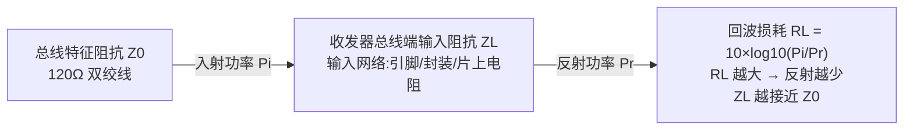
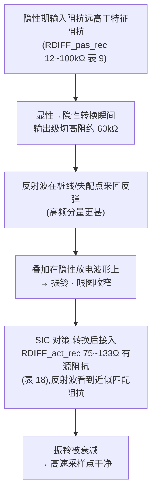
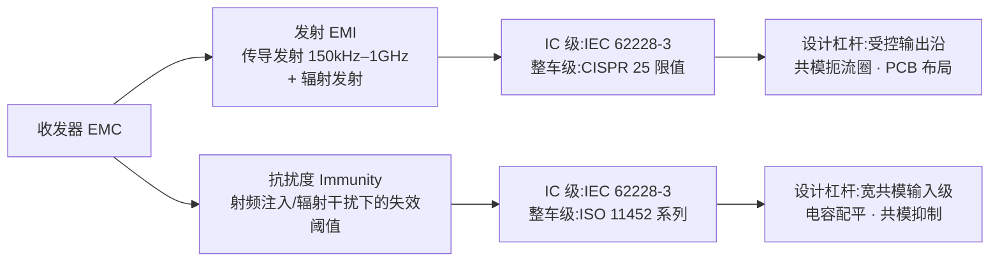
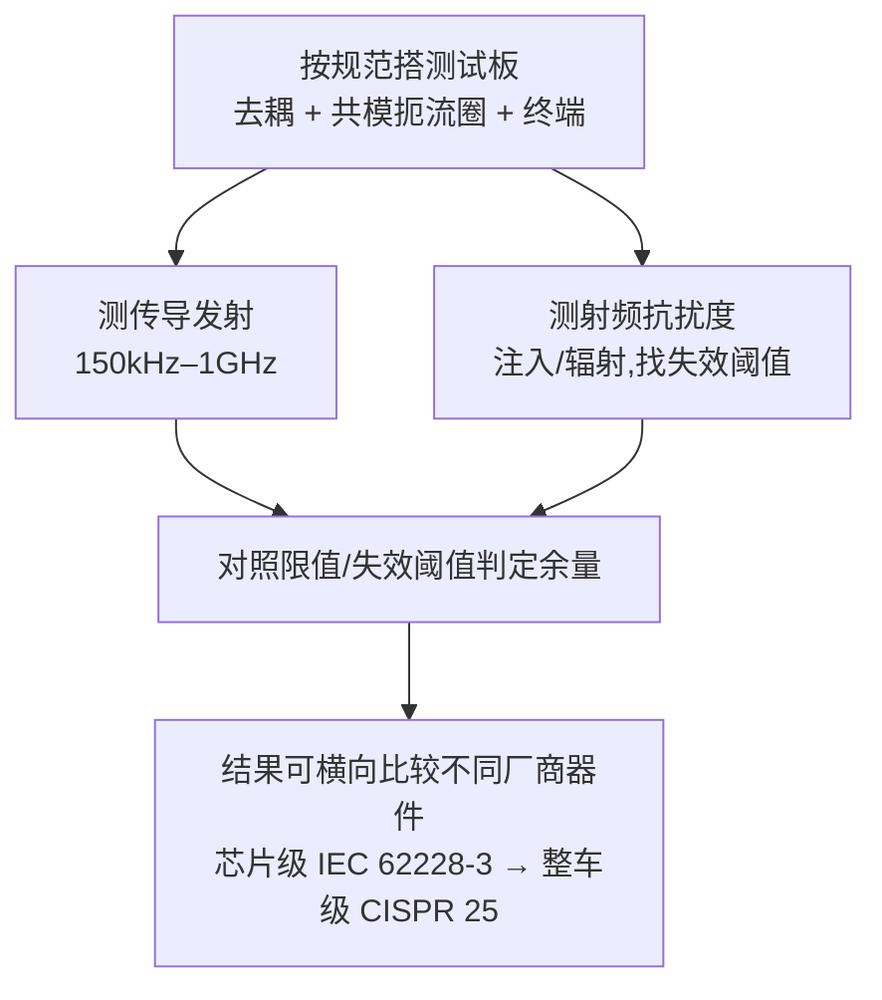

## 定义

**回波损耗(Return Loss)** 是收发器总线端输入阻抗与总线特征阻抗(120 Ω 双绞线)匹配程度的度量,定义为入射功率与反射功率之比(以 dB 表示);**数值越大,阻抗匹配越好、反射越少**。CAN FD 高速数据相位尤其关注高数据率相关频率范围内的回波损耗——高速边沿富含高频分量,高频反射直接叠加成振铃与眼图收窄。

**EMC(电磁兼容)** 涵盖**发射(EMI)**与**抗扰度(Immunity)**两个方向:发射是设备产生的非期望电磁辐射,抗扰度是设备在电磁环境中仍能正常工作的能力。收发器级 EMC 的评估标准是 **IEC 62228-3**(CAN 收发器 IC 级 EMC 评估,传导发射 150 kHz–1 GHz 与射频抗扰度);整车发射限值依据 **CISPR 25**。两者与 ISO 11898-2:2024 的 EMC 条款配套使用。

## 关键参数

### 说明:ISO 11898-2:2024 无独立"回波损耗"数值表

本版全文未给出独立的回波损耗数值参数表(参数速查页 7.10 已注明:"回波损耗"条目页简介中的表述为对 SIC 特性的概括描述)。回波损耗/阻抗匹配的相关要求通过**接收输入电阻与匹配度**、**SIC 主动阻抗**与**驱动对称性**三组参数体现,数值如下。

### 接收输入电阻与匹配(表 9/10,5.3.7 节)—— 隐性期总线阻抗

| 参数 | 符号 | 最小 [kΩ] | 最大 [kΩ] | 条件 |
|---|---|---|---|---|
| 差分内部电阻 | RDIFF_pas_rec | 12 | 100 | -2V≤VCAN_L,VCAN_H≤+7V |
| 单端内部电阻 | RSE_pas_rec_H、RSE_pas_rec_L | 6 | 50 | 同上 |
| 内部电阻匹配 | mR | -0,03 | +0,03 | VCAN_L、VCAN_H:+5V |

注:RDIFF_pas_rec = RSE_pas_rec_H + RSE_pas_rec_L;mR = 2×(RSE_H − RSE_L)/(RSE_H + RSE_L)(表 10 脚注 a)。隐性期输入阻抗远高于 120Ω 特征阻抗(12~100 kΩ),因此**不会**为总线提供终端——这正是隐性期反射的根源之一,也解释了为什么需要 SIC 的有源阻尼窗口。

### SIC 主动阻抗与驱动对称性(表 18 / 表 12)

| 参数 | 符号 | 最小 | 最大 | 来源 |
|---|---|---|---|---|
| 差分内部电阻(显性→隐性转换后) | RDIFF_act_rec | 75Ω | 133Ω | 表 18 |
| 可选:单端内部电阻 | RSE_SIC_act_rec | 37,5Ω | 66,5Ω | 表 18 |
| 基于 Vcc 的驱动器对称性 | Vsym_vcc | +0,9 | +1,1 | 表 12(5.4.1) |
| 基于 Vrec 之和的驱动器对称性 | Vsym_vrec | +0,9 | +1,1 | 表 12 |

表 12 注:驱动对称性观测条件为 TXD 方波激励、频率对应实现预期支持的最高位速率但最高 1 MHz(2 Mbit/s)。驱动对称性直接决定共模发射水平(5.4.1:为达到可接受的 RF 发射水平,发射器须满足表 12)。

### 器件级对照(TJA1463 数据手册,表 8)

| 参数 | 符号 | 最小 | 典型 | 最大 |
|---|---|---|---|---|
| 输入电阻(被动隐性) | Ri | 25 kΩ | 40 kΩ | 50 kΩ |
| 输入电阻偏差 | Ri deviation | -3% | — | +3% |
| 差分输入电阻 | Ri(dif) | 50 kΩ | 80 kΩ | 100 kΩ |
| 有源隐性相输入电阻 | Ri(actrec) | 37,5Ω | — | 60Ω |
| 有源隐性相差分输入电阻 | Ri(dif)actrec | 75Ω | — | 125Ω |
| 共模输入电容 | Ci(cm) | — | — | 30 pF |
| 差分输入电容 | Ci(dif) | — | — | 15 pF |
| 共模电压阶跃 | Vcm(step) | -150 mV | — | +150 mV |
| 峰峰共模电压 | Vcm(p-p) | -300 mV | — | +300 mV |
| 发射器电压对称性 | VTXsym | 0,9 VCC | — | 1,1 VCC |

## 工作原理/机制

### 回波损耗的物理定义

阻抗失配产生的反射叠加到原始信号上,造成振铃、眼图收窄与采样错误——回波损耗改善与[振铃抑制](ringing-suppression.md)共同支撑高速数据相位。

### 失配→反射→振铃的因果链

- 回波损耗**随频率变化**:高频段更易因封装引脚、片上输入网络的寄生电容/电感劣化,是 SIC 收发器设计难点之一——TJA1463 的 Ci(cm) ≤30 pF、Ci(dif) ≤15 pF 即是对高频输入网络的量化约束。
- 有源隐性期阻抗(表 18:75~133Ω)覆盖总线特征阻抗(120Ω)附近,是"动态匹配"的体现;Annex B.1 提示典型实现为显性→隐性边沿后一个位宽区间内 100Ω。

### 收发器 EMC 的两条腿

- **发射来源**:收发器输出沿的高频分量、驱动电流回路辐射——数据相位速率越高,边沿越陡,发射越难压;驱动对称性(Vsym_vcc 0,9~1,1,表 12)是发射水平的直接约束。
- **压摆率的折衷**:沿越陡,采样时刻信号越"干净"但 EMI 增大;沿越缓,EMI 越小但高速数据相位下边沿占用位时间、来不及稳定。沿整形是 EMC 与时序的核心折衷点。

### 表征流程(IEC 62228-3 思路)

## 对收发器设计的意义

- **输入网络阻抗匹配**:终端阻抗合成、封装/ESD 结构对高频寄生(电容/电感)共同决定高频回波损耗;版图上 CANH/CANL 对称走线、电容配平(约 10 pF 内,见[US7113759B2 电容平衡](../../resources/_entries/patents/us7113759b2.md))是输入级共模/差分平衡的物理基础。
- **SIC 阻抗可调**:有源隐性阻抗(75~133Ω)落在特征阻抗附近,OTA 或可编程电阻实现可在 PVT 下保持匹配(见[US11539548B2 阻抗匹配+斜率控制](../../resources/full-text/us11539548b2-microchip-sic.md));Annex B.1 的 100Ω 典型值是标定阻尼阻抗的起点。
- **EMC 是"设计进来"的**:受控/整形输出沿(分段斜率控制)、驱动对称性(Vsym ±10%,Annex A 收紧到 ±5%,表 A.9)、共模处理(复制电路+电流斜坡)在版图与器件层面决定发射与抗扰;流片后按 IEC 62228-3 测试是认证必测项。
- **对控制器(嵌入式)**:系统布线(共模扼流圈、PCB 布局、终端位置)决定网络能否通过整车 EMC;高速数据相位下的发射问题常通过降沿(斜率控制)与滤波缓解。

## 常见误区

- **误区一:"在 ISO 11898-2:2024 里能查到回波损耗的 dB 数值"** —— 全文未给出独立回波损耗数值表;相关要求分散在输入电阻(表 9/10)、SIC 阻抗(表 18)与驱动对称性(表 12)中,定量回波损耗测量需按数据手册测试电路与论文方法(如 Hancock 2020)自行表征。
- **误区二:"隐性期输入电阻越大越好"** —— RDIFF_pas_rec 上限 100 kΩ 是标准约束:过高导致隐性期总线几乎无负载、反射加剧;过低则拖累总线负载与节点数预算。12~100 kΩ 是一个"够高但不失控"的窗口。
- **误区三:"EMC 只是测试问题"** —— 发射水平直接受驱动对称性(表 12)约束,是设计指标而非测试结果;等流片后测 EMC 再改版图,代价远高于设计期就做对称与沿整形。
- **误区四:TVS/CMC 对信号无影响** —— 片外 TVS 寄生电容与共模扼流圈阻抗都会进入总线端输入网络,影响高频回波损耗与边沿,选型时要与芯片输入电容(Ci(cm) ≤30 pF 量级)统筹。

## 参见

- 标准规范(内容来源):[ISO 11898-2:2024 关键参数速查](../../resources/standards-text/iso-11898-2-2024-key-parameters.md)、[ISO 11898-2:2024 全文](../../resources/standards-text/iso-11898-2-2024-full.md)、[IEC 62228-3 条目](../../resources/_entries/standards/iec-62228-3-2019.md)
- 厂商资料:[NXP TJA1463 数据手册全文](../../resources/full-text/tja1463-datasheet.md)、[TI SLLA581 白皮书全文](../../resources/full-text/slla581-white-paper.md)
- 专利全文:[US11539548B2 阻抗匹配+斜率控制](../../resources/full-text/us11539548b2-microchip-sic.md)
- 教程:[SIC 是什么](../../tutorials/07-what-is-sic.md)、[振铃抑制原理与测量](../../tutorials/08-ringing-suppression.md)、[一致性测试与 plugfest](../../tutorials/11-conformance-plugfest.md)
- 词条:[回波损耗](../../glossary/return-loss.md)、[EMI/EMC](../../glossary/emi-emc.md)、[IEC 62228-3](../../glossary/iec-62228-3.md)、[CISPR 25](../../glossary/cispr25.md)、[压摆率](../../glossary/slew-rate.md)、[共模扼流圈](../../glossary/common-mode-choke.md)
- 相邻子域:[振铃抑制:SIC 核心能力](ringing-suppression.md)、[输出级:差分驱动与显性/隐性电平](../transceiver-design/output-stage.md)、[ESD 保护与共模抑制](../transceiver-design/esd-common-mode.md)
