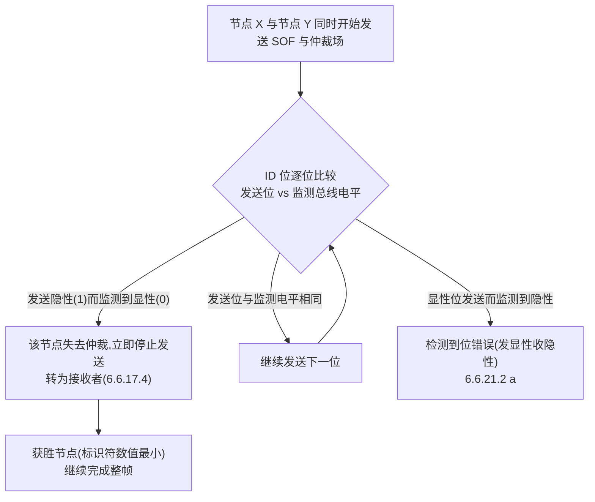
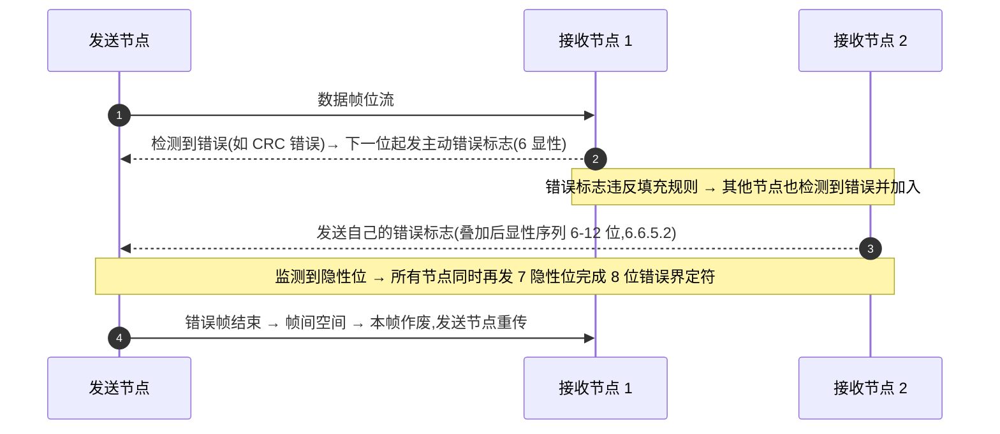
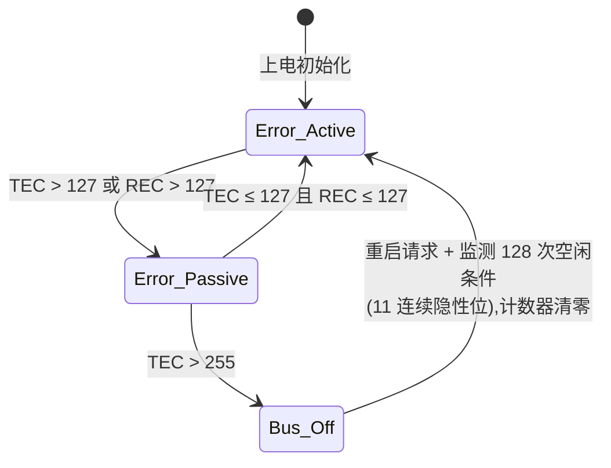

## 概述

**仲裁(Arbitration)** 是 CAN 多节点共享总线的访问控制机制:多个节点同时发送时,在仲裁场逐位比较标识符,**显性位优先于隐性位**;发送隐性位却读到显性位的节点立即退出竞争并转为接收,其余节点继续发送——标识符数值越小,优先级越高(6.6.17.4/6.6.17.5)。

**错误处理**是 CAN 高可靠性的核心:任何节点检测到协议错误时,通过**错误帧(EF)**向全网广播"本帧已被破坏",并依据**错误计数(TEC/REC)**在 Error Active(主动错误)、Error Passive(被动错误)、Bus-off(离线)三态间迁移,以隔离持续故障的节点。机制由 ISO 11898-1:2024 第 6.6.5/6.6.21/8.1.4 节定义。

## 关键参数

### 五类错误检测(6.6.21.2)

| 错误类型 | 触发条件 |
|---|---|
| 位错误(Bit Error) | 发送位与监测到的总线电平不同;例外:仲裁时发送的非动态填充隐性位被显性覆盖、ACK slot 发隐性被覆盖、被动错误标志期间检测到显性、ADH 位(6.6.21.2 a) |
| 填充错误(Stuff Error) | 动态填充编码字段中第 6 个连续相同电平位(6.6.21.2 b);FD/XL 固定填充位不在期望值属**格式错误**而非填充错误 |
| CRC 错误(CRC Error) | 接收端计算的 PCRC/FCRC 序列与收到的不同;FD 帧 stuff count 不匹配或奇偶位不匹配也判 FCRC 错误(6.6.21.2 c) |
| 格式错误(Form Error) | 固定格式字段出现意外位值;EOF 末位显性、错误/过载界定符末位显性不算格式错误(6.6.21.2 d) |
| ACK 错误(ACK Error) | 发送端在 ACK slot 未检测到显性(6.6.21.2 e) |

### 错误帧结构(6.6.5)

- **主动错误标志**:6 个连续显性位;故意违反位填充与固定格式规则,迫使其他节点也检测到错误;
- **被动错误标志**:6 个连续隐性位(除非被其他节点的显性位覆盖);error-passive 接收端须等 6 个连续相同位确认标志完成;
- 多节点错误标志叠加后,总线上显性序列长度**最小 6 位、最大 12 位**;
- **错误界定符**:8 个隐性位;发送错误标志后监测到隐性位时,所有节点同时再发 7 个隐性位完成 8 位界定符。

### 错误状态机与阈值(5.10-5.12、8.1.4.3/8.1.4.4)

| 状态 | 触发条件 | 行为 |
|---|---|---|
| error-active | 初始状态 | 检测到错误时发送主动错误标志(6 显性);总线空闲即可访问(6.6.17.1) |
| error-passive | 发送或接收错误计数器 >127(7 位计数器进位) | 发送被动错误标志(6 隐性);发送后须挂起 8 位时间(suspend transmission,6.6.7.4);两计数器均 ≤127 时回到 error-active |
| bus-off | 发送错误计数器 >255(8 位计数器进位) | 不发送、不确认任何帧;重启请求后监测 **128 次空闲条件**(11 连续隐性位)后重新整合,计数器清零 |

### 错误计数规则摘要(8.1.4.2)

| 规则 | 内容 |
|---|---|
| a | 接收器检测到错误:接收错误计数器 +1(发送主动错误标志/过载标志时的位错误除外) |
| b | 接收器发送错误标志后首位检测到显性:接收错误计数器 +8 |
| c | 发送器发送错误标志:发送错误计数器 +8(两个例外:error-passive 发送器 ACK 错误且被动标志期间未检测到显性;仲裁决定前的填充错误且填充位应隐性但被监测为显性——两种情况下计数器不变) |
| d | 发送器发送主动错误标志/过载标志时检测到位错误:发送错误计数器 +8 |
| e | 接收器发送主动错误标志/过载标志时检测到位错误:接收错误计数器 +8 |
| f | 任何节点容忍发送主动/被动错误标志或过载标志后最多 7 个连续显性位;检测到 14 个连续显性位(主动错误标志/过载标志)或被动错误标志后 8 个连续显性位,以及其后每增加 8 个连续显性位,发送错误计数器 +8、接收错误计数器 +8 |
| g | 帧成功发送(获得 ACK 且到 EOF 结束无错误):发送错误计数器 −1(已为 0 则保持) |
| h | 帧成功接收(至 ACK slot 无错误且成功发送 ACK 位):接收错误计数器在 1-127 之间时 −1;为 0 保持;>127 时设为 119-127 之间的值 |

### 恢复与重传

- 恢复时间:自检测到错误到可能开始下一帧为 **17-23 个名义位时间**(error-passive 节点最多 31 个)(5.8);
- 空闲条件:11 个连续隐性位构成(6.6.7.5);bus-off 恢复需监测 128 次空闲条件(8.1.4.4);
- 重传:自动重传可配置,0 次(不重传)至至少 6 次;仲裁失败后的重启动不计入重传计数器(6.5.3)。

## 工作原理

### 基于标识符的逐位仲裁(flowchart)

仲裁自 ID(28) 开始、至控制场的 FDF 位结束(FBFF/FEFF)(6.6.17.4);同标识符下优先级:CBFF > FBFF > XLFF,CEFF > FEFF(6.6.17.5)。仲裁依赖"发送即回读"的环回路径——发送方通过位错误检测确认自己是否仍在总线控制中。

### 错误传播与错误帧(sequenceDiagram)

接收端检测到 FCRC 错误时不发 ACK;CC 帧接收端自 EOF 首位起发错误帧,FD 帧接收端在 **CRC 界定符后 3 个位时间**起发错误帧(6.6.21.3.1)。

### 错误状态机(stateDiagram-v2)

错误计数规则可多条同时适用;error-passive 限值 127 对应 7 位计数器进位,255 对应 8 位计数器进位(8.1.4.3/8.1.4.4)。CAN FD 控制场的 **ESI 位**由发送节点报告自身错误状态:Error Active 发显性(0),Error Passive 发隐性(1)(6.6.11.3),为系统提供在线诊断信息。

### 过载帧与错误帧的区别(6.6.6/6.6.21.3.2)

过载帧结构与错误帧类似(6 位标志 + 8 位隐性分隔符),但**只在帧间空间发送**:LLC 请求的过载帧(内部条件需延迟下一帧,最多 2 个)或反应性过载帧(intermission 前两位检测到显性、接收端在 EOF 末位检测到显性、任何节点在错误/过载界定符末位检测到显性)。不插入数据帧内部;随控制器处理能力提升,实践中已很少使用。

## 对设计的意义

- **对控制器(嵌入式)**:错误状态机与计数逻辑是控制器硬件的一部分——设计驱动与诊断时,需理解 TEC/REC 的增减规则(规则 a-h)、Bus-off 恢复序列(128 次空闲条件)与 ESI 位暴露的节点状态;排查"节点莫名失联"时,先看是否进入 Bus-off、错误计数从哪类错误累积;重传次数(0 至至少 6 次)可配置。
- **对收发器(模拟 IC)**:错误帧要求收发器能把 6 个显性位强驱动到总线(主动错误标志传播的时序);Error Passive 节点发送隐性错误标志,不影响总线;仲裁依赖"发送即回读"的环回路径,这条路径的延迟与对称性正是[位定时与同步](../bit-timing/index.md)分域关注的收发器指标。
- **对系统**:仲裁场与经典 CAN 完全一致,两类节点可公平竞争;FD 帧仲裁在 FDF 位结束,之后的位错误不再引发"失去仲裁"而是错误处理。

## 常见误区

- **误区一:"仲裁是'监听-退避'式的"** —— CAN 仲裁是**边发边听、逐位竞争**:所有竞争节点同时发送,发送隐性读到显性者当场退出,不破坏获胜节点正在发送的帧(6.6.17.4)。
- **误区二:"错误标志只有 6 个显性位一种"** —— 主动错误标志 6 显性,被动错误标志 6 隐性;多节点叠加后显性序列 6-12 位;错误界定符 8 隐性(6.6.5)。
- **误区三:"检测到错误就进 Bus-off"** —— Bus-off 仅由**发送**错误计数器 >255 触发;>127 只是进入 error-passive;两计数器 ≤127 即回 error-active(8.1.4.3/8.1.4.4)。
- **误区四:"bus-off 恢复 = 等一段时间"** —— 恢复需重启请求后监测到 **128 次空闲条件(每次 11 个连续隐性位)**,之后计数器清零(8.1.4.4)。
- **误区五:"过载帧可以插进数据帧"** —— 过载帧只在帧间空间发送(LLC 请求或反应性条件),不插入数据帧内部(6.6.21.3.2)。

## 参见

- 标准规范(内容来源):[ISO 11898-1:2024 关键参数速查](../../resources/standards-text/iso-11898-1-2024-key-parameters.md)、[ISO 11898-1:2024 全文(6.6.5/6.6.17/6.6.21/8.1.4)](../../resources/standards-text/iso-11898-1-2024-full.md)
- 教程:[图解 CAN FD 帧结构:EDL/BRS/ESI 一图看懂](../../tutorials/01-can-fd-frame-structure.md)、[CAN 2.0 与 CAN FD 的 5 个关键差异](../../tutorials/02-can2-vs-canfd.md)
- 词条:[仲裁](../../glossary/arbitration.md)、[错误帧](../../glossary/error-frame.md)、[Bus-off](../../glossary/bus-off.md)、[ESI](../../glossary/esi.md)、[过载帧](../../glossary/overload-frame.md)、[远程帧](../../glossary/remote-frame.md)
- 标准条目:[ISO 11898-1 (2024)](../../resources/_entries/standards/iso-11898-1-2024.md)、[Bosch CAN FD Specification v1.0](../../resources/_entries/standards/bosch-2012-canfd-spec.md)
- 论文:[Hartwich 2012: CAN with Flexible Data-Rate](../../resources/_entries/papers/2012-hartwich-can-fd.md)
- 相邻子域:[帧格式总览](frame-format.md)、[CRC 与位填充](crc-and-bit-stuffing.md)、[位定时与同步](../bit-timing/index.md)
