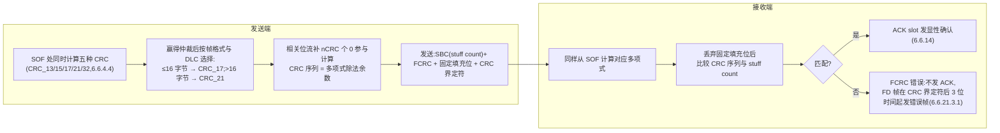
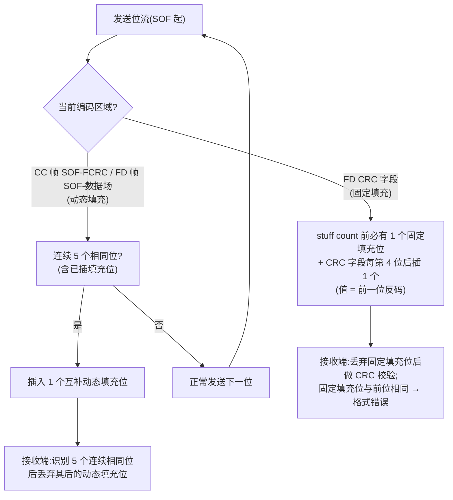

## 概述

**CRC(循环冗余校验)** 是帧尾的检错字段,由 BCH 码派生(6.6.4.4)。CAN FD 中,数据长度 ≤ 16 字节时采用 **17 位 CRC(CRC_17)**,> 16 字节时采用 **21 位 CRC(CRC_21)**,保证长数据帧仍维持与经典 CAN 15 位 CRC 相当(同为汉明距离 6)的检错强度。CRC 覆盖 SOF、仲裁场、控制场、数据场以及其中的**动态填充位与 stuff count**(经典 CAN 的 CRC 不覆盖填充位)。

**位填充(Bit Stuffing)** 是保证总线信号有足够跳变沿供节点重同步的编码机制(6.6.13):经典 CAN 与 CAN FD 仲裁相位采用**动态位填充**(连续 5 个相同电平后插入 1 个反相填充位);CAN FD 数据相位(CRC 字段)改用**固定位填充**(stuff count 前 1 个 + CRC 字段每第 4 位后 1 个),使高速数据相位的填充行为可预期。两者均由 ISO 11898-1:2024 第 6.6.4.4/6.6.13 节定义。

## 关键参数:CRC 生成多项式(6.6.4.4)

| CRC | 帧/字段 | 位长 nCRC | 多项式(十六进制,含高序位) | 初始化向量 CRC_INIT_VECTOR | 汉明距离 |
|---|---|---|---|---|---|
| CRC_13 | XL 帧仲裁与控制字段(PCRC) | 13 | 39E7₁₆ | (0,0,…,1)(单个 1 在最低位) | 6 |
| CRC_15 | 经典 CC 帧(FCRC) | 15 | C599₁₆ | (0,…,0) | 6 |
| CRC_17 | FD 帧数据字段 ≤16 字节(FCRC) | 17 | 3685B₁₆ | (1,0,…,0)(单个 1 在最高位) | 6 |
| CRC_21 | FD 帧数据字段 >16 字节(FCRC) | 21 | 302899₁₆ | (1,0,…,0)(单个 1 在最高位) | 6 |
| CRC_32 | XL 整帧(FCRC) | 32 | 1F4ACFB13₁₆ | (0,0,…,1)(单个 1 在最低位) | 6 |

**要点**:发送节点与接收节点在 **SOF 处同时计算全部五种 CRC**;赢得仲裁的节点按帧格式与 DLC 选择发送相应 CRC 序列,接收端只按所选多项式校验(6.6.4.4)。CRC 相关位流按 6.6.10.5/6.6.11.5/6.6.12.3/6.6.12.5 规定,并**补 nCRC 个 0 位**参与计算;计算用 nCRC 位移位寄存器按"CRCNXT = NXTBIT EXOR CRC_RG(nCRC−1)"的算法实现(6.6.4.4)。

### FD 帧 CRC 相关位流(6.6.11.5)

```
相关位流 = SOF + 仲裁场 + 控制场 + 数据场
          + stuff count + 动态填充位(不含固定填充位)
```

### Stuff count(FD 帧,6.6.11.5、表 8)

- 位于 CRC 字段开头,4 位:**SBC3/SBC2/SBC1 格雷编码 + SBC0 奇偶位**;
- 表示 stuff count 之前(第一个固定填充位之前)填充位数量**模 8** 的值 0-7;
- 发送端与接收端都计数填充位;接收端校验收到的 stuff count 与自身计数是否匹配,不匹配判 FCRC 错误(6.6.21.2 c)。

## 关键参数:位填充规则(6.6.13)

### 动态位填充(6.6.13.2)

- 发送器检测到 **5 个连续相同位(含动态填充位)**时插入 1 个互补位;接收器识别 5 个连续相同位后丢弃其后的动态填充位;
- 应用范围:CC 帧从 SOF 到 FCRC;FD 帧从 SOF 到数据场;XL 帧从 SOF 到仲裁场(XL 帧最大 3 个动态填充位,最后可能位置在 FDF 位之前);
- **填充错误**:动态填充编码字段第 6 个连续相同电平位处检测(6.6.21.2 b)。

### 固定位填充(FD CRC 字段,6.6.13.3.1)

- **stuff count 第一位之前必有 1 个固定填充位**,即使前字段末尾不是 5 个连续相同位;若前字段末尾恰好是 5 个连续相同位,则只保留该固定填充位、**不得连续两个填充位**;
- 此后 **CRC 字段每第 4 位后插入 1 个固定填充位**;
- 固定填充位取值 = **其前一位的反码**;
- 接收端丢弃固定填充位做 CRC 校验;固定填充位与前位相同时检测**格式错误**(不是填充错误);
- FD CRC 字段固定填充位数量等于 CC 帧动态填充方法的最大填充位数。

### 不填充的字段(6.6.13.1)

**ACK 字段、EOF**(XL 帧还有 FCP)不填充。

## 工作原理

### CRC 编码与解码流程(flowchart)



### 位填充插入规则(flowchart)



### 数据相位固定填充的位置示意


stuff count 之前的固定填充位保证 CRC 字段的填充位置与内容完全可预期——仲裁相位位时间以微秒计,填充位置偶发性可接受;数据相位位时间以纳秒计,收发器与控制器需要知道填充位的确切位置才能稳定同步与计算 CRC(固定填充位数量 = CC 帧动态填充的最大填充位数,6.6.13.3.1)。

### 五类错误中的 CRC 与填充

CRC 错误与填充错误是五类错误检测(位/填充/CRC/格式/ACK)中的两项:CRC 错误由接收方重新计算并比对触发;填充错误由动态填充规则违反触发(第 6 个连续相同位);固定填充位异常属格式错误。两者最终都通过错误帧传播,详见[仲裁与错误处理](arbitration-and-error.md)。

## 对设计的意义

- **对控制器(嵌入式)**:CRC 引擎需要支持多个多项式并按 DLC 自动切换(≤16 字节 CRC_17,>16 字节 CRC_21),且 SOF 处五种 CRC 并行计算(6.6.4.4);解码时必须**先丢弃填充位再计算 CRC**,并校验 stuff count(格雷编码 + 奇偶位),否则 CRC 不匹配——这是 CAN FD 控制器实现比经典 CAN 复杂的主要原因之一。调试"收到帧但 CRC 错误"时,先确认位定时与填充解码路径是否正确。
- **对收发器(模拟 IC)**:收发器不参与 CRC 计算,但位填充机制直接决定信号的边沿密度,从而影响接收比较器与时钟恢复的负担;数据相位固定填充带来更规则的边沿模式,配合[采样点](../bit-timing/time-quantum-sample-point.md)与 TDC,是高速数据相位可靠采样的协议侧保障。
- **对系统**:汉明距离 6 是五种 CRC 的共同底线(6.6.4.4)——17/21 位 CRC 相对经典 15 位 CRC 的升级,是"帧更长但检错强度不下降"的关键设计。

## 常见误区

- **误区一:"CRC 覆盖所有填充位"** —— FD 帧 CRC 相关位流包含 **stuff count 与动态填充位,但不含固定填充位**(6.6.11.5);经典 CAN 的 CRC 不覆盖填充位。
- **误区二:"填充位只在 5 个连续相同位后插入"** —— 仲裁相位(动态填充)如此;FD 数据相位是**固定填充**:stuff count 前必有 1 个(即使前字段末尾不是 5 个连续相同位),之后每第 4 位 1 个(6.6.13.3.1)。
- **误区三:"固定填充位错误是填充错误"** —— 固定填充位不在期望值(与前位相同)是**格式错误**;填充错误专指动态填充字段的第 6 个连续相同位(6.6.21.2 b/d)。
- **误区四:"CRC 多项式随便选一个 17/21 位多项式就行"** —— 多项式、初始化向量与位序由 6.6.4.4 明确规定(CRC_17 = 3685B₁₆、CRC_21 = 302899₁₆,均含高序位,初始化向量最高位为 1),且与接收端必须一致;CRC 序列是相关位流(补 nCRC 个 0)对生成多项式做模 2 除法的余数。
- **误区五:"stuff count 是简单的二进制计数"** —— FD 帧 stuff count 是 **4 位格雷编码(SBC3/SBC2/SBC1)+ 1 位奇偶位(SBC0)**,表示填充位数模 8(表 8)。

## 参见

- 标准规范(内容来源):[ISO 11898-1:2024 关键参数速查](../../resources/standards-text/iso-11898-1-2024-key-parameters.md)、[ISO 11898-1:2024 全文(6.6.4.4/6.6.11.5/6.6.13)](../../resources/standards-text/iso-11898-1-2024-full.md)
- 教程:[图解 CAN FD 帧结构:EDL/BRS/ESI 一图看懂](../../tutorials/01-can-fd-frame-structure.md)、[CAN 2.0 与 CAN FD 的 5 个关键差异](../../tutorials/02-can2-vs-canfd.md)
- 词条:[CRC(17/21 位)](../../glossary/crc.md)、[位填充](../../glossary/bit-stuffing.md)、[DLC](../../glossary/dlc.md)、[错误帧](../../glossary/error-frame.md)
- 标准条目:[ISO 11898-1 (2024)](../../resources/_entries/standards/iso-11898-1-2024.md)、[Bosch CAN FD Specification v1.0](../../resources/_entries/standards/bosch-2012-canfd-spec.md)
- 论文:[Hartwich 2012: CAN with Flexible Data-Rate](../../resources/_entries/papers/2012-hartwich-can-fd.md)
- 相邻子域:[帧格式总览](frame-format.md)、[仲裁与错误处理](arbitration-and-error.md)、[位定时与同步](../bit-timing/index.md)
