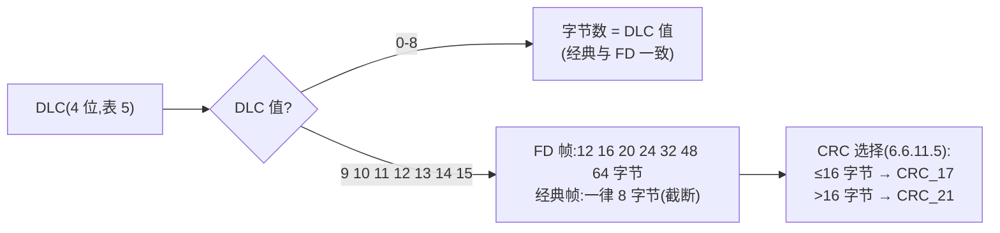
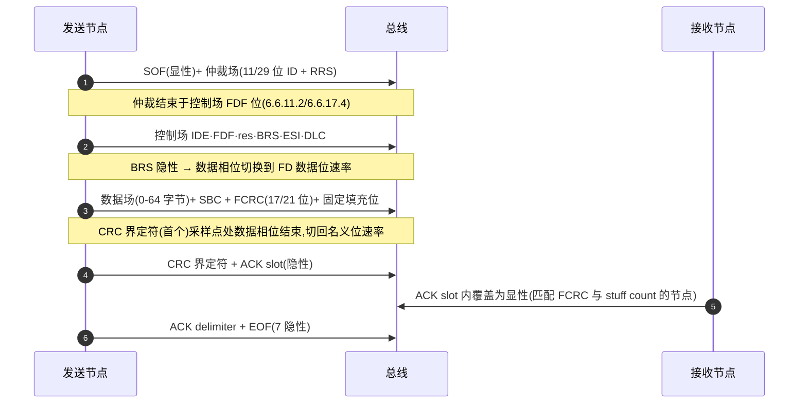
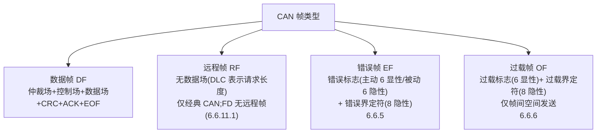

## 概述

CAN 总线上只存在四种帧类型:**数据帧**(Data Frame,携带有效载荷)、**远程帧**(Remote Frame,请求对方发送数据)、**错误帧**(Error Frame,节点报告检测到的协议错误)与**过载帧**(Overload Frame,延迟后续帧或报告接收器过载)。其中数据帧是通信主体,其余三种是辅助机制。

**CAN FD 数据帧**是数据帧的扩展形态,由 ISO 11898-1:2024 第 6.6.11 节定义:FD 帧有两种格式,**FBFF(11 位标识符)**与 **FEFF(29 位标识符)**,可携带 **0 至 64 字节**数据;**不存在远程 FD 帧**(6.6.11.1)。帧骨架与经典 CAN 相同(SOF → 仲裁场 → 控制场 → 数据场 → CRC 场 → ACK 场 → EOF),差异集中在控制场的 FDF/res/BRS/ESI 标志位、DLC 映射、CRC 长度与填充规则上。协议源头是 Bosch 2012 年 CAN FD 规范。

## 关键参数:FBFF 帧位序

### FBFF(11 位标识符)数据帧完整位序(图 18/20/22)

| 字段 | 内容 | 位值/规则 | 条款 |
|---|---|---|---|
| SOF | 起始帧 | 显性 | 6.6.8 |
| 仲裁场 | ID(28)…ID(18)(11 位)+ RRS | RRS 发送显性;接收端接受显性或隐性 | 6.6.11.2 |
| 控制场 | IDE | 显性(区分 11 位标识符格式) | 6.6.11.3 |
| 控制场 | FDF(FD Format Indicator) | **隐性 = FD/XL 帧**;显性 = CC 帧;11 位标识符帧中位于 IDE 之后 | 6.6.11.3 |
| 控制场 | res(保留位) | 显性;检测为隐性时:协议异常处理启用则检测协议异常事件,禁用则按格式错误 | 6.6.11.3 |
| 控制场 | BRS(Bit Rate Switch) | 隐性 = 数据相位切换到 FD 数据位速率;显性 = 全程名义位速率 | 6.6.11.3 |
| 控制场 | ESI(Error State Indicator) | 发送端 error-active 发显性、error-passive 发隐性;LLC 置位则发隐性 | 6.6.11.3 |
| 控制场 | DLC(4 位) | 数据长度编码,见 DLC 表 | 6.6.11.3 |
| 数据场 | 0-64 字节 | 字节 0 起顺序发送,每字节 8 位(bit(7)→bit(0));DLC=0 时无数据场 | 6.6.11.4 |
| CRC 场 | SBC(stuff count,4 位)+ FCRC(17 或 21 位)+ CRC 界定符 | CRC 界定符 1 或 2 个隐性位(发送端发 1 个) | 6.6.11.5 |
| ACK 场 | ACK slot + ACK delimiter | 发送端发隐性;接收端在 slot 内覆盖为显性;界定符隐性 | 6.6.11.6 |
| EOF | 帧结束 | 7 个隐性位 | 6.6.11.7 |

### FEFF(29 位标识符)位序

`SOF → ID(28)…ID(18) → SRR(隐性)→ IDE(隐性)→ ID(17)…ID(0) → RRS(显性)→ FDF(隐性)→ res(显性)→ BRS → ESI → DLC → 数据 → SBC+FCRC+CRC 界定符 → ACK slot+delimiter → EOF`。仲裁自 ID(28) 开始、至控制场的 FDF 位结束;SRR/IDE 隐性保证同基标识符下 11 位标识符帧优先于 29 位帧(6.6.11.2、图 19-21)。

### DLC 编码(表 5,6.4.3)

| DLC(十进制) | 0-8 | 9 | 10 | 11 | 12 | 13 | 14 | 15 |
|---|---|---|---|---|---|---|---|---|
| 经典帧字节数 | 0-8(直映) | 8 | 8 | 8 | 8 | 8 | 8 | 8 |
| FD 帧字节数 | 0-8(直映) | 12 | 16 | 20 | 24 | 32 | 48 | 64 |

规则:**0-8 直接映射**;FD 帧 9-15 映射到 12/16/20/24/32/48/64 字节(间隔先 4 字节后 8/16 字节递增);经典帧 9-15 全部为 8 字节(截断)。

## 工作原理

### 帧结构位序总览(sequenceDiagram)

### 帧格式家族:四种帧类型

### 经典 CAN vs CAN FD 数据帧

| 维度 | 经典 CAN(CC) | CAN FD |
|---|---|---|
| 数据场 | 最多 8 字节 | 最多 **64 字节** |
| 位速率 | 整帧单速率 | 一帧两速:BRS 隐性后进入数据相位,CRC 界定符(首个)采样点处切回(6.6.11.5 NOTE) |
| 控制场 | `IDE + r0 + DLC`(CBFF) | `IDE + FDF + res + BRS + ESI + DLC`(FBFF);FEFF 中 IDE 在仲裁场 |
| CRC | CRC_15,15 位 | **CRC_17(数据 ≤16 字节)或 CRC_21(>16 字节)**;FD 帧 CRC 相关位流含 stuff count 与动态填充位、不含固定填充位(6.6.11.5) |
| 位填充 | 动态填充(SOF 至 FCRC) | 仲裁相位动态填充(SOF 至数据场);数据相位固定填充(FD CRC 字段,6.6.13) |
| 远程帧 | RTR 位区分 | 无远程 FD 帧 |

### 三个标志位

**FDF 决定"这是什么帧"(隐性 = FD/XL),BRS 决定"数据段跑多快"(隐性 = 切换),ESI 报告"发送方状态如何"(隐性 = error-passive)**。FDF 对应经典帧的 r0/r1 位位置;经典节点把隐性 FDF 读作保留位违例,判格式错误并触发错误帧——**"仲裁兼容"不等于"全网络兼容"**:同一网络要么全支持 CAN FD,要么分网/分时部署。

### 经典 CAN 帧(CBFF/CEFF)要点(6.6.10)

- CBFF 仲裁字段:ID(28)…ID(18) + RTR;CEFF:ID(28)…ID(18) + SRR(隐性)+ IDE(隐性)+ ID(17)…ID(0) + RTR。RTR 隐性 = 远程帧,显性 = 数据帧;同标识符下数据帧优先于远程帧(6.6.10.2)。
- 控制字段:IDE/r1(显性)+ r0(显性)+ DLC(4 位)(图 14);CBFF 中 IDE 显性、CEFF 中 r1 与 FD 帧 FDF 对应,FD 容错节点在该位收到隐性时检测协议异常事件(6.6.10.3)。
- CRC 字段:FCRC(CRC_15,15 位)+ CRC 界定符(1 个隐性位)(6.6.10.5)。
- 经典 CAN 帧从 SOF 到 FCRC 采用动态位填充(6.6.13.2)。

### 协议异常事件(6.6.17.2)

FD 容错节点在控制字段的 **res 位检测到隐性**(预期显性)时,若协议异常处理启用则检测协议异常事件、禁用则按格式错误(6.6.11.3)。协议异常事件的反应:**错误计数器不变、启用硬同步、节点发送隐性位并进入总线再整合状态**(6.6.17.2)——这是 FD 帧与 XL 帧共存网络中的关键容错路径。

### ACK 与 EOF 规则(6.6.11.6/6.6.11.7/6.6.15)

- 接收端在 ACK slot 内把发送端的隐性位覆盖为显性;FD 帧中所有节点接受最长 **2 位**的重叠 ACK slot 显性相位为有效 ACK(补偿接收端间相位偏移);
- ACK delimiter 为隐性,与 CRC 界定符一起把 ACK slot 夹在两个隐性位之间;
- EOF 为 7 个隐性位;接收端帧在 **EOF 倒数第二位**无错误即视为有效,发送端需到 EOF 结束无错误才算有效(6.6.15.2)。

## 对设计的意义

- **对控制器(嵌入式)**:解码器必须按 FDF/res/BRS/ESI 解析帧类型、协议异常事件与速率切换边界;DLC 非连续映射决定 CRC 引擎选 17 位还是 21 位多项式;发送器在 BRS 之后、CRC 界定符之前以数据相位速率工作,需要两套位定时与 TDC 支持;帧校验时须先丢弃固定填充位再算 CRC。
- **对收发器(模拟 IC)**:帧格式本身不由收发器解释,但 BRS 造成的"仲裁速率 ↔ 数据速率"切换要求收发器传播延迟对称性与环回延迟稳定(否则高速数据相位无法可靠采样);错误帧要求收发器能把 6 个显性位强驱动到总线。帧结构是推导[位定时与同步](../bit-timing/index.md)和[物理层](../physical-layer/index.md)需求的上游输入。

## 常见误区

- **误区一:"FD 帧有远程帧"** —— FD 不存在远程帧(6.6.11.1);RTR 位在 FD 帧中由 RRS 位取代,RRS 发送显性、接收端接受显性或隐性(6.6.11.2)。
- **误区二:"DLC 9 表示 9 字节"** —— DLC 0-8 直映,9-15 非连续映射到 12/16/20/24/32/48/64 字节(表 5);经典帧 9-15 全部截断为 8 字节。
- **误区三:"数据相位从 BRS 位开始、到 ACK 结束"** —— FD 数据相位自 **BRS 位采样点(检测为隐性)**开始,至 **CRC 界定符首个采样点**结束(7.3.2);ACK/EOF 始终以仲裁速率传输。
- **误区四:"CRC 界定符固定 1 位"** —— 发送端发 1 个隐性位,但接受端接受 1 或 2 个隐性位;接收端在第一个 CRC 界定符位后发送其 ACK 位(6.6.11.5)。
- **误区五:"经典与 FD 帧可以长期混跑"** —— 仲裁场兼容,但经典节点把隐性 FDF 判为格式错误并触发错误帧;同网络要么全 FD,要么分网/分时。

## 参见

- 标准规范(内容来源):[ISO 11898-1:2024 关键参数速查](../../resources/standards-text/iso-11898-1-2024-key-parameters.md)、[ISO 11898-1:2024 全文(6.6.8-6.6.12)](../../resources/standards-text/iso-11898-1-2024-full.md)、[Bosch CAN FD 规范全文](../../resources/standards-text/bosch-canfd-spec-full.md)
- 教程:[图解 CAN FD 帧结构:EDL/BRS/ESI 一图看懂](../../tutorials/01-can-fd-frame-structure.md)、[CAN 2.0 与 CAN FD 的 5 个关键差异](../../tutorials/02-can2-vs-canfd.md)
- 词条:[EDL](../../glossary/edl.md)、[BRS](../../glossary/brs.md)、[ESI](../../glossary/esi.md)、[DLC](../../glossary/dlc.md)、[远程帧](../../glossary/remote-frame.md)、[过载帧](../../glossary/overload-frame.md)
- 标准条目:[ISO 11898-1 (2024)](../../resources/_entries/standards/iso-11898-1-2024.md)、[Bosch CAN FD Specification v1.0](../../resources/_entries/standards/bosch-2012-canfd-spec.md)
- 论文:[Hartwich 2012: CAN with Flexible Data-Rate](../../resources/_entries/papers/2012-hartwich-can-fd.md)
- 相邻子域:[CRC 与位填充](crc-and-bit-stuffing.md)、[仲裁与错误处理](arbitration-and-error.md)、[位定时与同步](../bit-timing/index.md)
