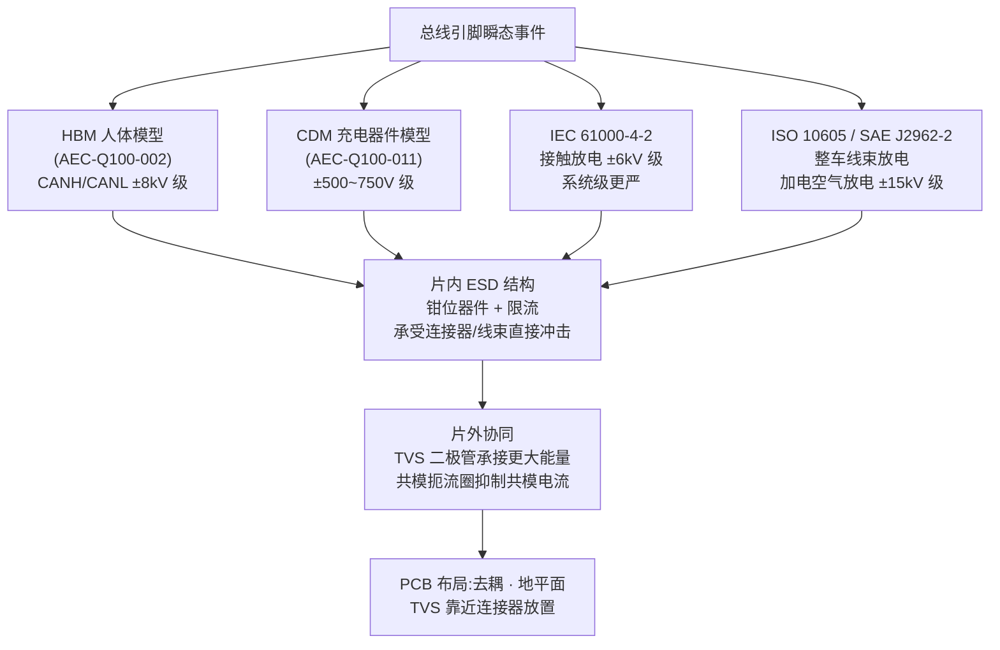
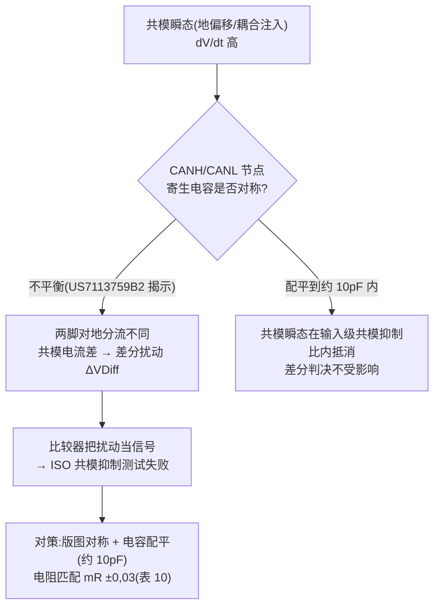
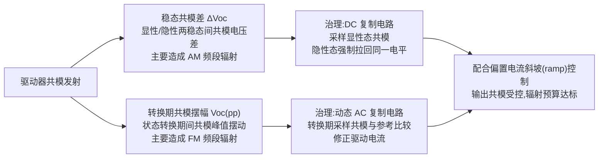
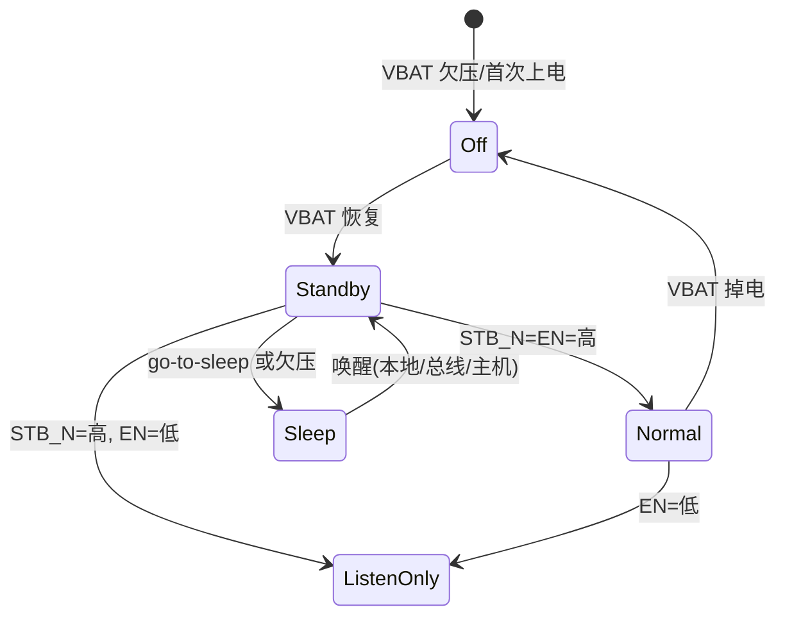

## 定义

**ESD 保护与共模抑制**是收发器面向车载线束环境的两个健壮性维度:**ESD 保护**让 CANH/CANL 引脚扛住静电放电与过压事件;**共模抑制**让接收器在地电位差、耦合干扰下仍能正确判别差分电平,并压低收发器自身的共模发射。二者共同决定收发器在整车中的存活率与 EMC 合规性。

## 关键参数

### 最大额定值(表 2,5.3.1 节)—— 未损坏前提下的电压上限

| 参数 | 符号 | 最小 [V] | 最大 [V] | 条件 |
|---|---|---|---|---|
| 最大额定值 | VDiff | -5,0 | +10,0 | 需满足一般或扩展最大额定值之一 |
| 一般最大额定值 | VCAN_H、VCAN_L | -27,0 | +40,0 | — |
| 可选:扩展最大额定值 | VCAN_H、VCAN_L | -58,0 | +58,0 | — |

来源:参数速查页表 2(5.3.1 节)。注:VDiff = VCAN_H − VCAN_L;VDiff 最大额定值不保证 VCAN_H / VCAN_L 的所有组合都合规。该表适用于加电与未加电、TXD 无效与 TXD 变为有效(此时 CAN_H/CAN_L 接固定电压)的情况。

### 未加电漏电流(表 11,5.3.8 节)

| 参数 | 符号 | 最小 [μA] | 最大 [μA] | 条件 |
|---|---|---|---|---|
| CAN_H、CAN_L 漏电流 | ICAN_H、ICAN_L | -10 | +10 | VCAN_H=5V、VCAN_L=5V,所有电源输入接 GND |

未加电的 HS-PMA 不得干扰同介质上其他 HS-PMA 的通信——这是总线节点"拔电不捣乱"的量化保证。

### 器件级 ESD 与电压耐受(TJA1463 数据手册,表 6)

| 项目 | 数值 | 标准 |
|---|---|---|
| CANH/CANL 电压限值 | -36 V ~ +40 V | IEC 60134 |
| CANH-CANL 间电压 | -40 V ~ +40 V | IEC 60134 |
| ESD:CANH/CANL | -6 kV ~ +6 kV | IEC 61000-4-2(150 pF,330 Ω) |
| ESD:VBAT/WAKE | ±8 kV | IEC 61000-4-2 |
| ESD:CANH/CANL(加电空气放电) | ±15 kV | SAE J2962-2:2019(330 pF,2k) |
| ESD:CANH/CANL(加电接触放电) | ±8 kV | SAE J2962-2 |
| ESD:HBM(CANH/CANL) | ±8 kV | AEC-Q100-002 |
| ESD:HBM(任意引脚) | ±4 kV | AEC-Q100-002 |
| ESD:CDM(角引脚/其他) | ±750 V / ±500 V | AEC-Q100-011 |
| 瞬态(pulse 3a / 3b 等) | -150 V / +100 V 等 | ISO 7637-2(经 IEC TS 62228 4.2.4) |

### 共模相关参数(表 7 条件与 TJA1463 表 8)

| 参数 | 符号 | 数值 | 来源 |
|---|---|---|---|
| 接收器共模输入范围(条件列) | VCAN_H/L | -12,0 V ~ +12,0 V | 表 7/8 条件 |
| 共模电压阶跃 | Vcm(step) | ±150 mV | TJA1463 表 8 |
| 峰峰共模电压 | Vcm(p-p) | ±300 mV | TJA1463 表 8 |
| 共模输入电容 | Ci(cm) | ≤30 pF | TJA1463 表 8 |
| 差分输入电容 | Ci(dif) | ≤15 pF | TJA1463 表 8 |
| 输入电阻匹配 | mR | ±0,03 | 表 10 |

## 工作原理/机制

### ESD 保护:分级模型与片内/片外分工

- **分级模型**:HBM(典型 ≥ ±8 kV)、CDM、IEC 61000-4-2、ISO 10605(整车线束放电);具体等级以器件数据手册与 AEC-Q100 要求为准。注意不同模型数值不可直接横向比较(放电网络不同:150 pF/330 Ω vs 330 pF/2 k 等)。
- **片内防护**:收发器引脚内置 ESD 结构承受直接冲击;器件级极限电压(CANH/CANL -36~+40 V、CANH-CANL ±40 V,TJA1463)与总线容错(±58 V 新一代器件)决定故障场景下的存活。
- **片外协同**:外围 **TVS 二极管**承接更大能量、**共模扼流圈**抑制共模电流;注意 TVS 寄生电容对高速数据相位信号质量的影响(与芯片输入电容 Ci(cm) ≤30 pF 统筹)。

TI [SLVAFC1 应用笔记](../../resources/_entries/vendors/ti-slvafc1.md)系统讲解 CAN 总线瞬态与 ESD 耦合路径、IEC 61000-4-2 / ISO 7637 测试方法、TVS 与共模扼流圈选型及 PCB 布局;NXP [AH1308](../../resources/_entries/vendors/nxp-ah1308.md)给出含完整 ESD/EMC 防护的应用电路与 PCB 规则。

### 共模瞬态如何转成差分扰动:电容不平衡机制

TI [US7113759B2(电容平衡)](../../resources/_entries/patents/us7113759b2.md) 证明 CANH/CANL 寄生电容不平衡会让共模瞬态转成差分扰动(ISO 共模抑制测试失败的根因),需把两脚电容配平到约 10 pF 内——版图对称与电容配平是共模抑制的物理基础,详见[接收比较器](receiver-comparator.md)。

### 共模发射抑制:输出端的两个分量

TI [US7183793B2(共模发射抑制)](../../resources/_entries/patents/us7183793b2.md) 把驱动器共模发射分为两个分量分别治理:稳态共模差 ΔVoc 用 **DC 复制电路**(采样显性态共模,在隐性态强制拉回同一共模电平);转换期共模摆幅 Voc(pp) 用 **动态 AC 复制电路**(转换期间采样共模并与参考比较、修正驱动电流)。配合偏置电流斜坡控制,构成控制输出共模的经典模拟方法,对 SIC 高 dV/dt 场景下的辐射预算同样适用。发射水平的直接约束还有驱动对称性(Vsym_vcc 0,9~1,1,表 12;Annex A 收紧至 0,95~1,05,表 A.9)。

### 收发器系统模式与故障保护(TJA1463 状态机)

TJA1463 的系统状态机(Off/Standby/Normal/Listen-only/Sleep)配合 CAN 状态机(CAN Off/Offline/Wake/Pass-through/Active/Listen-only)实现失效安全与低功耗;本地故障(TXD 显性超时、TXD-RXD 短路、总线持续显性、过温)经 ERR_N 引脚轮询诊断。总线持续显性超过 tto(dom)bus 0,8~9 ms 判定总线显性故障;TXD 显性超时 tto(dom)TXD 0,8~9 ms 释放总线到隐性(数据手册表 9)。

## 对收发器设计的意义

- **ESD/共模是"看不见的性能"**:片内 ESD 结构(钳位器件、限流)与输入级共模抑制(四象限输入、电容配平)在版图与器件层面决定健壮性;共模发射抑制(复制电路 + 电流斜坡)是 EMC 设计的模拟核心。公开专利(US7113759B2、US7183793B2、US10042807B2)是设计思路教材。
- **预算式设计**:把共模范围预算(-12~+12 V)分解给地电位差、线束耦合与故障注入;把 ESD 预算分解给片内结构、片外 TVS 与连接器/线束——选型时同步核对 TVS 寄生电容与芯片 Ci(cm) 的叠加。
- **测试即设计输入**:芯片级 ESD/EFT 台架方法与共模注入测试方法在 SLVAFC1、AH1308 中有实操步骤;收发器 EMC 评估按 IEC 62228-3,车规整机按 CISPR 25/ISO 11452(见[回波损耗与 EMC](../physical-layer/return-loss-emc.md))。
- **对控制器(嵌入式)**:PCB 上 TVS 与共模扼流圈选型、地平面处理、线束屏蔽;故障(对电源/对地短路)场景下收发器进入保护,控制器应能识别总线故障状态(ERR_N 诊断)并恢复。

## 常见误区

- **误区一:"HBM 8 kV 与 IEC 61000-4-2 8 kV 一样"** —— 放电网络不同(HBM 为 100 pF/1,5 kΩ 量级,IEC 61000-4-2 为 150 pF/330 Ω),数值不可直接横向比较;数据手册会分别标注(如 TJA1463:HBM ±8 kV 与 IEC 61000-4-2 ±6 kV 并存)。
- **误区二:"加 TVS 越大越好"** —— TVS 寄生电容会进入总线端输入网络,劣化高频回波损耗与边沿;高速数据相位下需在钳位能力与电容之间选型,并与芯片输入电容统筹。
- **误区三:"共模问题靠外部 CMC 解决即可"** —— 芯片自身的电容/电阻不平衡(US7113759B2)会把共模瞬态转成差分扰动,这是片内版图对称问题,外部共模扼流圈无法完全补救。
- **误区四:"最大额定值可以长期使用"** —— 表 2 的 -27~+40 V(-58~+58 V 扩展)是"不造成损坏"的静态极限,不是工作范围;TJA1463 的 -36~+40 V 同理(且 VBAT 28~40 V 区间特性不保证),设计时需留故障余量。

## 参见

- 标准规范(内容来源):[ISO 11898-2:2024 关键参数速查](../../resources/standards-text/iso-11898-2-2024-key-parameters.md)、[ISO 11898-2:2024 全文](../../resources/standards-text/iso-11898-2-2024-full.md)、[IEC 62228-3 条目](../../resources/_entries/standards/iec-62228-3-2019.md)
- 厂商资料:[NXP TJA1463 数据手册全文](../../resources/full-text/tja1463-datasheet.md)、[TI SLVAFC1(ESD 防护)](../../resources/_entries/vendors/ti-slvafc1.md)、[NXP AH1308(应用提示)](../../resources/_entries/vendors/nxp-ah1308.md)
- 专利:[US7113759B2(电容平衡)](../../resources/_entries/patents/us7113759b2.md)、[US7183793B2(共模发射抑制)](../../resources/_entries/patents/us7183793b2.md)、[US10042807B2(四象限输入)](../../resources/_entries/patents/us10042807b2.md)
- 教程:[收发器传播延迟对称性](../../tutorials/09-delay-symmetry.md)、[示波器抓 CAN FD 帧](../../tutorials/10-scope-capture.md)(观察共模/振铃)
- 词条:[ESD](../../glossary/esd.md)、[共模范围](../../glossary/common-mode-range.md)、[共模扼流圈](../../glossary/common-mode-choke.md)、[EMI/EMC](../../glossary/emi-emc.md)、[CISPR 25](../../glossary/cispr25.md)、[AEC-Q100](../../glossary/aec-q100.md)
- 相邻子域:[回波损耗与 EMC](../physical-layer/return-loss-emc.md)、[接收比较器](receiver-comparator.md)、[SIC 设计专题·设计篇](../sic-design/design.md)
