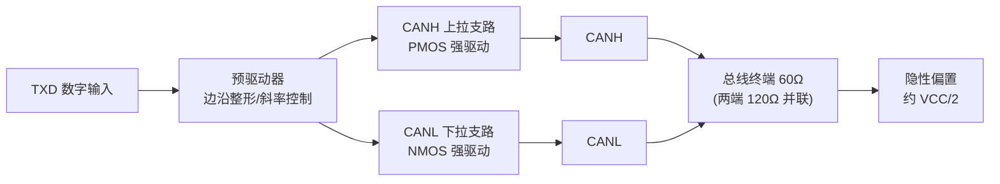
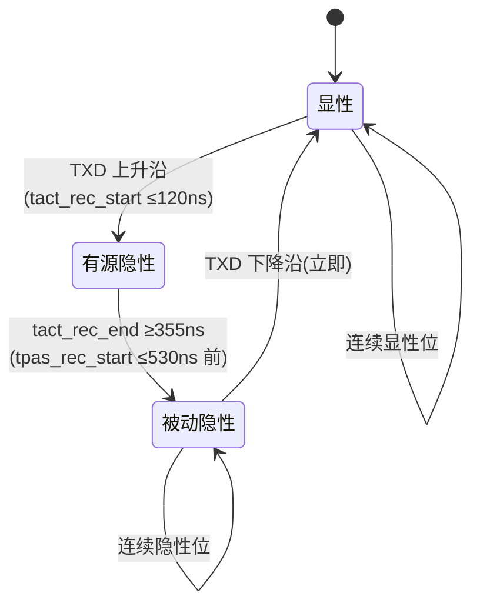
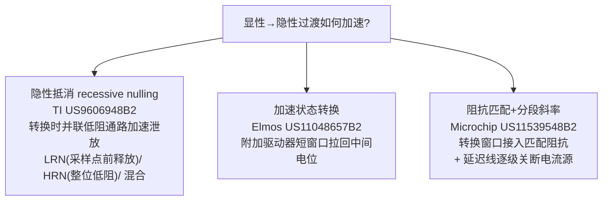
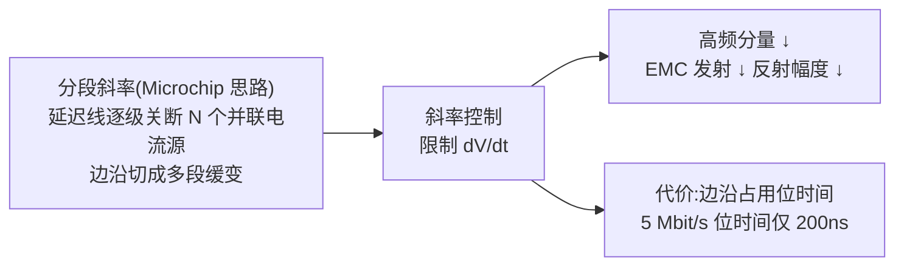

## 定义

**输出级(Output Stage / Driver)** 是 CAN 收发器把控制器 **TxD** 数字信号转换为总线差分电平的模拟前端:显性位时驱动 CANH 抬高、CANL 拉低,形成约 2 V 的差分显性电平;隐性位时输出级退出驱动(高阻"放手"),靠总线终端电阻把两线拉回约 2.5 V(差分约 0 V)。同时,输出级负责**边沿斜率控制**与 SIC 的**三态阻抗切换**,并决定发送路径延迟 **tTX**——它和数据相位的高速可靠性与 EMC 直接相关。

关键物理事实:隐性态不是"输出级拉出来"的,而是靠网络放电"释放"出来的——显性→隐性转换的速度受总线 RC 时间常数限制,这正是高速数据相位(CAN FD 数据段)输出级要解决的问题。

## 关键参数

### 显性/隐性输出电平(表 5 与表 3,5.3.4/5.3.2 节)

| 参数 | 符号 | 最小 [V] | 典型 [V] | 最大 [V] | 条件 |
|---|---|---|---|---|---|
| 显性 CAN_H 单端电压 | VCAN_H | +2,75 | +3,5 | +4,5 | RL=50Ω 至 65Ω |
| 显性 CAN_L 单端电压 | VCAN_L | +0,5 | +1,5 | +2,25 | RL=50Ω 至 65Ω |
| 正常总线负载差分电压 | VDiff | +1,5 | +2,0 | +3,0 | RL=50Ω 至 65Ω |
| 仲裁期间有效电阻差分电压 | VDiff | +1,5 | 未定义 | +5,0 | RL=2240Ω(32 节点同时显性) |
| 隐性差分输出电压 | VDiff | -0,5 | 0 | +0,05 | 偏置激活(表 3) |
| 隐性单端输出电压 | VCAN_H/L | +2,0 | +2,5 | +3,0 | RL>1010Ω(表 3) |
| 隐性单端(端接 60Ω) | VCAN_H/L rec | +2,137 | +2,5 | +2,887 | RL=60Ω(±1%)(表 3) |

来源:参数速查页表 5(5.3.4 节)、表 3(5.3.2 节)。表 5 注:表中要求同时成立,并非 VCAN_H 与 VCAN_L 的所有组合都满足 VDiff 定义;RL=2240Ω 对应 32 节点同时发送显性时单节点驱动负载变小的仲裁场景。

### 驱动电流与对称性(表 6 / 表 12)

| 参数 | 符号 | 最小 | 最大 | 条件 |
|---|---|---|---|---|
| CAN_H 绝对电流 | ICAN_H | — | 115 mA | -3V≤VCAN_H≤+18V |
| CAN_L 绝对电流 | ICAN_L | — | 115 mA | -3V≤VCAN_L≤+18V |
| 驱动对称性(基于 Vcc) | Vsym_vcc | +0,9 | +1,1 | RL=60Ω(±1%),C₁=4,7nF |
| 驱动对称性(基于 Vrec 之和) | Vsym_vrec | +0,9 | +1,1 | 同上 |

来源:参数速查页表 6(5.3.5 节)、表 12(5.4.1 节)。表 6 注:最小输出电流由表 5 隐含规定,预计高于 30 mA。

### SIC 模式:三态阻抗与窗口(表 18;SIC 模式显性输出见表 A.3)

| 参数 | 符号 | 最小 | 最大 |
|---|---|---|---|
| 差分内部电阻(有源隐性) | RDIFF_act_rec | 75Ω | 133Ω |
| 可选:单端内部电阻 | RSE_SIC_act_rec | 37,5Ω | 66,5Ω |
| 主动信号改善阶段开始时间 | tact_rec_start | n.a. | 120 ns |
| 主动信号改善阶段结束时间 | tact_rec_end | 355 ns | n.a. |
| 被动隐性阶段开始时间 | tpas_rec_start | n.a. | 530 ns |
| SIC 模式显性 CAN_H 单端电压 | VCAN_H | 3,0 V | 4,26 V(表 A.3,RL=45Ω 至 65Ω) |
| SIC 模式显性 CAN_L 单端电压 | VCAN_L | 0,75 V | 2,01 V(表 A.3) |

### 器件级对照(TJA1463 数据手册,表 8)

| 参数 | 符号 | 最小 | 典型 | 最大 |
|---|---|---|---|---|
| 显性输出 CANH | VO(dom) | 2,89 V | 3,5 V | 4,26 V |
| 显性输出 CANL | VO(dom) | 0,77 V | 1,5 V | 2,13 V |
| 差分输出(RL=50~65Ω) | VO(dif) | 1,5 V | — | 2,75 V |
| 差分输出(RL=45~70Ω) | VO(dif) | 1,4 V | — | 3,3 V |
| 显性相差分输入电阻 | Ri(dif)dom | — | — | 62,5Ω |
| 显性相输入电阻 | Ri(dom) | — | — | 30Ω |
| 有源隐性相差分输入电阻 | Ri(dif)actrec | 75Ω | — | 125Ω |
| 有源隐性相输入电阻 | Ri(actrec) | 37,5Ω | — | 60Ω |

## 工作原理/机制

### 输出级架构:差分驱动对

显性态:上拉管把 CANH 拉向电源、下拉管把 CANL 拉向地,两路同时导通形成差分电流回路;隐性态:两路同时关断,由终端电阻网络把两线偏置回 VCC/2。驱动电流大小决定显性差分电压与抗负载能力(总线负载、短路到电源/地)。输出级需承受总线故障与负压(对电源短路、对地短路、抛负载等),常配合高压/负压保护串联器件(如 US11310072B2 中 M2/M3/M5/M6 高压钳位串联管)。

### 三态阻抗状态机(SIC)

| 相位 | 输出阻抗 | 驱动行为 | 设计要点 |
|---|---|---|---|
| 显性 dominant | 低(约 50Ω 量级) | 强制驱动差分 | 大电流、低导通电阻、对称灌/拉 |
| 有源隐性 active recessive | 75~133Ω(RDIFF_act_rec) | 主动向隐性放电 | 阻抗精确可控、可定时关断、可编程/校准 |
| 被动隐性 passive recessive | 约 60 kΩ | 高阻,总线自然放电 | 高阻漏电要小、与仲裁兼容 |

有源隐性阻抗太低会过度加载总线(影响仲裁、增加功耗),太高起不到阻尼作用——75~133Ω 窗口是"阻尼效果"与"总线负载"的折衷,通常由并联的辅助驱动支路实现,并**可编程/校准**以覆盖 PVT 变化(设计要点详见[SIC 设计专题·设计篇](../sic-design/design.md))。

### 高速数据相位的挑战:加速隐性过渡

数据相位(如 5 Mbit/s)位时间仅 200 ns,显性→隐性放电时间成为速率瓶颈,催生了**加速隐性过渡**方案。三条公开专利路线:

| 方案 | 代表专利 | 思路 |
|---|---|---|
| **隐性抵消(recessive nulling)** | TI [US9606948B2](../../resources/full-text/us9606948b2-recessive-nulling.md) | 显性→隐性跳变时短时并联基于共模电压(VCC/2,运放缓冲产生)的低阻分数驱动器,加速泄放分布电容电荷,缩短差分电压衰减到隐性阈值的时间;LRN 模式只在隐性位开头一段生效、**必须在采样点前释放阻抗**以免过度加载总线干扰仲裁;HRN 模式覆盖整个隐性位(仅限单主/无仲裁拓扑);混合模式按帧段选择 |
| **加速状态转换** | Elmos [US11048657B2](../../resources/_entries/patents/us11048657b2.md) | 主驱动器外加附加驱动器,在跳变后短暂窗口(<70% 位时间示例)内以低阻把 CANH/CANL 拉回中间电位,缩短衰减时间 T_decay |
| **阻抗匹配+斜率控制组合** | Microchip [US11539548B2](../../resources/full-text/us11539548b2-microchip-sic.md) | 显性态保持低阻输出、隐性过渡期接入匹配阻抗(OTA 或背靠背 Ron 受控晶体管对,总 Ron=总线特征阻抗,带温度补偿),并以串联延迟线逐级关断并联电流源做分段斜率控制,面向 5 Mbit/s 及以上 |

这些方案与 SIC 的振铃抑制共用同一套输出级技战术,详见[振铃抑制:SIC 核心能力](../physical-layer/ringing-suppression.md)。

### 斜率控制与 EMC

- 通过限制驱动电流的上升/下降沿压低高频分量,是**控制 EMC(尤其传导发射)**的基本手段;驱动对称性 Vsym_vcc(0,9~1,1,表 12)是发射水平的直接约束。
- 斜率过慢会占用位时间、牺牲高速数据相位时序;过快则加剧振铃与辐射——收发器在速率与 EMC 之间做折衷,部分器件提供多档斜率配置。
- Microchip US11539548B2 的**分段斜率控制**:把主驱动器分成 N 个并联小驱动器(电流源或电阻开关),禁用信号经串联延迟线逐级到达,边沿被切成多段缓变;该方案不改变总线差分阻抗,与阻抗匹配可独立或组合使用。

### 输出级决定 tTX 与环回延迟

环回延迟的三段中,**tTX(发送路径延迟)** 由输出级与输出沿整形决定:驱动电流建立快慢、加速过渡窗口的时序、开关毛刺都反映在 tTX 及其随 PVT 的变化上。参数集 C 要求 TXD→总线传播延迟 tprop(TXD_BUS) ≤80 ns、环回延迟 ≤190 ns(表 14);TJA1463 实测 td(TXD-busactrec)start 70~120 ns、td(TXD-busactrec)end 355~480 ns、td(TXD-buspasrec)start 415~530 ns。tTX 直接影响 TDC 补偿精度与位时序对称性(见[收发器延迟补偿(TDC/SSP)](../bit-timing/tdc.md))。

## 对收发器设计的意义

- **输出级是"把控制器逻辑变成总线物理"的最后一公里**,设计权衡集中在三个两难:驱动强度 vs 斜率(EMC)、放电速度 vs 振铃、加速过渡窗口 vs 干扰他人(仲裁兼容)。
- **SIC 三态阻抗是硬指标**:有源隐性阻抗必须落在 RDIFF_act_rec 75~133Ω,窗口时序满足 ≤120 ns / ≥355 ns / ≤530 ns;有源→被动切换必须 glitch-free,TXD 变 LOW 必须立即切回显性(仲裁兼容);TXD 显性超时保护 tdom 0,80~6,0 ms(表 A.10)防止 TXD 卡死。
- **对称边沿整形**:驱动器上升/下降边沿尽量一致(参数集 C:t△Bit(Bus) -10~+10 ns),延迟路径拆分预算(td(TXD-bus) ≤80 ns),片上延迟做温度补偿(-40~150 °C 全温)。
- **公开素材**:US9606948B2、US11048657B2、US11539548B2 是电路思路教材;厂商数据手册(TJA1463/TCAN1462/NCV7357)给出可对标的电气参数;工艺参考 0.14 µm HV SOI(NXP Deloge 2015)、0.18 µm CMOS 等(见[SIC 设计专题·设计篇](../sic-design/design.md))。

## 常见误区

- **误区一:"隐性位是输出级拉出来的"** —— 隐性位靠终端电阻网络把总线偏置到 VCC/2,输出级处于高阻"放手"状态;显性→隐性转换速度受总线 RC 时间常数限制,这正是 SIC 有源隐性要解决的问题。
- **误区二:"显性差分电压越大越好"** —— 表 5 同时约束 VCAN_H、VCAN_L 与 VDiff(且要求同时成立):VCAN_H 上限 +4,5 V、VDiff 上限 +3,0 V(正常负载)。输出级把 CANH 拉得过高会把共模推离 VCC/2,劣化对称性(Vsym)并增加发射。
- **误区三:"有源隐性窗口越长越好"** —— 表 18 只规定下界(tact_rec_end ≥355 ns)与上界(tpas_rec_start ≤530 ns);窗口过长会占用仲裁相位、妨碍显性覆盖,过短则阻尼不足——可编程窗口按网络长度微调是正解。
- **误区四:斜率控制只影响 EMC** —— 斜率同时决定边沿在采样点的稳定程度与反射幅度;高速数据相位下斜率是 EMC、振铃与时序三者的共同折衷点。

## 参见

- 标准规范(内容来源):[ISO 11898-2:2024 关键参数速查](../../resources/standards-text/iso-11898-2-2024-key-parameters.md)、[ISO 11898-2:2024 全文](../../resources/standards-text/iso-11898-2-2024-full.md)
- 专利全文(内容来源):[US9606948B2 隐性抵消](../../resources/full-text/us9606948b2-recessive-nulling.md)、[US11539548B2 阻抗匹配+斜率控制](../../resources/full-text/us11539548b2-microchip-sic.md)、[US10020841B2 前馈振铃抑制](../../resources/full-text/us10020841b2-feedforward.md)、[US11310072B2 瞬态触发振铃抑制](../../resources/full-text/us11310072b2-ring-suppression.md)
- 厂商资料:[NXP TJA1463 数据手册全文](../../resources/full-text/tja1463-datasheet.md)、[TI SLLA581 白皮书全文](../../resources/full-text/slla581-white-paper.md)
- 教程:[SIC 是什么](../../tutorials/07-what-is-sic.md)、[振铃抑制原理与测量](../../tutorials/08-ringing-suppression.md)、[收发器传播延迟对称性](../../tutorials/09-delay-symmetry.md)
- 词条:[显性/隐性电平](../../glossary/dominant-recessive-levels.md)、[压摆率](../../glossary/slew-rate.md)、[收发器](../../glossary/transceiver.md)、[CAN SIC](../../glossary/can-sic.md)
- 相邻子域:[振铃抑制:SIC 核心能力](../physical-layer/ringing-suppression.md)、[收发器延迟补偿(TDC/SSP)](../bit-timing/tdc.md)、[SIC 设计专题·设计篇](../sic-design/design.md)
