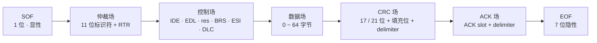
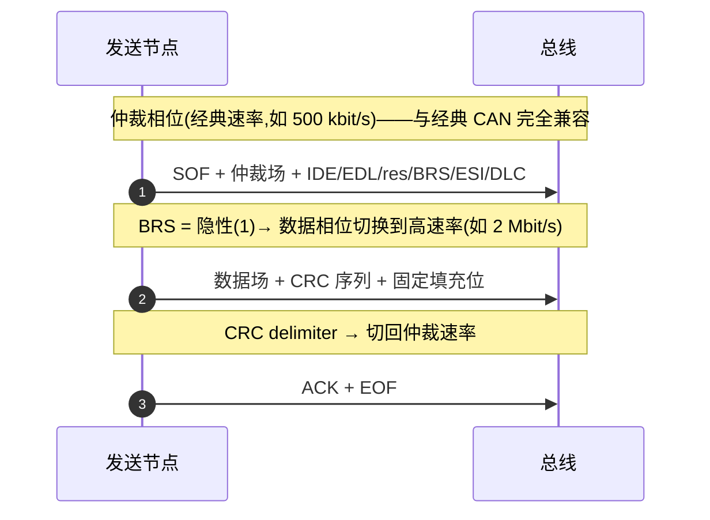

## 适用读者 / 前置知识

- **适用读者**:所有刚开始接触 CAN FD 的人——嵌入式开发者与模拟 IC 工程师。
- **前置知识**:只需要对 CAN 有最基础的印象即可(听说过"CAN 总线""报文"这些词)。如果完全没概念,建议先读[Classical CAN 词条](../glossary/classical-can.md)建立背景,再回来看本教程。

## 正文

### 一张图看懂整体结构

CAN FD 数据帧与经典 CAN 数据帧一样,由若干"场(field)"拼接而成。下面这张图按**位序**(从左到右)画出了 CAN FD 数据帧(标准 11 位标识符)的完整布局:



从左往右读:帧以 **SOF**(Start of Frame,显性位)开头,随后是**仲裁场**(用于总线竞争)、**控制场**(携带格式与长度信息)、**数据场**(真正要传的载荷)、**CRC 场**(检错)、**ACK 场**(接收确认)和 **EOF**(帧结束)。这个骨架与经典 CAN 几乎一样——CAN FD 的秘密,集中在控制场的三个标志位上:**EDL、BRS、ESI**。

### 逐字段讲解

#### SOF 与仲裁场

- **SOF**:1 位显性,宣告"我要发帧了",所有节点据此同步。
- **仲裁场**:11 位标准标识符(扩展帧为 29 位)+ 1 位 RTR。多个节点同时发送时,在这里逐位竞争(显性位优先)。**CAN FD 的仲裁场与经典 CAN 完全一致**,这是两类节点能在同一网络共存竞争的根本原因。

#### 控制场:三个标志位都在这里

标准标识符 CAN FD 帧的控制场位序为:

```
IDE → EDL → res → BRS → ESI → DLC
```

| 位 | 名称 | 作用 |
|---|---|---|
| IDE | 标识符扩展位 | 显性(0)= 标准帧;隐性(1)= 扩展帧 |
| **EDL** | 扩展数据长度 | **隐性(1) = 这是 CAN FD 帧**;显性(0)= 经典 CAN 帧 |
| res | 保留位 | 发送显性(0),为未来扩展保留 |
| **BRS** | 位速率切换 | 隐性(1)= 数据相位切换到高速率;显性(0)= 整帧保持仲裁速率 |
| **ESI** | 错误状态指示 | 发送节点处于 Error Passive 时为隐性(1);Error Active 为显性(0) |
| DLC | 数据长度码 | 4 位,指示数据场字节数 |

三个标志位一句话记忆:

> **EDL 决定"这是什么帧",BRS 决定"数据段跑多快",ESI 报告"发送方状态如何"。**

#### 数据场与 DLC

- CAN FD 数据场最长 **64 字节**(经典 CAN 只有 8 字节)。
- DLC 是 4 位编码,但**不再连续映射**:0~8 对应 0~8 字节;9~15 分别映射到更大的非连续长度:

| DLC | 0 | 1 | 2 | 3 | 4 | 5 | 6 | 7 | 8 | 9 | A | B | C | D | E | F |
|---|---|---|---|---|---|---|---|---|---|---|---|---|---|---|---|---|
| 字节数 | 0 | 1 | 2 | 3 | 4 | 5 | 6 | 7 | 8 | 12 | 16 | 20 | 24 | 32 | 48 | 64 |

#### CRC 场

- 数据长度 ≤ 16 字节用 **17 位 CRC**,> 16 字节用 **21 位 CRC**,保证长数据帧仍维持与经典 CAN 的 15 位 CRC 相当的检错能力。
- CRC 覆盖控制场、数据场以及其中的**填充位**(见下文),CRC 序列之后还带一段**固定填充位**和 1 位 CRC delimiter(显性)。
- 相关机制详见 [CRC 词条](../glossary/crc.md) 与 [位填充词条](../glossary/bit-stuffing.md)。

#### ACK 场与 EOF

- **ACK 场**:1 位 ACK slot(发送方发隐性,接收成功的节点回显性覆盖)+ 1 位 ACK delimiter(隐性)。
- **EOF**:7 位隐性,结束整帧。之后是帧间空间,进入下一轮通信。

### 速率切换:一图看懂 BRS

BRS 让 CAN FD 做到"**仲裁慢慢来,数据快快跑**"——仲裁相位用经典速率保证与旧节点的兼容,数据相位切到高速率提升吞吐。看时序图:



关键边界:

- **BRS 位位于控制场中部(DLC 之前,其后还有 ESI)**,发送方在 BRS 之后即切换速率,因此数据场、CRC 场都以数据相位速率传输。
- **切回点**在 CRC delimiter 处,之后 ACK、EOF 都回到仲裁速率——因为 ACK 需要最慢的节点也能回读确认。
- BRS 隐性切换高速率,要求收发器传播延迟对称性好、控制器启用 TDC(收发器延迟补偿),否则数据相位采样会失败。这就是为什么"CAN FD 需要更高级的收发器"。

### 与经典 CAN 帧的兼容关系

EDL 位于经典帧的 r0 位置(标准帧)或 r1 位置(扩展帧),经典帧中该位固定为显性。所以:

- 只有 CAN FD 节点能把 EDL 隐性的帧正确解析为 FD 帧;
- 只支持经典 CAN 的节点遇到 EDL 隐性位,会判定为**格式错误**并触发错误帧。

结论:**FD 帧与经典帧的"仲裁兼容"不等于"全网络兼容"**——同一网络上要么所有节点都支持 CAN FD,要么把 FD 帧与经典帧分网/分时部署。详见 [EDL 词条](../glossary/edl.md)。

## 关键结论

1. CAN FD 帧的骨架与经典 CAN 相同:SOF → 仲裁场 → 控制场 → 数据场 → CRC → ACK → EOF,仲裁场完全兼容。
2. **EDL 隐性 = CAN FD 帧**;**BRS 隐性 = 数据相位提速**;ESI 由发送节点报告自身错误状态,三者都在控制场中。
3. 数据场最长 64 字节,DLC 采用非连续映射(9~15 → 12/16/20/24/32/48/64)。
4. CRC 按数据长度选 17 位或 21 位,并覆盖填充位,保证长帧检错强度不下降。
5. 速率切换的边界:BRS 之后进入数据相位,CRC delimiter 处切回仲裁速率;ACK/EOF 始终以仲裁速率传输。

## 动手验证

在 Linux 环境下(无需硬件,用内核虚拟 CAN 接口)可以很快看到一帧 CAN FD:

```bash
# 1. 创建虚拟 CAN 接口 vcan0
sudo modprobe vcan
sudo ip link add dev vcan0 type vcan
sudo ip link set vcan0 up

# 2. 终端 A:抓帧
candump vcan0 -n 3

# 3. 终端 B:发一帧 CAN FD(12 字节,无 BRS)
cansend vcan0 123##0112233445566778899aabbcc
```

`##0` 表示 CAN FD 帧(flags=0,即不切换 BRS),后接 24 个十六进制字符 = 12 字节数据。抓帧结果显示长度 `[12]`——经典 CAN 最多 8 字节,所以长度大于 8 就能直接确认这是 CAN FD 帧。想看到 BRS 的效果,把 `##0` 换成 `##1`(BRS 置位)再试一次。

如果手头有真实 CAN 接口卡(如 USB-CAN),把 `vcan0` 换成 `can0`,并按接口卡说明用 `ip link` 配置速率后重复上述步骤。

## 参见

- 词条:[EDL](../glossary/edl.md)、[BRS](../glossary/brs.md)、[ESI](../glossary/esi.md)、[DLC](../glossary/dlc.md)、[CRC(17/21 位)](../glossary/crc.md)、[位填充](../glossary/bit-stuffing.md)、[CAN FD](../glossary/can-fd.md)
- 标准规范:[Bosch CAN FD Specification v1.0](../resources/_entries/standards/bosch-2012-canfd-spec.md)、[ISO 11898-1 (2024)](../resources/_entries/standards/iso-11898-1-2024.md)
- 论文:[Hartwich 2012: CAN with Flexible Data-Rate](../resources/_entries/papers/2012-hartwich-can-fd.md)
- 知识库:[协议基础](../knowledge/protocol/index.md)
