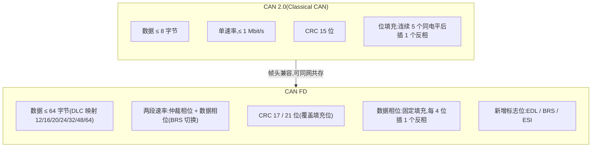

## 适用读者 / 前置知识

- **适用读者**:需要为项目选型、或刚开始接触 CAN FD 的开发者与工程师。
- **前置知识**:了解"CAN 总线会传报文"即可;若想先直观感受两种帧长得什么样,可以读[图解 CAN FD 帧结构](01-can-fd-frame-structure.md)再回来。

## 正文

CAN 2.0(官方称 Classical CAN,由 ISO 11898-1 定义数据链路层)是 20 世纪 90 年代定型的经典协议;CAN FD(CAN with Flexible Data-rate)2012 年由 Bosch 提出、2015 年写入 ISO 11898-1。下面这张图先建立整体印象:



### 差异 1:数据场长度——8 字节 vs 64 字节

这是最直观的区别:

- 经典 CAN 数据场最多 **8 字节**,DLC 0~8 直接对应字节数,9~15 保留不用。
- CAN FD 数据场最多 **64 字节**,DLC 采用非连续映射:9~15 分别代表 12/16/20/24/32/48/64 字节。

同样发一帧,FD 可以装入最多 8 倍的数据,加上速率提升,吞吐量可提高一个数量级以上。这正是"Flexible Data-rate"的动机之一:经典 CAN 的 1 Mbit/s + 8 字节载荷在车载带宽需求面前成了瓶颈。

### 差异 2:比特率——一帧一速 vs 一帧两速

- 经典 CAN 整帧单一比特率,标准上限 1 Mbit/s。
- CAN FD 一帧内有两段速率:仲裁相位沿用经典速率(保证与旧节点仲裁兼容),数据相位在 **BRS 位**控制下切换到更高速率(实践中常见 2 Mbit/s,条件允许时 5 Mbit/s,视控制器与收发器能力而定)。

BRS 的切换边界:数据场与 CRC 场走高速率,CRC delimiter 处切回仲裁速率,ACK/EOF 仍用仲裁速率。

### 差异 3:帧格式与标志位

- 经典帧控制场为 `IDE + r0 + DLC`(标准帧)或 `SRR + IDE + r1 + DLC`(扩展帧)。
- CAN FD 帧控制场为 `IDE + EDL + res + BRS + ESI + DLC`,新增三个标志位:
  - **EDL**:隐性表示这是 CAN FD 帧;
  - **BRS**:隐性表示数据相位提速;
  - **ESI**:发送节点报告自己是否已进入 Error Passive。
- CRC 也从 15 位升级为 **17 位(数据 ≤ 16 字节)或 21 位(数据 > 16 字节)**,保证更长的帧仍有足够的检错强度。

> ⚠️ 兼容性注意:FD 帧的前部(SOF、仲裁场)与经典帧完全一致,所以两类节点可以公平仲裁;但经典节点把 EDL 位解读为保留位 r0/r1,读到隐性即判格式错误。**"仲裁兼容"不等于"全网络兼容"**,混合部署必须保证所有节点支持 FD,或分区隔离。

### 差异 4:位填充规则

位填充是为了保证总线信号有足够的跳变沿供节点重同步:

- 经典 CAN:连续出现 **5 个相同电平**后强制插入 1 个反相填充位。
- CAN FD 仲裁相位沿用上述 5 位规则;数据相位改用**固定填充(fixed stuffing)**:每 4 位插入 1 个填充位(含 CRC 序列自身),使高速数据相位的填充行为可预期,也让 17/21 位 CRC 能覆盖填充位(经典 CAN 的 CRC 不覆盖填充位)。

固定填充的好处:数据相位速率越高,位时间越短,越需要确定性——固定填充让收发器与控制器都知道填充位置,简化高速下的同步与 CRC 计算。

### 差异 5:物理层与收发器要求

速率翻倍、帧变长,对物理层提出了新要求:

- **收发器**:数据相位高速下,收发器的传播延迟对称性、环回延迟必须足够小且稳定,否则节点无法在正确时刻采样。ISO 11898-2 为此规定了 CAN FD 收发器(比经典 HS-CAN 收发器更严格的时序要求);要稳定跑 5 Mbit/s 大网络,还需要信号改善能力(CAN SIC)。
- **控制器**:数据相位需要 **TDC(收发器延迟补偿)**,发送节点实测"TxD→总线→RxD"的环回延迟,改为在第二采样点(SSP)采样,从而不再依赖固定采样点补偿物理层延迟。经典 CAN 控制器不支持 FD 帧格式(EDL 位与 17/21 位 CRC 等),且通常没有 TDC,无法直接跑 CAN FD。
- **位定时**:仲裁相位与数据相位要分别配置采样点;数据相位采样点通常配置得更靠后(80%~90% 附近),并依赖 TDC 提供的裕量。详见[位定时入门](03-bit-timing-basics.md)。

## 关键结论

1. 载荷:8 字节 → 64 字节,靠 DLC 非连续映射实现。
2. 速率:一帧单速(≤1 Mbit/s)→ 一帧两速(仲裁 + 数据,数据相位常见 2/5 Mbit/s,视能力)。
3. 帧格式:新增 EDL/BRS/ESI 标志位,CRC 从 15 位升级为 17/21 位。
4. 填充规则:经典 5 位规则 → FD 数据相位固定填充(每 4 位)。
5. 物理层:CAN FD 要求收发器延迟对称性与 TDC;5 Mbit/s 大网络还需 SIC 收发器。

## 动手验证

在 Linux 下用虚拟接口,同一接口上交替发经典帧与 FD 帧,观察抓帧输出:

```bash
sudo modprobe vcan
sudo ip link add dev vcan0 type vcan
sudo ip link set vcan0 up

# 终端 A:抓帧(不停)
candump vcan0

# 终端 B:
cansend vcan0 123#1122334455667788          # 经典 CAN 帧(8 字节)
cansend vcan0 123##01122334455667788        # CAN FD 帧(8 字节,无 BRS)
cansend vcan0 123##11122334455667788        # CAN FD 帧(8 字节,BRS 置位)
cansend vcan0 123##0112233445566778899aabbcc  # CAN FD 帧(12 字节)
```

观察点:FD 帧的长度显示可以超过 8(如 `[12]`);`##1` 与 `##0` 对应 BRS 开关。真实接口上,还可以用 `ip -details link show can0` 分别查看仲裁/数据相位的位定时配置,对比两者采样点的不同。

## 参见

- 词条:[CAN FD](../glossary/can-fd.md)、[Classical CAN](../glossary/classical-can.md)、[BRS](../glossary/brs.md)、[EDL](../glossary/edl.md)、[DLC](../glossary/dlc.md)、[CAN SIC](../glossary/can-sic.md)
- 标准规范:[ISO 11898-1 (2024)](../resources/_entries/standards/iso-11898-1-2024.md)、[Bosch CAN FD Specification v1.0](../resources/_entries/standards/bosch-2012-canfd-spec.md)
- 厂商资料:[TI SDAA190: CAN / CAN FD / CAN XL 对比](../resources/_entries/vendors/ti-sdaa190.md)
- 知识库:[协议基础](../knowledge/protocol/index.md)
