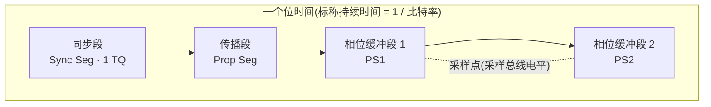
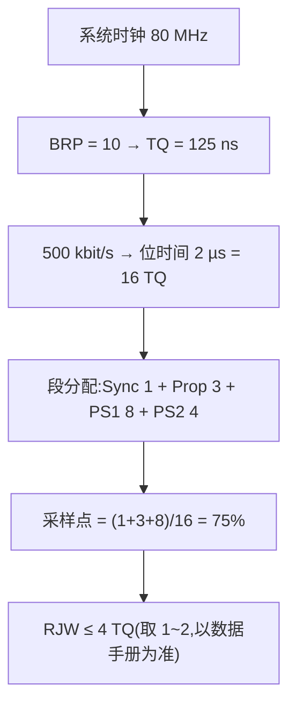

## 适用读者 / 前置知识

- **适用读者**:嵌入式工程师,以及任何需要配置 CAN/CAN FD 控制器寄存器或调网络时序的人。
- **前置知识**:了解位(bit)、比特率(bps)的概念;最好读过[图解 CAN FD 帧结构](01-can-fd-frame-structure.md)。不需要数学功底,只需要一点点比例计算。

## 正文

CAN 是异步串行总线,没有独立的时钟线,接收节点必须在每个位的合适时刻"采样"总线电平。位定时(Bit Timing)就是规定:**一个位的时间怎么切分、在哪个时刻采样、采样时刻能否微调**。这套机制直接决定网络能否稳定通信——绝大多数"偶发收不到、误码、莫名错误帧"的根因都藏在位定时配置里。

### 时间量子(TQ):位定时的最小砖块

控制器把系统时钟(如 80 MHz)按预分频系数(通常叫 BRP/Baud Rate Prescaler)分频,得到基本时间单位 **TQ(Time Quantum)**:

```
TQ = 预分频系数 × 系统时钟周期
```

一个位时间(Tbit = 1 / 比特率)必须由**整数个 TQ**组成,每个段都以 TQ 的整数倍配置。例如:80 MHz 时钟、BRP=10 → TQ = 125 ns;位时间 2 µs(500 kbit/s)→ 16 个 TQ。

### 位时间的四段结构

ISO 11898-1 把位时间划分为四段,采样点位于相位缓冲段 1 与 2 的交界:



| 段 | 作用 |
|---|---|
| **同步段(Sync Seg)** | 固定 1 TQ。总线电平跳变应在此发生,是硬同步/重同步的基准 |
| **传播段(Prop Seg)** | 吸收信号在总线与收发器上的传播延迟,让"自己发的显性回波"在采样点前稳定 |
| **相位缓冲段 1(PS1)** | 可被重同步延长,用于向后调整采样点 |
| **相位缓冲段 2(PS2)** | 可被重同步缩短,用于向前调整采样点 |

采样点位置用占位时间的百分比表示:

```
采样点(%) = (Sync Seg + Prop Seg + PS1) / 位时间总 TQ 数 × 100%
```

### 采样点为什么重要

每个节点在自己的采样点采样总线。如果两个节点采样点差异太大,或采样点早于"信号稳定时刻",同一个位就可能被不同节点判成不同电平。工程上:

- 经典 CAN / 仲裁相位采样点常见配置在 **70%~87.5%** 附近;
- CAN FD 数据相位通常配置得**更靠后(常见 80%~90% 附近)**,因为数据相位高速下留出更多 PS2 做相位调整;

> 注意:不同控制器/参考设计推荐值略有差异,**具体数值以你所用控制器的数据手册与位定时参考表为准**。

采样点靠后意味着:采样时刻更接近位末,给信号传播、振铃稳定留了更多时间,但留给 PS2 的相位调整空间变小,二者需权衡。

### 相位裕度:还能容忍多少偏差

**相位裕度(Phase Margin)**是指采样点两侧还可容忍的相位偏差总量。粗略地看,总相位裕度 ≈ 相位缓冲段 1 + 相位缓冲段 2 的长度之和(以 TQ 计)。它会被子网络以下因素消耗:

- 总线传播延迟(与线长成正比,经验上 ≈ 5~7 ns/m,以线缆特性为准);
- 收发器传播延迟及其**不对称性**(Tx 路径与 Rx 路径时间差);
- 各节点晶振/时钟偏差随帧长累积的漂移。

如果消耗超过裕度,采样点就会落到不稳定区间,表现为偶发位错误。所以"网络能不能跑"的本质问题是:**配置完之后相位裕度是否仍为正**。相关概念详见[相位裕度词条](../glossary/phase-margin.md)。

### 同步机制:把采样点拉回正确位置

- **硬同步**:帧起始 SOF 下降沿到来时,所有节点把采样点对齐到同步段;
- **重同步**:帧内检测到电平跳变早于/晚于预期时,通过缩短或延长相位缓冲段来微调,每次调整量不超过 **RJW(重同步跳转宽度)**。

RJW 越大,容忍晶振偏差和相位漂移的能力越强,但过大会把采样点推出稳定区,需要权衡。详见[RJW 词条](../glossary/re-sync-jump-width.md)。

### 一个完整计算示例

设系统时钟 80 MHz,仲裁相位目标 500 kbit/s,取位时间 16 TQ、采样点 75%:

```
比特率 = 80 MHz / (BRP × 16 TQ) = 500 kbit/s → BRP = 10,TQ = 125 ns
段分配:Sync 1 + Prop 3 + PS1 8 + PS2 4 = 16 TQ
采样点 = (1 + 3 + 8) / 16 = 75% ✔
RJW 取 ≤ min(PS1, PS2) = 4 TQ(常见取 1~2,以数据手册为准)
```



### CAN FD 的位定时有什么不同

CAN FD 对仲裁相位与数据相位**分别配置**一段位时间。数据相位有两个特殊之处:

1. **传播段可以很短**:数据相位的环回延迟由 **TDC(收发器延迟补偿)**补偿,不再需要长传播段吸收延迟,因此传播段常只留 1~2 TQ;
2. **依赖第二采样点(SSP)**:TDC 使能后,发送节点按实测环回延迟推迟到第二采样点采样,采样点位置由 TDC 配置决定,而非固定百分比。

一句话:**仲裁相位靠"长传播段 + 固定采样点"吸收延迟;数据相位靠"TDC + 第二采样点"消除延迟。** 详见[位定时配置实战](06-bit-timing-config.md)与 [TDC 词条](../glossary/tdc.md)。

## 关键结论

1. 位时间由整数个 TQ 组成,分为同步段、传播段、PS1、PS2 四段,采样点位于 PS1/PS2 交界。
2. 采样点百分比 = (Sync + Prop + PS1)/总 TQ;经典/仲裁相位常见 70%~87.5%,FD 数据相位常见 80%~90%,以数据手册推荐为准。
3. 相位裕度 ≈ PS1 + PS2,被传播延迟、收发器延迟不对称与时钟偏差消耗,配置目标就是"裕度保持为正"。
4. 同步段 + RJW 构成重同步能力,容忍节点间的时钟偏差。
5. CAN FD 数据相位靠 TDC + 第二采样点(SSP)补偿环回延迟,传播段可压缩到 1~2 TQ。

## 动手验证

先看当前接口的实际位定时(需要 CAN 接口或 vcan):

```bash
# 配置仲裁 500 kbit/s + 数据 2 Mbit/s
sudo ip link set can0 up type can bitrate 500000 dbitrate 2000000 fd on

# 查看内核实际协商出的段配置(TQ、prop-seg、phase-seg1/2、sjw、采样点)
ip -details link show can0
```

输出里会出现类似 `bitrate 500000 sample-point 0.750` 以及 `tq 125 prop-seg 3 phase-seg1 8 phase-seg2 4 sjw 1` 的字段——把看到的数值与本教程的示例对照,你就能读懂每段是几 TQ、采样点算出来是多少。

自测题(动手算):

1. 系统时钟 40 MHz,BRP = 4,求 TQ(ns)。
2. 用上面得到的 TQ,配 250 kbit/s,位时间应为多少 TQ?合理吗(8~25 常见范围)?
3. 若 `ip -details` 显示 `sample-point 0.800`,说明设计者把采样点放在位时间的什么位置?

## 参见

- 词条:[时间量子](../glossary/time-quantum.md)、[位时间](../glossary/bit-time.md)、[采样点](../glossary/sample-point.md)、[相位裕度](../glossary/phase-margin.md)、[传播段](../glossary/propagation-segment.md)、[重同步跳转宽度](../glossary/re-sync-jump-width.md)、[TDC](../glossary/tdc.md)
- 标准规范:[CiA 601-3(位定时配置与评估工具)](../resources/_entries/standards/cia-601-3-bit-timing.md)、[CiA 601-1(物理接口实现)](../resources/_entries/standards/cia-601-1-physical-interface.md)、[ISO 11898-1 (2024)](../resources/_entries/standards/iso-11898-1-2024.md)
- 教程:[CAN FD 位定时配置实战](06-bit-timing-config.md)
- 知识库:[位定时与同步](../knowledge/bit-timing/index.md)
