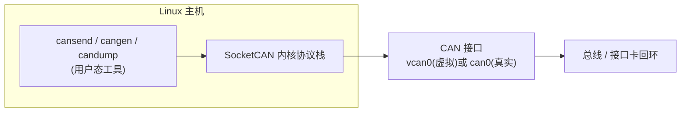
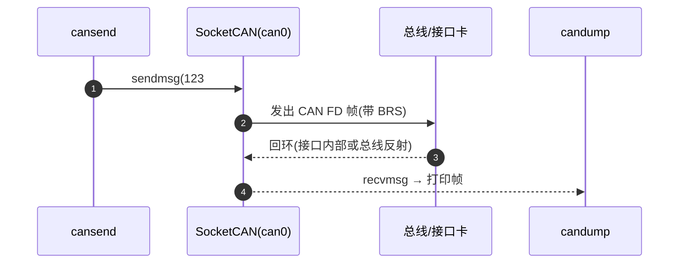

## 适用读者 / 前置知识

- **适用读者**:嵌入式工程师、Linux 开发者,想在 PC 上立刻上手 CAN FD。
- **前置知识**:基本的 Linux 命令行(sudo、bash)。不需要任何 CAN 硬件知识——本教程先教你在**零硬件**环境下跑通。

## 正文

SocketCAN 是 Linux 内核原生的 CAN 协议栈:它把 CAN 接口抽象成网络设备(`can0`、`vcan0`),用标准 `ip link` 命令配置,配套 `can-utils` 的命令行工具收发报文。它支持经典 CAN 与 CAN FD(含 BRS 数据相位),是 Linux 下做 CAN 实验的事实标准,免费、开箱即用。

先看整体结构:



### 第 0 步:确认环境

```bash
# 检查内核 CAN 子系统是否可用(有输出即 OK)
modprobe vcan

# 安装 can-utils(含 candump / cansend / cangen)
# Debian / Ubuntu:
sudo apt update && sudo apt install -y can-utils
```

验证安装:

```bash
cansend --help >/dev/null && echo "can-utils OK"
```

### 方案 A:零硬件——虚拟 CAN 接口 vcan0

`vcan` 是内核的虚拟 CAN 驱动,报文在接口内部回环,不接触任何物理总线,最适合练习命令与验证协议栈。

```bash
# 创建并启用虚拟接口
sudo ip link add dev vcan0 type vcan
sudo ip link set vcan0 up

# 终端 1:监听
candump vcan0

# 终端 2:发送(会看到终端 1 打印出这帧)
cansend vcan0 123#1122334455667788
```

看到类似输出即成功:

```
  vcan0  123   [8]  11 22 33 44 55 66 77 88
```

### 方案 B:真实接口卡——配置 CAN FD

如果手头有 USB-CAN 接口卡(被 Linux 内核支持,如 gs_usb、peak_usb 等),把它插上后接口名通常是 `can0`。**注意:虚拟 vcan 没有真实的位定时,只有真实接口才需要(才能)配置速率。**

```bash
# 配置 CAN FD:仲裁 500 kbit/s + 数据 2 Mbit/s,BRS 使能
sudo ip link set can0 up type can bitrate 500000 dbitrate 2000000 fd on
```

> 若网络为经典 CAN,去掉 FD 参数即可:`sudo ip link set can0 up type can bitrate 500000`。

### 发送 CAN FD 帧

can-utils 的报文格式:

- 经典帧:`<id>#<数据>`
- **CAN FD 帧:`<id>##<flags><数据>`**,其中 `flags` 是 1 位十六进制,SocketCAN 中 bit0 = BRS、bit1 = ESI:
  - `##0` — FD 帧,数据相位不切换速率(整帧跑仲裁速率);
  - `##1` — FD 帧且 **BRS 置位**(数据相位高速率);
  - `##3` — FD 帧,BRS + ESI 都置位。

```bash
# 发一帧 8 字节 CAN FD(无 BRS)
cansend can0 123##01122334455667788

# 发一帧 8 字节 CAN FD(带 BRS,数据相位提速)
cansend can0 123##11122334455667788

# 发一帧 12 字节 CAN FD——经典 CAN 做不到的长度
cansend can0 123##0112233445566778899aabbcc

# 发一帧 64 字节 CAN FD(128 个十六进制字符)
cansend can0 123##0112233445566778899aabbccddeeff00112233445566778899aabbccddeeff00112233445566778899aabbccddeeff00112233445566778899aabbccddeeff
```

对应回环流程:



### 用 cangen 批量产生 FD 流量

`cangen` 按规则生成报文,适合压测与观察:

```bash
# 每秒 1 帧、固定 ID 42A、长度 8、数据递增的 FD 帧
cangen vcan0 -f -g 1000 -I 42A -L 8 -D i -v

# 带 BRS 的 FD 帧流
cangen vcan0 -b -g 500 -v
```

`-f` 表示 FD 帧、`-b` 表示 FD 帧且 BRS 置位、`-g` 是间隔毫秒、`-I`/`-L`/`-D` 分别控制 ID/长度/数据(用 `-v` 打印已发帧)。

### 常见问题排查

| 现象 | 可能原因 |
|---|---|
| `No such device` | 接口卡驱动未加载或未创建 `vcan0` |
| `Cannot assign requested address` | 接口没 `up` |
| `candump` 不显示 FD 帧内容 | 先确认内核与 can-utils 支持 FD(`candump --help` 或 man 页);发送/接收都用 FD 帧格式(`cansend can0 123##12345678`) |
| 真实接口上频繁报错 | 位定时配置不当、无终端电阻、收发器不支持 FD——参考[位定时配置实战](06-bit-timing-config.md) |

## 关键结论

1. SocketCAN 把 CAN 抽象为网络接口,`ip link` 配置、`candump`/`cansend`/`cangen` 收发,免费且零硬件门槛。
2. 零硬件练习用 `vcan0`;真实 FD 网络用 `can0` 并按 `bitrate`/`dbitrate` 双速率配置。
3. can-utils 的 FD 帧格式为 `<id>##<flags><数据>`,`##0` 无 BRS、`##1` 带 BRS、`##3` 带 BRS+ESI。
4. 数据长度 > 8 字节或使用了 `##` 格式,即可确认是 CAN FD 帧。
5. 抓帧 `candump`、发单帧 `cansend`、造流量 `cangen`,三件套覆盖绝大多数调试场景。

## 动手验证

把上面"方案 A"的完整命令串复制到终端即可(5 分钟内可完成):

```bash
sudo modprobe vcan
sudo ip link add dev vcan0 type vcan
sudo ip link set vcan0 up
candump vcan0 &
cansend vcan0 123##0112233445566778899aabbcc   # 12 字节 FD 帧
cangen vcan0 -f -g 1000 -I 42A -L 8 -D i -v -n 3  # 3 帧 FD 流量
wait
```

预期:candump 打印出 12 字节 FD 帧,以及 3 帧 ID=42A 的 FD 帧。之后建议用一块真实 USB-CAN 卡接**两块**到同一总线(或一块支持回环的卡),跑通真实链路的 FD 收发,再进入[位定时配置实战](06-bit-timing-config.md)。

## 参见

- 词条:[SocketCAN](../glossary/socketcan.md)、[CAN FD](../glossary/can-fd.md)、[can-utils](../glossary/can-utils.md)
- 工具资源:[SocketCAN 资源条目](../resources/_entries/tools-community/socketcan.md)、[can-utils 资源条目](../resources/_entries/tools-community/can-utils.md)
- 教程:[CAN FD 位定时配置实战](06-bit-timing-config.md)、[CAN 2.0 与 CAN FD 的 5 个关键差异](02-can2-vs-canfd.md)
- 知识库:[工具与测试](../knowledge/tools/index.md)
