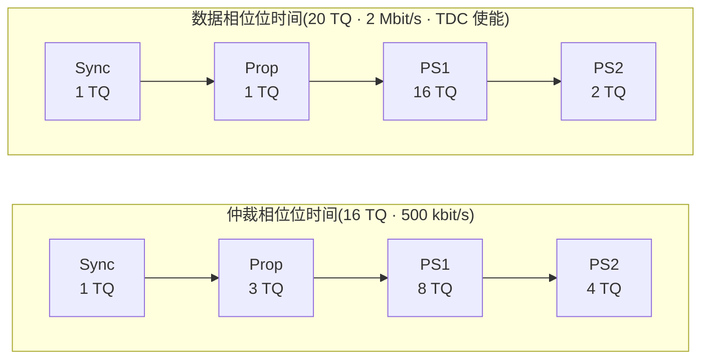
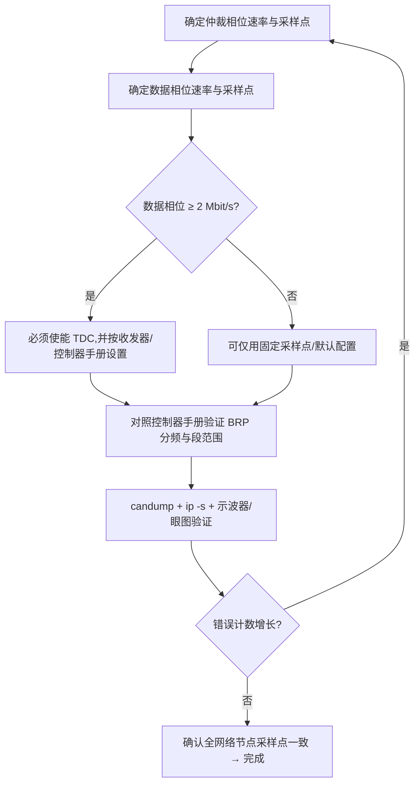

## 适用读者 / 前置知识

- **适用读者**:已经能收发 CAN FD、准备认真配置位定时的嵌入式工程师。
- **前置知识**:读完[位定时入门](03-bit-timing-basics.md)(TQ、四段结构、采样点、相位裕度)和[SocketCAN 回环](05-socketcan-loopback.md)。本教程聚焦"怎么配、配多少、怎么验证"。

## 正文

CAN FD 的位定时是**两套独立配置**:仲裁相位一套、数据相位一套,各有一段位时间,段结构相同但参数不同。核心目标只有一个——**两个相位都留足相位裕度**。

### 双相位位时间示意



仲裁相位传播段长(要吸收总线与收发器延迟);数据相位传播段压到 1 TQ,采样点推后(PS1 大、PS2 小),延迟交给 TDC 补偿。

### 先定速率组合,再算段配置

常见组合(以规范与行业实践为参考,可行性取决于控制器与收发器能力):

| 组合 | 仲裁相位 | 数据相位 | 说明 |
|---|---|---|---|
| 500k + 2M | 500 kbit/s | 2 Mbit/s | 北美整车基准(SAE J2284-4);经典 HS 收发器可支持 |
| 1M + 2M | 1 Mbit/s | 2 Mbit/s | 常见组合,数据相位需 TDC |
| 1M + 5M | 1 Mbit/s | 5 Mbit/s | 视控制器分频能力与收发器对称性而定,通常需 SIC 级收发器与简单拓扑 |
| 500k + 5M | 500 kbit/s | 5 Mbit/s | SIC 收发器的典型高吞吐配置 |

> ⚠️ **具体数值以控制器数据手册与收发器数据手册为准**:控制器限定了 TQ 分频范围、TDC 精度与第二采样点可配置位数;收发器限定了环回延迟、传播延迟对称性(以及 SIC 的振铃抑制能力)。5 Mbit/s 不是"配置出来就有",要先看收发器能不能支撑。

### 逐段配置步骤

以 **1M 仲裁 + 5M 数据**、系统时钟 80 MHz 为例(数值为演示,按你的控制器数据手册调整):

**① 仲裁相位(1 Mbit/s):**

```
80 MHz / 1 Mbit/s = 80 → 位时间 16 TQ、BRP = 5,TQ = 62.5 ns
段分配:Sync 1 + Prop 4 + PS1 7 + PS2 4 = 16 TQ
采样点 = (1+4+7)/16 = 75%
```

**② 数据相位(5 Mbit/s):**

```
80 MHz / 5 Mbit/s = 16 → 位时间 16 TQ、BRP = 1,TQ = 12.5 ns
段分配:Sync 1 + Prop 1 + PS1 12 + PS2 2 = 16 TQ
采样点 = (1+1+12)/16 = 87.5%(TDC 使能后按第二采样点工作)
```

数据相位 16 TQ 对 TQ 分频是下限附近,若你的控制器要求更多 TQ,需先降分频、提高系统时钟,或接受更低速率——这就是"速率组合受控制器能力限制"的具体含义。

配置决策可以按下面的流程走:



### 在 SocketCAN 里配置

SocketCAN 内核会按目标速率**自动计算**一套段配置,通常足够用;要精确控制,用 `sample-point` 参数指定采样点百分比:

```bash
# 500k + 2M,采样点:仲裁 75%、数据 80%
sudo ip link set can0 up type can \
  bitrate 500000 sample-point 75% \
  dbitrate 2000000 dsample-point 80% fd on

# 1M + 5M
sudo ip link set can0 up type can \
  bitrate 1000000 sample-point 75% \
  dbitrate 5000000 dsample-point 80% fd on
```

更细的寄存器级控制(SocketCAN 支持显式指定每一段)示例:

```bash
sudo ip link set can0 up type can \
  tq 62 prop-seg 4 phase-seg1 7 phase-seg2 4 sjw 1 \
  dtq 12 dprop-seg 1 dphase-seg1 12 dphase-seg2 2 dsjw 1 fd on
```

> `fd on` 使能 CAN FD;不带 `fd on` 则接口按经典 CAN 工作。不同内核版本对 `sample-point`/`tq` 等参数的约束略有差异,报错时检查 `ip link` 支持的可选项。

### TDC:数据相位的命门

数据相位速率 ≥ 2 Mbit/s 时,环回延迟(发送→总线→接收回读)占位时间的比例显著变大,必须让控制器按实测环回延迟做**收发器延迟补偿(TDC)**:

- 控制器使能 TDC 后,在数据相位不再用固定采样点,而是测量环回延迟后推迟到**第二采样点(SSP)**采样;
- 收发器的传播延迟对称性与环回延迟稳定性决定 TDC 补偿的精度——这是"为什么 5M 通常要 SIC 收发器"的底层原因。

TDC 开关与 SSP 偏移量在各控制器驱动/寄存器中配置(如某些驱动通过 ethtool/SocketCAN 的 netlink 或专用工具设置);**具体寄存器名与默认值以控制器数据手册为准**,本教程只给出原理与检查方法。

### 验证:看配置、看错误帧

```bash
# 1) 确认内核实际协商出的位定时
ip -details link show can0

# 2) 抓帧观察(应能正常收发 FD 帧)
candump can0 -n 10

# 3) 看接口错误统计——持续增长说明位定时/拓扑有问题
ip -s -details link show can0
```

错误计数器稳定在 0、`candump` 正常打印 FD 帧,配置才算通过。进一步可以用示波器/逻辑分析仪抓差分波形,核对实际采样点位置与眼图裕量(资料库的示波器条目有方法参考)。

### 调参常见坑

| 症状 | 常见原因 |
|---|---|
| 数据相位误码/错误帧 | 采样点太靠前、TDC 未使能、收发器不支持该速率 |
| 仲裁正常、数据段偶发失败 | 收发器传播延迟不对称超预算、拓扑过长 |
| 换控制器/收发器后报错 | 位定时被"重新自动计算",检查采样点是否漂移 |
| 全网络时好时坏 | 各节点采样点不一致——所有节点必须用同一套(或兼容的)位定时 |

## 关键结论

1. CAN FD 位定时是仲裁/数据两套独立配置,各自的采样点与相位裕度都要单独检查。
2. 常用组合 500k+2M、1M+2M、1M+5M、500k+5M;是否可行取决于控制器分频/TDC 能力与收发器对称性,SIC 收发器才稳定支撑 5 Mbit/s。
3. 数据相位采样点通常配置在 80%~90% 附近,传播段压到 1~2 TQ,延迟交给 TDC 补偿。
4. TDC 是高速数据相位的前提:开关与第二采样点配置以控制器数据手册为准。
5. 验证三连:`ip -details link show can0` 看配置、`candump` 看收发、`ip -s link` 看错误计数;全节点采样点必须一致。

## 动手验证

按你的硬件选择一条命令串执行(下为 1M+5M 示例):

```bash
# 1. 配置(数值以控制器/收发器数据手册为准)
sudo ip link set can0 up type can \
  bitrate 1000000 sample-point 75% \
  dbitrate 5000000 dsample-point 80% fd on

# 2. 检查实际位定时
ip -details link show can0

# 3. 回环/对发验证
candump can0 -n 20 &
cansend can0 123##11122334455667788          # FD + BRS
cangen can0 -f -b -g 100 -n 50 -v            # 50 帧带 BRS 的 FD 流量

# 4. 错误统计
ip -s -details link show can0
```

练习:把 `dsample-point` 依次调成 60% / 70% / 80% / 90%,观察错误计数与误码变化,体会采样点对高速数据相位裕度的影响。最后用示波器核对实际波形上的采样点位置。

## 参见

- 词条:[采样点](../glossary/sample-point.md)、[相位裕度](../glossary/phase-margin.md)、[TDC](../glossary/tdc.md)、[时间量子](../glossary/time-quantum.md)、[传播延迟对称性](../glossary/propagation-delay-symmetry.md)
- 标准规范:[CiA 601-3(位定时配置与评估工具)](../resources/_entries/standards/cia-601-3-bit-timing.md)、[SAE J2284-4(500k+2M 互操作规范)](../resources/_entries/standards/sae-j2284-4-2016.md)、[ISO 11898-1 (2024)](../resources/_entries/standards/iso-11898-1-2024.md)
- 工具资源:[示波器 CAN 解码](../resources/_entries/tools-community/oscilloscope-can-decoding.md)
- 教程:[位定时入门](03-bit-timing-basics.md)、[用 SocketCAN 5 分钟跑通 CAN FD 回环](05-socketcan-loopback.md)
