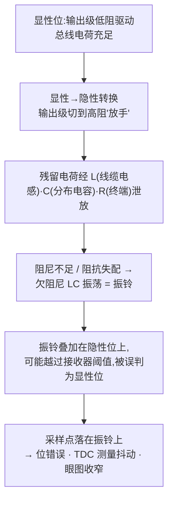
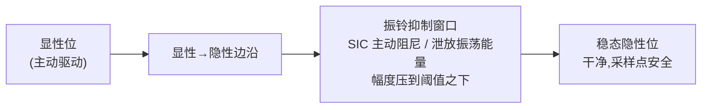

## 适用读者 / 前置知识

- **适用读者**:模拟 IC 工程师(理解振铃机制与抑制电路方案)、也适合想"看懂示波器上那团振荡"的嵌入式工程师。
- **前置知识**:读过 [SIC 是什么](07-what-is-sic.md),知道 SIC 的四大能力;对总线终端(120 Ω)与收发器输出级有基本概念(可先看[总线终端词条](../glossary/bus-termination.md))。

## 正文

### 振铃从哪来:显性→隐性转换后的欠阻尼振荡

CAN 总线物理上是一根被分布电感和分布电容包裹的双绞线。观察两个状态:

- **显性位**:收发器输出级**主动驱动**,把总线拉到约 2 V 差分电平,此时电感/电容处于"被驱动"状态;
- **隐性位**:收发器**放手**——输出级呈高阻,总线靠 60 Ω(两个 120 Ω 终端并联)的等效电阻**自然放电**回到 0 V 附近。

问题出在**显性→隐性转换**的瞬间:输出级从"低阻强驱动"切到"高阻",总线上残留的电荷要经过"线缆电感 L + 分布电容 C + 终端电阻 R"构成的 **RLC 网络**泄放。如果阻尼不足(L 偏大、R 偏小、或存在不匹配),电荷泄放过程就表现为**欠阻尼 LC 振荡**——也就是振铃(ringing)。

**阻抗失配**会进一步放大振铃:桩线(stub)末端、非理想终端、星型节点处的反射波与原始边沿叠加,让振铃更大、拖得更久。传统 HS-CAN 收发器按 2016 版规范设计,对这个过程**不做主动干预**——在 2 Mbit/s 以内位时间长、采样点后置,振铃自然衰减来得及;到了 5 Mbit/s(位时间 200 ns),振铃还没衰减完,采样点已经到了。

### 为什么振铃有害:不只是"波形难看"

- **误判位**:振铃峰值越过接收器显性阈值(约 0.7 V 量级,以 ISO 11898-2 为准)时,接收节点把隐性位读成显性位 → 位错误 → 错误帧;
- **TDC 抖动**:控制器在数据相位测量环回延迟,若边沿被振铃扰动,每次测到的 tloop 不同,TDC 补偿就不准(关联 [BRS 与 TDC](04-brs-tdc.md));
- **限制拓扑**:振铃限制了可容忍的桩线长度、节点数和星型结构——这正是普通 FD 收发器在 5 Mbit/s 只能点对点工作的直接原因。

### SIC 怎么抑制:主动阻尼 + 振铃抑制窗口

SIC 收发器的振铃抑制从**输出级内部**解决这个问题:在显性→隐性转换后的一段时间里,不再"完全放手",而是主动给总线一个**阻尼通路**(低阻泄放、受控下拉、或切换式终端),把振荡能量快速泄放掉,把振铃压到接收器阈值之下。ISO 11898-2:2024 对转换后**振铃的幅度与持续时间(振铃抑制窗口)**提出了量化要求——波形必须在规定窗口内回到阈值以下。

### 专利里的两种典型方案

抑制电路怎么实现?看两个公开专利就能理解主流思路(均为 Google Patents 免费公开):

| 方案 | 专利 | 思路 | 特点 |
|---|---|---|---|
| **前馈开关终端** | NXP [US10020841B2](../resources/_entries/patents/us10020841b2.md) | 在 **TXD 引脚**检测显性→隐性边沿,前馈地闭合与终端电阻串联的开关,把终端阻抗接入总线一段时间(如位时间的 40%–100%),吸收反射/振铃 | 不需要感知总线波形,抗噪声误触发;开关导通电阻/寄生电容要纳入终端匹配设计 |
| **瞬态触发阻尼** | TI [US11310072B2](../resources/_entries/patents/us11310072b2.md) | 显性→隐性跳变时脉冲发生器(示例约 200 ns)驱动隐性抵消(recessive nulling),同时打开振铃泄放通路:振铃经电容耦合到 NMOS 栅极,幅度过阈值即导通,把能量泄放到 VCC/GND | "电平检测 + 自动阻尼",不需要精确计时,只需保证振铃峰值不越阈值 |

- NXP 方案是**前馈**(用已知的 TXD 边沿触发),TI 方案是**反馈式/瞬态触发**(感知总线振铃幅度);
- 两条路线都回答了同一个问题:**转换后那段时间总线不能完全没人管**;
- 相关背景还可读 DENSO 2014 年论文(星型 CAN FD 网络的振铃抑制电路,是 SIC 思想的学术前身)与 Microchip/Bosch 的同类专利。

### 测量:示波器上看 TJA1044 vs TJA1463

振铃抑制效果最直观的验证方式——用示波器对比一颗普通 FD 收发器与一颗 SIC 收发器在相同网络上的波形。对比对象建议:**NXP TJA1044(ISO 11898-2:2016,普通 FD)** vs **NXP TJA1463(ISO 11898-2:2024 SIC)**,或 TI 对偶器件。

测量要点(详见[示波器 CAN 解码工具条目](../resources/_entries/tools-community/oscilloscope-can-decoding.md)):

1. **差分探头**跨接 CANH/CANL(不能用单端探头看总线,共模会淹没差分信号);
2. 触发:把示波器触发设在**显性→隐性下降沿**,观察转换后 200~500 ns 内的波形;
3. 观察点:**振铃峰值幅度**、**衰减到阈值以下所需时间**、**振铃周期**;
4. 对比判断:普通 FD 器件在长桩线/大拓扑下振铃明显、拖得久;SIC 器件在窗口内就把振荡压到阈值之下。

> 测量必须在**数据相位高速率**(如 5 Mbit/s)下进行,因为仲裁相位位时间长、振铃影响小。配合眼图模板测试可做定量对比(参考 [Hancock 2020 论文](../resources/_entries/papers/2020-hancock-physical-layer.md))。

## 关键结论

1. 振铃源于显性→隐性转换后输出级"放手",残留电荷经总线 L-C-R 欠阻尼放电形成振荡;阻抗失配(桩线/非理想终端)放大它。
2. 振铃的危害是量化的:越过接收器阈值被误判为显性位、扰动 TDC 环回延迟测量、收窄眼图——直接限制数据相位速率与拓扑。
3. SIC 在转换后主动阻尼,把振铃在**振铃抑制窗口**内压到阈值之下;ISO 11898-2:2024 对幅度与持续时间提出量化要求。
4. 两种典型电路:NXP **前馈开关终端**(US10020841B2,由 TXD 边沿触发)与 TI **瞬态触发阻尼**(US11310072B2,电平检测自动泄放)。
5. 验证方法:示波器差分探头 + 显性→隐性边沿触发,对比普通 FD(TJA1044)与 SIC(TJA1463)在高速数据相位下的振铃幅度与衰减时间。

## 动手验证

**① 波形对比实验**(需示波器 + 差分探头 + 两颗收发器):

1. 搭一块带 120 Ω 终端、含一根 1~2 m 桩线的总线板;
2. 数据相位配置 5 Mbit/s(如 `ip link set can0 up ... dbitrate 5000000 ... fd on`);
3. 分别安装 TJA1044 与 TJA1463,各抓一张显性→隐性转换后的波形;
4. 记录两行数据:**振铃峰值(mV)** 与 **衰减到 0.7 V 阈值以下的时间(ns)**,对比差异。

**② 用专利文档做一次设计推演**(模拟 IC 方向):

1. 读 [US10020841B2](../resources/_entries/patents/us10020841b2.md):画出发边沿检测器 → 开关 → 终端电阻的信号通路;
2. 思考:前馈开关的"闭合时长"应设为数据位时间的百分之几?太长会怎样(干扰其他节点驱动),太短会怎样(抑制不充分)?
3. 再读 [US11310072B2](../resources/_entries/patents/us11310072b2.md):对比两种方案各自的抗噪声性、功耗、PVT 鲁棒性,写一段"我选哪种、为什么"的结论。

**③ 观察题**:把 5 Mbit/s 数据相位下的采样点配置从 70% 调到 90%,对比错误计数——体会"采样点避开振铃"与"振铃被抑制"两种手段如何互补(配置方法见[位定时配置实战](06-bit-timing-config.md))。

## 参见

- 词条:[振铃抑制](../glossary/ringing-suppression.md)、[回波损耗](../glossary/return-loss.md)、[CAN SIC](../glossary/can-sic.md)、[总线终端](../glossary/bus-termination.md)、[压摆率](../glossary/slew-rate.md)
- 专利:[NXP US10020841B2(前馈振铃抑制)](../resources/_entries/patents/us10020841b2.md)、[TI US11310072B2(瞬态触发振铃抑制)](../resources/_entries/patents/us11310072b2.md)
- 标准规范:[ISO 11898-2 (2024)](../resources/_entries/standards/iso-11898-2-2024.md)
- 厂商资料:[NXP TJA1463(SIC)](../resources/_entries/vendors/nxp-tja1463.md)、[NXP TJA1044(普通 FD,对比基线)](../resources/_entries/vendors/nxp-tja1044.md)、[TI SLLA581 白皮书](../resources/_entries/vendors/ti-slla581.md)
- 论文:[Mori 2014: 星型 CAN FD 的振铃抑制电路](../resources/_entries/papers/2014-mori-ringing-suppression.md)、[Hancock 2020: CAN FD 物理层表征与眼图模板](../resources/_entries/papers/2020-hancock-physical-layer.md)
- 工具资源:[示波器 CAN 解码](../resources/_entries/tools-community/oscilloscope-can-decoding.md)
- 教程:[SIC 是什么](07-what-is-sic.md)、[BRS 与 TDC](04-brs-tdc.md)
