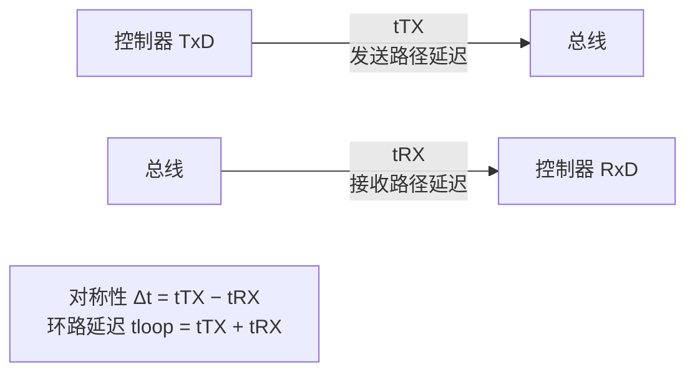
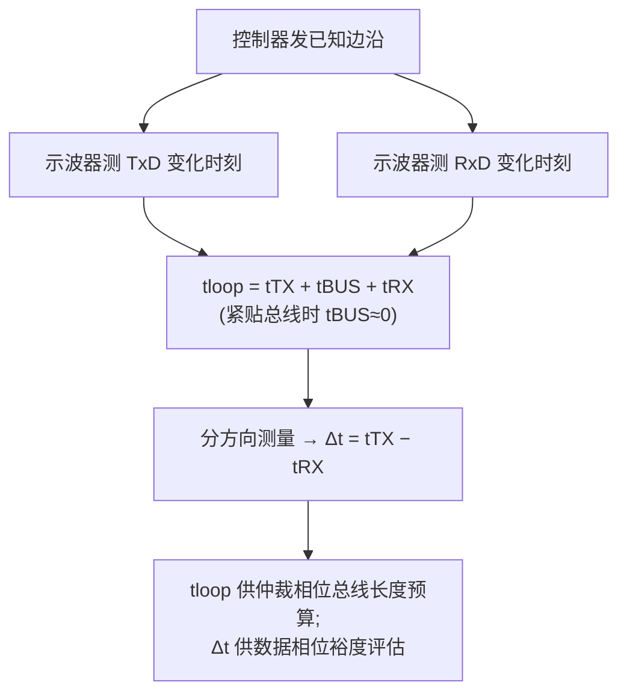

## 适用读者 / 前置知识

- **适用读者**:模拟 IC 工程师(收发器设计指标)与系统/嵌入式工程师(延迟预算与选型)。
- **前置知识**:读过 [BRS 与 TDC](04-brs-tdc.md),知道环回延迟由 tTX + tBUS + tRX 组成、数据相位靠 TDC 补偿;对位时间四段结构与相位裕度有概念(见[位定时入门](03-bit-timing-basics.md))。

## 正文

### 对称性是什么:两条路径的延迟差

每个 CAN 收发器有两条信号路径:

- **发送路径**:TxD 输入变化 → 总线差分电平变化,记为 `tTX`;
- **接收路径**:总线差分电平变化 → RxD 输出变化,记为 `tRX`。

**传播延迟对称性(Tx/Rx delay symmetry)** 定义为这两条路径延迟的一致程度,常用**二者之差**描述:`Δt = tTX − tRX`(也可表述为显性/隐性边沿延迟差)。Δt 越接近 0,对称性越好。



tTX 由驱动级、输出沿整形决定;tRX 由接收比较器与输入滤波决定。**大小由电路决定,差异由匹配决定**——对称性本质上是"驱动级与比较器的延迟匹配"这一个版图与电路设计问题。

### 为什么数据相位对对称性敏感

仲裁相位位时间以微秒计(500 kbit/s 时 2 µs),几十纳秒的不对称完全可被传播段吸收。但数据相位位时间以纳秒计:

- 5 Mbit/s 数据相位位时间 = 200 ns;
- 若 tTX 与 tRX 相差 20 ns,就占了位时间的 10%;
- TDC 补偿的是环回延迟的**大小**(tTX + tBUS + tRX),对**不对称性本身**只能部分补偿——远端节点发来的位,经过的是"远端 tTX + 总线 + 本节点 tRX",而本节点 TDC 是按"本节点 tTX + 总线 + 本节点 tRX"校准的,两者之差中就有对称性误差。

因此**对称性是 TDC 精度的天花板**:对称性越好,数据相位可用的相位裕度越大,可支持的数据相位速率越高。收发器数据手册的"位时序对称性/环路延迟"参数,正是这颗芯片能支持多高速率的依据。

### CiA 601-1 的数值要求与延迟预算

**CiA 601-1**(物理接口实现,技术报告)把 ISO 的抽象要求翻译成可操作的节点设计数值:指定 **Tx/Rx 延迟对称性**要求,以及 **1/2/5 Mbit/s 不同数据速率下 RxD 隐性位时间**的要求(隐性位不能过窄——对称性差会让隐性位被吃掉)。具体数值以 CiA 601-1 v2.0.0 文档为准,本教程不替它"填空",只给出用法:

**延迟预算计算**(仲裁相位,决定总线长度):

```
节点 A 发、节点 B 收的完整路径延迟:
t_path = tTX(A) + tBUS(线缆传播) + tRX(B)

总线传播:双绞线信号传播速度约 5 ns/m 量级(以线缆数据为准)

CAN 仲裁要求:最远两节点路径往返延迟 ≤ 传播段(Prop Seg)时长
即 2 × t_path ≤ Prop Seg 时长
→ 由此推出最大总线长度 = (Prop Seg − 2×(tTX+tRX)) / (2 × 传播延迟/m)
```

**数据相位预算**(决定可支持的速率):

```
数据相位位时间 t_bit = 1 / 数据速率
可用裕度 ≈ t_bit − (TDC 补偿后的残余不对称误差 + 时钟偏差 + 振铃/边沿抖动)
残余不对称误差 与 (tTX − tRX) 直接相关 → 对称性越差,裕度越小
```

这就是"节点数、总线长度、数据速率"三者的耦合:节点越多、总线越长,路径延迟越大;数据速率越高,位时间越短。对称性决定在这三者组合下还剩下多少裕量。

### 测量:环回法与一致性测试项

对称性的测量用**环回(loop-back)法**:

1. 控制器发一个已知边沿(TxD 由高到低或由低到高);
2. 用示波器/时间间隔分析仪同时测 TxD 变化时刻与 RxD 变化时刻(收发器引脚处);
3. 测到的是 **tloop = tTX + tBUS + tRX**;把收发器紧靠总线(总线延迟≈0)即可近似得到 **tTX + tRX**;
4. 分别测**显性→隐性**与**隐性→显性**两个方向,或拆收发器输出接固定电平再单独测 tTX、tRX,得到 Δt。

> 环回测量中,`tTX + tRX` 的大小影响仲裁相位的总线长度预算,`Δt` 影响数据相位裕度——两个参数要分开记录。ISO 16845-2 把延迟对称性、位时序、环路延迟列为收发器静态/动态一致性测试项;系统级验证可参考 [Hancock 2020(示波器动态脉冲参数测量)](../resources/_entries/papers/2020-hancock-physical-layer.md)。



## 关键结论

1. 传播延迟对称性 = 发送路径延迟 tTX 与接收路径延迟 tRX 之差;大小由电路决定,差异由**匹配**决定。
2. 数据相位位时间越短,对称性越重要:它是 TDC 补偿精度的天花板,直接决定可支持的数据相位速率与相位裕度。
3. CiA 601-1 给出 Tx/Rx 延迟对称性与 1/2/5 Mbit/s 下 RxD 隐性位时间的数值要求,是"ISO 条款 → 节点设计数值"的中间层(具体数值以文档为准)。
4. 延迟预算:仲裁相位 `2 × (tTX+tBUS+tRX) ≤ 传播段` 决定总线长度;数据相位残余不对称误差直接消耗相位裕度。
5. 测量用环回法:`tloop` 与 `Δt` 分开记录;对称性也是 ISO 16845-2 的一致性测试项。

## 动手验证

**① 数据手册对照**(无需硬件):

1. 打开 [NXP TJA1044 数据手册条目](../resources/_entries/vendors/nxp-tja1044.md)与 [NXP TJA1463 数据手册条目](../resources/_entries/vendors/nxp-tja1463.md)(或 TI 对偶器件);
2. 在电气特性里找"位时序对称性 / 传播延迟 / 环路延迟"参数,记录典型值与最大值;
3. 对比普通 FD 与 SIC 器件的对称性指标,体会"SIC 更紧的对称性支撑更高数据速率"。

**② 做一次仲裁相位延迟预算**(纸上计算):

1. 取收发器 tTX + tRX 典型值(从数据手册查,如约 200 ns 量级);
2. 设仲裁速率 500 kbit/s、位时间 2 µs、Prop Seg = 4 TQ 且 TQ = 100 ns(即 400 ns);
3. 算 `最大总线长度 = (Prop Seg − 2×(tTX+tRX)) / (2 × 5 ns/m)`;
4. 把 tTX+tRX 换成数据手册**最大值**再算一次,对比总线长度收缩了多少——这就是"收发器延迟决定网络规模"的量化直觉。

**③ 环回测量**(有示波器 + 单节点时):

1. 只接一个节点(收发器直接接 120 Ω 终端,总线尽量短);
2. 控制器循环发送一个含边沿的固定报文;
3. 示波器 CH1 接 TxD、CH2 接 RxD,触发在 TxD 边沿;
4. 测 TxD 与 RxD 两个边沿的时间差,记录 tloop;换不同温度/电压再测,观察对称性漂移。

## 参见

- 词条:[传播延迟对称性](../glossary/propagation-delay-symmetry.md)、[环路延迟](../glossary/loop-delay.md)、[TDC](../glossary/tdc.md)、[相位裕度](../glossary/phase-margin.md)、[传播段](../glossary/propagation-segment.md)、[采样点](../glossary/sample-point.md)
- 标准规范:[CiA 601-1(物理接口实现与延迟对称性数值)](../resources/_entries/standards/cia-601-1-physical-interface.md)、[ISO 11898-2 (2016)](../resources/_entries/standards/iso-11898-2-2016.md)、[ISO 16845-2(HS-MAU 一致性测试)](../resources/_entries/standards/iso-16845-2-2018.md)
- 厂商资料:[NXP AH1308(Mantis 应用提示,含延迟/EMC 应用电路)](../resources/_entries/vendors/nxp-ah1308.md)、[NXP TJA1044](../resources/_entries/vendors/nxp-tja1044.md)、[NXP TJA1463](../resources/_entries/vendors/nxp-tja1463.md)
- 论文:[Hancock 2020: CAN FD 物理层表征(示波器动态参数测量)](../resources/_entries/papers/2020-hancock-physical-layer.md)
- 教程:[BRS 与 TDC](04-brs-tdc.md)、[SIC 是什么](07-what-is-sic.md)、[位定时配置实战](06-bit-timing-config.md)
