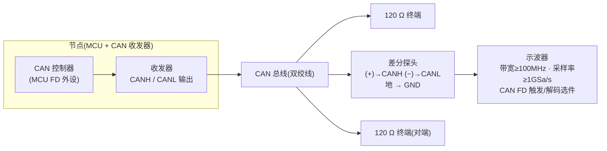
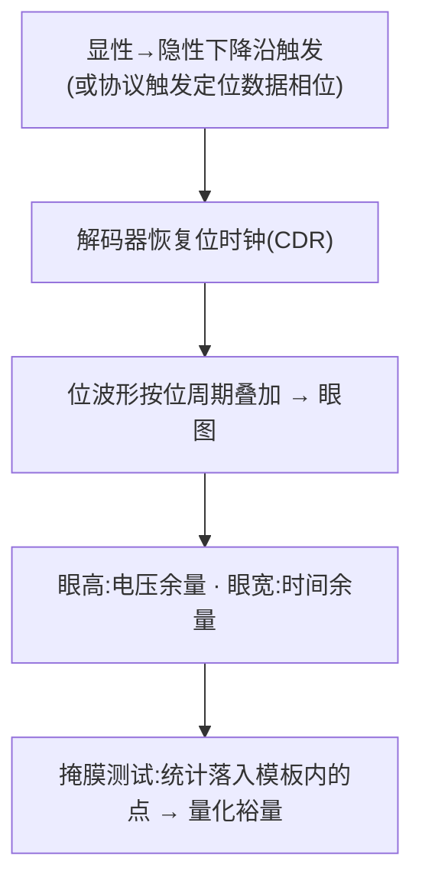

## 适用读者 / 前置知识

- **适用读者**:嵌入式工程师——已经能在真实总线上收发 CAN FD,准备用示波器验证位定时、排查错误帧、评估信号完整性(如 5 Mbit/s 数据相位)。
- **前置知识**:读完[用 SocketCAN 5 分钟跑通 CAN FD 回环](05-socketcan-loopback.md)与[CAN FD 位定时配置实战](06-bit-timing-config.md),能配置 FD 接口;知道采样点、BRS 的含义(词条:[采样点](../glossary/sample-point.md)、[TDC](../glossary/tdc.md))。
- **需要的硬件**:带 CAN FD 触发/解码功能的示波器(带宽 ≥ 100 MHz、采样率 ≥ 1 GSa/s)、**差分探头**,以及一个能持续发送带 BRS 的 FD 帧的节点(USB-CAN 接口卡或开发板均可)。

## 正文

### 为什么用示波器抓 CAN FD

软件工具(candump、错误计数)只能告诉你"节点收发是否成功",看不到总线上**真实发生了什么**。示波器补上三块拼图:

| 目的 | 要回答的问题 | 对应手段 |
|---|---|---|
| 验证位定时 | 采样点是不是落在稳定区?数据相位速率对不对? | 抓波形 → 量位时间 → 定位采样点 |
| 排查信号完整性 | 高速数据相位为什么偶发报错? | 显性→隐性边沿触发,看转换后的振铃 |
| 评估收发器 | 这颗 SIC 相比普通 FD 收发器强在哪? | 数据相位眼图 + 掩膜对比(呼应[教程 08](08-ringing-suppression.md)) |

### 接线示意:差分探头跨接 CANH/CANL



接线要点:

- **必须用差分探头**跨接 CANH(+)/CANL(−)(或使用带 CAN FD 分析能力的接口卡/总线分析仪直接引出差分信号)。CAN 是差分信号:隐性位 CANH=CANL≈2.5 V(相对地,差分≈0 V);显性位 CANH≈3.5 V、CANL≈1.5 V(差分≈2 V)。用单端探头看单线只能看到约 1 V 的小摆幅,还叠加共模噪声,位边界与振铃都会被淹没。
- SIC 收发器的显性**共模电平**与经典 HS-CAN 略有不同,但差分电平仍约 2 V——差分测量的好处正是对共模不敏感,换收发器对比时无需改设置。
- 探头接入点选在**总线中部或终端电阻两端**,离被测节点尽量远,减少探头寄生电容对波形的影响;探头地线要**短接到底盘地**并贴近接入点,避免长地线拾取噪声。
- **带宽/采样率**:数据相位 5 Mbit/s 时位时间仅 200 ns,收发器沿约 15~50 ns。要看清沿的形状与振铃,带宽 **≥ 100 MHz**、采样率 **≥ 1 GSa/s** 是底线(建议更高);只量位时间时可开 20 MHz 带宽限制滤掉高频噪声,但**测振铃与眼图必须用全带宽**。

### 触发:让示波器"只保留值得看的那一段"

示波器按触发条件持续采集、丢弃未命中的波形。CAN 有**两个关键触发**,用途完全不同:

| 触发目标 | 触发方式 | 阈值建议 | 用途 |
|---|---|---|---|
| 帧起始(SOF) | 边沿:隐性→显性**上升沿**;或协议触发"帧起始" | 差分电压 1 V 左右 | 看一帧完整结构、验证解码 |
| 显性→隐性**下降沿** | 边沿:下降沿;或协议触发"数据相位/BRS 之后" | 差分电压 1 V 左右 | **振铃与眼图分析的关键触发** |

- 触发阈值设在 **1 V 差分左右**:显性差分约 2 V、隐性约 0 V,1 V 落在两者之间(注意与接收器阈值约 0.7 V 不是一回事,触发阈值只决定示波器何时开始采集);
- 触发源必须选**差分通道**(不是单端通道),阈值按差分电压理解;
- 带 **CAN FD 协议触发**的示波器可直接按"帧起始 / 特定 ID / BRS 之后的数据相位"触发——由解码器识别 EDL 位与 BRS 位,比纯边沿更语义化。具体菜单路径各型号不同,**以你的示波器型号为准**,但触发源、阈值、目标是同一套原理。

### 协议解码:让示波器帮你读帧

主流示波器(Keysight / Tektronix / R&S 等)自带 CAN FD 解码选件。解码前**必须正确配置**,否则解出的全是错的:

- **双速率**:仲裁相位速率与数据相位速率(如 1 Mbit/s / 5 Mbit/s)——配错一个,整帧解错;
- **FD 模式**:使能 CAN FD,并确认允许 BRS 速率切换;
- **解码阈值**:与触发阈值一致(1 V 差分左右);
- **采样点**:部分示波器解码器允许指定采样点百分比(如 75%~80%),决定它从位时间的哪个时刻采位。

解码后示波器在波形上直接标注 **ID、DLC、数据字节、CRC、位填充与错误帧**,还能给出**采样点位置标记**。**验证解码正确**:同一个流量源,示波器解出的 ID/数据应与 `candump` 输出完全一致——这是判断"解码配置错还是总线真有问题"的第一手段。

### 观测 1:电平与位时间

- **量电平**:用游标量差分波形的显性高电平(应接近 2 V)与隐性电平(应接近 0 V,允许 ±500 mV 以内)。显性电平明显偏低或隐性不为 0,检查终端电阻、供电与收发器。
- **量位时间**:测两个相同极性边沿之间的时间间隔。注意 CAN 数据相位是 NRZ + **位填充**(连续 5 个相同位后插入反相位),单次间隔不一定是位时间,建议用解码器的位时间测量,或量 10 个位取平均。BRS 位之后数据相位提速,波形上能直接看到**位宽变窄**(如仲裁位 1 µs → 数据位 200 ns)。
- **找采样点**:按位时间百分比(如 75%)用游标定位采样时刻,观察该时刻波形是否远离边沿、电压余量是否充足。也可以直接看解码器标注的采样点标记,核对它是否落在眼图中央。

### 观测 2:显性→隐性转换后的振铃

这是 CAN FD 物理层**最值得看的一段**(原理详见[教程 08](08-ringing-suppression.md)):

- 把触发设在**显性→隐性下降沿**,时基调到 50~100 ns/格,观察转换后 **200~500 ns** 内的波形;
- 记录三个量:**振铃峰值(mV)**、**衰减到接收阈值以下的时间(ns)**、**振铃周期**;
- 若振铃峰值越过接收阈值(约 0.7 V 差分,精确值以 ISO 11898-2 为准),后续隐性位可能被误判为显性位 → 位错误 → 错误帧,这直接限制数据速率与拓扑。
- **对比实验**:同一网络、同一套位定时,分别装普通 FD 收发器与 SIC 收发器(如 NXP TJA1044 vs TJA1463),在 5 Mbit/s 数据相位下对比振铃幅度与衰减时间——SIC 在振铃抑制窗口内把振荡压到阈值之下,波形明显更干净。

### 观测 3:数据相位眼图

眼图把大量位波形按位周期**叠加**在一起,把"电压余量(眼高)"与"时间余量(眼宽)"量化出来:



- **怎么形成**:CAN 没有随路时钟,示波器必须靠解码器**恢复位时钟**(或数据相位触发)对齐每个位;直接"余辉叠加"不按位周期对齐,不能当眼图看;
- **在哪看**:触发定位到**数据相位**(BRS 之后),数据相位速率越高,眼图越能暴露问题;
- **看什么**:眼睛张开度(眼高是否接近 2 V?眼宽占位时间比例?)、边沿交叉点是否集中、隐性位(0 V 附近)是否被振铃污染;
- **对比 SIC**:普通 FD 收发器在高速数据相位 + 长桩线拓扑下,显性→隐性振铃会挤占下一个采样点,眼图明显收窄;SIC 抑制振铃后眼高/眼宽余量显著改善。用**掩膜测试(mask test)**量化:把模板放在眼图上,统计落在模板内的采样点;
- 眼睛张开度受采样点位置影响:把数据相位采样点从 60% 调到 90%,观察眼图与错误计数变化(配置方法见[位定时配置实战](06-bit-timing-config.md))。

### 动手前的检查清单

| # | 检查项 | 自查 |
|---|---|---|
| 1 | 差分探头已接 CANH(+)/CANL(−),极性正确,地线短接 | □ |
| 2 | 总线两端各有 120 Ω 终端 | □ |
| 3 | 带宽 ≥ 100 MHz、采样率 ≥ 1 GSa/s;测振铃/眼图时未开带宽限制 | □ |
| 4 | 触发源 = 差分通道,阈值 ≈ 1 V 差分 | □ |
| 5 | 解码器已配置 FD 模式 + 仲裁/数据双速率,采样点合理 | □ |
| 6 | 节点正在发送带 BRS 的 FD 帧(数据相位为高速率) | □ |
| 7 | 示波器解码结果与 `candump` 一致 | □ |

## 关键结论

1. 抓 CAN FD 波形必须**差分测量**(差分探头跨接 CANH/CANL,或接口卡引出差分信号):差分显性≈2 V、隐性≈0 V,接收阈值约 0.7 V。
2. 两个关键触发:隐性→显性**上升沿**(帧起始,看整帧与解码)与**显性→隐性下降沿**(振铃与眼图,观察转换后 200~500 ns)。
3. 带宽 ≥ 100 MHz、采样率 ≥ 1 GSa/s 是看清 5 Mbit/s 数据相位边沿与振铃的底线;量位时间可开限带,测振铃/眼图必须全带宽。
4. 协议解码依赖正确的**双速率与 FD 模式**配置;与 `candump` 对照是验证解码的第一手段。
5. 眼图 + 掩膜把振铃影响量化:普通 FD 收发器在高速率下眼图收窄,SIC 抑制振铃后眼高/眼宽余量显著改善(详见[教程 08](08-ringing-suppression.md))。

## 动手验证

**① 准备总线与流量**(节点用 SocketCAN,接口已按 1M+5M 配置):

```bash
# 确认接口配置与错误统计
ip -details link show can0
ip -s -details link show can0

# 持续产生带 BRS 的 FD 帧(数据相位 5 Mbit/s)
cangen can0 -f -b -g 200 -v          # 每 200 ms 一帧带 BRS 的 FD 帧

# 另一终端对照解码:示波器解出的 ID/数据应与此一致
candump can0 -n 20
```

**② 示波器设置**(按 ① 检查清单逐项过;具体菜单路径以你的示波器型号为准):

1. 差分探头接入 CANH/CANL,垂直刻度约 1 V/格(差分);
2. 触发:上升沿(帧起始),阈值 1 V 差分,时基 20 µs/格看整帧 → 缩到 500 ns/格看单个位;
3. 开启 CAN FD 解码:仲裁速率 1 Mbit/s、数据速率 5 Mbit/s、FD 模式;与 `candump` 对照验证;
4. 触发改为下降沿(显性→隐性),时基 100 ns/格,记录振铃峰值(mV)与衰减到阈值以下的时间(ns);
5. 开启眼图/掩膜功能(若支持),触发定位到数据相位,记录眼高与眼宽。

**③ 对比实验**(呼应[教程 08](08-ringing-suppression.md)):

1. 相同总线与位定时下,先后安装普通 FD 收发器与 SIC 收发器(如 TJA1044 vs TJA1463);
2. 各抓一张显性→隐性转换后的波形和一张数据相位眼图;
3. 填表对比:**振铃峰值 / 衰减时间 / 眼高 / 眼宽**,体会 SIC 对 5 Mbit/s 的支撑作用。

**④ 练习**:把数据相位采样点从 60% 调到 90%(`dsample-point`),观察眼图张开度与 `ip -s` 错误计数变化;再在 2 Mbit/s 与 5 Mbit/s 各抓一张眼图,比较眼宽随速率的变化。

## 参见

- 词条:[采样点](../glossary/sample-point.md)、[振铃抑制](../glossary/ringing-suppression.md)、[显性/隐性电平](../glossary/dominant-recessive-levels.md)、[TDC](../glossary/tdc.md)
- 工具资源:[示波器 + CAN/CAN FD 解码](../resources/_entries/tools-community/oscilloscope-can-decoding.md)、[CAN 接口卡](../resources/_entries/tools-community/can-interface-card.md)
- 教程:[振铃抑制原理与测量](08-ringing-suppression.md)、[CAN FD 位定时配置实战](06-bit-timing-config.md)、[用 SocketCAN 5 分钟跑通 CAN FD 回环](05-socketcan-loopback.md)
