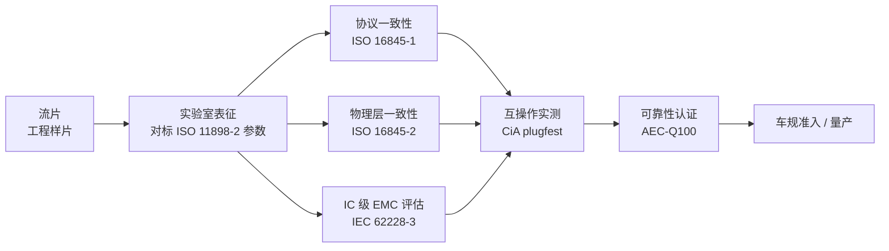
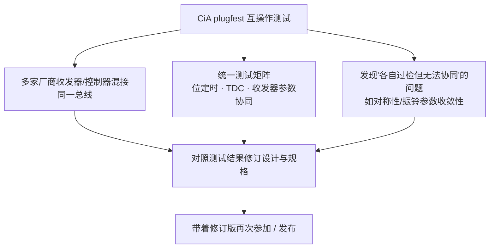

## 适用读者 / 前置知识

- **适用读者**:模拟 IC 工程师为主,负责芯片验证、认证流程或规格对标;嵌入式工程师可了解测试体系全貌。
- **前置知识**:读过 [SIC 是什么](07-what-is-sic.md) 与 [收发器传播延迟对称性](09-delay-symmetry.md),知道收发器的关键指标(对称性、环路延迟、振铃抑制、EMC)分别是什么、怎么测。

## 正文

### 认证不是"一步到位",而是一条分层路径

一颗 CAN 收发器从流片到进入整车,要过的关卡分属不同体系:协议、物理层、EMC、可靠性、互操作。它们各管一段,缺一不可:

### 协议一致性:ISO 16845-1

**ISO 16845-1:2016** 规定 CAN 一致性测试计划的第一部分:**数据链路层(DLL)与物理信令(PCS)** 的一致性测试用例,覆盖 Classical CAN 与 CAN FD。它测的是"协议控制器侧的行为是否符合标准"——帧格式、位填充、错误处理、仲裁、位定时相关规则。针对新版 ISO 11898-2:2024/2026 的修订草案 ISO/DIS 16845-1(编号 90696)正在制定中。

- **测什么**:控制器行为与协议规则的一致性(对收发器芯片而言,更多是配套控制器的验证);
- **怎么测**:一致性测试系统按 ISO 16845 测试用例自动执行,由测试机构/工具厂商提供([CAN FD 一致性测试系统条目](../resources/_entries/tools-community/canfd-conformance-tester.md))。

### 物理层一致性:ISO 16845-2

**ISO 16845-2:2018** 规定针对 **ISO 11898-2:2016 高速介质访问单元(HS-MAU)** 的静态与动态测试,直接覆盖收发器芯片:包含 **Tx/Rx 延迟对称性、位时序、环路延迟**等测量项。这是收发器芯片一致性测试的**直接依据**;针对 ISO 11898-2:2024/2026 的修订草案 ISO/DIS 16845-2(编号 90695)正在制定中,也就是说 **SIC 时代的一致性测试要求正在随新版规范升级**。

- **测什么**:对称性、位时序、环路延迟等物理层动态参数;
- **对设计的意义**:设计阶段就应按 Part 2 测试项预留**可测性**——测试模式、对称性校准接口,否则流片后无法表征某些参数。

### IC 级 EMC 评估:IEC 62228-3

协议与物理层参数只解决"能不能通",不解决"会不会干扰别人、怕不怕被干扰"。**IEC 62228-3:2019**(集成电路—收发器 EMC 评估—第 3 部分:CAN 收发器)规定 CAN 收发器 IC 的 EMC 评估方法,包括:

- **测试板规范**:去耦、共模扼流圈、终端等标准配置;
- **传导发射**:150 kHz ~ 1 GHz 频率范围的发射测量;
- **射频抗扰度**:注入干扰下的性能评估。

这是 CISPR 25 在收发器**芯片层面**的落地测试标准,与 ISO 11898-2 的 EMC 条款配套使用。收发器选型与设计阶段就应把 IEC 62228-3 的测试板方案考虑进评估环境,量化的发射与抗扰度余量是"这颗芯片 EMC 好不好"的直接判据。

### 可靠性认证:AEC-Q100

EMC 和一致性都过了,还要过**可靠性**——车规 IC 的准入门槛 **AEC-Q100**:温度循环、高温工作寿命、ESD、闩锁、湿度等系列压力测试,按工作温度范围分 Grade 0~3(如 Grade 0 为 -40 °C ~ +150 °C)。车规 CAN 收发器需通过相应等级并在数据手册标注(如 TJA1463/TJA1464 标注 AEC-Q100 Grade 1)。

### 互操作实测:CiA plugfest

一致性测试证明"你符合标准",但**多个厂商的芯片各自符合标准,未必能在一起协同工作**——这正是 plugfest 存在的意义。

**CiA 定期组织的 plugfest / 互操作测试**:多家厂商的收发器、控制器、线束与测试工具接入**同一 CAN 总线**,按统一测试矩阵实测互操作与兼容性。它介于一致性测试与整车量产之间,是协议演进期(如 CAN FD SIC 推广阶段)的关键验证环节。

**参加前建议**:先通过一致性测试自测,再带着自研芯片参加互操作实测;重点是让**边沿对称性、位时序裕量、TDC 行为**在多厂商混搭的网络里收敛。Wosnitza 2017 年论文就披露了高速 CAN 互操作测试的教训:不同厂商 SIC/HS-CAN 收发器混用时,参数必须收敛才能真正互操作。

### 自研芯片的完整路径小结

| 阶段 | 依据 | 测什么 | 谁来测 |
|---|---|---|---|
| 实验室表征 | ISO 11898-2 参数条款 | 驱动、阈值、对称性、环路延迟、振铃抑制 | 自研团队(参考 Hancock 2020 的示波器方法) |
| 协议一致性 | ISO 16845-1 | DLL + PCS 行为 | 一致性测试系统/实验室 |
| 物理层一致性 | ISO 16845-2 | HS-MAU 对称性/位时序/环路延迟 | 一致性测试系统/实验室 |
| IC 级 EMC | IEC 62228-3 | 传导发射 + 射频抗扰度 | EMC 测试系统/实验室 |
| 可靠性 | AEC-Q100 | 温度、寿命、ESD、闩锁等 | 第三方实验室 |
| 互操作 | CiA plugfest | 多厂商混搭网络实测 | CiA 组织(CiA 会员) |

> 针对 SIC 收发器,关注新版 ISO 11898-2:2024/2026 配套的 ISO/DIS 16845-1/-2 修订草案——旧版 Part 2 针对 2016 版规范,SIC 新增的振铃抑制等动态参数如何纳入一致性测试,是当前行业正在明确的议题。

## 关键结论

1. 收发器认证是**分层路径**:ISO 16845-1(协议/数据链路)、ISO 16845-2(物理层/HS-MAU)、IEC 62228-3(IC 级 EMC)、AEC-Q100(可靠性)、CiA plugfest(互操作)。
2. ISO 16845-2 直接测收发器的延迟对称性、位时序、环路延迟,设计阶段就应预留测试模式与校准接口(可测性设计)。
3. IEC 62228-3 是 CISPR 25 在芯片层面的落地:测试板规范 + 150 kHz~1 GHz 传导发射 + 射频抗扰度,是"芯片 EMC 好坏"的可量化判据。
4. plugfest 验证"各自符合标准 ≠ 能协同工作",是多厂商混搭网络下位定时/TDC/收发器参数收敛性的实测;SIC 时代新版一致性测试(ISO/DIS 16845-1/-2)正在制定中。
5. AEC-Q100 是车规可靠性准入门槛(分 Grade 0~3),与上述功能/EMC 测试并行但独立。

## 动手验证

**① 做一份"对标检查表"**(模拟 IC 方向,无需硬件):

1. 打开 [ISO 16845-2 条目](../resources/_entries/standards/iso-16845-2-2018.md),列出它覆盖的测试项(对称性、位时序、环路延迟…);
2. 对照你正在设计/选型的收发器数据手册,逐项确认"手册里有没有对应参数、有没有对应测试模式引脚/寄存器";
3. 把缺口写成"可测性设计待办":没有测试模式就无法流片后表征——这是设计阶段就要定的。

**② 走一遍 plugfest 参与流程**(纸上推演):

1. 确认所在团队/公司是否为 CiA 会员(plugfest 通常要求会员资格,见[CiA plugfest 条目](../resources/_entries/tools-community/certification-cia-plugfest.md));
2. 列出参加前要自测的项:一致性测试(ISO 16845 系列)、EMC 摸底(IEC 62228-3)、典型拓扑下的 5 Mbit/s 长稳测试;
3. 设计一份"混搭矩阵":自研芯片 × {TJA1463, TCAN1463, TJA1044(非 SIC)} 的发送/接收配对,预判哪些组合可能暴露对称性/振铃收敛问题。

**③ 读一手材料**:通读 [Wosnitza 2017(互操作测试教训)](../resources/_entries/papers/2017-wosnitza-interoperability.md) 与 [Hancock 2020(表征方法)](../resources/_entries/papers/2020-hancock-physical-layer.md),分别提炼 3 条"互操作最容易翻车"和 3 条"表征最容易测错"的点。

## 参见

- 词条:[ISO 16845](../glossary/iso-16845.md)、[IEC 62228-3](../glossary/iec-62228-3.md)、[plugfest](../glossary/plugfest.md)、[传播延迟对称性](../glossary/propagation-delay-symmetry.md)、[EMI/EMC](../glossary/emi-emc.md)、[AEC-Q100](../glossary/aec-q100.md)、[CAN SIC](../glossary/can-sic.md)
- 标准规范:[ISO 16845-1(协议一致性)](../resources/_entries/standards/iso-16845-1-2016.md)、[ISO 16845-2(物理层一致性)](../resources/_entries/standards/iso-16845-2-2018.md)、[IEC 62228-3(IC 级 EMC 评估)](../resources/_entries/standards/iec-62228-3-2019.md)、[ISO 11898-2 (2024)](../resources/_entries/standards/iso-11898-2-2024.md)
- 工具与社区:[CiA plugfest / interoperability 测试](../resources/_entries/tools-community/certification-cia-plugfest.md)、[CAN FD 一致性测试系统](../resources/_entries/tools-community/canfd-conformance-tester.md)、[一致性测试标准](../resources/_entries/tools-community/certification-conformance-standards.md)、[EMC 测试系统](../resources/_entries/tools-community/emc-test-system.md)
- 论文:[Wosnitza 2017: CAN FD 收发器互操作挑战](../resources/_entries/papers/2017-wosnitza-interoperability.md)、[Hancock 2020: CAN FD 物理层表征](../resources/_entries/papers/2020-hancock-physical-layer.md)
- 教程:[收发器传播延迟对称性](09-delay-symmetry.md)、[振铃抑制原理与测量](08-ringing-suppression.md)、[SIC 是什么](07-what-is-sic.md)
