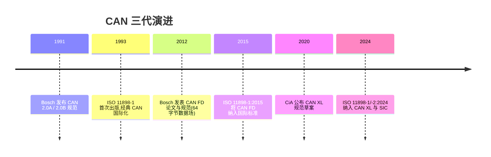
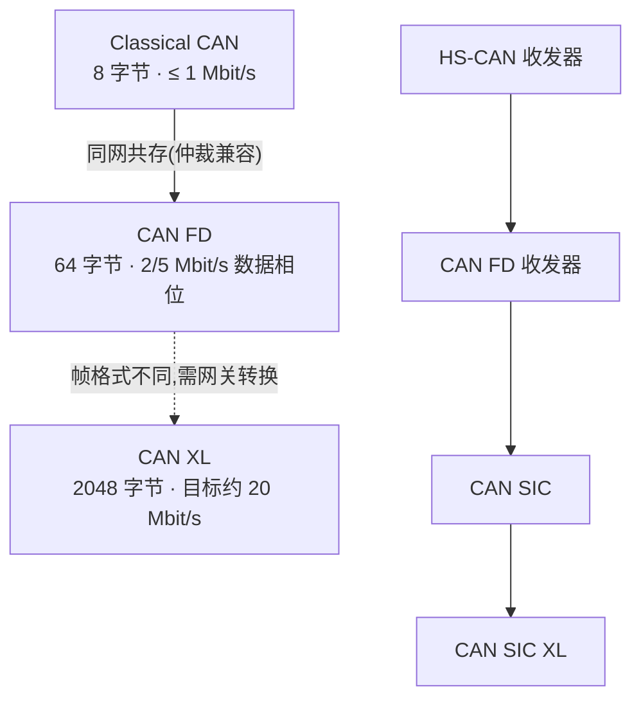

## 适用读者 / 前置知识

- **适用读者**:想建立 CAN 技术全景图的人——学生、嵌入式开发者、模拟 IC 工程师都适合。
- **前置知识**:无需任何前置,本教程从零梳理。若想深究某一代,再读对应的帧结构教程或词条。

## 正文

CAN 从 20 世纪 80 年代问世至今走过了三代:Classical CAN(经典 CAN / CAN 2.0)、CAN FD(CAN with Flexible Data-rate)、CAN XL(第三代 CAN)。它们共享同一个核心思想——**显性/隐性电平的差分串行总线、逐位仲裁、无需主站**——但在数据长度、速率与物理层要求上一次比一次激进。

### 演进时间线



### 三代协议一表对比

| 维度 | Classical CAN | CAN FD | CAN XL |
|---|---|---|---|
| 提出/标准化 | Bosch 1991;ISO 11898-1:1993 | Bosch 2012;ISO 11898-1:2015 | CiA 2020 草案;ISO 11898-1/-2:2024 |
| 数据字段 | ≤ 8 字节 | ≤ 64 字节 | ≤ 2048 字节 |
| 数据相位速率 | ≤ 1 Mbit/s(单速率) | 常见 2/5 Mbit/s(视控制器与收发器能力) | 目标约 20 Mbit/s(PWM 编码) |
| 标志位 | — | 新增 EDL / BRS / ESI | 在 FD 基础上继续扩展(与 FD 不直接互操作) |
| CRC | 15 位 | 17/21 位 | 更长 CRC + 校验和机制 |
| 帧兼容 | — | 仲裁兼容,可同网共存 | 帧格式不同,需网关转换 |
| 收发器 | HS-CAN 收发器 | CAN FD 收发器(对称性/TDC) | SIC、SIC XL(振铃抑制等) |

### 三代关系与兼容性



三条要点:

1. **Classical CAN → CAN FD:向下兼容的加法演进**。FD 帧仲裁场与经典帧完全一致,两类节点可以在同一网络公平仲裁、同网共存;但经典节点无法解析 FD 帧,混合网络必须保证所有节点支持 FD(或分网)。
2. **CAN FD → CAN XL:不向后兼容的换代**。CAN XL 的帧格式与 CAN FD 不同,报文不能直接互操作,网关/转发节点做转换。CAN XL 定位是"想比 FD 更高吞吐、但还不想上以太网"的车载场景。
3. **收发器同步代际演进**:物理层从经典 HS-CAN 收发器,到为高速数据相位而生的 CAN FD 收发器(严格的传播延迟对称性 + 控制器 TDC),再到 CAN SIC(振铃抑制、改善信号),最后到支持 PWM 高速的 SIC XL。每一代协议都对收发器提出了更严的信号质量要求。

### 为什么一直演进

- **带宽需求**:诊断刷写、OTA、高级驾驶辅助的高频数据都想要更大带宽,1 Mbit/s + 8 字节是瓶颈。
- **成本与复杂度**:相对车载以太网,CAN 家族协议栈轻、物理层简单、成本低,值得把"最后一公里"的带宽榨干。
- **兼容性约束**:整车已有大量 CAN 网络,演进必须是"能平滑迁移"的——这也解释了为何 FD 与经典 CAN 保持仲裁兼容,而 XL 选择独立路线。

## 关键结论

1. 三代 CAN 共享显性/隐性差分物理层与逐位仲裁机制,区别在于数据长度、速率和帧格式的激进程度。
2. 数据场从 8 → 64 → 2048 字节;数据相位速率从 1 Mbit/s 到常见 2/5 Mbit/s,再到 XL 目标约 20 Mbit/s。
3. CAN FD 与经典 CAN 仲裁兼容、可同网共存;CAN XL 与 FD 帧格式不同,需网关转换。
4. 标准化路线:ISO 11898-1:2015(FD 首次入标)→ ISO 11898-1/-2:2024(纳入 FD/XL 与 SIC)。
5. 收发器代际(HS-CAN → FD → SIC → SIC XL)与协议代际同步演进,信号质量要求逐代提高。

## 动手验证

1. 打开 [TI SDAA190 应用笔记](../resources/_entries/vendors/ti-sdaa190.md)(资料库有本地 PDF),对照其对比表核对本教程的三代对比表。
2. 翻阅 [Bosch CAN FD Specification v1.0](../resources/_entries/standards/bosch-2012-canfd-spec.md) 开头几页,体会 CAN FD 在 2012 年如何被"发明"出来。
3. 进阶练习:在 Linux 上开两个虚拟接口,一个发 FD 帧、一个用经典 CAN 工具解析,观察经典工具对 FD 帧的报错——直观理解"仲裁兼容 ≠ 全网络兼容"。

```bash
sudo modprobe vcan
sudo ip link add dev vcan0 type vcan
sudo ip link set vcan0 up
# 发 12 字节 FD 帧(经典 CAN 无法承载的长度)
cansend vcan0 123##0112233445566778899aabbcc
```

## 参见

- 词条:[Classical CAN](../glossary/classical-can.md)、[CAN FD](../glossary/can-fd.md)、[CAN XL](../glossary/can-xl.md)、[CAN SIC](../glossary/can-sic.md)、[EDL](../glossary/edl.md)
- 标准规范:[ISO 11898-1 (2024)](../resources/_entries/standards/iso-11898-1-2024.md)、[CiA 610~613 系列(CAN XL 规范与测试计划)](../resources/_entries/standards/cia-610-613-can-xl-series.md)
- 论文:[Hell 2020: The physical layer in the CAN XL world](../resources/_entries/papers/2020-hell-can-xl-physical-layer.md)
- 厂商资料:[TI SDAA190: CAN / CAN FD / CAN XL 对比](../resources/_entries/vendors/ti-sdaa190.md)
