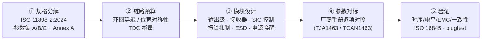
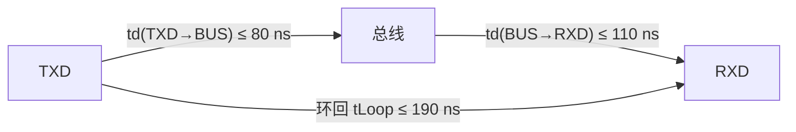

# 设计参考

> 本板块把 ISO 11898-2:2024、关键专利与主流 SIC 收发器数据手册中的**参数**翻译成**电路设计要点**,按收发器模块逐页展开。适合正在设计或对标 CAN FD / CAN SIC 收发器的模拟 IC 工程师:先看[参数集与规格基线](parameter-sets.md)建立规格树,再按模块进入设计要点,最后用[参数设计要点总表](parameter-checklist.md)做流片前自查。

## 设计流程地图

## 模块地图与设计要点入口

| 模块 | 核心设计问题 | 设计要点页 |
| --- | --- | --- |
| TX 模块(发送通路) | TXD 输入、预驱动、斜率与对称性、DTO 与失效安全 | [TX 模块设计要点](tx-module.md) |
| 输出级(驱动器) | 显性/隐性电平、驱动电流、斜率与对称性、SIC 三态阻抗 | [输出级设计要点](output-stage.md) |
| 接收比较器(HS/LP) | 阈值与迟滞、共模范围、输入阻抗匹配、接收延迟与对称性 | [接收比较器设计要点](receiver.md) |
| SIC 控制逻辑 | 显性→隐性边沿检测、有源隐性窗口(≤120/≥355/≤530 ns)、glitch-free 切换 | [SIC 控制逻辑设计要点](sic-control.md) |
| 振铃抑制电路 | recessive nulling、瞬态检测阻尼、阻抗匹配与分段斜率 | [振铃抑制电路设计要点](ring-suppression.md) |
| ESD 与总线故障保护 | 最大额定值、输入衰减器/80V 耐压、片内/片外防护分工、闩锁 | [ESD 与总线保护设计要点](esd-protection.md) |
| 电源管理/模式/唤醒 | UVLO、VIO 电平转换、Normal/Standby/Sleep、WUP/WUF、CAN FD passive | [电源与唤醒设计要点](power-wake.md) |
| 全模块参数总表 | 每一模块的参数、符号、规格、设计要点、测试条件一表汇总 | [参数设计要点总表](parameter-checklist.md) |

## 时序链路预算

环回延迟 = 发送路径 + 接收路径,是 TDC 补偿与位宽对称性的基础;预算如何拆、PVT 如何留裕量,见[时序链路预算](timing-budget.md)。

## 与知识库/教程的关系

- **知识库**:本板块是[收发器设计](../knowledge/transceiver-design/index.md)的"设计手册版";知识库回答"参数是什么、为什么",设计参考回答"这个模块怎么设计、参数怎么定"。
- **SIC 专题**:深入原理见[SIC 设计专题](../knowledge/sic-design/index.md)(原理/设计/测试三篇 + HTML 学习笔记)。
- **教程**:动手验证方法见[教程列表](../tutorials/index.md)(位定时、SIC、延迟对称性、示波器、plugfest)。
- **资源**:标准全文/参数速查/专利全文见[资源库](../resources/index.md)。

## 使用建议

1. **从规格出发**:先读[参数集与规格基线](parameter-sets.md),明确你的芯片要满足 Set A/B/C 中的哪一档,以及是否叠加 Annex A(FAST/XL 兼容)。
2. **先预算后模块**:用[时序链路预算](timing-budget.md)把 tLoop、tBit 偏差、tRec 对称性拆到每个模块,再进模块页——模块设计必须回填预算。
3. **逐项对标**:用[参数设计要点总表](parameter-checklist.md)逐行核对自家芯片与 TJA1463/TCAN1463 的差距,标注"满足/超标/不满足"。
4. **验证闭环**:流片后按[测试篇](../knowledge/sic-design/testing.md)与 [ISO 16845](../resources/_entries/standards/iso-16845-1-2016.md) 验证,把实测值回填到总表。
