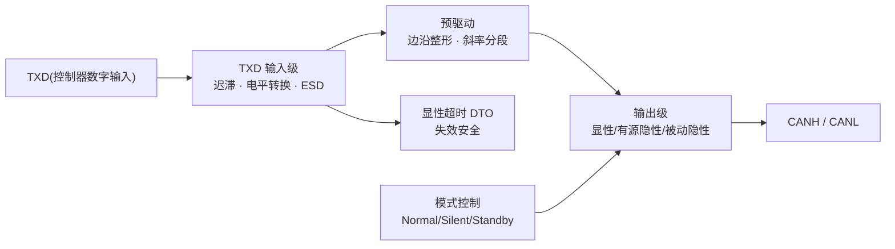

# TX 模块设计要点

## 模块职责

TX 模块是收发器的**发送通路**:从 **TXD 数字输入**到预驱动、输出级,再到 CANH/CANL 总线。它决定发送路径延迟 tTX、边沿斜率与对称性、失效安全(TXD 显性超时)与模式联动(静音/只听)。输出级的具体电路见[输出级设计要点](output-stage.md),本页聚焦 TX 通路整体。

## 参数设计要点表

| 参数/功能 | 规格参考 | 设计要点 |
| --- | --- | --- |
| TXD 输入阈值 | VIL/VIH 以器件手册为准(典型 TTL/CMOS 电平) | 输入迟滞防抖动;悬空时内部上拉/下拉失效安全 |
| TXD→总线延迟 | tprop(TXD_BUS) ≤ 80 ns(Set C) | 输入级 + 预驱动 + 输出级;计入[tLoop 预算](timing-budget.md) |
| 发送隐性位宽偏差 | ΔtBit(Bus) −10 ~ +10 ns(Set C) | 边沿整形对称,建议目标 ±6 ns |
| 驱动对称性 | Vsym_vcc 0.9~1.1 | 上下支路电流镜像精度,直接影响 EMC |
| 压摆率 | 以器件手册为准;分段斜率可配置 | 斜率与 EMC、振铃、位时间三方折衷 |
| TXD 显性超时 | tto(dom)TXD 0.8~9 ms(器件级) | TXD 卡显性时自动关断驱动器释放总线 |
| 总线显性超时 | tto(dom)bus 0.8~9 ms(器件级) | 总线持续显性故障检测 + 诊断输出 |
| 短路/故障保护 | 输出级短路电流受控 | 对电源/地短路不损坏、可恢复 |
| 静音模式 | Silent/Listen-only:发送关断、接收保持 | 模式切换无毛刺,TXD 无效时不驱动总线 |

## 关键设计点

### 1. TXD 输入级

- **迟滞**:TXD 是控制器送来的数字信号,输入级加迟滞防止边沿噪声导致重复触发;阈值与 MCU 电平(3.3/5 V)匹配,低 VIO 场景注意输入高电平下限。
- **失效安全**:TXD 引脚悬空或控制器未上电时,内部上拉/下拉必须把 TXD 拉到隐性(高),**不允许悬空导致总线被卡在显性**。
- **ESD 与接口**:TXD 引脚同样需要 ESD 保护(通常为 HBM ±2~4 kV 量级),并避免与 RXD 长距离平行走线耦合。

### 2. 预驱动与边沿整形

- 预驱动把 TXD 边沿“整形”成输出级需要的驱动时序:控制电流建立/关断的顺序,决定输出边沿的对称性。
- **分段斜率**(Microchip 思路):把输出级分成 N 个并联小驱动器,禁用信号经串联延迟线逐级到达,边沿切成多段缓变——不改变总线差分阻抗,同时压低高频分量。
- 预驱动延迟是 tTX 的主要组成部分,必须与输出级延迟一起做 PVT 仿真(SS/高温最坏)。

### 3. 输出级三态与 SIC 联动

- 显性:低阻强制驱动;有源隐性:75~133 Ω(RDIFF_act_rec)主动放电;被动隐性:约 60 kΩ 高阻。
- TX 通路必须保证 **TXD 变 LOW 立即切回显性**(仲裁覆盖),有源隐性相位可被显性立即中断。
- SIC 窗口(tact_rec_start ≤120 ns / tact_rec_end ≥355 ns / tpas_rec_start ≤530 ns)由 SIC 控制逻辑产生,TX 模块负责执行阻抗切换,详见[SIC 控制逻辑设计要点](sic-control.md)。

### 4. TXD 显性超时保护(DTO)

- **功能**:TXD 持续显性超过 tto(dom)TXD(0.8~9 ms)时,内部定时器关断驱动器,把总线释放回隐性,防止控制器故障拖垮网络。
- **恢复**:TXD 回到隐性后自动复位,重新允许发送;恢复过程不得产生总线毛刺。
- **设计注意**:定时器要覆盖工艺角与温度(建议留 ±20% 容差);超时阈值不可太短(正常长帧显性不会超过),也不可太长(失效安全失效)。

### 5. 模式联动与失效安全

- Silent/Listen-only:发送通路关断(TXD 无效),接收通路保持;用于总线监听与故障隔离。
- Standby/Sleep:发送通路完全关闭,总线引脚高阻,漏电 ≤ µA 级。
- 模式切换(如 Normal↔Silent)瞬间输出必须处于确定状态(隐性/高阻),不能产生显性毛刺。

## 常见陷阱

- **TXD 悬空没有失效安全**:控制器没上电时总线被卡显性,整网瘫痪。
- **输入迟滞不足**:TXD 边沿噪声反复触发输出级,位宽抖动吃掉时序裕量。
- **DTO 只做发送侧不看总线**:TXD 正常但总线被外部拉显性时,需要总线显性超时检测配合诊断。
- **斜率只考虑 EMC**:高速数据相位下斜率同时影响采样点稳定与反射幅度,分段斜率与阻抗匹配要一起设计。
- **模式切换毛刺**:静音/正常切换瞬间输出跳变,需要先回隐性再切换。

## 参见

- [输出级设计要点](output-stage.md) / [SIC 控制逻辑设计要点](sic-control.md) / [时序链路预算](timing-budget.md)
- 知识库:[输出级:差分驱动与显性/隐性电平](../knowledge/transceiver-design/output-stage.md)、[SIC 设计专题·设计篇](../knowledge/sic-design/design.md)
- 资源:[TJA1463 数据手册全文](../resources/full-text/tja1463-datasheet.md)、[TCAN1462-Q1 数据手册全文](../resources/full-text/tcan1462-datasheet.md)、[US11539548B2 阻抗匹配+斜率控制](../resources/full-text/us11539548b2-microchip-sic.md)
