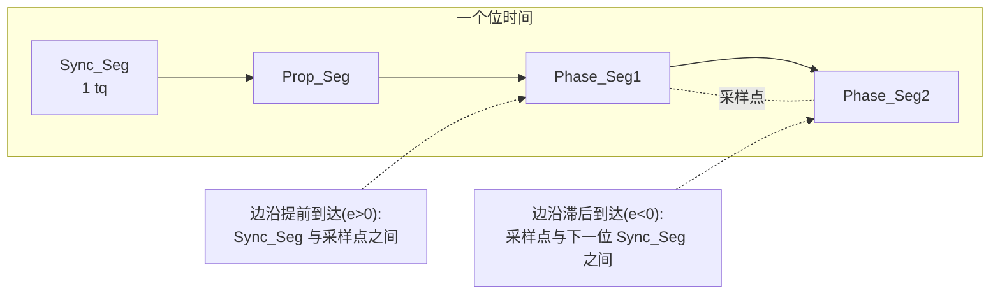
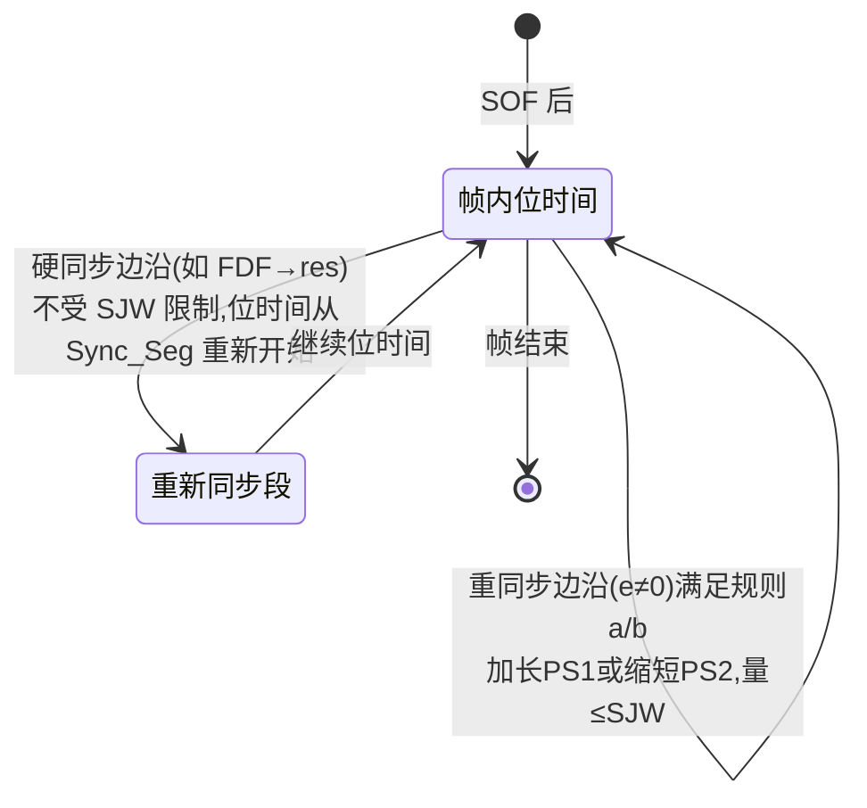
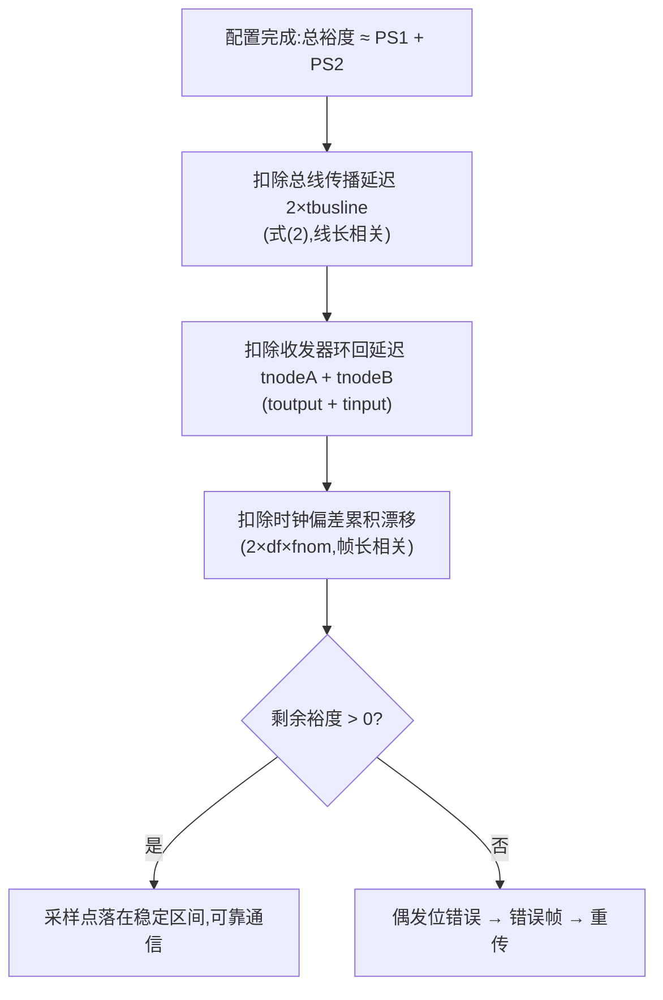

## 概述

**相位裕度(Phase Margin)** 是采样点两侧还可容忍的相位偏差总量:总相位裕度 ≈ 相位缓冲段 1 + 相位缓冲段 2 的长度之和(以 tq 计)。它被总线传播延迟、收发器传播延迟及其不对称性、各节点时钟偏差共同消耗——**"网络能不能跑"的本质问题是:配置完之后相位裕度是否仍为正。**

**同步**是节点把采样点拉回正确位置的机制,由 ISO 11898-1:2024 第 7.3.5 节定义:**硬同步**在特定边沿(帧间空间、总线整合状态、FDF→res 边沿等)把位时间重新从 Sync_Seg 开始;**重同步**在帧内检测到边沿相位误差时,通过加长 Phase_Seg1 或缩短 Phase_Seg2 微调采样点,调整量上限为**同步跳转宽度(SJW)**。

## 关键参数与公式

### 相位裕度预算

```
总相位裕度 ≈ Phase_Seg1 + Phase_Seg2(以 tq 计)

被以下项消耗:
· 总线传播延迟(式(2)中的 tbusline,与线长成正比,双绞线约 5~7 ns/m,以线缆特性为准)
· 收发器传播延迟及其不对称性(Δt = toutput − tinput 方向的差异)
· 各节点时钟振荡器偏差随帧长累积的漂移(2×df×fnom,见 7.3.6)
```

### 仲裁条件公式(7.3.2)

| 公式 | 内容 |
|---|---|
| 式(1) | tnode = toutput + tinput(节点内部延迟 = 输出 + 输入异步延迟之和) |
| 式(2) | **tprop_seg ≥ tnodeA + tnodeB + 2×tbusline**(正确仲裁:传播段必须 ≥ 双方节点延迟之和 + 2 倍总线传播时间) |

仲裁相位中,`2×(tTX + tBUS + tRX) ≤ 传播段` 是总线长度的约束来源:传播段吸收环回延迟,剩余空间才构成采样点两侧的裕度。

### 同步规则要点(7.3.5)

| 规则 | 内容 |
|---|---|
| a | 每个位时间(两个采样点之间)只允许**一次同步**;边沿检测后同步被禁用,直到下一采样点读到隐性 |
| b | 边沿仅在**上一采样点读到的总线状态为隐性**时才引起同步;发显性位的节点不对正相位误差边沿同步 |
| c | 硬同步执行的边沿:帧间空间内(intermission 第一位除外)、总线整合状态、FD 帧 **FDF→res** 边沿、XL 帧 XLF→resXL 边沿(接收节点)、DH1/DH2→DL1、DAH 或 AH1→AL1 |
| d | 其余满足规则 a/b 的隐性→显性边沿用于重同步;发送 FD/XL 帧的节点在发送数据相位期间不同步 |

### 相位误差 e 与重同步(7.3.5.2/7.3.5.4)

- **e = 0**:边沿位于 Sync_Seg 内;
- **e > 0**:边沿位于 Sync_Seg 与当前位采样点之间(边沿提前);
- **e < 0**:边沿位于当前位采样点与下一位 Sync_Seg 之间(边沿滞后);
- 重同步:|e| ≤ SJW 时效果等同硬同步;|e| > SJW 时,**e 为正 → Phase_Seg1 加长 SJW,e 为负 → Phase_Seg2 缩短 SJW**;
- 硬同步**不受 SJW 限制**,强制引发硬同步的边沿落在重定位后的位时间同步段内(7.3.5.3)。

### 振荡器容差与 SJW(7.3.6)

节点时钟频率容差范围:(1−df)×fnom ≤ fosc ≤ (1+df)×fnom;任意两节点最大差异预期为 **2×df×fnom**。df 取决于 tq 长度、位时间各段与 SJW,须满足标准公式(3)-(8);配置的 **SJW 不得大于 Phase_Seg1 与 Phase_Seg2 中较小者**(7.3.3)。注:公式(3)-(8) 的具体解析式在全文页中为图形/公式对象,未提取为文本,此处不展开数值。

## 工作原理

### 相位误差与重同步示意



重同步的几何意义:边沿提前(e>0)说明本节点位时间偏长,把 Phase_Seg1 加长 SJW 让采样点后移;边沿滞后(e<0)说明本节点位时间偏短,把 Phase_Seg2 缩短 SJW 让采样点前移。

### 硬同步 vs 重同步



硬同步用于把节点对齐到"已知的边界"(帧起始、格式切换、总线整合),重同步用于在帧内持续跟踪发送节点的时钟。**CAN FD 数据相位期间发送节点不做同步**(7.3.5.1 规则 d)——数据相位的时间基准完全依赖 TDC 与收发器延迟稳定性,这是数据相位对收发器对称性要求更高的协议侧原因。

### 相位裕度被消耗的过程



数据相位中,环回延迟被 TDC 补偿后,剩余的不对称误差、SSP 量化误差与振铃抖动仍消耗裕度——因此**收发器传播延迟对称性是数据相位裕度的天花板**。

## 对设计的意义

- **对控制器(嵌入式)**:相位裕度无法直接"配置",它是段配置、SJW 与网络拓扑共同作用的结果。排查"偶发收不到、莫名错误帧"时,用 `ip -details link show can0` 核对各段 tq 与采样点,再结合收发器数据手册的延迟参数做预算:裕度为正则配置合理;SJW 取 ≤ min(PS1, PS2),常见 1~4 tq,以数据手册为准。
- **对收发器(模拟 IC)**:收发器能做的只有一件事——把环回延迟与不对称性做小、做稳。传播延迟对称性(Δt)直接决定数据相位剩余裕度;驱动沿整形与振铃抑制决定采样时刻的信号稳定度。相位裕度分析是把"协议位定时"与"收发器电气参数"连接起来的计算纽带。
- **对系统**:总线长度受式(2)约束:线越长,2×tbusline 越大,要么加大传播段、要么降速率;全网络节点采样点必须一致(或落在容差内)。

## 常见误区

- **误区一:"相位裕度 = 采样点百分比"** —— 采样点百分比是段配置的结果;裕度是采样点两侧可容忍的相位偏差总量(≈ PS1+PS2),两者相关但不同。
- **误区二:"硬同步和重同步一样受 SJW 限制"** —— 重同步受 SJW 限制,硬同步**不受 SJW 限制**(7.3.5.3)。
- **误区三:"帧内任何边沿都能触发同步"** —— 每个位时间只允许一次同步,且只有上一采样点读到隐性的边沿才引起同步(规则 a/b);发送数据相位期间发送节点不做同步(规则 d)。
- **误区四:"SJW 越大越好"** —— SJW 越大容忍时钟偏差能力越强,但 SJW ≤ min(PS1, PS2) 是硬约束,过大还会把采样点推出稳定区;df 的许可范围由公式(3)-(8) 综合决定,不是越大越安全。
- **误区五:"数据相位也有重同步兜底"** —— 数据相位发送节点不同步,数据相位时序完全依赖 TDC + 收发器延迟稳定性;把重同步当成高速数据相位的兜底是常见误判。

## 参见

- 标准规范(内容来源):[ISO 11898-1:2024 关键参数速查](../../resources/standards-text/iso-11898-1-2024-key-parameters.md)、[ISO 11898-1:2024 全文(7.3.2/7.3.5/7.3.6)](../../resources/standards-text/iso-11898-1-2024-full.md)
- 教程:[位定时入门:时间量子、采样点与相位裕度](../../tutorials/03-bit-timing-basics.md)、[BRS 与 TDC:为什么需要收发器延迟补偿](../../tutorials/04-brs-tdc.md)、[收发器传播延迟对称性](../../tutorials/09-delay-symmetry.md)
- 词条:[相位裕度](../../glossary/phase-margin.md)、[采样点](../../glossary/sample-point.md)、[重同步跳转宽度](../../glossary/re-sync-jump-width.md)、[传播延迟对称性](../../glossary/propagation-delay-symmetry.md)、[传播段](../../glossary/propagation-segment.md)
- 标准条目:[CiA 601-3(位定时配置与评估工具)](../../resources/_entries/standards/cia-601-3-bit-timing.md)、[CiA 601-1(物理接口实现与延迟对称性)](../../resources/_entries/standards/cia-601-1-physical-interface.md)
- 相邻子域:[时间量子与采样点](time-quantum-sample-point.md)、[收发器延迟补偿(TDC/SSP)](tdc.md)、[振铃抑制与采样点稳定性](../physical-layer/ringing-suppression.md)
