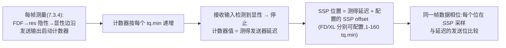
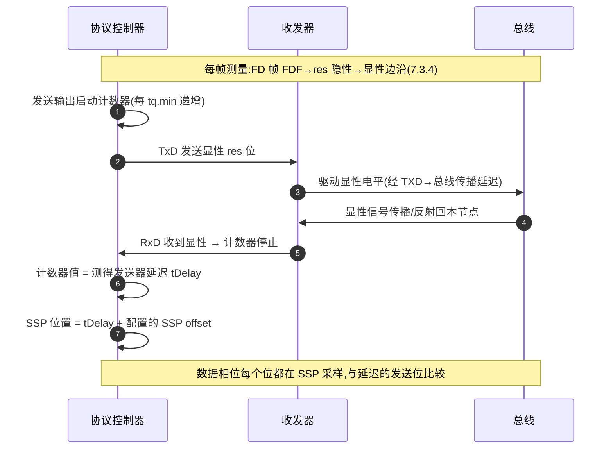
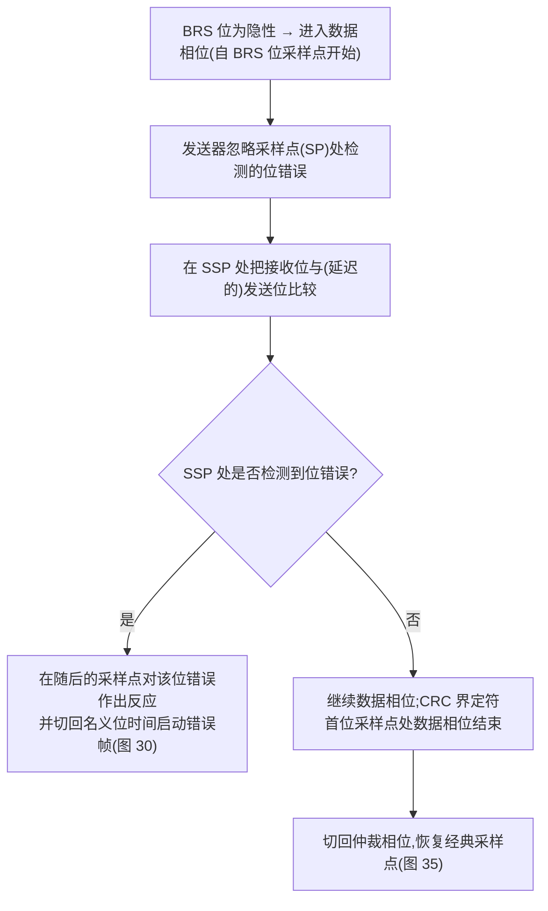

## 概述

**TDC(Transmitter Delay Compensation,收发器延迟补偿)** 是 CAN FD/CAN XL 协议控制器在数据相位采用的采样补偿机制:发送节点在每帧测量"TxD 发出 → 收发器驱动 → 总线 → 接收比较器 → 回到 RxD"的实际**发送器延迟(transmitter delay)**,把数据相位的采样推迟到**第二采样点(SSP,Secondary Sample Point)**,以消除物理层延迟对数据相位采样的占用。

机制最早定义于 **Bosch CAN FD 规范(2012)第 8.1 节 *Transceiver Delay Compensation***("CAN FD nodes shall support an optional transceiver delay compensation mechanism…"),后被 **ISO 11898-1:2024 第 7.3.4 节**标准化并改为强制性要求。它**只用于数据相位**;仲裁相位仍用经典采样点。

## 关键参数与规则(7.3.4)

| 项目 | 要求 | 来源 |
|---|---|---|
| 支持性 | 支持 FD 帧格式与支持 XL 帧格式的节点**必须支持** TDC | 7.3.4 |
| 应使用(should) | FD/XL 数据相位位时间 ≤ **1000 ns** 时应使用 TDC | 7.3.4 |
| 必须使用(needs) | FD/XL 数据相位中 Sync_Seg+Prop_Seg+Phase_Seg1 之和短于 PCS→PMA→PCS 传播延迟时必须使用 | 7.3.4 |
| 是否启用 | 可编程;启用时**预分频 m 必须为 1 或 2** | 7.3.4 |
| 补偿能力 | 至少 **95 tq.min**;仅支持 FD 不支持 XL 的节点可限制为 **63 tq.min** | 7.3.4 |
| SSP 位置 | FD 帧与 XL 帧**分别可配置** | 7.3.4 |
| SSP offset 范围 | FD/XL 数据位时间 1 至 160 tq.min(表 13);仅 FD 节点 1 至 63 tq.min(表 12) | 表 12/13 |

### 为什么必须 TDC:数据相位位时间太短

无发送器延迟补偿时,FD/XL 帧数据相位位速率受限于"发送器最迟在**采样点**收到自己发送的位,否则检测到位错误"这一约束(7.3.4 原文,与 Bosch 8.1 节措辞一致)。5 Mbit/s 数据位时间仅 200 ns,而典型收发器环回延迟达数百 ns 量级——固定采样点必然失效。

### SSP 位置公式

```
SSP 位置 = 测得发送器延迟(计数器值)+ 配置的 SSP offset
```



- 延迟测量在**每个发送帧**进行:FD 帧在 **FDF→res 位**的隐性→显性边沿,XL 帧在 **XLF→resXL 位**的隐性→显性边沿;发送 res/resXL 位时在发送输出启动计数器,按每个最小时间量子(tq.min)递增,直到接收输入检测到显性信号停止;计数器值即测得发送器延迟,应用于**同一帧**的数据相位(7.3.4)。
- 若 SSP 位置值为奇数且数据相位时间量子预分频为 2,可将 SSP 位置值**除以 2 并向下取整**(7.3.4)。

### 示例(NOTE,7.3.4)

使用最小配置范围时最新 SSP 为 **160+95 = 255 tq.min**(SSP offset 160 + 补偿 95);按 tq.min = 6,25 ns(160 MHz)计,可补偿 **95 × 6,25 = 593,75 ns** 的发送器延迟,SSP offset 可设为 **160 × 6,25 = 1000 ns**。

### 位错误处理规则(7.3.4)

- 启用 TDC 时,发送器**忽略采样点处检测到的位错误**;
- 在 **SSP 处**将接收位与(延迟的)发送位比较;若在 SSP 检测到位错误,**在随后的采样点**对该位错误作出反应(图 30);
- 数据相位末端那些 SSP 会落入后续仲裁相位的位,**禁用其位错误检测**(图 35:SSP 序列在数据相位结束处停止;节点也可选择把 SSP 序列继续到数据相位限之外,仅检查本地错误,图 36);
- 数据相位结束时(首个 CRC 界定符位的采样点)SSP 序列停止。

### 与 Bosch 规范第 8.1 节的对照

| 项目 | Bosch CAN FD 规范 v1.0(2012)8.1 节 | ISO 11898-1:2024 7.3.4 节 |
|---|---|---|
| 机制性质 | **可选(optional)** 机制 | FD/XL 使能节点**必须支持** |
| 延迟名称 | TRV_DELAY | transmitter delay(发送器延迟) |
| 测量边沿 | 每帧 EDL 位 → 保留位 r0 的边沿(发送位边沿与接收位边沿之间) | FD 帧 **FDF→res** 边沿、XL 帧 XLF→resXL 边沿(隐性→显性) |
| SSP 位置 | TRV_DELAY + offset(如数据相位半位时间),向下取整到整数个时间量子;可位于发送位结束之后 | 测得发送器延迟 + 配置的 SSP offset(1-160 tq.min,表 13) |
| 位错误反应 | SSP 检测到位错误 → 下一个采样点反应 | 同左;启用时忽略采样点处的位错误 |

两条标准的机制同源:Bosch 2012 年首倡的"测量环回延迟、推迟到第二采样点比较"思路,在 ISO 11898-1:2024 中被保留为同一套 SSP 规则,并把"可选"升级为"支持 FD/XL 格式的节点必须支持"(7.3.4)。

### 数据相位速率与收发器延迟预算(ISO 11898-2:2024)

| 参数集 | 适用位速率 | tLoop 最大 | 关键位宽变化参数 |
|---|---|---|---|
| 参数集 A | >1 Mbit/s 至 2 Mbit/s | 255 ns | 数值未从全文提取(见速查页注) |
| 参数集 B | >2 Mbit/s 至 5 Mbit/s | 255 ns | t△Bit(Bus) −45/+10 ns;t△Bit(RXD) −80/+20 ns;t△Rec −45/+15 ns(表 16) |
| 参数集 C | 本版新引入 | **190 ns** | t△Bit(Bus) −10/+10 ns;t△Bit(RXD) −30/+20 ns;t△Rec −20/+15 ns(表 17);tprop(TXD_BUS) ≤80 ns、tprop(BUS_RXD) ≤110 ns(表 14) |

参数集 C 的 190 ns tLoop 上限即"收发器延迟做小"的量化目标:配合 TDC 补偿 95 tq.min 的能力(160 MHz 下 593,75 ns),数据相位才可能跑到 5 Mbit/s 甚至更高。

## 工作原理

### 环回路径与延迟测量(sequenceDiagram)



### 数据相位采样:SSP 对比"固定采样点"



TDC 补偿的是**延迟的大小**;它无法补偿延迟的**变化**——这正是收发器传播延迟**对称性**与环回延迟**稳定性**重要的原因。数据相位末端、SSP 落入仲裁相位的位禁用位错误检测,避免把仲裁相位的合法显性位误判为错误。

### 发送器延迟超过一个数据位时间的情况(图 34)

标准给出的示例位流 [A 至 K] 中,发送器延迟**几乎两个数据位时间**长,因此 SSP 被置于从发送器延迟起至位开始后三个数据位时间之间的范围,即输入信号预期已稳定的位置;此时接收位流中的位要与**延迟两个数据位时间**的发送位流比较:SSPA 处接收位 AR 与延迟发送位 A₂ 比较,以此类推(7.3.4)。SSP 可以位于发送位结束之后。

## 对设计的意义

- **对控制器(嵌入式)**:数据相位 ≥ 2 Mbit/s(位时间 ≤ 500 ns < 1000 ns)时必须使能 TDC,并按收发器数据手册的环回延迟设置 SSP offset;启用 TDC 时预分频 m 必须为 1 或 2;TDC 开关、偏移步长与寄存器名因控制器而异,以控制器数据手册为准。
- **对收发器(模拟 IC)**:ISO 11898-2:2024 的参数集 C 环路延迟 tLoop 最大 **190 ns**(TXD→CAN_H/CAN_L 传播延迟 ≤ 80 ns,CAN_H/CAN_L→RXD ≤ 110 ns,表 17/14);参数集 A/B 的 tLoop 最大 255 ns——收发器把环回延迟做小、做对称、做稳定,控制器才能把 SSP 算准,这是"为什么 CAN FD 收发器需要更低的传播延迟与更好的对称性"的直接原因。
- **对系统**:数据相位位时间 ≤ 1000 ns 时应使用 TDC;若 Sync+Prop+PS1 之和短于 PCS→PMA→PCS 传播延迟则**必须**使用(7.3.4)。

## 常见误区

- **误区一:"TDC 补偿的是采样点本身"** —— TDC 补偿的是发送器延迟(环回延迟),采样推迟到 **SSP = 测得延迟 + SSP offset**;补偿对象是延迟的**大小**,不是采样时刻的任意后移。
- **误区二:"TDC 在所有速率下都生效"** —— 只在数据相位生效,仲裁相位(仲裁竞争、ACK)仍用经典采样点;且仅当 BRS 位为隐性时用于 FD 帧数据相位(7.3.4)。
- **误区三:"SSP 位置是固定配置的百分比"** —— SSP 位置 = 每帧实测延迟 + 配置 offset,是**动态测量 + 静态偏移**的组合;SSP offset 才是可配置参数(1-160 tq.min)。
- **误区四:"延迟测量用 BRS 位边沿"** —— 测量边沿是 FD 帧的 **FDF→res** 位(隐性→显性),不是 BRS 位;测量在每帧进行,结果应用于同一帧的数据相位(7.3.4)。
- **误区五:"TDC 使能后采样点处的位错误检测照常"** —— 恰恰相反:启用 TDC 时发送器**忽略**采样点处检测的位错误,改在 SSP 处比较、在随后采样点反应(7.3.4)。

## 参见

- 标准规范(内容来源):[ISO 11898-1:2024 关键参数速查](../../resources/standards-text/iso-11898-1-2024-key-parameters.md)、[ISO 11898-1:2024 全文(7.3.4)](../../resources/standards-text/iso-11898-1-2024-full.md)、[Bosch CAN FD 规范全文(第 8.1 节)](../../resources/standards-text/bosch-canfd-spec-full.md)、[ISO 11898-2:2024 关键参数速查(参数集 C tLoop)](../../resources/standards-text/iso-11898-2-2024-key-parameters.md)
- 教程:[BRS 与 TDC:为什么需要收发器延迟补偿](../../tutorials/04-brs-tdc.md)、[CAN FD 位定时配置实战](../../tutorials/06-bit-timing-config.md)、[收发器传播延迟对称性](../../tutorials/09-delay-symmetry.md)
- 词条:[TDC](../../glossary/tdc.md)、[环路延迟](../../glossary/loop-delay.md)、[采样点](../../glossary/sample-point.md)、[传播延迟对称性](../../glossary/propagation-delay-symmetry.md)、[BRS](../../glossary/brs.md)
- 标准条目:[Bosch CAN FD Specification v1.0(第 8 章 TDC 源头)](../../resources/_entries/standards/bosch-2012-canfd-spec.md)、[ISO 11898-1 (2024)](../../resources/_entries/standards/iso-11898-1-2024.md)
- 论文:[Hartwich 2012: CAN with Flexible Data-Rate](../../resources/_entries/papers/2012-hartwich-can-fd.md)
- 相邻子域:[时间量子与采样点](time-quantum-sample-point.md)、[相位裕度与同步](phase-margin.md)、[控制器寄存器 TDC 配置](../controller/register-tdc-config.md)
