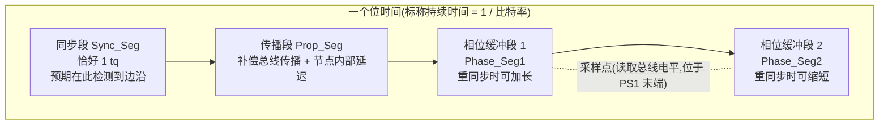
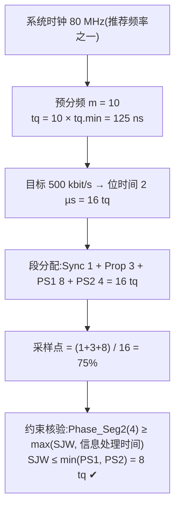

## 概述

**时间量子(Time Quantum,tq)** 是 CAN 位定时的最小时间单位;**位时间(Bit Time)** 是一个位的标称持续时间(名义位时间的倒数),被划分为四个连续的、互不重叠的段:**同步段(Sync_Seg)→ 传播段(Prop_Seg)→ 相位缓冲段 1(Phase_Seg1)→ 相位缓冲段 2(Phase_Seg2)**。**采样点(Sample Point)** 位于 Phase_Seg1 的末端,是节点读取并解释总线电平的时刻。整个模型由 **ISO 11898-1:2024 第 7.3.2/7.3.3 节**定义,是仲裁相位与数据相位两套位定时配置的共同基础。

## 关键参数与公式

### 时间量子 tq(7.3.2)

- tq 是源自节点时钟周期的固定时间单位;存在整数可编程预分频器,最小时间量子 **tq.min = 1 个节点时钟周期**;tq 长度 = 预分频值 m × tq.min(m 为整数,可编程范围 1 至 32,表 11-13)。
- 位时间长度取决于 tq 长度与位内的 tq 数;若不同参数组合得到相同位时间长度,**较短 tq 的组合使节点同步更好**(7.3.2)。
- 推荐节点时钟:CAN FD 应用推荐 **20 MHz、40 MHz 或 80 MHz**;CAN XL 数据位速率至 20 Mbit/s 时推荐 **160 MHz**(7.3.2)。
- 三种位速率与三套独立配置寄存器:名义位速率、FD 数据位速率、XL 数据位速率;FD 数据相位自 BRS 位采样点(检测为隐性)开始,至 CRC 界定符首个采样点结束(7.3.2)。

### 采样点公式

```
采样点位置(%) = (Sync_Seg + Prop_Seg + Phase_Seg1) / 位时间总 tq 数 × 100%
```

采样点位于 Phase_Seg1 末端(7.3.2);**信息处理时间**(自采样点起计算下一 bit 电平所需时间)≤ 2 tq(7.3.3)。

### 关键公式(仲裁条件,7.3.2)

| 公式 | 内容 | 含义 |
|---|---|---|
| 式(1) | tnode = toutput + tinput | 节点内部延迟 = 输出路径 + 输入路径异步延迟之和 |
| 式(2) | tprop_seg ≥ tnodeA + tnodeB + 2×tbusline | 正确仲裁:传播段必须 ≥ 双方节点延迟之和 + 2 倍总线传播时间 |

### 可编程总 tq 数范围(7.3.3)

| 节点类型 | 名义位时间 | 数据位时间 |
|---|---|---|
| 非 FD 使能 | 至少 8 至 25 tq | 不适用 |
| FD 使能 | 至少 8 至 80 tq | 至少 5 至 25 tq |
| XL 使能 | 至少 5 至 641 tq(1+384+128+128) | 至少 5 至 385 tq(1+128+128+128) |

### 段配置范围(表 11-13,7.3.3)

支持全部帧格式时(表 13,最小配置范围):

| 参数 | 名义位时间 | FD 数据位时间 | XL 数据位时间 |
|---|---|---|---|
| 预分频 m | 1 至 32 | 1 至 32 | 1 至 32 |
| Sync_Seg | 1 tq | 1 tq | 1 tq |
| Prop_Seg | 1 至 384 tq | 0 至 128 tq | 0 至 128 tq |
| Phase_Seg1 | 1 至 128 tq | 1 至 128 tq | 1 至 128 tq |
| Phase_Seg2 | 2 至 128 tq | 2 至 128 tq | 2 至 128 tq |
| SJW | 1 至 128 tq | 1 至 128 tq | 1 至 128 tq |
| SSP offset | 不适用 | 1 至 160 tq.min | 1 至 160 tq.min |

(仅支持 FD 不支持 XL 的表 12:名义位时间独立预分频时 Prop_Seg 1-48 tq、共享预分频时 0-96 tq,FD 数据位时间 Prop_Seg 0-8 tq,SSP offset 1-63 tq.min。)

### 配置限制(7.3.3)

- 信息处理时间 ≤ 2 tq;
- 数据位时间:Phase_Seg2 ≥ max(SJW, 最大信息处理时间);
- 名义位时间:Phase_Seg2 ≥ max(SJW, 信息处理时间);
- 名义与数据位时间:SJW ≤ min(Phase_Seg1, Phase_Seg2);
- **Prop_Seg 在数据位速率配置中可为 0**;
- Sync_Seg 恰好 1 tq;Prop_Seg 与 Phase_Seg1 可不分开编程,编程其和即可。

## 工作原理

### 位时间的四段结构



| 段 | 作用(7.3.2) |
|---|---|
| Sync_Seg | 同步各 CAN 节点;预期在此段内检测到边沿;恰好 1 个 tq |
| Prop_Seg | 补偿网络物理延迟:总线信号传播时间 + 节点内部延迟时间 |
| Phase_Seg1 / Phase_Seg2 | 补偿边沿相位误差;重同步时可被加长/缩短 |
| SJW | 重同步时相位缓冲段加长/缩短的上限 |
| 采样点 | 位于 Phase_Seg1 末端 |
| 信息处理时间 | 自采样点开始,≤ 2 tq |

### 采样点位置示意(gantt 时间轴)

```mermaid
gantt
    title 位时间 = 16 tq 示例(Sync 1 + Prop 3 + PS1 8 + PS2 4):采样点位于 75%
    dateFormat X
    axisFormat %s
    Sync_Seg 1tq: 0, 1
    Prop_Seg 3tq: 1, 3
    Phase_Seg1 8tq: 4, 8
    Phase_Seg2 4tq: 12, 4
```



采样点越靠后,给信号传播与振铃稳定留下的时间越多,但 Phase_Seg2 留给重同步调整的空间变小;两套位时间的采样点必须分别权衡。全网络最优切换配置的三个条件(7.3.2):**a)** 名义与数据位时间使用相同 tq 长度;**b)** 网络中所有节点名义采样点位置相同;**c)** FD 数据位时间采样点位置相同。

### 一个完整配置计算示例



仲裁相位典型配置 16 tq、采样点 75%;数据相位因环回延迟交给 TDC 补偿,Prop_Seg 可压到 0 tq(7.3.3),采样点主要由"小传播段 + 大 PS1 + 小 PS2"构成,详见[TDC](tdc.md)。

### 振荡器容差(7.3.6)

节点时钟频率容差范围:(1−df)×fnom ≤ fosc ≤ (1+df)×fnom;任意两节点时钟最大差异预期为 **2×df×fnom**。df 取决于 tq 长度、位时间各段与 SJW,须满足标准公式(3)-(8)(CC 帧用(3)-(5)、FD 帧用(3)-(7)、XL 帧用(3)(4)(8));配置的 SJW 不得大于 Phase_Seg1 与 Phase_Seg2 中较小者。注:公式(3)-(8) 的具体解析式在全文页中为图形/公式对象,未提取为文本,此处不展开数值。

## 对设计的意义

- **对控制器(嵌入式)**:TQ 预分频与各段寄存器是位定时配置的全部手段;仲裁与数据相位两套位时间必须分别配置且各段满足 7.3.3 限制;`ip -details link show can0` 可查看内核实际协商的 `tq/prop-seg/phase-seg1/phase-seg2/sjw` 与采样点,是核对配置的第一现场。
- **对收发器(模拟 IC)**:式(2) 中的 tnode = toutput + tinput 正是收发器传播延迟的预算来源——收发器延迟越小,仲裁相位传播段越短、可支持的拓扑越长;采样点时刻"信号必须稳定"的要求直接转化为驱动沿整形与振铃抑制需求,是连接[物理层与SIC](../physical-layer/index.md)分域的桥梁。
- **对系统**:全网络节点采样点必须一致(或落在容差内),否则同一帧在不同节点可能被判为不同电平;CAN FD 用 20/40/80 MHz 节点时钟是官方推荐起点。

## 常见误区

- **误区一:"tq 就是系统时钟周期"** —— tq = m × tq.min,最小时间量子 tq.min 才等于 1 个节点时钟周期;预分频 m(1-32)把 tq 放大为时钟周期的整数倍。
- **误区二:"采样点想放哪放哪"** —— Phase_Seg2 ≥ max(SJW, 信息处理时间)、SJW ≤ min(PS1, PS2)、信息处理时间 ≤ 2 tq 是硬约束;采样点百分比只是这些约束的结果。
- **误区三:"数据相位传播段必须 ≥ 0 且越大越好"** —— 数据位时间中 Prop_Seg **可为 0**(7.3.3),环回延迟由 TDC 补偿,传播段反而要短;仲裁相位才靠传播段吸收延迟。
- **误区四:"采样点越靠后越安全"** —— 采样点靠后确实给传播/振铃更多时间,但会压缩 Phase_Seg2 的重同步空间;对振荡器容差(df)的容忍能力取决于 Phase_Seg1、Phase_Seg2 与 SJW(7.3.2/7.3.6),不是单纯越靠后越好。

## 参见

- 标准规范(内容来源):[ISO 11898-1:2024 关键参数速查](../../resources/standards-text/iso-11898-1-2024-key-parameters.md)、[ISO 11898-1:2024 全文](../../resources/standards-text/iso-11898-1-2024-full.md)
- 教程:[位定时入门:时间量子、采样点与相位裕度](../../tutorials/03-bit-timing-basics.md)、[CAN FD 位定时配置实战](../../tutorials/06-bit-timing-config.md)、[BRS 与 TDC:为什么需要收发器延迟补偿](../../tutorials/04-brs-tdc.md)
- 词条:[时间量子](../../glossary/time-quantum.md)、[位时间](../../glossary/bit-time.md)、[采样点](../../glossary/sample-point.md)、[传播段](../../glossary/propagation-segment.md)、[同步段](../../glossary/sync-segment.md)、[重同步跳转宽度](../../glossary/re-sync-jump-width.md)
- 标准条目:[ISO 11898-1 (2024)](../../resources/_entries/standards/iso-11898-1-2024.md)、[CiA 601-3(位定时配置与评估工具)](../../resources/_entries/standards/cia-601-3-bit-timing.md)
- 相邻子域:[相位裕度与同步](phase-margin.md)、[收发器延迟补偿(TDC/SSP)](tdc.md)、[物理层与SIC](../physical-layer/index.md)
