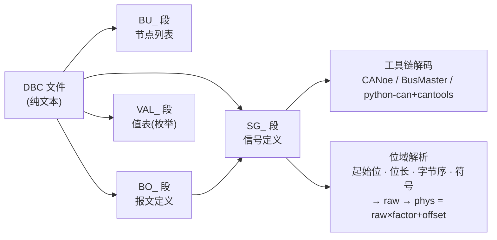
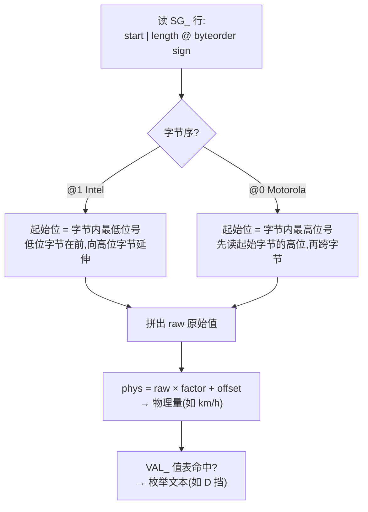
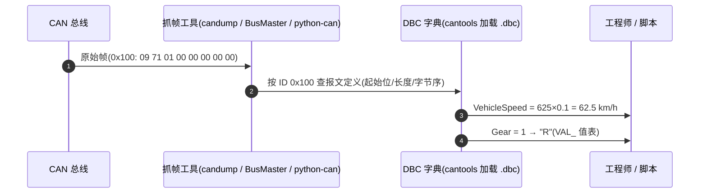
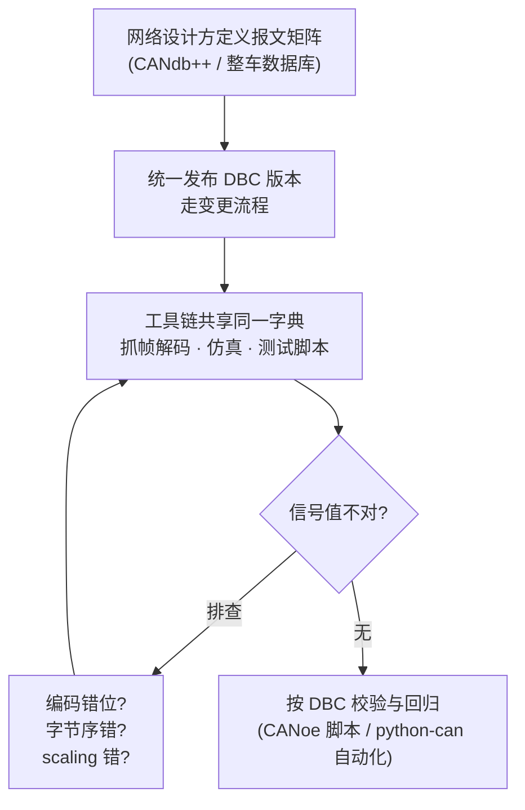

## 概述

**DBC(Database CAN)** 是 Vector 提出的 CAN 网络描述文件格式:以纯文本定义**报文(Message)** 与**信号(Signal)**——起始位、位长、字节序、缩放/偏移、物理单位与值表,让 CANoe、BusMaster、python-can 等工具共享同一套网络"字典",实现**信号级解码与仿真**(把原始字节翻译成"车速 = 62.5 km/h"这类物理量)。DBC 由网络设计工具(如 CANdb++)或整车网络数据库生成,可描述经典 CAN 与 CAN FD 报文(词条 DBC)。

一条信号的"字典"语义:`phys = raw × factor + offset`。例如车速信号 factor=0.1、offset=0,原始值 625 即 62.5 km/h——DBC 解码工具正是按这套关系换算,离线/在线分析都必须依赖正确的 DBC。

## DBC 文件结构与核心元素



| 元素 | 说明 |
|---|---|
| 报文(Message) | 一个 CAN 帧:ID(标准/扩展)、DLC、发送周期、发送节点 |
| 信号(Signal) | 报文内的一段位域:起始位、位长、字节序(Intel/ Motorola)、**缩放因子 + 偏移**(原始值 → 物理值)、单位、值表 |
| 多路复用(Multiplex) | 同一报文的信号集随多路复用位(如模式)切换,压缩报文数量 |
| 节点(Node) | 发送/接收方定义,用于网络仿真与可达性检查 |
| 值表(Value Table) | 枚举型信号:如 0=Off、1=On |

## 完整 DBC 示例(自拟,符合 DBC 语法)

以下为演示用最小网络(VCU 发送车速/挡位/制动状态,仪表接收),结构与语法可对照 CANdb++ 导出的真实文件:

```
VERSION ""

NS_ :
	NS_DESC_
	CM_
	BA_DEF_
	BA_
	VAL_
	CAT_DEF_
	CAT_
	FILTER
	BA_DEF_DEF_
	EV_DATA_
	ENVVAR_DATA_
	SGTYPE_
	SGTYPE_VAL_
	BA_DEF_SGTYPE_
	BA_SGTYPE_
	SIG_TYPE_REF_
	VAL_TABLE_
	SIG_GROUP_
	SIG_VALTYPE_
	SIGTYPE_VALTYPE_
	BO_TX_BU_
	BA_DEF_REL_
	BA_REL_
	BA_DEF_DEF_REL_
	BU_SG_REL_
	BU_EV_REL_
	BU_BO_REL_
	SG_MUL_VAL_

BS_:

BU_: ECU_VCU ECU_DASH

BO_ 256 VCU_Speed: 8 ECU_VCU
 SG_ VehicleSpeed : 0|16@1+ (0.1,0) [0|3276.7] "km/h" ECU_DASH
 SG_ Gear : 16|4@1+ (1,0) [0|15] "" ECU_DASH
 SG_ BrakeActive : 20|1@1+ (1,0) [0|1] "" ECU_DASH

BO_ 512 VCU_Status: 4 ECU_VCU
 SG_ ErrorFlag : 0|8@1+ (1,0) [0|255] "" ECU_DASH

VAL_ 256 Gear 0 "P" 1 "R" 2 "N" 3 "D" 4 "S" ;
VAL_ 256 BrakeActive 0 "Released" 1 "Pressed" ;

BA_DEF_ BO_ "GenMsgCycleTime" INT 0 0;
BA_ "GenMsgCycleTime" BO_ 256 100;
BA_ "GenMsgCycleTime" BO_ 512 20;
```

语法要点(供阅读与手写排错):

| 片段 | 含义 |
|---|---|
| `BU_: ECU_VCU ECU_DASH` | 节点列表 |
| `BO_ 256 VCU_Speed: 8 ECU_VCU` | 报文:ID 256(0x100)、名 VCU_Speed、DLC 8、发送节点 ECU_VCU |
| `SG_ VehicleSpeed : 0|16@1+ (0.1,0) [0\|3276.7] "km/h" ECU_DASH` | 信号:起始位 0、位长 16、`@1` Intel 字节序(`@0` 为 Motorola)、`+` 无符号(`-` 有符号)、factor 0.1、offset 0、物理范围、单位、接收节点 |
| `VAL_ 256 Gear 0 "P" 1 "R" … ;` | 值表:枚举值 → 文本 |
| `BA_DEF_ / BA_` | 属性定义与赋值(如周期 100 ms) |

> 注:起始位 0、长度 16、`@1` 的 Intel 信号,字节排列为低位字节在前;Motorola(`@0`)信号的起始位按 MSB 位号编号,跨字节位序相反——**字节序写错是 DBC 解码错位的第一大来源**。

### Intel 与 Motorola 字节序解析



## 常用工具与解码流程

| 工具 | 用途 | 类型 |
|---|---|---|
| CANdb++ | Vector 官方 DBC 编辑器,报文/信号定义的事实标准 | 商业 |
| BusMaster | 开源分析工具,加载 DBC 做信号级解码与仿真 | 开源免费 |
| python-can + cantools | 脚本读取/写入 DBC,自动化解析报文 | 开源免费 |
| CANoe / CANalyzer | 仿真与测试环境,深度集成 DBC | 商业 |



DBC 与 CAN FD:可描述 CAN FD 报文(帧类型、BRS、数据长度),FD 报文通过帧格式字段与 DLC 扩展区分。与 **CANopen FD** 的关系:DBC 是"面向工具的信号字典",CANopen FD 是"面向对象的应用协议"(对象字典 OD + PDO/SDO);CANopen 网络另有 EDS 文件描述,机制与 DBC 不同,二者互补而非替代(见[CANopen FD](../../glossary/canopen-fd.md))。

## 工程流程与注意事项



- DBC 版本管理:整车/项目 DBC 由网络设计方统一下发,改动走变更流程;错误的 DBC(位定义、字节序、缩放)会让所有工具解码错位。
- 逆向场景:无 DBC 时可通过抓帧 + 已知信号反推,但成本高,通常以官方 DBC 为准。

## 对设计/调试的意义

- **对控制器(嵌入式)**:DBC 是嵌入式工程师解析报文的基本功——应用层按 DBC 的位定义打包/拆包信号,工具链(抓帧、仿真、诊断)按 DBC 校验;理解报文矩阵有助于定位"信号值不对"是编码错位、字节序错还是 scaling 错。
- **对收发器(模拟 IC)**:收发器设计者较少直接使用 DBC,但在互操作/一致性测试中,DBC 驱动的测试工具(CANoe 脚本)承载协议级测试用例;物理层问题(振铃、位错误)最终也要落到"某个信号在 DBC 里解读出错"的应用层症状上——上位机侧 SocketCAN 抓帧与[示波器抓帧](../tools/scope-capture.md)对账时,DBC 是"帧/信号"视图的字典。

## 参见

- 词条:[DBC](../../glossary/dbc.md)、[CANopen FD](../../glossary/canopen-fd.md)、[python-can](../../glossary/python-can.md)、[SocketCAN](../../glossary/socketcan.md)
- 工具条目:[CANdb++](../../resources/_entries/tools-community/candb-editor.md)、[CANoe/CANalyzer](../../resources/_entries/tools-community/canoe-canalyzer.md)、[BusMaster](../../resources/_entries/tools-community/busmaster.md)、[python-can](../../resources/_entries/tools-community/python-can.md)
- 相邻子域:[SocketCAN](socketcan.md)、[总线分析工具对比](../tools/tool-comparison.md)
