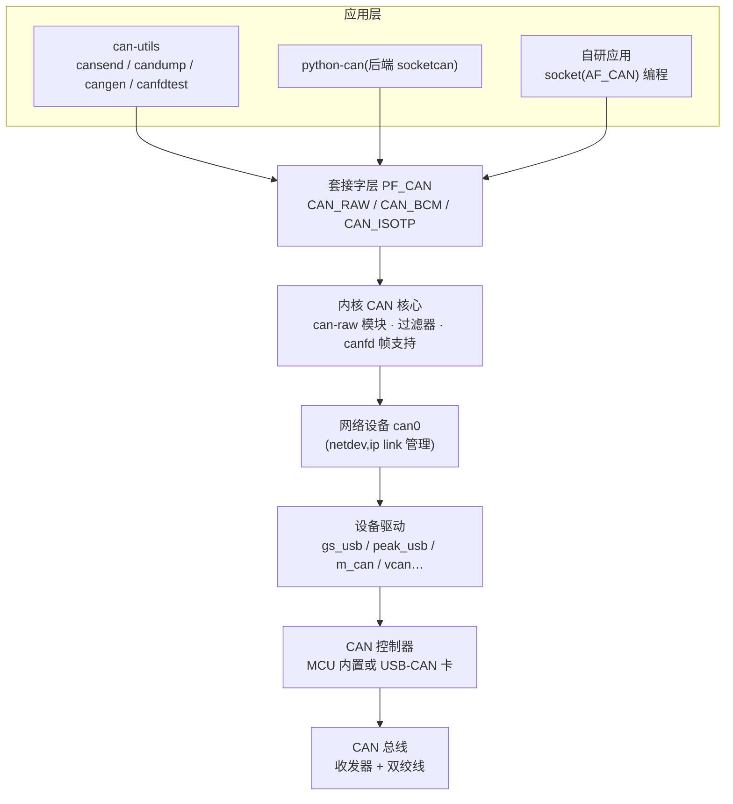
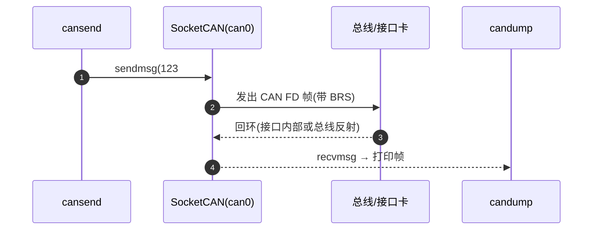
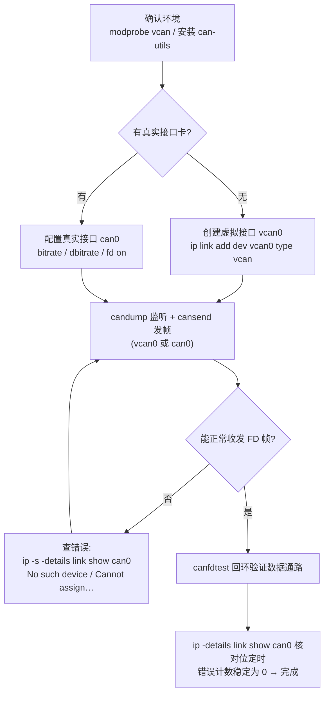

## 概述

**SocketCAN** 是 Linux 内核原生支持的 CAN 协议栈:把 CAN 控制器抽象为网络设备(`can0`、`can1`…),通过 **PF_CAN 协议族套接字**编程访问,并提供标准的配置命令(如 `ip link set can0 up type can bitrate 500000 dbitrate 5000000 fd on`)。它与 can-utils(命令行工具集)、python-can(Python 库)配合,是嵌入式 Linux 与 PC 端 CAN/CAN FD 开发的事实标准——免费、零安装成本,支持经典 CAN 与 CAN FD(含 BRS 数据相位)。

与把 CAN 当"串口"处理的传统驱动不同,SocketCAN 的抽象模型是**网络接口**:多进程共享、内核侧过滤、标准 `ip` 命令配置,天然具备网络栈能力(内核文档:SocketCAN 文档)。

## 架构分层:应用 → PF_CAN → 网络设备 → 驱动 → 控制器



| 层 | 职责 | 关键点 |
|---|---|---|
| 应用层 | `cansend`/`candump`/`cangen` 等工具、python-can 脚本、自研程序 | 只看到"接口 + 帧",不接触寄存器 |
| 套接字层 PF_CAN | 按协议类型分发帧 | `CAN_RAW` 裸收发、`CAN_BCM` 周期/变化发送、`CAN_ISOTP` 诊断传输层 |
| 内核 CAN 核心 | 帧过滤、canfd 帧格式、错误状态统计 | FD 帧(含 BRS、ESI)内核 3.6+ 原生支持 |
| 网络设备 | `can0`/`can1` 抽象,位定时与模式参数挂在这里 | `ip link`/`ip -details link` 查看与配置 |
| 驱动 → 控制器 | 把 netdev 操作映射到控制器寄存器 | gs_usb、peak_usb、m_can、vcan(虚拟)等 |

- **设备抽象**:CAN 接口作为 netdev 管理,`ip link`/`ip -details link` 查看与配置(速率、FD 使能、环回模式);虚拟接口 `vcan0` 用于零硬件练习,报文只在接口内部回环。
- **套接字类型**:`CAN_RAW`(裸收发帧)、`CAN_BCM`(广播管理,周期/变化发送)、`CAN_ISOTP`(传输层,ECU 诊断常用)。

## 接口配置:ip link 双速率与采样点

```bash
# 经典 CAN(无 FD)
sudo ip link set can0 up type can bitrate 500000

# CAN FD:仲裁 500 kbit/s + 数据 2 Mbit/s,BRS 使能
sudo ip link set can0 up type can bitrate 500000 dbitrate 2000000 fd on

# 指定采样点(内核按目标速率自动计算段配置,需要精确控制时用 sample-point)
sudo ip link set can0 up type can \
  bitrate 1000000 sample-point 75% \
  dbitrate 5000000 dsample-point 80% fd on
```

- `fd on` 使能 CAN FD;不带则接口按经典 CAN 工作(教程 05)。
- **虚拟 vcan 没有真实的位定时**,只有真实接口才需要(才能)配置速率(教程 05)。
- 更细的寄存器级控制(SocketCAN 支持显式指定每一段):

```bash
sudo ip link set can0 up type can \
  tq 62 prop-seg 4 phase-seg1 7 phase-seg2 4 sjw 1 \
  dtq 12 dprop-seg 1 dphase-seg1 12 dphase-seg2 2 dsjw 1 fd on
```

段参数(tq/prop-seg/phase-seg1/phase-seg2/sjw 与 d 前缀的数据相位版本)与[控制器寄存器与 TDC 配置](register-tdc-config.md)中的概念一一对应。

## 帧格式与收发:cansend / candump

can-utils 的报文格式:经典帧 `<id>#<数据>`;**CAN FD 帧 `<id>##<flags><数据>`**,`flags` 是 1 位十六进制,SocketCAN 中 bit0 = BRS、bit1 = ESI:

| 格式 | 含义 |
|---|---|
| `##0` | FD 帧,数据相位不切换速率(整帧跑仲裁速率) |
| `##1` | FD 帧且 **BRS 置位**(数据相位高速率) |
| `##3` | FD 帧,BRS + ESI 都置位 |

```bash
# 发一帧 8 字节 CAN FD(无 BRS)
cansend can0 123##01122334455667788

# 发一帧 8 字节 CAN FD(带 BRS,数据相位提速)
cansend can0 123##11122334455667788

# 发一帧 12 字节 CAN FD——经典 CAN 做不到的长度
cansend can0 123##0112233445566778899aabbcc

# 抓包(终端 1 持续监听)
candump can0

# 只抓 10 帧后退出
candump can0 -n 10
```

收发一帧的完整路径:



## 流量生成与压测:cangen / canbusload

```bash
# 每秒 1 帧、固定 ID 42A、长度 8、数据递增的 FD 帧
cangen vcan0 -f -g 1000 -I 42A -L 8 -D i -v

# 带 BRS 的 FD 帧流(压测数据相位)
cangen vcan0 -b -g 500 -v
```

| 参数 | 含义 |
|---|---|
| `-f` / `-b` | FD 帧 / FD 帧且 BRS 置位 |
| `-g` | 帧间隔(毫秒) |
| `-I` / `-L` / `-D` | ID / 长度 / 数据(模式) |
| `-v` | 打印已发帧 |

`canbusload` 统计总线负载率;`cansniffer` 按信号变化观察报文——`candump`+`cangen` 组合可做压力测试(词条 can-utils)。

## 回环验证:canfdtest

`canfdtest` 验证接口与收发器数据通路的连通性:同一接口上回环(loopback 模式)或两个接口对测,持续收发并校验数据一致性——是"接口与收发器通路是否正常"的最快检查,也是位定时/TDC 配置生效后验证收发的第一步。

## python-can 桥接

python-can 提供统一的 Python API(`bus.send()` / `bus.recv()`),后端可接 SocketCAN、PCAN、Vector、Kvaser、ZLG 等接口——同一套脚本既能跑 Linux 本地也能连 Windows 下的商业硬件,适合写数据分析与自动化测试脚本(词条 python-can;具体后端名与参数以官方文档为准)。

```python
import can
bus = can.Bus(interface="socketcan", channel="can0")   # Linux 走 SocketCAN 后端
msg = bus.recv()                                        # 阻塞接收一帧
print(msg.arbitration_id, msg.data)
```

## 典型调试流程(操作流程)



| 现象 | 可能原因 |
|---|---|
| `No such device` | 接口卡驱动未加载或未创建 `vcan0` |
| `Cannot assign requested address` | 接口没 `up` |
| `candump` 不显示 FD 帧内容 | 内核与 can-utils 不支持 FD;发送/接收都用 FD 帧格式(`cansend can0 123##12345678`) |
| 真实接口上频繁报错 | 位定时配置不当、无终端电阻、收发器不支持 FD——见[位定时配置实战](../../tutorials/06-bit-timing-config.md) |

## 对设计/调试的意义

- **对控制器(嵌入式)**:SocketCAN 是嵌入式工程师与 CAN FD 打交道的入口——位定时/TDC 参数、FD 模式开关、环回模式都通过接口配置;`ip -details link show can0` 的时序参数与[控制器寄存器与 TDC 配置](register-tdc-config.md)一一对应,错误计数(`ip -s -details link show can0`)可验证位定时/TDC 配置是否生效。
- **对收发器(模拟 IC)**:`canfdtest` 回环测试与 `candump` 抓帧构成收发器环回延迟、位时序正确性的快速验证手段;上位机侧的 SocketCAN 数据分析与[示波器抓帧](../tools/scope-capture.md)互为印证——软件侧看"帧对不对",示波器侧看"波形对不对"。

## 参见

- 教程:[用 SocketCAN 5 分钟跑通 CAN FD 回环](../../tutorials/05-socketcan-loopback.md)、[CAN FD 位定时配置实战](../../tutorials/06-bit-timing-config.md)
- 词条:[SocketCAN](../../glossary/socketcan.md)、[can-utils](../../glossary/can-utils.md)、[python-can](../../glossary/python-can.md)
- 工具条目:[SocketCAN](../../resources/_entries/tools-community/socketcan.md)、[can-utils](../../resources/_entries/tools-community/can-utils.md)、[python-can](../../resources/_entries/tools-community/python-can.md)、[CAN 接口卡](../../resources/_entries/tools-community/can-interface-card.md)
- 相邻子域:[控制器寄存器与 TDC 配置](register-tdc-config.md)、[总线分析工具对比](../tools/tool-comparison.md)、[DBC 报文矩阵与信号定义](dbc.md)
