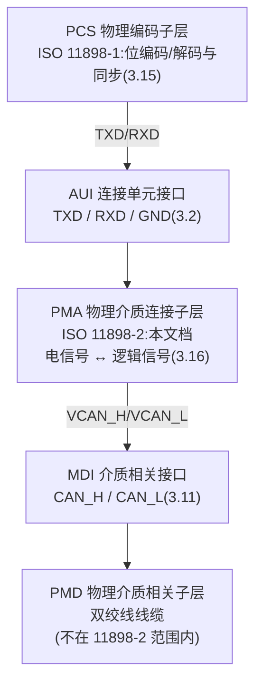
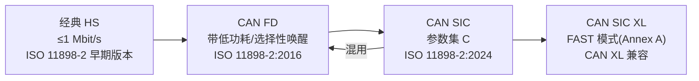
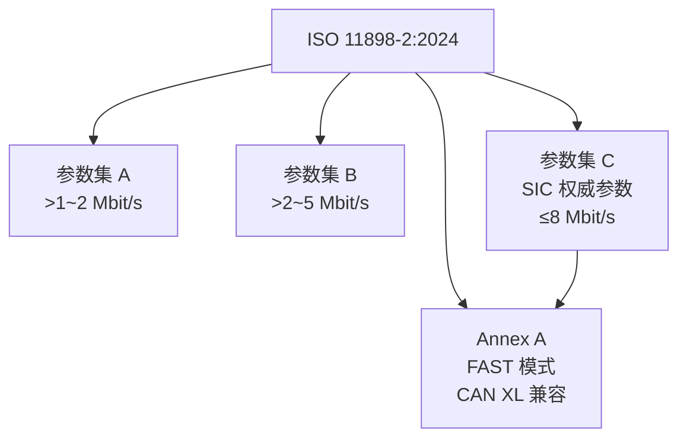

## 定义

**ISO 11898-2**(Road vehicles — CAN — Part 2: High-speed physical medium attachment (PMA) sublayer)规定 CAN **高速物理介质连接(PMA)子层**的电气要求:一个 HS-PMA 由一台发射器与一个接收实体构成,通过 CAN_H/CAN_L 双线向 PMD 子层(双绞线)驱动差分电压,并向 PCS 子层提供由 **TXD / RXD / GND** 组成的 AUI(标准 3.16、3.2、5.1 节)。它是收发器芯片设计的**权威参数来源**,与规定数据链路层+物理编码子层(PCS)的 **ISO 11898-1** 配套构成 CAN 的标准体系。

现行版 **ISO 11898-2:2024** 同时规定全部 CAN HS-PMA 选项:经典 HS、CAN FD(带低功耗/选择性唤醒)、**CAN SIC(signal improvement capability = 抑制 MDI 振铃的能力,3.21)** 与 **CAN SIC XL(FAST 模式,Annex A)**。其前身之一是 **CiA 601-4**(2023 年撤回、内容并入 ISO),建议配合 **CiA 140 勘误**阅读以规避标准中的已知图文错误。

## 关键参数

### 版本演进

| 版本 | 状态 | 内容 |
|---|---|---|
| ISO 11898-2:2016 | 已撤回 | 首次将 CAN FD 收发器纳入 ISO;合并原 ISO 11898-5(低功耗)与 -6(选择性唤醒);ISO 16845-2:2018 一致性测试针对此版 |
| ISO 11898-2:2024 | 现行 | 新增 **CAN SIC 与 CAN SIC XL(FAST 模式)**;参数集 A/B/C、振铃抑制、SIC 时序/阻抗条款 |
| ISO 11898-2:2026 | 官网现行显示 | ISO 官网现已显示 2026 版,2024 版为 CiA 文档所引用的参考版 |

### 参数集 A/B/C 与位速率

参数集 A = 旧版表 13(位速率 >1 Mbit/s 至 2 Mbit/s);参数集 B = 旧版表 14(>2 Mbit/s 至 5 Mbit/s);参数集 C 为本版新引入(SIC 权威参数)。数据信号时序见参数速查页表 15/16/17,环回延迟见表 14。

| 参数 | 符号 | 参数集 A | 参数集 B | 参数集 C |
|---|---|---|---|---|
| 适用位速率 | — | >1~2 Mbit/s | >2~5 Mbit/s | ≤8 Mbit/s(SIC) |
| 环回延迟 | tLoop | ≤255 ns | ≤255 ns | ≤190 ns |
| 发送隐性位宽变化 | t△Bit(Bus) | 未提取数值(详见原文) | -45~+10 ns | -10~+10 ns |
| 接收隐性位宽变化 | t△Bit(RXD) | 未提取数值(详见原文) | -80~+20 ns | -30~+20 ns |
| 接收时序对称性 | t△Rec | 未提取数值(详见原文) | -45~+15 ns | -20~+15 ns |
| TXD→总线传播延迟 | tprop(TXD_BUS) | 仅限环回延迟 | 仅限环回延迟 | ≤80 ns |
| 总线→RXD 传播延迟 | tprop(BUS_RXD) | 仅限环回延迟 | 仅限环回延迟 | ≤110 ns |

来源:参数速查页表 14(5.4.3 节)、表 15/16/17。注:参数集 A 对应表 15 在站内全文页中未提取出数值行,以官方正式版本为准。

### 显性/隐性电平与接收阈值(HS-PMA 基线)

| 参数 | 符号 | 最小 [V] | 典型 [V] | 最大 [V] | 条件 |
|---|---|---|---|---|---|
| 显性 CAN_H 单端电压 | VCAN_H | +2,75 | +3,5 | +4,5 | RL=50Ω 至 65Ω |
| 显性 CAN_L 单端电压 | VCAN_L | +0,5 | +1,5 | +2,25 | RL=50Ω 至 65Ω |
| 正常总线负载差分电压 | VDiff | +1,5 | +2,0 | +3,0 | RL=50Ω 至 65Ω |
| 仲裁期间有效电阻差分电压 | VDiff | +1,5 | 未定义 | +5,0 | RL=2240Ω(32 节点同时显性) |
| 隐性差分输出电压 | VDiff | -0,5 | 0 | +0,05 | 偏置激活(表 3) |
| 隐性单端输出(偏置激活) | VCAN_H/L | +2,0 | +2,5 | +3,0 | RL>1010Ω(表 3) |
| 接收:隐性态差分输入范围 | VDiff | -3,0 | — | +0,5 | -12V≤VCAN≤+12V(表 7) |
| 接收:显性态差分输入范围 | VDiff | +0,9 | — | +8,0 | 同上(表 7) |

来源:参数速查页表 3(5.3.2)、表 5(5.3.4)、表 7(5.3.6)。表 5 注:最大 R 按 70Ω 假设,2240Ω 对应 32 节点网络(2240Ω/70Ω=32),即最多 32 个节点同时发送显性时单节点驱动负载变小的情况。

### SIC 模式核心参数(表 18 与表 A.12)

| 参数 | 符号 | 最小 | 最大 | 来源 |
|---|---|---|---|---|
| 差分内部电阻(显性→隐性转换后) | RDIFF_act_rec | 75Ω | 133Ω | 表 18 |
| 可选:单端内部电阻 | RSE_SIC_act_rec | 37,5Ω | 66,5Ω | 表 18 |
| 主动信号改善阶段开始时间 | tact_rec_start | n.a. | 120 ns | 表 18 |
| 主动信号改善阶段结束时间 | tact_rec_end | 355 ns | n.a. | 表 18 |
| 被动隐性阶段开始时间 | tpas_rec_start | n.a. | 530 ns | 表 18 |
| 信号改善时间(表 A.12) | tsic | +300 ns | +530 ns | 表 A.12 |

## 工作原理/机制

### ISO 11898-2 在物理层分层中的位置

HS-PMA 的职责(5.1 节):偏置所连接的双绞线介质(相对公共地);发射器驱动 CAN_H 与 CAN_L 之间的差分电压表示逻辑 0(显性),或**不驱动差分电压**表示逻辑 1(隐性)。SIC 能力(3.21)即"抑制 MDI 上振铃的能力",按参数集 C(表 14 与表 17)规定。

### HS-PMA 各选项与演进

- 经典 HS 支撑 ≤1 Mbit/s;CAN FD 以更严格的延迟对称性支撑 >1 Mbit/s 数据相位;SIC 增加振铃抑制、受控沿整形与更紧的时序对称性,支撑 5 Mbit/s(器件可至 8 Mbit/s)与更大拓扑;SIC XL(Annex A/FAST 模式)面向 CAN XL 网络。
- SIC 收发器与 CAN FD、HS-CAN 收发器可同总线混用(混用互操作性,详见[SLLA581 白皮书](../../resources/full-text/slla581-white-paper.md))。

### 参数集与工作模式组合

工作模式组合(参数速查页表 A.1,Annex A 规范性):

| 工作模式 | 电压偏置状态 | 发送器状态 | 接收器状态 |
|---|---|---|---|
| SIC 模式 | 电压偏置激活 | 显性或隐性 | 显性或隐性 |
| FAST TX 模式 | 电压偏置激活 | level_0 或 level_1 | level_0 或 level_1 |
| FAST RX 模式 | 电压偏置激活 | 被动隐性 | level_0 或 level_1 |

FAST 模式把 NRZ 位流经 PWM 编码/解码(PWME/PWMD,3.17/3.18)传输:FAST TX 驱动电平 level_0/level_1(不可互相覆盖),FAST RX 调整接收阈值区分两种电平;SIC 模式仍按显性/隐性仲裁。模式预选时序(表 A.15):PWM 符号接受长度 tsymbolNom 45~205 ns,FAST→SIC 切换 tFastToSIC 210~245 ns。

## 对收发器设计的意义

- **这是 SIC 收发器设计的"金标准"**:共模/差分输出、上升/下降沿整形、SIC 阻抗切换窗口(tact_rec_start ≤120 ns、tact_rec_end ≥355 ns、tpas_rec_start ≤530 ns)、环回延迟(≤190 ns)与 EMC 特性全部由此标准定义,流片后的一致性认证也以它为准绳。
- **按"经典 HS → CAN FD → CAN SIC → SIC XL"顺序理解演进**:先满足表 5 显性输出与表 12 驱动对称性(Vsym_vcc、Vsym_vrec 均为 +0,9/+1,0/+1,1),再落实表 18 的 SIC 三态阻抗与窗口,最后按 Annex A 增加 FAST 模式电平(表 A.4:level_0/level_1 差分电压 ±0,60~±1,50 V)与 PWM 解码逻辑。
- **设计落地对照**:NXP TJA1463 数据手册把 ISO 参数与厂商参数做了逐条交叉引用(如 ISO RDIFF_act_rec ↔ NXP Ri(dif)actrec 75~125Ω、tact_rec_start ↔ td(TXD-busactrec)start 70~120 ns),是"标准参数 → 芯片规格"映射的现成教材;设计要点详见[SIC 设计专题·设计篇](../sic-design/design.md)。
- **对控制器(嵌入式)**:BRS 数据相位的相位裕度与位不对称直接受 11898-2 参数集约束——理解"为什么 5 Mbit/s 需要 SIC 收发器",是配置采样点与 TDC 的前提(见[收发器延迟补偿(TDC/SSP)](../bit-timing/tdc.md))。

## 常见误区

- **误区一:"ISO 11898-2 有独立的回波损耗数值表"** —— 本版全文未给出独立的"回波损耗"参数表;相关要求通过接收输入电阻(表 9/10:RDIFF_pas_rec 12~100 kΩ、mR ±0,03)、SIC 阻抗(表 18:RDIFF_act_rec 75~133Ω)与驱动对称性(表 12)体现,详见[回波损耗与 EMC](return-loss-emc.md)。
- **误区二:参数集 A 的数值可直接查到** —— 参数速查页明确标注表 15(参数集 A)在站内全文未提取出数值行,引用时以官方正式版本为准。
- **误区三:FAST 模式仍是显性/隐性电平** —— FAST TX 模式使用 level_0/level_1 电平(表 A.4),二者不可互相覆盖,不再是"显性覆盖隐性"的仲裁语义;SIC 模式才保留显性/隐性仲裁。
- **误区四:CiA 601-4 仍有效** —— CiA 601-4(2019,SIC 原始规范)已于 2023 年撤回、内容并入 ISO 11898-2:2024;2024 前发布的 SIC 器件按 CiA 601-4 合规,新设计按 ISO 11898-2:2024。

## 参见

- 标准规范(内容来源):[ISO 11898-2:2024 关键参数速查](../../resources/standards-text/iso-11898-2-2024-key-parameters.md)、[ISO 11898-2:2024 全文](../../resources/standards-text/iso-11898-2-2024-full.md)、[ISO 11898-2 (2024) 条目](../../resources/_entries/standards/iso-11898-2-2024.md)、[CiA 140(勘误)](../../resources/_entries/standards/cia-140-corrigendum.md)
- 词条:[ISO 11898-2](../../glossary/iso-11898-2.md)、[CAN SIC](../../glossary/can-sic.md)、[收发器](../../glossary/transceiver.md)、[显性/隐性电平](../../glossary/dominant-recessive-levels.md)、[共模范围](../../glossary/common-mode-range.md)
- 教程:[SIC 是什么:CAN FD 收发器的信号改善能力](../../tutorials/07-what-is-sic.md)、[收发器传播延迟对称性](../../tutorials/09-delay-symmetry.md)
- 相邻子域:[振铃抑制:SIC 核心能力](ringing-suppression.md)、[回波损耗与 EMC](return-loss-emc.md)、[SIC 设计专题·原理篇](../sic-design/principle.md)、[SIC 设计专题·设计篇](../sic-design/design.md)
