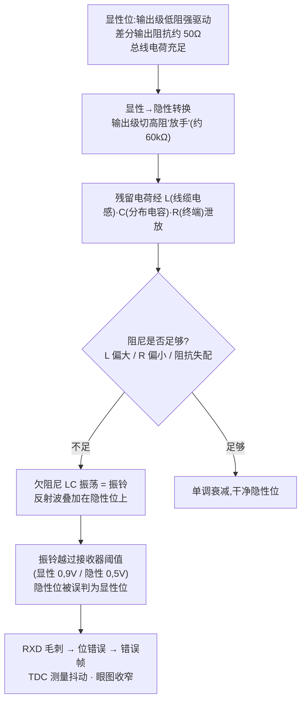
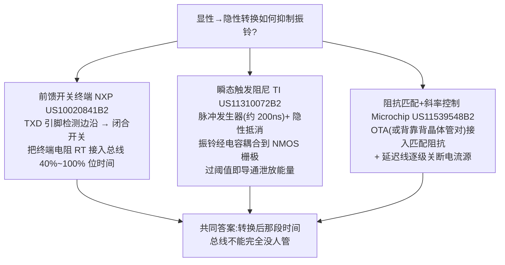
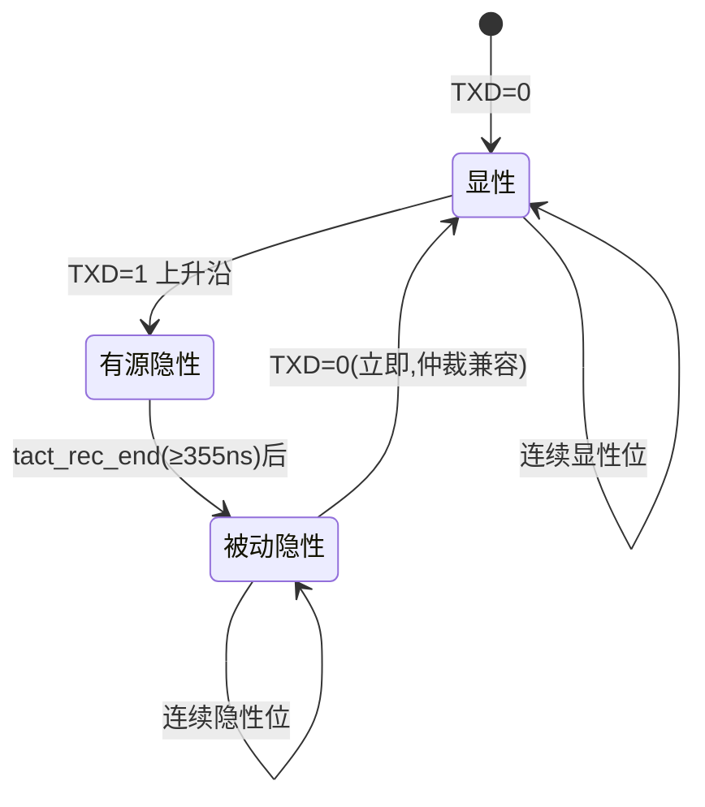

## 定义

**振铃抑制(Ringing Suppression)** 是 CAN SIC 收发器在**显性→隐性转换**后对总线差分/共模振铃进行主动抑制的能力,是 SIC 与普通 CAN FD 收发器在波形层面最直观的区别。ISO 11898-2:2024 将其形式化为 SIC(signal improvement capability,3.21:抑制 MDI 振铃的能力):SIC 模式期间,在**信号改善时间内**,线束反射引起的潜在差分扰动被减小(Annex A.1);要求源头可追溯到 CiA 601-4(SIC 前身规范)与厂商专利。

**机理**:总线物理上是"线缆电感 L + 分布电容 C + 终端电阻 R"构成的 RLC 网络。显性位时输出级低阻强驱动(差分输出阻抗约 50 Ω,与网络特征阻抗接近);显性→隐性转换时输出级切到高阻(约 60 kΩ)"放手",反射波遇到巨大阻抗突变,残留电荷经 L-C-R 欠阻尼放电形成振荡——即振铃(SLLA581 第 3 节)。阻抗失配(桩线、非理想终端、星型节点)会放大它。

## 关键参数

### 振铃抑制窗口:SIC 时序与阻抗(表 18,5.4.3 节)

| 参数 | 符号 | 最小 | 最大 | 含义 |
|---|---|---|---|---|
| 主动信号改善阶段开始时间 | tact_rec_start | n.a. | 120 ns | 从上升 TXD 边沿(50% 阈值处斜率 <5ns)起,有源隐性驱动必须开始 |
| 主动信号改善阶段结束时间 | tact_rec_end | 355 ns | n.a. | 有源隐性驱动至少持续到此刻 |
| 被动隐性阶段开始时间 | tpas_rec_start | n.a. | 530 ns | 此后可回到标称阻抗的被动隐性 |
| 差分内部电阻(CAN_H 到 CAN_L) | RDIFF_act_rec | 75Ω | 133Ω | 有源隐性期差分阻抗范围 |
| 可选:单端内部电阻 | RSE_SIC_act_rec | 37,5Ω | 66,5Ω | 同上(单端) |

### 信号改善时间与位宽偏差(表 A.12,A.3 节)

| 参数 | 符号 | 最小 [ns] | 最大 [ns] | 备注 |
|---|---|---|---|---|
| 信号改善时间 | tsic | +300 | +530 | 从 TXD 上升沿到信号改善阶段结束 |
| 发送位宽变化 | t△Bit(Bus) | -10 | +10 | 总线隐性位长相对 TXD 位长 |
| 接收位宽变化 | t△Bit(RXD) | -30 | +20 | RXD 隐性位长相对 TXD 位长 |
| 接收时序对称性 | t△REC | -20 | +15 | RXD 隐性位长相对总线位长 |

### 信息性说明(Annex B.1)

实现振铃抑制电路时,差分内部电阻在显性→隐性边沿后的**一个位宽区间 [tBit(Bus)] 内典型为 100 Ω**——这是标准对"阻尼阻抗量级"的官方提示。

### 选择性唤醒对振铃的容忍(5.5.5.3)

接收信号须符合信号形状 A/B:n₁ 个连续显性位(n₁∈{1,2,3,4,5}),tA 0≤tA≤55% 的 tBit,tB 0≤tB≤5% 的 tBit(实现可允许更高最大值);发送器时钟频率偏差容差至少 0,5%。形状 A 即为"处理振铃"的信号模板——隐性位开头允许出现受控的振铃形态,只要边沿落在 n₁×tBit−tB 到 n₁×tBit+tA 之外就不算解码错误。

## 工作原理/机制

### 振铃的产生:显性→隐性转换后的欠阻尼放电

普通 CAN FD 收发器按 ISO 11898-2:2016 设计,对此过程不做主动干预——2 Mbit/s 以内位时间长(500 ns)、采样点后置,振铃来得及衰减;5 Mbit/s(位时间 200 ns)时振铃还没衰减完采样点就到了(SLLA581 第 2 节:200 ns 位时间对复杂星型拓扑的振铃衰减而言太小)。

### SIC 的振铃抑制:三态阻抗与信号改善窗口

SIC 在显性→隐性转换后不再"完全放手":先以低于标称阻抗的**主动隐性(active recessive,3.1:以专用低阻抗、持续专用时长的中间驱动级)**拉着总线向隐性放电——反射波看到的是接近匹配的阻抗,振铃被大幅衰减;窗口结束后回到**被动隐性(passive recessive,3.14:标称阻抗)**。表 18 的四个时序/阻抗参数(≤120 ns / ≥355 ns / ≤530 ns / 75~133Ω)与表 A.12 的 tsic(+300/+530 ns)共同定义了这个窗口。5 Mbit/s 数据相位位时间 200 ns,振铃抑制覆盖整个隐性位;仲裁相位(1 Mbit/s,位时间 1 µs)多位同时发送时显性位必须能覆盖隐性位,因此振铃抑制时长会限制仲裁速率与网络长度(SLLA581 第 3 节)。

### 三类典型电路方案

| 方案 | 代表专利 | 思路 | 特点 |
|---|---|---|---|
| **前馈开关终端** | NXP [US10020841B2](../../resources/full-text/us10020841b2-feedforward.md) | 边沿检测器监测 TXD,检测到显性→隐性下降沿即闭合与终端电阻 RT 串联的开关,把 RT 接入 CANH-CANL 一段设定时间(数据相位位时间的 40%~100%,示例 90% ≈ 400 ns @2 Mbit/s);检测到下一个隐性→显性边沿即打开 | 不需要感知总线波形,响应快、抗噪声误触发;仲裁期间多个发送者同时闭合会使总线电压短暂未定义,但时长小于仲裁位时间的 25%,采样点(50%~80% tBit)之前已恢复 |
| **瞬态触发阻尼** | TI [US11310072B2](../../resources/full-text/us11310072b2-ring-suppression.md) | 脉冲发生器在 TXD 0→1 跳变时输出(示例 200 ns,固定或可编程)驱动隐性抵消电路(M7-M12)把内部节点拉到 VCM;同时瞬态触发电路 SW1/R1/C1/M21(CANH 侧)与 SW2/R2/C2/M22(CANL 侧)使能:振铃经 C 耦合到 NMOS 栅极,幅度过阈值即导通泄放,栅极经 R 放电后自动关断 | "电平检测 + 自动阻尼",无需精确计时、对 PVT 鲁棒;耦合电容取值(过阈值但不误触发)与泄放管尺寸是设计关键 |
| **阻抗匹配+斜率控制** | Microchip [US11539548B2](../../resources/full-text/us11539548b2-microchip-sic.md) | 阻抗匹配单元只在显性→隐性转换期间及之后短时(V_WINDOW 窗口)接入总线:差分输入/差分输出 OTA(gm 理想 = 1/总线特征阻抗,增益随差分输入增大而下降以防驱动节点过载)或背靠背 Ron 受控晶体管对(总 Ron = 总线特征阻抗,带温度补偿);另用串联延迟线逐级关断并联电流源做分段斜率控制 | 匹配阻抗可在线成形、全温稳定;窗口外零额外直流损耗;斜率控制不改变总线差分阻抗,是另一条独立抑制路径 |

### 输出级状态机(设计视角)

关键约束:TXD 变 LOW 时总线须**立即**切回显性(显性必须能覆盖有源隐性,仲裁兼容);有源→被动切换须 **glitch-free**(无毛刺阻抗切换)。

## 对收发器设计的意义

- **输出级三态阻抗是 SIC 设计的核心**:有源隐性阻抗必须落在 RDIFF_act_rec 75~133Ω——太低过度加载总线(影响仲裁、增加功耗),太高起不到阻尼作用;通常由并联的辅助驱动支路实现并**可编程/校准**以覆盖 PVT(TJA1463 实测:Ri(dif)actrec 75~125Ω,Ri(actrec) 37,5~60Ω)。
- **窗口时序须可调**:NXP TJA1463 实测窗口为 td(TXD-busactrec)start 70~120 ns、td(TXD-busactrec)end 355~480 ns、td(TXD-buspasrec)start 415~530 ns——短桩网络窗口可短、长网络需长,寄存器可编程微调;边沿检测要抗抖、抗毛刺。
- **与仲裁兼容**:多位同时驱动时有源隐性必须能被显性覆盖;TXD 显性超时保护(tdom 0,80~6,0 ms,表 A.10)防止 TXD 卡死拉死总线。
- **开关导通电阻/寄生电容要纳入终端匹配设计**(前馈方案);瞬态触发方案的耦合电容与泄放管尺寸、阻抗匹配方案的 OTA 增益压缩点(被动防过载)是各自的设计关键。
- 系统侧:采样点配置(5 Mbit/s 推荐约 55%)与 SSP 设置必须与正常采样点一致,与振铃抑制互补(见[SIC 设计专题·原理篇](../sic-design/principle.md))。

## 常见误区

- **误区一:"有源隐性 = 一直低阻驱动"** —— 有源隐性只在信号改善窗口内(表 18:tact_rec_end ≥355 ns 至 tpas_rec_start ≤530 ns)以 75~133Ω 驱动,窗口结束后必须回到标称阻抗的被动隐性,否则多节点仲裁会被破坏。
- **误区二:"振铃抑制只关心差分电压"** —— ISO 11898-2 5.3.6 的 NOTE 明确:连接共模扼流圈和/或未端接桩线的介质上会**暂时出现负差分电压**,接收器必须容忍;抑制电路同时要处理共模路径。
- **误区三:"采样点后置就能解决一切"** —— 采样点后置只是"避开振铃",SIC 是"压掉振铃";两者互补但不可互相替代,5 Mbit/s 下 200 ns 位时间没有足够的后置空间。
- **误区四:用单端探头测振铃** —— 单端探头会被共模淹没,必须用差分探头跨接 CANH/CANL,触发设在显性→隐性下降沿。

## 参见

- 标准规范(内容来源):[ISO 11898-2:2024 关键参数速查](../../resources/standards-text/iso-11898-2-2024-key-parameters.md)、[ISO 11898-2:2024 全文](../../resources/standards-text/iso-11898-2-2024-full.md)
- 专利全文(内容来源):[US10020841B2 前馈振铃抑制](../../resources/full-text/us10020841b2-feedforward.md)、[US11310072B2 瞬态触发振铃抑制](../../resources/full-text/us11310072b2-ring-suppression.md)、[US11539548B2 阻抗匹配+斜率控制](../../resources/full-text/us11539548b2-microchip-sic.md)
- 厂商资料:[NXP TJA1463 数据手册全文](../../resources/full-text/tja1463-datasheet.md)、[TI SLLA581 白皮书全文](../../resources/full-text/slla581-white-paper.md)
- 教程:[振铃抑制原理与测量:从波形看懂 SIC](../../tutorials/08-ringing-suppression.md)、[SIC 是什么](../../tutorials/07-what-is-sic.md)
- 词条:[振铃抑制](../../glossary/ringing-suppression.md)、[CAN SIC](../../glossary/can-sic.md)、[回波损耗](../../glossary/return-loss.md)、[总线终端](../../glossary/bus-termination.md)
- 相邻子域:[SIC 设计专题·原理篇](../sic-design/principle.md)、[SIC 设计专题·设计篇](../sic-design/design.md)、[输出级:差分驱动与显性/隐性电平](../transceiver-design/output-stage.md)、[回波损耗与 EMC](return-loss-emc.md)
