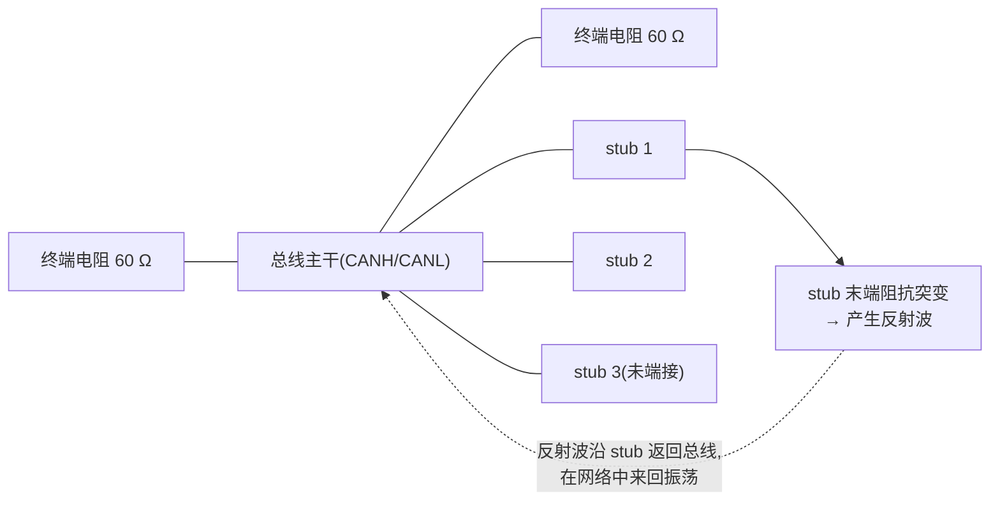
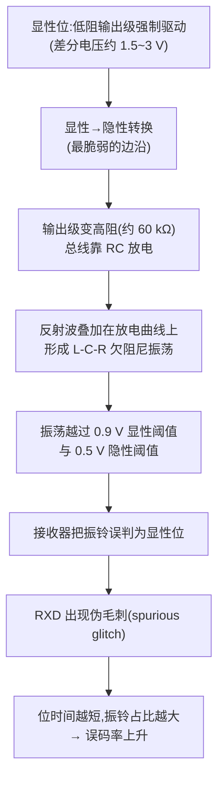
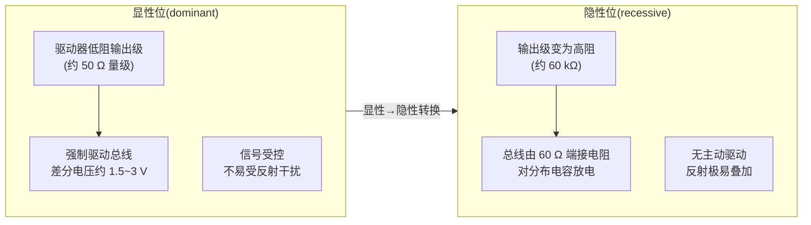
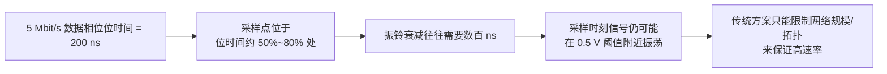
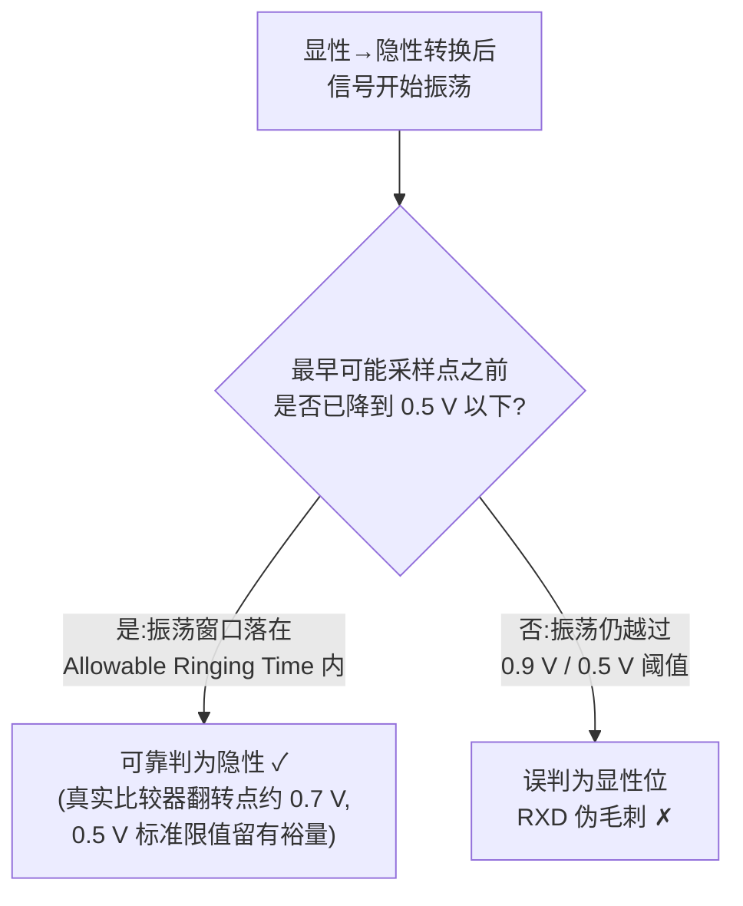
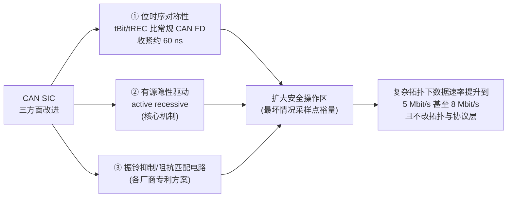
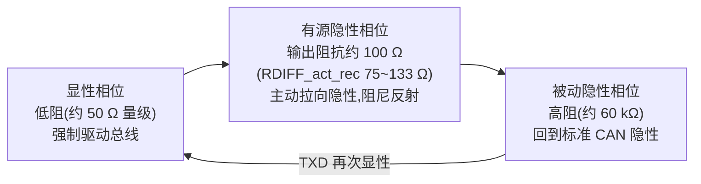
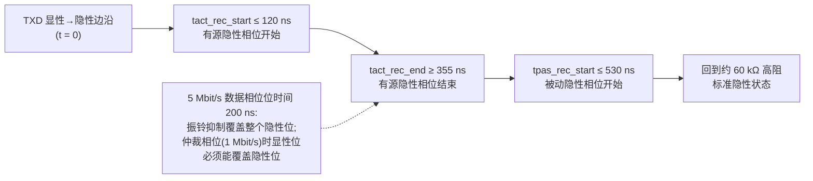
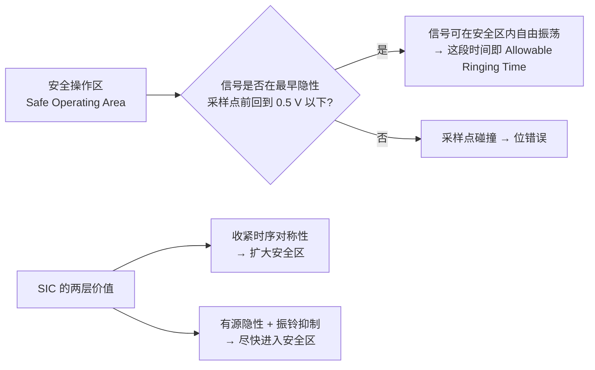
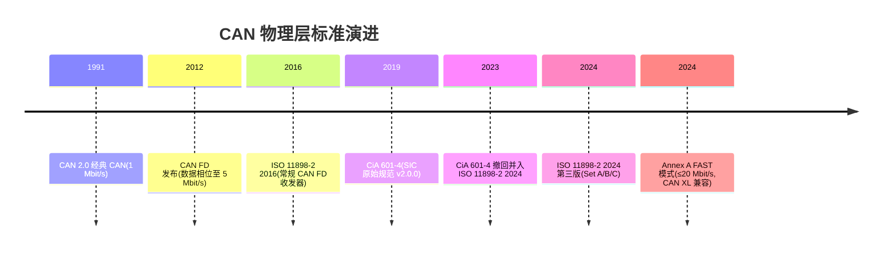

# SIC 原理:振铃机理与信号改善机制

> 本篇为 SIC 设计专题·**原理篇**,配套[设计篇](design.md)与[测试篇](testing.md)。本篇从"为什么需要 SIC"出发,讲清振铃的物理机理、SIC 的三方面改进、关键电气参数与系统级概念。
> 所有数值均提取自已下载的原始资料(TI SLLA581 白皮书、NXP TJA1463 数据手册、Adamson 2020 iCC 论文),详见文末[引用清单](#6-参考资料已下载按优先级)。

---

## 1. 为什么需要 SIC:CAN FD 的高速瓶颈

### 1.1 背景:星型拓扑与 stub 反射

CAN 网络最大的优势是**易扩展**——往总线上挂节点即可。但网络复杂化后(如星型拓扑),未端接的 stub(短桩线)成为反射源:信号到达 stub 末端阻抗突变点会产生反射,反射波在网络中来回振荡,叠加在有用信号上形成**振铃(ringing)**。

- 常规 CAN FD 收发器虽然额定支持 5 Mbit/s,但**在真实车载网络中通常只能用到 <2 Mbit/s**(SLLA581 明确说明)。
- 原因是 5 Mbit/s 数据相位位时间仅 200 ns,振铃在采样点前无法衰减干净,导致 RXD 出现毛刺(glitch)。

> 上图:星型拓扑中未端接的 stub 末端是阻抗突变点,入射信号在此反射,反射波沿 stub 回到总线、在网络中来回振荡,叠加在有用信号上形成振铃;stub 越长、数量越多,振荡越持久,振铃越难在采样点前衰减干净。

### 1.2 振铃造成的直接后果

以 SLLA581 的 Figure 1-1/1-2 为例(波形描述):

- 总线差分电压 VOD(CANH − CANL)在显性→隐性转换后**振荡越过 900 mV(显性阈值)和 500 mV(隐性阈值)**;
- 接收器把振铃误判为显性位 → RXD 上出现**伪毛刺(spurious glitches)**;
- 数据相位速率越高,位时间越短,振铃占位时间的比例越大,误码率越高。

**CAN SIC 的目标**:在复杂拓扑(星型、多 stub)下把可用数据速率提升到 5 Mbit/s 甚至 8 Mbit/s,且**不需要改动网络拓扑或协议层**。

---

## 2. 振铃的物理机理(设计前必须理解)

> 振铃的完整因果链:显性→隐性转换后总线进入"无源放电"状态,反射波与线缆分布电感、电容构成欠阻尼振荡(L-C-R),振幅足以反复穿越 0.9 V/0.5 V 阈值,接收器将其误判为显性位,在 RXD 上产生伪毛刺;数据相位速率越高、位时间越短,振铃占位时间比例越大,误码率越高。

### 2.1 为什么隐性位最脆弱

- **显性位(dominant)**:驱动器以低阻输出级强制驱动总线,差分电压约 1.5~3 V(显性),信号受控,不易受反射干扰。
- **隐性位(recessive)**:驱动器输出级变为**高阻(约 60 kΩ)**,总线状态由 60 Ω 端接电阻把分布电容放电决定——总线信号本质上是"靠网络自己放电",没有主动驱动。
- 因此**显性→隐性转换是最脆弱的边沿**:任何反射都会叠加在这个放电过程上,而放电时间常数(RC)取决于线缆长度、stub、端接。

> 对比:显性位由驱动器低阻强制驱动,信号受控、不易受反射干扰;隐性位则完全"靠网络自己放电",没有主动驱动——因此显性→隐性转换是最脆弱的边沿,任何反射都叠加在 RC 放电曲线上,而放电时间常数取决于线缆长度、stub 与端接。

### 2.2 RC 放电与位时间的矛盾

- 隐性电平恢复速度受限于总线 RC 时间常数;stub 越长、节点越多,等效电容越大,放电越慢。
- 5 Mbit/s 数据相位位时间 200 ns,而振铃衰减往往需要数百 ns → 在采样点(约 50~80% 位时间处)信号仍可能在 0.5 V 阈值附近振荡。
- **结论**:传统方案只能靠"限制网络规模/拓扑"来保证高速率,而 SIC 通过**主动改善信号**来打破这个限制。

> 时间矛盾一图可见:200 ns 的位时间"装不下"数百 ns 的振铃衰减,采样点(约 50~80% 位时间处)的信号仍可能停在 0.5 V 阈值附近振荡。SIC 的破局思路是主动改善信号,而不是限制网络。

### 2.3 接收器阈值(判断振铃是否致命的标尺)

| 电平 | 含义 |
|------|------|
| 0.9 V | 显性→隐性判定阈值(高于判定显性) |
| 0.5 V | 隐性判定阈值(必须低于此值才算可靠隐性) |
| ~0.7 V | 实际接收器比较器典型翻转点(数据手册的 0.5 V 是标准形式化限值,真实实现通常约 0.7 V,留有安全裕量——Adamson 2020) |

**判据**:隐性位信号必须在**最早可能采样点之前**降到 0.5 V 以下;这段可允许的振荡时间被称为 **Allowable Ringing Time**(Adamson 2020)。

> 判定标尺:隐性位信号必须在最早可能采样点之前降到 0.5 V 以下,这段可允许的振荡时间就是 Allowable Ringing Time。真实接收器比较器翻转点通常在约 0.7 V,为 0.5 V 的标准形式化限值留出安全裕量(Adamson 2020)。

---

## 3. SIC 的定义与三方面改进

### 3.1 定义与标准归属

> CAN SIC 是在 CAN FD 收发器上增加的信号改善能力,通过**减小信号振铃**提升复杂拓扑下的最大数据速率。
> 最早标准化于 **CiA 601-4**(signal improvement 规范,2019 v2.0.0);2023 年 601-4 撤回,内容并入 **ISO 11898-2:2024** 第三版(参数集 Set A/B/C);2024 版 Annex A 进一步引入 FAST 模式与 CAN XL 兼容。

> SIC 三方面改进协同作用:时序对称性"扩大安全操作区",有源隐性驱动与振铃抑制电路"尽快压振铃、进入安全区",共同把复杂拓扑下的可用数据速率推高到 5~8 Mbit/s,且不需要改动网络拓扑或协议层。以下 3.2~3.4 分别展开。

### 3.2 改进一:更紧的位时序对称性(timing symmetry)

SIC 收发器的位宽偏差(bit-width deviation)比常规 CAN FD 收紧了约 **60 ns**(Adamson 2020),这是数据速率上限突破的关键:

| 参数 | 符号 | CiA 601-4 / ISO 11898-2:2024 Set C | ISO 11898-2:2016(常规 CAN FD) |
|------|------|-------------------------------------|-------------------------------|
| 发送隐性位宽偏差 | tBit(Bus) | **−10 ~ +10 ns**(速率无关) | 2 Mbps:−65 ~ +30 ns;5 Mbps:−45 ~ +10 ns |
| 接收位宽偏差 | tBit(RxD) | **−30 ~ +20 ns** | 2 Mbps:−100 ~ +50 ns;5 Mbps:−80 ~ +20 ns |
| 接收时序对称性 | tREC | **−20 ~ +15 ns** | 2 Mbps:−65 ~ +40 ns;5 Mbps:−45 ~ +15 ns |
| 环回延迟 | tLoop | **≤190 ns**(SIC) | **≤255 ns**(CAN FD) |

> 来源:SLLA581 Table 1-1 与 "Benefits of CAN SIC" 章节。对称性改善使最坏情况采样点碰撞(见 Adamson Figure 3)的理论速率上限从 ~6 Mbps 提升到远超 8 Mbps(仅考虑对称性、点对点)。

### 3.3 改进二:有源隐性驱动(active recessive)——SIC 的核心机制

SIC 收发器在显性→隐性转换后,不是立刻进入高阻,而是先进入一段**有源隐性(active recessive)相位**:

1. **显性相位**:输出级低阻(约 50 Ω 量级)强制驱动,总线为显性。
2. **有源隐性相位(active recessive)**:转换后,输出阻抗降到约 **100 Ω**,主动"拉着"总线向隐性放电——反射波遇到低阻看到的是近似匹配阻抗,振铃被大幅衰减;信号被快速拉到 0.5 V 以下。
3. **被动隐性相位(passive recessive)**:有源相位结束后,输出阻抗升回约 **60 kΩ**,回到标准 CAN 的高阻隐性状态(保证多节点共享总线、显性优先级仲裁不受影响)。

*图 2:显性 → 有源隐性 → 被动隐性三相位时序(与下面的 Mermaid 循环图对应)*

> 三相位循环(与上面的 ASCII 时序图对应):显性→有源隐性→被动隐性。有源隐性相位以约 100 Ω 的中等阻抗主动放电,反射波看到近似匹配阻抗而被大幅衰减,信号被快速拉到 0.5 V 以下;有源相位结束后升回约 60 kΩ 高阻,保证多节点共享总线、显性优先仲裁不受影响。

**关键时序窗口**(ISO 11898-2:2024 Set C,见 SLLA581 Table 1-2 / TJA1463 数据手册):

| 参数 | 符号 | 规格 |
|------|------|------|
| 有源信号改善相位开始时间 | tact_rec_start | ≤ 120 ns |
| 有源信号改善相位结束时间 | tact_rec_end | ≥ 355 ns |
| 被动隐性相位开始时间 | tpas_rec_start | ≤ 530 ns |
| 有源隐性相位差分内部电阻(CANH−CANL) | RDIFF_act_rec | **75 ~ 133 Ω** |

> 注意:5 Mbit/s 数据相位位时间 200 ns,振铃抑制覆盖整个隐性位;而仲裁相位(1 Mbit/s,位时间 1 µs)多位同时发送时,显性位必须能覆盖隐性位,因此振铃抑制时长会限制仲裁速率与网络长度(见 CiA 601-4 细节,SLLA581 已提示)。

> SIC 窗口时间轴(ISO 11898-2:2024 Set C):有源隐性最迟 120 ns 开始、至少持续到 355 ns、530 ns 内切回被动隐性。数据相位 200 ns 的位时间内振铃抑制全程有效;而仲裁相位(1 Mbit/s、位时间 1 µs)多位同时发送时,显性位必须能覆盖隐性位,因此振铃抑制时长会限制仲裁速率与网络长度。

### 3.4 改进三:振铃抑制/阻抗匹配电路

各厂商在有源隐性基础上,还会加专门的**振铃抑制电路**来加速衰减:
- 显性→隐性转换瞬间并联低阻通路加速放电(recessive nulling,TI);
- 瞬态触发式阻尼:检测到振铃峰值即导通泄放管(TI);
- 阻抗匹配单元 + 分段斜率控制(Microchip);
- 前馈式振铃抑制(NXP);
- 振荡抑制单元(Bosch)。
(实现细节与专利对照见[设计篇](design.md)。)

---

## 4. 系统级概念(理解 SIC 价值的关键)

### 4.1 Safe Operating Area(安全操作区)与 Allowable Ringing Time

- Adamson 2017 提出 "Corrected Sample Point",即考虑所有最坏情况不对称后,信号必须保持的**安全操作区**;
- 在安全操作区内,信号可以自由振荡,**只要在最早隐性采样点前回到 0.5 V 以下**——这段允许时间就是 Allowable Ringing Time;
- SIC 的价值体现在两个层面:**收紧对称性(扩大安全区)+ 快速压振铃(尽快进入安全区)**。

> 安全操作区(Adamson 2017 的 "Corrected Sample Point" 概念)是考虑所有最坏情况不对称后,信号必须保持的区域:区内信号可以自由振荡,只要在最早隐性采样点前回到 0.5 V 以下——这段允许时间就是 Allowable Ringing Time。SIC 的价值正是"扩大安全区"与"尽快进入安全区"双管齐下。

### 4.2 拓扑经验法则(Adamson 2020,经客户实测验证)

> **HS-CAN 500 kbps 能工作的网络 → CAN SIC 2 Mbps 也能工作;
> HS-CAN 2 Mbps 能工作的网络 → CAN SIC 5 Mbps 也能工作。**

依据:HS-CAN 500 kbps 与 SIC 2 Mbps 的 Allowable Ringing Time 相当;HS-CAN 2 Mbps 与 SIC 5 Mbps 相当。

### 4.3 采样点选择

- **2 Mbps**:采样点宜靠后(70~80%),给振铃最多衰减时间;
- **5 Mbps**:采样点宜回中(推荐 **50% + 1 tq ≈ 55%**),为抖动与 PCB 效应留裕量;
- **⚠️ Secondary Sample Point(SSP)必须与正常采样点设置一致**——5 Mbps 时 SSP 设错是 CAN FD 网络支持案例中的常见隐患(Adamson 2020 明确指出)。

### 4.4 线缆(CiA 601-6)

- 线缆阻抗应在 **110~140 Ω** 之间;
- **PVC 绝缘线缆不满足要求**(阻抗温度敏感性 + 传播延迟大),会放大振铃;SIC 的紧对称性与快速隐性边沿对劣质线缆有一定补偿,但仍建议温漂实测。

---

## 5. 标准演进与兼容性全景

*图 6:CiA 601-4 并入 ISO 11898-2:2024,参数集 Set A/B/C 与 Annex A*

> 标准演进时间线:从经典 CAN 2.0 到 CAN FD,再到 2019 年 CiA 601-4 首次标准化 SIC(signal improvement 规范 v2.0.0);2023 年 601-4 撤回后内容并入 ISO 11898-2:2024 第三版(参数集 Set A/B/C),2024 版 Annex A 进一步引入 FAST 模式(≤20 Mbit/s)与 CAN XL 兼容,SIC 向后兼容。

- **互操作**:CAN SIC 收发器与 CAN FD、HS-CAN 收发器可同总线混用(SLLA581 确认);
- **SIC vs SIC XL**:SIC 面向 ≤5/8 Mbit/s;SIC XL(Annex A/FAST)面向 CAN XL 网络 ≤20 Mbit/s,详见专题内 [CNL2023-1 Infineon SIC vs SIC XL](../../files/sic-design/CNL2023-1_Infineon_SIC_vs_SIC_XL.pdf);
- **数据速率收益**:2→5 Mbps 吞吐提升约 43%(64 字节载荷);5→8 Mbps 仅 19%——这是为什么业界把下一个跳跃投向 CAN XL(Adamson 2020)。

---

## 6. 参考资料(已下载,按优先级)

| 资料 | 位置 | 用途 |
|------|------|------|
| TI SLLA581A SIC 白皮书(原理+实测波形) | [站内条目](../../resources/_entries/vendors/ti-slla581.md)、[本地 PDF](../../files/vendors/TI_SLLA581_SIC_whitepaper.pdf) | **必读**,原理与参数的最全一手来源 |
| Adamson 2020(5-Mbps 网络设计) | [站内条目](../../resources/_entries/papers/2020-adamson-5mbps-networks.md)、[本地 PDF](../../files/papers/2020_Adamson_CAN_signal_improvement_and_5Mbps_networks.pdf) | **必读**,系统级概念与拓扑法则 |
| NXP TJA1463 数据手册(SIC 参数表) | [站内条目](../../resources/_entries/vendors/nxp-tja1463.md)、[本地 PDF](../../files/vendors/NXP_TJA1463_CAN_SIC_datasheet.pdf) | 参数对照、ISO 参数↔厂商参数转换表 |
| Infineon:CAN SIC 动态参数(CAN Newsletter 4/2022) | [本地 PDF](../../files/sic-design/CNL2022-4_Infineon_CAN_SIC_dynamic_parameters.pdf) | SIC 动态参数与 EMC 关系 |
| Infineon:SIC or SIC XL(1/2023) | [本地 PDF](../../files/sic-design/CNL2023-1_Infineon_SIC_vs_SIC_XL.pdf) | SIC 与 SIC XL 选型 |
| 多厂商 SIC 方案访谈(3/2022) | [本地 PDF](../../files/sic-design/CNL2022-3_SIC_transceiver_provider_interviews.pdf) | 各家设计取舍 |
| Kvaser:Cable layout and CAN transceivers for higher bit rates(2024 iCC) | [本地 PDF](../../files/sic-design/iCC2024_Kvaser_cable_layout_and_CAN_SIC.pdf) | 线束布局与 SIC 收益量化 |
| Kvaser:Improved CAN-driver(2020 iCC) | [本地 PDF](../../files/sic-design/iCC2020_Kvaser_improved_CAN_driver.pdf) | 振铃机理与 slew rate 关系 |
| 标准正文(付费) | [ISO 11898-2:2024](../../resources/_entries/standards/iso-11898-2-2024.md)、[CiA 601-4(撤回稿,存档)](../../resources/_entries/standards/cia-601-4-sic.md) | 逐条参数与测试条款的权威出处 |

---

## 关联

- **词条**:[CAN SIC](../../glossary/can-sic.md)、[振铃抑制](../../glossary/ringing-suppression.md)、[回波损耗](../../glossary/return-loss.md)、[显性/隐性电平](../../glossary/dominant-recessive-levels.md)、[采样点](../../glossary/sample-point.md)、[收发器](../../glossary/transceiver.md)
- **教程**:[SIC 是什么](../../tutorials/07-what-is-sic.md)、[振铃抑制原理与测量:从波形看懂 SIC](../../tutorials/08-ringing-suppression.md)
- **知识库**:[物理层与SIC 子域](../physical-layer/index.md)(ISO 11898-2 结构、振铃抑制、回波损耗与 EMC)、[位定时与同步](../bit-timing/index.md)(采样点/TDC)
- **专题内**:继续读[设计篇](design.md)(三态阻抗与振铃抑制电路实现)与[测试篇](testing.md)(参数测量与网络验证)
