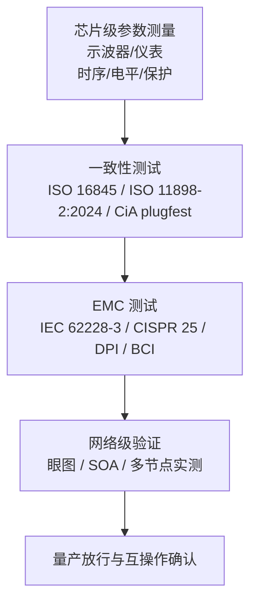
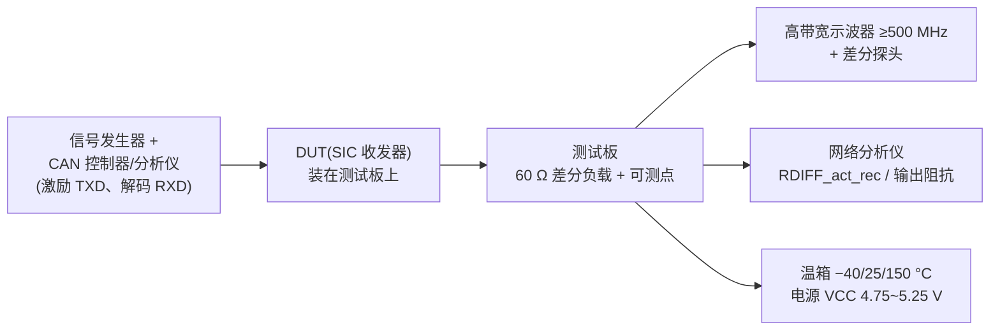
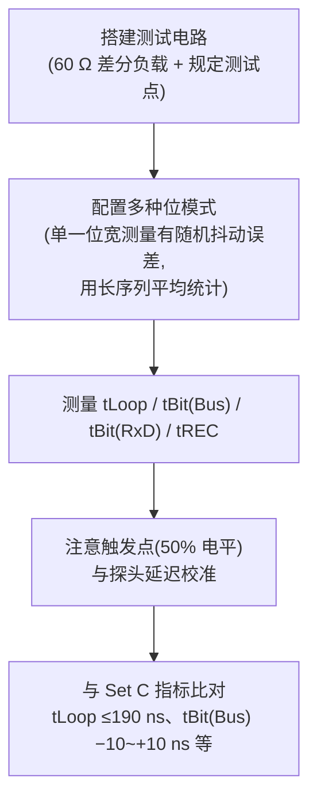
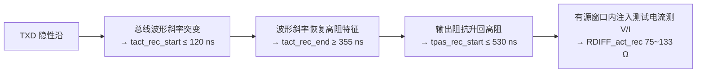
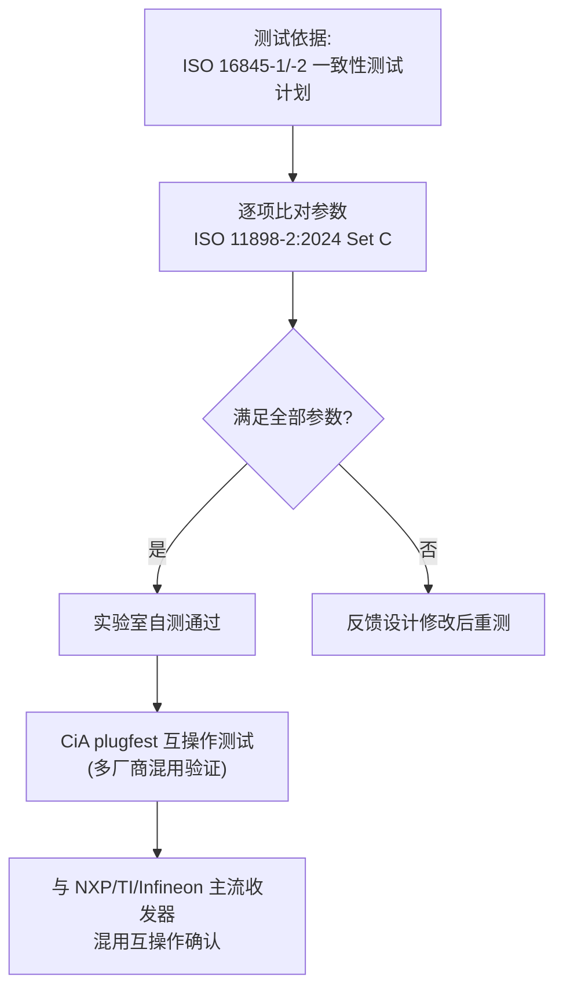
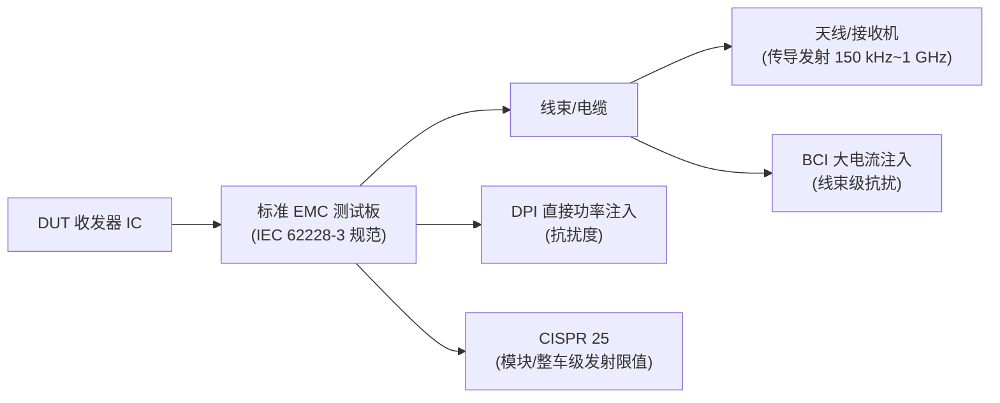
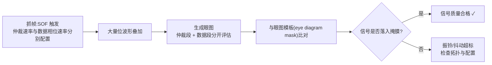
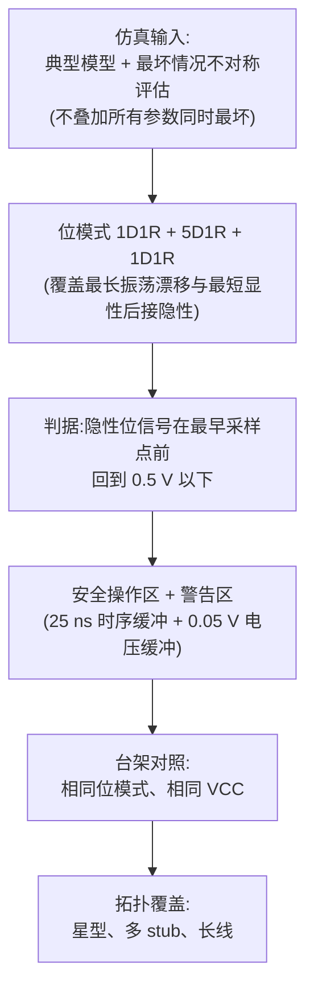
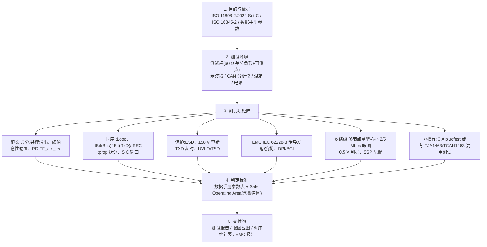

# SIC 测试:验证与测试方法

> 本篇为 SIC 设计专题·**测试篇**,配套[原理篇](principle.md)与[设计篇](design.md)。
> 本篇覆盖 SIC 收发器从**芯片级参数测量**到**一致性认证**、**EMC 测试**、**网络级验证**的完整测试体系,并给出测试计划模板。
> 测试方法与标准依据取自已下载资料(Hancock 2020 iCC 测量论文、Adamson 2020、TJA1463 数据手册)与经验证的 CiA/ADI 行业文章(链接见文末)。

---

## 1. 测试体系总览


*图 22:验证测试体系总览(芯片级参数 → 一致性 → EMC → 网络级 → 测试计划)*



> 测试体系自上而下的四层递进:芯片级参数测量提供基础数据,一致性测试确认标准符合性,EMC 测试覆盖车规电磁兼容,网络级验证观察系统行为,最终支撑量产放行与多厂商互操作确认。

---

## 2. 芯片级参数测量

### 2.1 测量设备与设置

| 设备 | 用途 |
|------|------|
| 高带宽示波器(≥500 MHz)+ 差分探头 | 总线差分波形、时序测量 |
| 信号发生器 + CAN 控制器/分析仪 | 激励 TXD、解码 RXD |
| 网络分析仪(或阻抗测量) | RDIFF_act_rec、输出阻抗 |
| 专用测试板(标准测试电路) | 固定负载(60 Ω 差分)、可测点 |

> Hancock 2020(Keysight)"Characterizing the physical layer of CAN FD"给出了环回延迟与隐性位宽的标准示波器测量流程([站内条目](../../resources/_entries/papers/2020-hancock-physical-layer.md)、[本地 PDF](../../files/papers/2020_Hancock_Characterizing_the_physical_layer_of_CAN_FD.pdf))。



> 标准测量平台:测试板提供 60 Ω 差分负载与规定可测点;示波器(≥500 MHz + 差分探头)测总线差分波形与时序,网络分析仪测阻抗(RDIFF_act_rec、输出阻抗),信号发生器 + CAN 控制器/分析仪提供激励与解码;温箱覆盖 −40/25/150 °C,电源按 VCC 4.75~5.25 V 设置。

### 2.2 时序参数测量(核心)

| 参数 | 符号 | 测量方法 | 指标(Set C) |
|------|------|---------|-------------|
| 环回延迟 | tLoop | TXD 边沿 → RXD 边沿(TJA1463: td(TXDL-RXDL)/td(TXDH-RXDH)) | ≤190 ns |
| 发送隐性位宽偏差 | tBit(Bus) | 比较总线隐性位宽度与 TXD 理想位宽 | −10 ~ +10 ns |
| 接收位宽偏差 | tBit(RxD) | 比较 RXD 隐性位宽度与 TXD 理想位宽 | −30 ~ +20 ns |
| 接收时序对称性 | tREC | tREC = tBit(RxD) − tBit(Bus) | −20 ~ +15 ns |
| TXD→总线传播延迟 | tprop(TXD-bus) | TXD 边沿 → 总线越过阈值 | ≤80 ns(dom/rec) |
| 总线→RXD 传播延迟 | tprop(bus-RXD) | 总线越过阈值 → RXD 边沿 | ≤110 ns(dom/rec) |

**测量要点**:
- 位宽偏差测量需要在**多个位模式**下统计(单一位宽测量会有随机抖动误差),通常用长序列平均;
- 测试电路:60 Ω 差分负载 + 规定测试点(TJA1463 Figure 12 的驱动器对称性测试电路);测试条件 VCC 4.75~5.25 V、Tj −40~150 °C;
- 环回延迟测试注意触发点(50% 电平)与探头延迟校准。



> 时序测量流程:先搭标准测试电路,再在多种位模式下用长序列平均统计位宽偏差(消除随机抖动误差),测量环回延迟与位宽偏差后与 Set C 指标比对;环回延迟测试须注意 50% 触发点与探头延迟校准。

### 2.3 SIC 特有参数测量

| 参数 | 符号 | 测量方法 | 指标 |
|------|------|---------|------|
| 有源隐性开始时间 | tact_rec_start | TXD 隐性沿 → 总线输出阻抗下降/波形斜率突变 | ≤120 ns |
| 有源隐性结束时间 | tact_rec_end | 总线波形斜率恢复高阻特征 | ≥355 ns |
| 被动隐性开始时间 | tpas_rec_start | 输出阻抗升回高阻 | ≤530 ns |
| 有源隐性差分电阻 | RDIFF_act_rec | 有源隐性窗口内注入测试电流测 V/I | 75~133 Ω |

**实现提示**:阻抗窗口测量需在总线上叠加小信号扰动,或在专用测试模式下把内部 SIC 控制信号引出;设计阶段应预留**测试模式/引脚**(见[设计篇](design.md)"可测性"检查清单)。



> SIC 窗口测量链:以 TXD 隐性沿为参考,用总线波形斜率突变点标定 tact_rec_start/end,用输出阻抗回升标定 tpas_rec_start;RDIFF_act_rec 需在有源窗口内注入测试电流测 V/I。测量常需专用测试模式把内部 SIC 控制信号引出。

### 2.4 保护与鲁棒性参数

- **ESD**:总线引脚 HBM/IEC 61000-4-2(≥8 kV);系统级配合 TVS 的 ESD(IEC 61000-4-2 汽车场景,[IEEE TDMR 2017 论文](../../resources/_entries/journals/2017-tdmr-esd-tvs-can-transceiver.md));
- **总线容错**:CANH/CANL 对 GND/电源短路、±58 V 注入;ISO 7637 瞬态;
- **TXD 显性超时**:拉死 TXD 验证 0.8~9 ms 超时释放;
- **欠压/过温**:UVLO 阈值、TSD 关断与恢复。

---

## 3. 一致性测试(标准符合性)

### 3.1 ISO 16845-1/-2

- **ISO 16845-1:2016**:CAN 数据链路层与物理信令一致性测试计划(协议控制器层);
- **ISO 16845-2:2018**:高速介质访问单元(HS-MAU)一致性测试——**收发器物理层参数的测试计划本体**,SIC 相关测试项以此为基准(针对 ISO 11898-2:2016;ISO/DIS 16845-2 2024 修订正在制定以覆盖新版);
- 获取:ISO 官网付费购买。

### 3.2 ISO 11898-2:2024 Set C 参数符合性

按[设计篇](design.md)的检查清单逐项比对数据手册参数,确认满足:
- 时序:tBit(Bus)/tBit(RxD)/tREC、环回延迟、传播延迟拆分;
- SIC 窗口:tact_rec_start/end、tpas_rec_start、RDIFF_act_rec;
- 电平:差分输出、共模、阈值、隐性偏置。
> 注意:CiA 601-4(2019 原 SIC 规范)已撤回并入 ISO 11898-2:2024,测试以 ISO 新标准为准;601-4 老测试电路仅作历史参考。



> 一致性测试流程:以 ISO 16845-1/-2 测试计划为基准,逐项比对 ISO 11898-2:2024 Set C 参数;自测通过后再参加 CiA plugfest(仅限 CiA 会员),验证与 NXP/TI/Infineon 等主流收发器混用的互操作性——这是 SIC 网络最大的工程风险点。

### 3.3 CiA plugfest(互操作测试)

- **性质**:CiA 组织的多厂商收发器/控制器互操作测试,**仅限 CiA 会员参加**;
- **历史**:2015 年纽伦堡 CAN FD plugfest 做了**振铃抑制对比测试**(三星拓扑、270 m 长线、有无振铃抑制电路对照)——SIC 概念验证的现场记录;
- 近年已为 CAN SIC / SIC XL 收发器组织互操作测试(CiA 测试中心确认);
- **价值**:验证自研芯片与 NXP/TI/Infineon 等主流收发器混用时的互操作性——SIC 网络最大的工程风险点。
- 链接:[CiA plugfest 页面](https://www.can-cia.org/services/cia-test-center/cia-plugfest)

---

## 4. EMC 测试



> EMC 测试设置分层:芯片级按 IEC 62228-3 测试板规范测传导发射(150 kHz~1 GHz)与射频抗扰;抗扰度方法含 DPI(直接功率注入)与 BCI(大电流注入);模块/整车级按 CISPR 25 限值评估,PCB 布局(共模扼流圈、去耦)影响显著。

### 4.1 IEC 62228-3(CAN 收发器 IC EMC 评估)— 芯片级 EMC 标准

- 规定 CAN 收发器 IC 的**传导发射(150 kHz~1 GHz)与射频抗扰度**测试板规范、测试条件与限值;
- **与 SIC 直接相关**:Infineon 的 CAN SIC 动态参数文章([本地 PDF](../../files/sic-design/CNL2022-4_Infineon_CAN_SIC_dynamic_parameters.pdf))专门讨论 SIC 动态参数与 EMC 测试的关系——SIC 快速边沿在降低振铃的同时会**增加高频发射**,两者需要权衡;
- 获取:IEC Webstore 付费购买。

### 4.2 CISPR 25(模块/整车级)

- 车辆/模块级传导与辐射发射限值;收发器在 PCB 上的布局(共模扼流圈、去耦)影响显著;
- 参考厂商应用笔记:[TI SLVAFC1(ESD 保护)](../../resources/_entries/vendors/ti-slvafc1.md)、[NXP AH1308(PCB/EMC 设计)](../../resources/_entries/vendors/nxp-ah1308.md)——均已下载。

### 4.3 抗扰度测试方法

- **DPI(Direct Power Injection)**:直接功率注入,评估收发器抗扰阈值(比较器、共模处理的薄弱点);
- **BCI(Bulk Current Injection)**:大电流注入,线束级抗扰;
- 参考:[SOKEN/丰田 2024 论文](../../resources/_entries/papers/2024-mizoguchi-immunity-evaluation.md)(车载 CAN-FD 收发器 IC 抗扰度评估方法,DOI 10.23919/EMCJapan/APEMCOkinawa58965.2024.10585203)、[九州工大 2022](../../resources/_entries/papers/2022-nishida-emc-evaluation.md)(CAN-FD 收发器辐射噪声评估)。

---

## 5. 网络级验证(系统)

### 5.1 眼图模板测试

- CAN FD 数据相位用**眼图模板(eye diagram mask)**作为合成信号质量测试(仲裁段 + 数据段分开评估);
- 参考:[LeCroy Stüber 2024 iCC "What information can eye diagrams provide for CAN?"](../../files/sic-design/iCC2024_LeCroy_eye_diagrams_CAN.pdf)、[Hancock 2020](../../resources/_entries/papers/2020-hancock-physical-layer.md);
- 实测时注意:触发源用 SOF,数据相位速率与仲裁速率分别配置。



> 眼图分析流程:以 SOF 为触发源抓帧,把大量位波形叠加成眼图,仲裁段与数据段分开评估;再与眼图模板比对,信号落入掩膜判定质量合格,超出则回溯振铃/抖动来源(拓扑、端接、采样点配置)。

### 5.2 Safe Operating Area 仿真 + 台架对照(Adamson 2020 方法论)

1. **仿真输入**:典型(typical)仿真模型 + **最坏情况不对称评估**(不叠加所有参数同时最坏,那不符合实际);
2. **位模式**:用 `1D1R + 5D1R + 1D1R`(1 显性+1 隐性,5 显性+1 隐性,1 显性+1 隐性)——覆盖最长振荡漂移与最短显性后接隐性两种最坏场景;
3. **判据**:隐性位信号在最早采样点前回到 0.5 V 以下;安全操作区边界外设**警告区**(建议 25 ns 时序缓冲 + 0.05 V 电压缓冲)用于早期预警;
4. **台架对照**:仿真条件与台架测量一致(相同位模式、相同 VCC),便于交叉验证;
5. **拓扑覆盖**:星型、多 stub、长线;可用 [Kvaser 2024 iCC 论文](../../files/sic-design/iCC2024_Kvaser_cable_layout_and_CAN_SIC.pdf)的线束布局分析做补充(已下载)。



> SOA 仿真 + 台架对照方法论:典型模型配合最坏情况不对称评估(不叠加所有参数同时最坏,那不符合实际),用 1D1R + 5D1R + 1D1R 位模式覆盖最长振荡漂移与最短显性后接隐性两种最坏场景,以"最早采样点前回到 0.5 V 以下"为判据,边界外设警告区(25 ns 时序缓冲 + 0.05 V 电压缓冲),最后用相同位模式、相同 VCC 的台架对照交叉验证。

### 5.3 关键配置验证

- **采样点**:2 Mbps 用 70~80%;5 Mbps 用 ~55%(50% + 1 tq);
- **⚠️ Secondary Sample Point(SSP)必须与主采样点一致**——5 Mbps 下 SSP 设错是实际网络中最常见的隐性故障;
- **端接**:60 Ω 差分端接、split termination + 共模电容(改善共模发射);振铃测试网络按 CiA 601-4/ISO 规范搭建。

### 5.4 系统级测试方法论(ADI)

- ADI 2023 文章"System-level testing of CAN FD transceivers"(免费,can-newsletter.org)讨论**多节点系统级测试**:环回延迟、RXD 位宽、传播时延对仲裁与采样点的联合影响;
- 链接:https://can-newsletter.org/engineering/engineering-miscellaneous/231215_system-test_transc_analog-devices_cnlm-23-4/

### 5.5 自动化测试

- 同济大学 2024:多供应商 CAN FD 收发器互操作自动化测试系统(DOI 10.1109/VPPC63154.2024.10755399);
- Aptiv 2021:双线高速 CAN/CAN FD/LIN 物理层一致性测试自动化框架(SAE 2021-26-0484)。

---

## 6. 测试计划模板(流片验证用)

```
1. 目的与依据:ISO 11898-2:2024 Set C / ISO 16845-2 / 数据手册参数
2. 测试环境:测试板(60Ω 差分负载+可测点)、示波器、CAN 分析仪、温箱(-40/25/150°C)、电源(VCC 4.5~5.5V)
3. 测试项矩阵:
   [ ] 静态:差分/共模输出、阈值、隐性偏置、输入阻抗(RDIFF_act_rec)
   [ ] 时序:tLoop、tBit(Bus)/tBit(RxD)/tREC、tprop 拆分、SIC 窗口(tact_rec_start/end、tpas_rec_start)
   [ ] 保护:ESD、±58V 容错、TXD 超时、UVLO/TSD
   [ ] EMC:IEC 62228-3 传导发射/抗扰;DPI/BCI
   [ ] 网络级:多节点星型拓扑 2/5 Mbps 眼图、0.5V 判据、SSP 配置
   [ ] 互操作:CiA plugfest 或与 TJA1463/TCAN1463 混用测试
4. 判定标准:数据手册参数表 + Safe Operating Area(含警告区)
5. 交付物:测试报告、眼图截图、时序统计表、EMC 报告
```



> 测试计划模板的五个组成部分:目的与依据、测试环境、测试项矩阵(静态/时序/保护/EMC/网络级/互操作六类)、判定标准(数据手册参数表 + Safe Operating Area 含警告区)与交付物,形成从计划到报告的完整闭环。

---

## 7. 参考资料(已下载/已验证)

| 资料 | 位置/链接 | 用途 |
|------|----------|------|
| Hancock 2020 物理层表征(iCC) | [站内条目](../../resources/_entries/papers/2020-hancock-physical-layer.md)、[本地 PDF](../../files/papers/2020_Hancock_Characterizing_the_physical_layer_of_CAN_FD.pdf) | 环回延迟/隐性位宽/眼图测量方法 |
| Adamson 2020(5-Mbps 网络) | [站内条目](../../resources/_entries/papers/2020-adamson-5mbps-networks.md)、[本地 PDF](../../files/papers/2020_Adamson_CAN_signal_improvement_and_5Mbps_networks.pdf) | Safe Operating Area 仿真方法论、位模式、采样点 |
| TJA1463 数据手册 | [站内条目](../../resources/_entries/vendors/nxp-tja1463.md)、[本地 PDF](../../files/vendors/NXP_TJA1463_CAN_SIC_datasheet.pdf) | 参数定义、测试电路(Figure 12)、测量条件 |
| Infineon CAN SIC 动态参数(4/2022) | [本地 PDF](../../files/sic-design/CNL2022-4_Infineon_CAN_SIC_dynamic_parameters.pdf) | SIC 动态参数与 EMC 关系 |
| LeCroy 眼图(iCC 2024) | [本地 PDF](../../files/sic-design/iCC2024_LeCroy_eye_diagrams_CAN.pdf) | 眼图分析方法 |
| Kvaser 线束/CAN 驱动(iCC 2020/2024) | [iCC2024](../../files/sic-design/iCC2024_Kvaser_cable_layout_and_CAN_SIC.pdf)、[iCC2020](../../files/sic-design/iCC2020_Kvaser_improved_CAN_driver.pdf) | 振铃机理、slew rate 与线束 |
| ADI 系统级测试(2023) | https://can-newsletter.org/engineering/engineering-miscellaneous/231215_system-test_transc_analog-devices_cnlm-23-4/ | 系统级测试方法论 |
| CiA plugfest 页面 | https://www.can-cia.org/services/cia-test-center/cia-plugfest | 互操作测试历史与报名 |
| CAN FD ringing suppression(2015 plugfest 报道) | https://www.can-newsletter.org/engineering/engineering-miscellaneous/150309_plug-fest-canfd-ringging-suppression/ | SIC 前身互操作测试现场记录 |
| 标准(付费) | [ISO 16845-1](../../resources/_entries/standards/iso-16845-1-2016.md)、[ISO 16845-2](../../resources/_entries/standards/iso-16845-2-2018.md)、[IEC 62228-3](../../resources/_entries/standards/iec-62228-3-2019.md)、[ISO 11898-2:2024](../../resources/_entries/standards/iso-11898-2-2024.md) | 测试条款权威出处 |

---

## 关联

- **词条**:[CAN SIC](../../glossary/can-sic.md)、[振铃抑制](../../glossary/ringing-suppression.md)、[一致性测试](../../glossary/iso-16845.md)、[IEC 62228-3](../../glossary/iec-62228-3.md)、[CISPR 25](../../glossary/cispr25.md)、[plugfest](../../glossary/plugfest.md)、[采样点](../../glossary/sample-point.md)、[TDC](../../glossary/tdc.md)
- **教程**:[一致性测试与 plugfest](../../tutorials/11-conformance-plugfest.md)、[示波器抓帧与分析](../../tutorials/10-scope-capture.md)
- **知识库**:[工具与测试 子域](../tools/index.md)(示波器抓帧、一致性测试)、[收发器设计 子域](../transceiver-design/index.md)
- **专题内**:原理见[原理篇](principle.md),设计见[设计篇](design.md)
