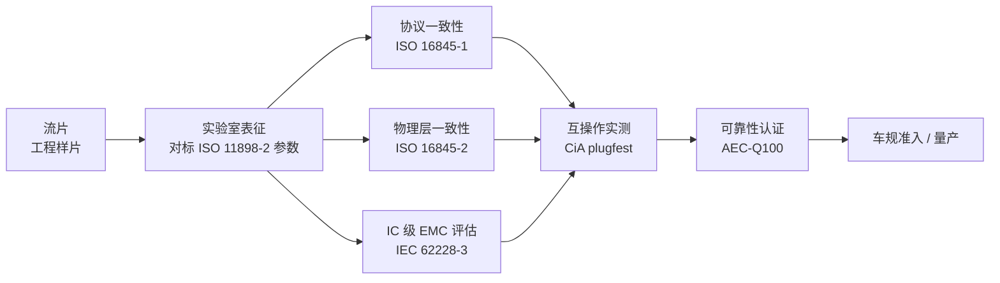
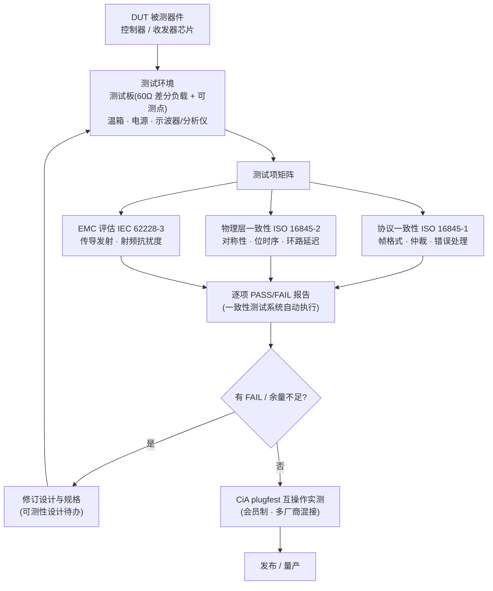
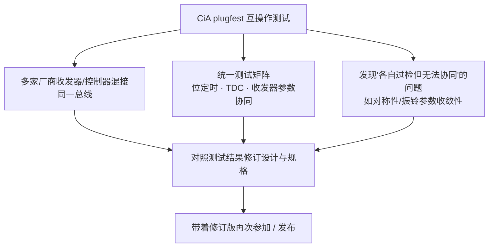

## 概述

**一致性测试(Conformance Testing)** 是按标准规定的用例,验证控制器/收发器实现与规范**一致**的测试体系:CAN FD 控制器按 **ISO 16845**(协议一致性),收发器物理层按 **ISO 16845-2**(HS-MAU)与 **IEC 62228-3**(EMC 评估),另以 **CiA plugfest** 做多厂商**互操作验证**——"一致性"保证实现符合文本,"互操作"保证实际互联可用,两者缺一不可。一致性测试证明"你符合标准",但多个厂商的芯片各自符合标准,未必能在一起协同工作——这正是 plugfest 存在的意义(教程 11)。

## 认证不是"一步到位",而是一条分层路径

一颗 CAN 收发器从流片到进入整车,要过的关卡分属不同体系:协议、物理层、EMC、可靠性、互操作,各管一段:

## 一致性测试体系

### 协议一致性:ISO 16845

| 标准 | 对象 | 内容 |
|---|---|---|
| [ISO 16845-1](../../resources/_entries/standards/iso-16845-1-2016.md) | 数据链路层 | 一致性测试计划 Part 1:帧格式、仲裁、错误处理、位填充、CRC 等用例,含 Classical CAN 与 CAN FD(控制器行为) |
| [ISO 16845-2](../../resources/_entries/standards/iso-16845-2-2018.md) | 物理层(HS-MAU) | 针对 ISO 11898-2:2016 高速介质访问单元的静态与动态测试——**Tx/Rx 延迟对称性、位时序、环路延迟**等测量项,是收发器芯片一致性测试的直接依据 |

- 针对新版 ISO 11898-2:2024/2026 的修订草案 **ISO/DIS 16845-1(编号 90696)与 ISO/DIS 16845-2(编号 90695)** 正在制定中——**SIC 时代的一致性测试要求正在随新版规范升级**,旧版 Part 2 针对 2016 版规范,SIC 新增的振铃抑制等动态参数如何纳入一致性测试是当前行业正在明确的议题(教程 11)。
- 执行载体:Vector 等厂商的 **CAN FD 一致性测试系统**运行规范用例脚本,输出逐项 PASS/FAIL 报告(条目 CAN FD 一致性测试系统)。

### 收发器 EMC 评估:IEC 62228-3 与 CISPR 25

- **IEC 62228-3:2019**:CAN 收发器集成电路的 EMC 评估标准——规定**测试板规范**(去耦、共模扼流圈、终端)、**传导发射(150 kHz ~ 1 GHz)** 与**射频抗扰度**测试方法,是 CISPR 25 在收发器**芯片层面**的落地测试标准,与 ISO 11898-2 的 EMC 条款配套使用(词条 IEC 62228-3)。
- **CISPR 25**:整车零部件电磁发射限值(车规级),与回波损耗、共模扼流圈布局共同决定收发器系统级 EMC 表现,见[回波损耗与 EMC](../physical-layer/return-loss-emc.md)。
- 厂商数据手册常以 IEC 62228-3 测试结果(如 NXP TJA146x、TI TCAN146x 的 EME/EMI 特性)展示器件的 EMC 竞争力。

### 测试项与 ISO 11898-2:2024 参数速查对应

一致性测试的判定离不开标准参数(见[ISO 11898-2:2024 关键参数速查](../../resources/standards-text/iso-11898-2-2024-key-parameters.md)):

| 测试方向 | 关键参数(速查页来源) | 数值示例 | 对应测试项 |
|---|---|---|---|
| 时序 | 环路延迟 tLoop | 参数集 A/B ≤255 ns;参数集 C ≤**190 ns**(TXD→总线 ≤80 ns、总线→RXD ≤110 ns,表 14) | ISO 16845-2 环路延迟测量 |
| 时序 | 发送位宽变化 t△Bit(Bus) | 参数集 B −45/+10 ns;参数集 C −10/+10 ns(表 16/17) | ISO 16845-2 位时序 |
| 时序 | 接收位宽变化 t△Bit(RXD) / 接收对称性 t△Rec | 参数集 C −30/+20 ns / −20/+15 ns(表 17) | ISO 16845-2 位时序 |
| SIC | 有源隐性差分电阻 RDIFF_act_rec | 75~133 Ω(表 18) | SIC 窗口阻抗测量 |
| SIC | 信号改善时间 tsic | +300/+530 ns(表 A.12) | SIC 动态参数 |
| 保护 | 发送显性超时 tdom | 0.8~10 ms(表 13);SIC 模式 0.80~6.0 ms(表 A.10) | 保护参数测试 |

## 一致性测试执行流程

- **测试项设计建议**(SIC 测试篇):静态(差分/共模输出、阈值、隐性偏置、输入阻抗 RDIFF_act_rec)、时序(tLoop、tBit(Bus)/tBit(RxD)/tREC、tprop 拆分、SIC 窗口 tact_rec_start/end、tpas_rec_start)、保护(ESD、±58 V 容错、TXD 超时、UVLO/TSD)、EMC(IEC 62228-3、DPI/BCI)、网络级(多节点星型拓扑 2/5 Mbps 眼图、0.5 V 判据、SSP 配置)。
- **对设计的意义**:设计阶段就应按 ISO 16845-2 测试项预留**可测性**——测试模式、对称性校准接口,否则流片后无法表征某些参数(教程 11)。
- 第三方实验室(TÜV、SGS、广电计量、赛宝等)承接收发器一致性、EMC 与车规认证;AEC-Q100 可靠性可在认证机构或内部完成。

## 互操作验证:CiA plugfest

**plugfest / interoperability 测试**是 CiA 定期组织的多厂商互操作活动:CAN FD、CAN SIC 收发器与控制器在真实网络里互联测试,暴露"各自符合一致性测试但仍无法协同工作"的问题(词条 plugfest)。

- **参加条件**:CiA **会员(member)** 可参与,需关注会员资格与活动排期(条目 CiA plugfest)。
- **历史**:2015 年纽伦堡 CAN FD plugfest 做了**振铃抑制对比测试**(三星拓扑、270 m 长线、有无振铃抑制电路对照)——SIC 概念验证的现场记录(SIC 测试篇)。
- **参加前建议**:先通过一致性测试自测,再带着自研芯片参加互操作实测;重点是让**边沿对称性、位时序裕量、TDC 行为**在多厂商混搭网络里收敛(Wosnitza 2017 论文披露:不同厂商 SIC/HS-CAN 收发器混用时,参数必须收敛才能真正互操作)。

## 自研芯片的完整路径小结

| 阶段 | 依据 | 测什么 | 谁来测 |
|---|---|---|---|
| 实验室表征 | ISO 11898-2 参数条款 | 驱动、阈值、对称性、环路延迟、振铃抑制 | 自研团队(示波器方法) |
| 协议一致性 | ISO 16845-1 | DLL + PCS 行为 | 一致性测试系统/实验室 |
| 物理层一致性 | ISO 16845-2 | HS-MAU 对称性/位时序/环路延迟 | 一致性测试系统/实验室 |
| IC 级 EMC | IEC 62228-3 | 传导发射 + 射频抗扰度 | EMC 测试系统/实验室 |
| 可靠性 | AEC-Q100 | 温度、寿命、ESD、闩锁等 | 第三方实验室 |
| 互操作 | CiA plugfest | 多厂商混搭网络实测 | CiA 组织(CiA 会员) |

## 对设计/调试的意义

- **对收发器(模拟 IC)**:一致性测试是流片后的"期末考试"——ISO 16845-2 的时序/电平用例、IEC 62228-3 的 EMC 台架、plugfest 的互操作,逐项验证输出级、接收比较器、ESD/共模设计是否达标;建议在量产前把测试用例反推成设计 Spec 的对照清单(厂商数据手册即是对标模板),并把"没有测试模式就无法流片后表征"写成可测性设计待办。
- **对控制器(嵌入式)**:控制器侧关注 ISO 16845-1 协议一致性(位定时配置、错误处理状态机),嵌入式工程师通过一致性测试报告确认控制器/驱动配置合法,配合[位定时配置实战](../../tutorials/06-bit-timing-config.md)落地;物理层问题可用[示波器抓帧](scope-capture.md)在一致性测试前预筛。

## 参见

- 教程:[一致性测试与 plugfest:芯片如何被认证](../../tutorials/11-conformance-plugfest.md)
- 词条:[ISO 16845](../../glossary/iso-16845.md)、[IEC 62228-3](../../glossary/iec-62228-3.md)、[plugfest](../../glossary/plugfest.md)、[CISPR 25](../../glossary/cispr25.md)、[CAN SIC](../../glossary/can-sic.md)、[AEC-Q100](../../glossary/aec-q100.md)
- 标准规范:[ISO 16845-1](../../resources/_entries/standards/iso-16845-1-2016.md)、[ISO 16845-2](../../resources/_entries/standards/iso-16845-2-2018.md)、[IEC 62228-3](../../resources/_entries/standards/iec-62228-3-2019.md)、[ISO 11898-2 (2024)](../../resources/_entries/standards/iso-11898-2-2024.md)
- 工具条目:[CAN FD 一致性测试系统](../../resources/_entries/tools-community/canfd-conformance-tester.md)、[CiA plugfest](../../resources/_entries/tools-community/certification-cia-plugfest.md)、[一致性测试标准](../../resources/_entries/tools-community/certification-conformance-standards.md)、[第三方实验室](../../resources/_entries/tools-community/certification-third-party-lab.md)
- 相邻子域:[回波损耗与 EMC](../physical-layer/return-loss-emc.md)、[示波器抓帧](scope-capture.md)、[SIC 测试:验证与测试方法](../sic-design/testing.md)
