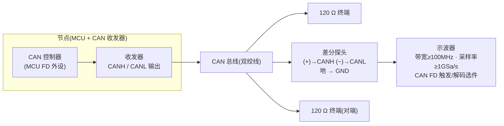
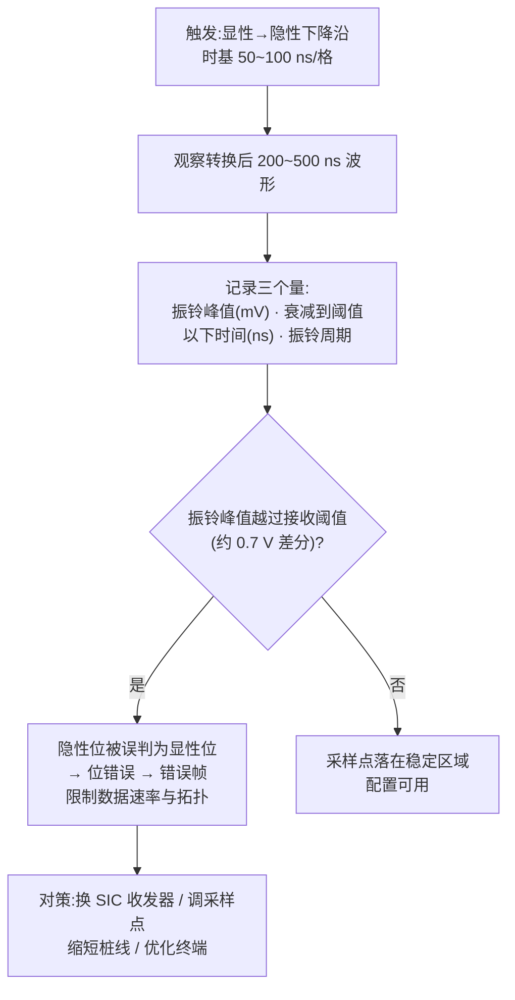
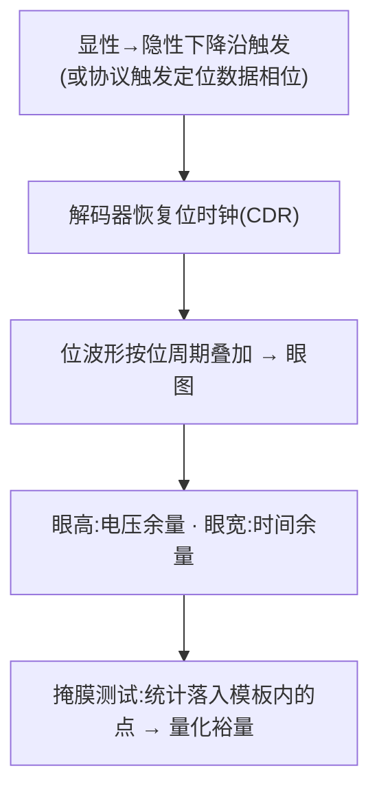
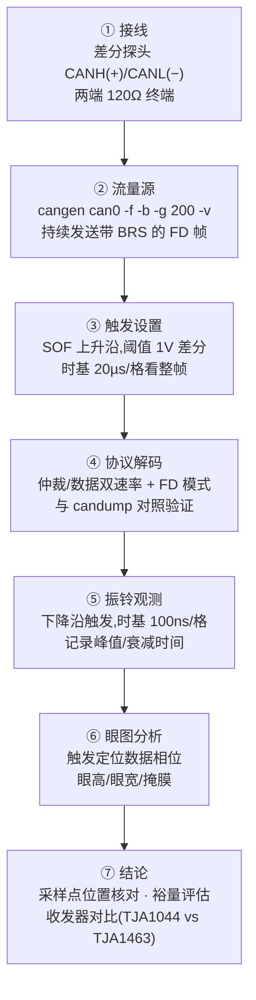

## 概述

**示波器抓帧**是物理层验证的核心手段:在总线物理波形层面观察 CAN FD 帧的显性/隐性电平、位定时、振铃与眼图,与协议分析工具的"帧/信号"视图互补。软件工具(candump、错误计数)只能告诉你"节点收发是否成功",看不到总线上**真实发生了什么**;示波器补上三块拼图:**验证位定时**(采样点是否落在稳定区)、**排查信号完整性**(高速数据相位为什么偶发报错)、**评估收发器**(这颗 SIC 相比普通 FD 收发器强在哪)。CAN FD 的**一帧两速(BRS)** 让触发、解码与眼图分析都比经典 CAN 更讲究。

硬件要求(教程 10):带 CAN FD 触发/解码功能的示波器(带宽 ≥ 100 MHz、采样率 ≥ 1 GSa/s)、**差分探头**,以及一个能持续发送带 BRS 的 FD 帧的节点(USB-CAN 接口卡或开发板)。选型要点:带宽、采样率、CAN FD 触发解码能力、眼图/测量功能(条目示波器 + CAN/CAN FD 解码)。

## 设备与选型要点

带 CAN / CAN FD 触发与解码功能的示波器(Keysight、Tektronix、R&S 等厂商)是物理层验证的核心设备;多数高端示波器自带 CAN FD 触发与协议解码(条目示波器 + CAN/CAN FD 解码)。选型要点:

| 选型项 | 建议 | 理由 |
|---|---|---|
| 带宽 | ≥ 100 MHz(建议更高) | 5 Mbit/s 数据相位位时间 200 ns,沿约 15~50 ns |
| 采样率 | ≥ 1 GSa/s | 奈奎斯特之外留足裕量,解码可靠性依赖足够的每 bit 采样点 |
| CAN FD 触发/解码 | 协议触发 + 双速率解码 | BRS 一帧两速,纯边沿触发难以定位数据相位 |
| 眼图/测量功能 | 眼图、掩膜测试 | 收发器对比与一致性预筛(见[SIC 测试:验证与测试方法](../sic-design/testing.md)) |

## 接线:差分探头跨接 CANH/CANL

- **必须用差分探头**跨接 CANH(+)/CANL(−):CAN 是差分信号——隐性位 CANH=CANL≈2.5 V(差分≈0 V),显性位 CANH≈3.5 V、CANL≈1.5 V(差分≈2 V)。单端探头看单线只有约 1 V 小摆幅,还叠加共模噪声,位边界与振铃都会被淹没。
- SIC 收发器的显性共模电平与经典 HS-CAN 略有不同,但差分电平仍约 2 V——差分测量的好处是对共模不敏感,换收发器对比时无需改设置。
- 探头接入点选在**总线中部或终端电阻两端**,离被测节点尽量远,减少探头寄生电容影响;地线短接到底盘地并贴近接入点。
- **带宽/采样率**:数据相位 5 Mbit/s 时位时间仅 200 ns,收发器沿约 15~50 ns——带宽 **≥ 100 MHz**、采样率 **≥ 1 GSa/s** 是底线;只量位时间可开 20 MHz 带宽限制滤噪,但**测振铃与眼图必须用全带宽**。

## 触发设置:让示波器"只保留值得看的那一段"

CAN 有两个关键触发,用途完全不同:

| 触发目标 | 触发方式 | 阈值建议 | 用途 |
|---|---|---|---|
| 帧起始(SOF) | 边沿:隐性→显性**上升沿**;或协议触发"帧起始" | 差分电压 1 V 左右 | 看一帧完整结构、验证解码 |
| 显性→隐性**下降沿** | 边沿:下降沿;或协议触发"数据相位/BRS 之后" | 差分电压 1 V 左右 | **振铃与眼图分析的关键触发** |

- 触发阈值设在 **1 V 差分左右**(显性约 2 V、隐性约 0 V,1 V 居中;注意与接收器阈值约 0.7 V 不是一回事——触发阈值只决定示波器何时开始采集);
- 触发源必须选**差分通道**,阈值按差分电压理解;
- 带 **CAN FD 协议触发**的示波器可按"帧起始 / 特定 ID / BRS 之后的数据相位"触发——由解码器识别 EDL 位与 BRS 位,比纯边沿更语义化;具体菜单路径以你的示波器型号为准,但触发源、阈值、目标是同一套原理。

## 协议解码:让示波器帮你读帧

主流示波器(Keysight / Tektronix / R&S 等)自带 CAN FD 解码选件。解码前**必须正确配置**,否则解出的全是错的:

- **双速率**:仲裁相位速率与数据相位速率(如 1 Mbit/s / 5 Mbit/s)——配错一个,整帧解错;
- **FD 模式**:使能 CAN FD,并确认允许 BRS 速率切换;
- **解码阈值**:与触发阈值一致(1 V 差分左右);
- **采样点**:部分示波器解码器允许指定采样点百分比(如 75%~80%)。

解码后示波器在波形上直接标注 **ID、DLC、数据字节、CRC、位填充与错误帧**,还能给出**采样点位置标记**。**验证解码正确**:同一个流量源,示波器解出的 ID/数据应与 `candump` 输出完全一致——这是判断"解码配置错还是总线真有问题"的第一手段。

## 测量:电平/位时间 → 振铃 → 眼图

### 观测 1:电平与位时间

- **量电平**:游标量差分波形显性高电平(应接近 2 V)与隐性电平(应接近 0 V,允许 ±500 mV 以内);显性偏低或隐性不为 0,检查终端电阻、供电与收发器。
- **量位时间**:测两个相同极性边沿之间的间隔。CAN 数据相位是 NRZ + **位填充**(连续 5 个相同位后插入反相位),单次间隔不一定是位时间——建议用解码器的位时间测量,或量 10 个位取平均。BRS 位之后数据相位提速,波形上直接看到**位宽变窄**(如仲裁位 1 µs → 数据位 200 ns)。
- **找采样点**:按位时间百分比(如 75%)用游标定位采样时刻,观察该时刻波形是否远离边沿、电压余量是否充足;也可看解码器标注的采样点标记是否落在眼图中央。

### 观测 2:显性→隐性转换后的振铃(核心观测)

原理:显性→隐性转换后残留电荷经 L-C-R 欠阻尼放电形成振荡(振铃),若峰值越过接收阈值,后续隐性位可能被误判为显性位,直接限制数据速率与拓扑(见[振铃抑制:SIC 核心能力](../physical-layer/ringing-suppression.md))。**对比实验**:同一网络、同一套位定时,分别装普通 FD 收发器与 SIC 收发器(如 NXP TJA1044 vs TJA1463),在 5 Mbit/s 数据相位下对比振铃幅度与衰减时间——SIC 在振铃抑制窗口内把振荡压到阈值之下,波形明显更干净。

### 观测 3:数据相位眼图与掩膜

- **怎么形成**:CAN 没有随路时钟,示波器必须靠解码器**恢复位时钟**(或数据相位触发)对齐每个位;直接"余辉叠加"不按位周期对齐,不能当眼图看。
- **在哪看**:触发定位到**数据相位**(BRS 之后),速率越高越能暴露问题。
- **看什么**:眼睛张开度(眼高是否接近 2 V?眼宽占位时间比例?)、边沿交叉点是否集中、隐性位(0 V 附近)是否被振铃污染。
- **掩膜测试(mask test)**:把模板放在眼图上,统计落在模板内的采样点,量化裕量——适合收发器对比与一致性预筛;眼图模板测试中数据相位与仲裁段分开评估(SIC 测试篇)。
- 眼睛张开度受采样点位置影响:把数据相位采样点从 60% 调到 90%,观察眼图与错误计数变化(配置方法见[位定时配置实战](../../tutorials/06-bit-timing-config.md))。

### 常用测量清单

- 显性/隐性差分电平幅度、阈值穿越点;
- 环回延迟量级(发送节点 TxD → 总线回读)与传播延迟对称性观测;
- 显性→隐性转换后的**振铃峰值幅度与衰减时间**;
- 采样点位置的波形核对(控制器配置的采样点是否落在稳定区域)。

## 完整抓帧流程(操作流程)

动手前检查清单:① 差分探头极性正确、地线短接;② 总线两端 120 Ω 终端;③ 带宽 ≥ 100 MHz、采样率 ≥ 1 GSa/s,测振铃/眼图未开带宽限制;④ 触发源 = 差分通道、阈值 ≈ 1 V;⑤ 解码器 FD 模式 + 双速率、采样点合理;⑥ 节点正在发送带 BRS 的 FD 帧;⑦ 解码结果与 `candump` 一致。

## 对设计/调试的意义

- **对控制器(嵌入式)**:示波器是位定时/TDC 配置是否生效的"裁判"——采样点位置、错误帧波形、环回延迟测量结果决定配置参数调整方向;解码报错但波形完好时,优先怀疑控制器位定时而非物理层。
- **对收发器(模拟 IC)**:眼图与振铃是收发器输出级、接收比较器指标的波形化表达:数据相位眼高眼宽、转换后振铃量直接对标数据手册的位时序与振铃抑制规格(ISO 11898-2:2024 参数集 C 的 t△Bit(Bus) −10/+10 ns、tsic +300/+530 ns 等),是流片后表征与竞品对比的标准手段。

## 参见

- 教程:[示波器抓 CAN FD 帧:触发、解码与眼图](../../tutorials/10-scope-capture.md)、[振铃抑制原理与测量](../../tutorials/08-ringing-suppression.md)、[收发器传播延迟对称性](../../tutorials/09-delay-symmetry.md)
- 词条:[振铃抑制](../../glossary/ringing-suppression.md)、[传播延迟对称性](../../glossary/propagation-delay-symmetry.md)、[采样点](../../glossary/sample-point.md)、[显性/隐性电平](../../glossary/dominant-recessive-levels.md)
- 工具条目:[示波器 + CAN/CAN FD 解码](../../resources/_entries/tools-community/oscilloscope-can-decoding.md)
- 相邻子域:[振铃抑制:SIC 核心能力](../physical-layer/ringing-suppression.md)、[输出级:差分驱动与显性/隐性电平](../transceiver-design/output-stage.md)、[总线分析工具对比](tool-comparison.md)、[SIC 测试:验证与测试方法](../sic-design/testing.md)
