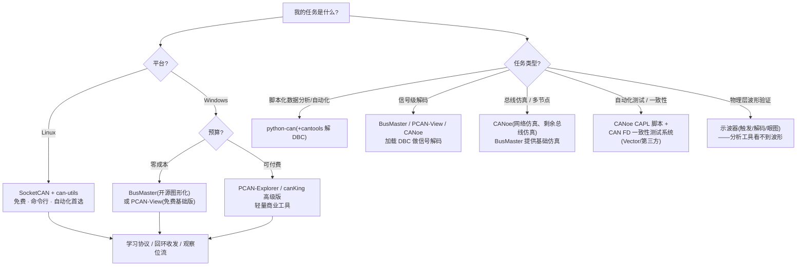
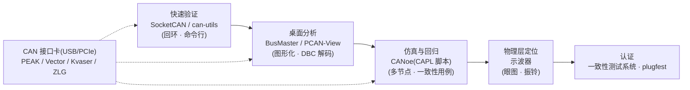
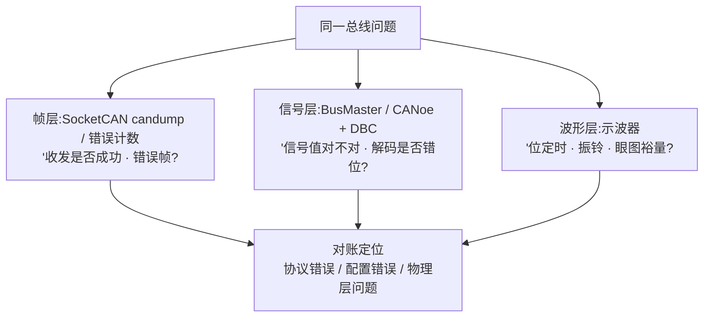

## 概述

**总线分析工具**用于收发包、抓帧、解码、仿真与自动化测试 CAN/CAN FD 网络,形态从内核协议栈、命令行工具、桌面分析软件到整车级开发环境不等。选型取决于**成本预算、平台与任务类型**:入门学习、脚本分析、专业开发与一致性测试需要不同梯度的工具。硬件侧统一靠 **CAN 接口卡**(USB/PCIe,厂商 PEAK/Vector/Kvaser/周立功 ZLG)接入总线——不同厂商接口卡与软件工具链配套(如 PEAK 配 PCAN-View、Kvaser 配 canKing、ZLG 配 USBCAN 工具),购买前确认驱动与生态支持(条目 CAN 接口卡)。

## 主流工具对比

| 工具 | 类型 | 成本 | 平台 | 定位 |
|---|---|---|---|---|
| **CANoe / CANalyzer** | Vector 商业 | 付费 | Windows | 车载网络开发/测试事实标准:CAN FD/SIC 分析、总线仿真、CAPL 脚本与一致性测试用例;CANalyzer 侧重分析,CANoe 侧重仿真、测试与自动化 |
| **PCAN-View / PCAN-Explorer** | PEAK-System | 基础版免费/完整版付费 | Windows | 轻量 USB-CAN 分析,入门友好,配合 PEAK 接口卡;Explorer 提供符号化报文、图形化视图与脚本扩展 |
| **Kvaser 套件(canKing 等)** | Kvaser | 部分免费(canKing)/高级功能付费 | Windows | 总线分析、报文记录,支持 CAN FD,配合 Kvaser 接口卡 |
| **BusMaster** | RBEI 开源 | 免费 | Windows(官方主要支持) | 跨平台开源 CAN/CAN FD 分析工具,图形化总线视图、报文收发、过滤、日志与脚本,学习帧结构方便 |
| **SocketCAN + can-utils** | Linux 内核 | 免费(内核自带) | Linux | 原生协议栈 + 命令行工具(candump/cansend/cangen/canfdtest),实验与自动化首选 |
| **python-can** | 社区开源 | 免费(MIT) | 跨平台 | Python 标准接口库,统一 API 多后端(SocketCAN/PCAN/Vector/Kvaser),写脚本做数据分析、自动化测试 |

### 各工具功能速查(据工具条目页)

| 功能 | CANoe/CANalyzer | PCAN-View/Explorer | Kvaser canKing | BusMaster | SocketCAN+can-utils | python-can |
|---|---|---|---|---|---|---|
| 报文收发/查看 | ✓ | ✓ | ✓ | ✓ | ✓ | ✓ |
| 日志记录 | ✓ | ✓(Explorer) | 高级功能付费 | ✓ | candump 重定向 | ✓ |
| 加载 DBC 信号解码 | ✓ | ✓(Explorer 符号化) | — | ✓ | 需配合 cantools 等 | ✓(+cantools) |
| 总线仿真/多节点 | ✓(CANoe 最强) | — | — | 基础仿真 | — | — |
| 脚本/自动化 | CAPL 脚本 | Explorer 脚本扩展 | 编程 API(付费) | 脚本 | shell/CI 脚本 | Python 脚本 |
| 一致性测试 | ✓(配套测试系统) | — | — | — | — | — |

## 按场景选型

- **入门学协议**:SocketCAN + can-utils(有 Linux)或 BusMaster(Windows),配一块 USB-CAN 接口卡,回环收发、观察位流最快(工具与社区汇总第五节建议)。
- **抓包/信号级分析**:BusMaster、PCAN-View、CANoe 均可加载 DBC 做信号解码;脚本化分析用 python-can。
- **总线仿真/多节点**:CANoe 的仿真能力最强(网络仿真、残余总线仿真),BusMaster 提供基础仿真。
- **自动化测试/一致性**:CANoe 的 CAPL 测试脚本 + 一致性测试系统(Vector/第三方),见[一致性测试](conformance-testing.md)。
- **物理层波形验证**:分析工具看"帧与信号",波形/眼图/振铃必须用[示波器](scope-capture.md)。

## 一个工具 vs 一套工具链

真实项目通常是组合拳,各层工具各管一段:

### 三层视图对账:帧 → 信号 → 波形

同一问题的不同观察粒度,需要不同工具对账:

SocketCAN 看"帧收发是否成功",BusMaster/CANoe 看"信号值对不对",示波器看"波形为什么不对"——三层对账才能定位是协议、配置还是物理层问题。

### 硬件底座:CAN 接口卡

接口卡(USB/PCIe)把 PC 与 CAN 总线连接起来,配合上位机软件(SocketCAN、BusMaster、python-can、厂商自带工具)实现报文收发与回环测试;Linux 下需被内核支持(如 gs_usb、peak_usb 驱动)。回环测试自研收发器、把 PC 接入被测总线,是验证基本收发功能的最短路(条目 CAN 接口卡)。

### 典型工作流示例

| 场景 | 推荐组合 | 步骤 |
|---|---|---|
| 嵌入式工程师调试驱动 | SocketCAN + can-utils + 示波器 | `ip link` 配置 → `candump` 抓帧 → `canfdtest` 回环 → 示波器核对采样点 |
| 测试工程师自动化回归 | python-can + cantools + CANoe | 脚本采集 → DBC 解码 → CANoe 回归用例 |
| 模拟 IC 验证收发器 | USB-CAN 卡 + BusMaster + 示波器 | 回环收发 → 波形/眼图 → 与主流收发器对比 |
| 整车网络开发 | CANoe/CANalyzer + CANdb++ | DBC 建网 → 仿真 → 一致性用例 |

### 选型速查清单

- 只有 Linux 环境:SocketCAN + can-utils(零成本);
- Windows + 零预算:BusMaster 或 PCAN-View(免费基础版);
- 需要 DBC 信号级视图:BusMaster / PCAN-Explorer / CANoe;
- 需要仿真与回归:CANoe(CAPL 脚本);
- 需要脚本与数据分析:python-can;
- 物理层问题:示波器(分析工具看不到波形);
- 认证:一致性测试系统 + CiA plugfest。

## 对设计/调试的意义

- **对控制器(嵌入式)**:工具链直接服务位定时/TDC 调试——SocketCAN 配置并核对时序参数、candump 观察错误帧、CANoe 脚本回归测试;DBC 驱动的信号解码让"物理层误码"与"应用层信号错误"能对上账(见[DBC 报文矩阵与信号定义](../controller/dbc.md))。
- **对收发器(模拟 IC)**:分析工具承担互操作与一致性测试的载体(CANoe 脚本、一致性测试系统),配合示波器把收发器问题定位到物理层;开源工具(SocketCAN/BusMaster)是低成本快速原型验证的首选——先用 can-utils 跑通回环,再上示波器量波形,最后进一致性体系。

## 参见

- 教程:[用 SocketCAN 5 分钟跑通 CAN FD 回环](../../tutorials/05-socketcan-loopback.md)、[CAN FD 位定时配置实战](../../tutorials/06-bit-timing-config.md)
- 词条:[BusMaster](../../glossary/busmaster.md)、[SocketCAN](../../glossary/socketcan.md)、[can-utils](../../glossary/can-utils.md)、[DBC](../../glossary/dbc.md)
- 工具条目:[CANoe/CANalyzer](../../resources/_entries/tools-community/canoe-canalyzer.md)、[BusMaster](../../resources/_entries/tools-community/busmaster.md)、[SocketCAN](../../resources/_entries/tools-community/socketcan.md)、[PCAN-View/Explorer](../../resources/_entries/tools-community/pcan-view-explorer.md)、[Kvaser 套件](../../resources/_entries/tools-community/kvaser-suite.md)、[python-can](../../resources/_entries/tools-community/python-can.md)、[CAN 接口卡](../../resources/_entries/tools-community/can-interface-card.md)
- 相邻子域:[SocketCAN](../controller/socketcan.md)、[示波器抓帧](scope-capture.md)、[一致性测试](conformance-testing.md)
