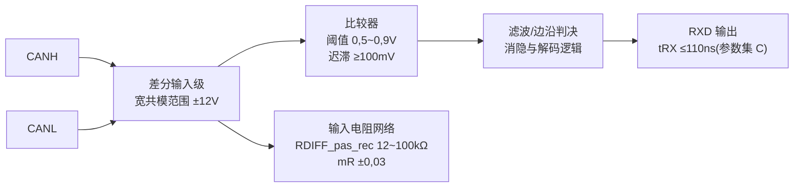
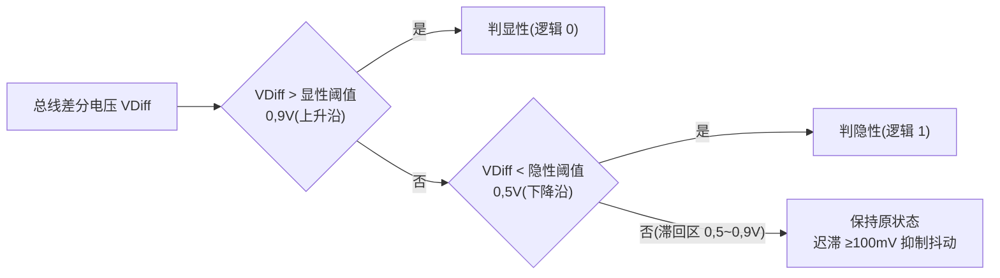
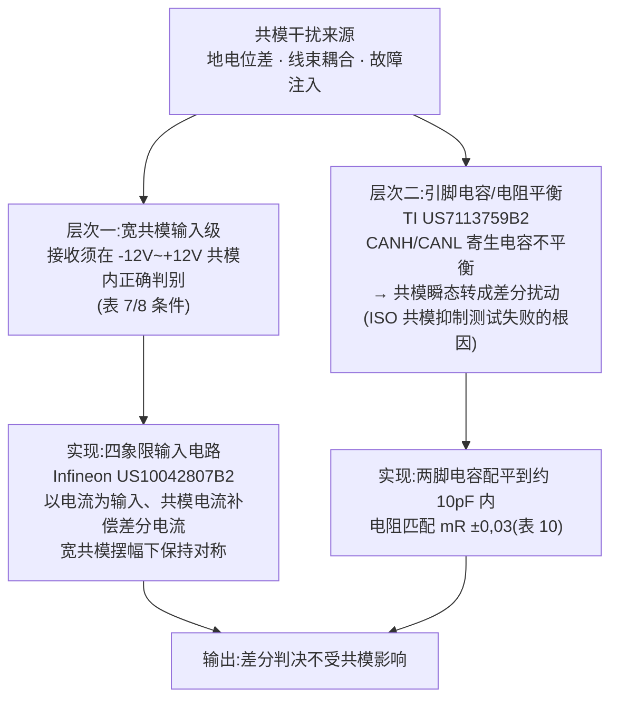
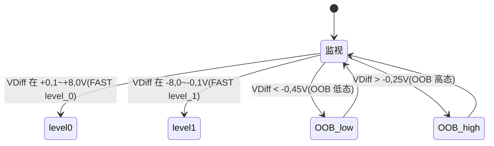

## 定义

**接收比较器(Receiver / Comparator)** 是 CAN 收发器的接收前端:持续监测 CANH/CANL 的**差分电压**,与显性/隐性判决阈值比较,把总线状态恢复为控制器可读的 **RxD** 逻辑电平。它决定接收路径延迟 **tRX**、共模抑制能力与抗振铃/抗干扰能力,是与输出级并列的收发器两大模拟核心之一。

## 关键参数

### 静态接收器输入特性(表 7/8,5.3.6 节;低功耗模式)

| 参数 | 符号 | 最小 [V] | 最大 [V] | 条件 |
|---|---|---|---|---|
| 隐性态差分输入电压范围(偏置激活) | VDiff | -3,0 | +0,5 | -12,0V≤VCAN_L≤+12,0V;-12,0V≤VCAN_H≤+12,0V |
| 显性态差分输入电压范围(偏置激活) | VDiff | +0,9 | +8,0 | 同上 |
| 隐性态差分输入电压范围(偏置未激活) | VDiff | -3,0 | +0,4 | 同上 |
| 显性态差分输入电压范围(偏置未激活) | VDiff | +1,15 | +8,0 | 同上 |

来源:参数速查页表 7/8(5.3.6 节)。表 7/8 的 NOTE(机制性说明):**负差分电压可暂时出现**于连接共模扼流圈和/或未端接桩线的介质;**正差分电压峰值可暂时出现**于多个 HS-PMA 同时发送显性且发送方之间存在地偏移时——接收比较器的输入范围就是按这两种真实场景定义的。

### 接收器输入电阻(表 9/10,5.3.7 节)

| 参数 | 符号 | 最小 [kΩ] | 最大 [kΩ] | 条件 |
|---|---|---|---|---|
| 差分内部电阻 | RDIFF_pas_rec | 12 | 100 | -2V≤VCAN_L,VCAN_H≤+7V |
| 单端内部电阻 | RSE_pas_rec_H、RSE_pas_rec_L | 6 | 50 | 同上 |
| 内部电阻匹配 | mR | -0,03 | +0,03 | VCAN_L、VCAN_H:+5V |

注:RDIFF_pas_rec = RSE_pas_rec_H + RSE_pas_rec_L;mR = 2×(RSE_H − RSE_L)/(RSE_H + RSE_L)(表 10 脚注 a)。输入电阻匹配度 mR 是共模→差分转换抑制的关键——两脚电阻不平衡会把共模电流转成差分误差。

### 接收时序与器件级阈值(TJA1463 数据手册,表 8/9)

| 参数 | 符号 | 最小 | 典型 | 最大 |
|---|---|---|---|---|
| 差分接收阈值电压 | Vth(RX)dif | 0,5 V | — | 0,9 V |
| 差分接收迟滞电压 | Vhys(RX)dif | 100 mV | — | — |
| 接收隐性电压 | Vrec(RX) | -8 V | — | +0,5 V |
| 接收显性电压 | Vdom(RX) | 0,9 V | — | 9 V |
| 输入电阻 | Ri | 25 kΩ | 40 kΩ | 50 kΩ |
| 差分输入电阻 | Ri(dif) | 50 kΩ | 80 kΩ | 100 kΩ |
| 总线→RXD 传播延迟(参数集 C) | tprop(BUS_RXD) | — | — | 110 ns(表 14) |
| 接收时序对称性(参数集 C) | t△Rec | -20 ns | — | +15 ns(表 17) |

注:ISO 11898-2:2024 显性/隐性阈值的形式化限值为 0,9 V / 0,5 V(表 7 隐性上限 +0,5、显性下限 +0,9);实际接收器比较器典型翻转点约 0,7 V,留有安全裕量(Adamson 2020,见[SIC 设计专题·原理篇](../sic-design/principle.md))。

### FAST/SIC 模式的接收电平(表 A.6/A.7,Annex A)

| 参数 | 符号 | 最小 [V] | 最大 [V] |
|---|---|---|---|
| level_0 态差分输入电压范围(FAST RX/TX) | VDiff | +0,1 | +8,0 |
| level_1 态差分输入电压范围(FAST RX/TX) | VDiff | -8,0 | -0,1 |
| OOB 比较器:低态差分输入范围(SIC 模式) | VDiff | -8,0 | -0,45 |
| OOB 比较器:高态差分输入范围(SIC 模式) | VDiff | -0,25 | +8,0 |

来源:参数速查页表 A.6/A.7。OOB(Out-of-Bounds)比较器用于判别超出常规显性/隐性窗口的电平——这是 FAST 模式与多协议共存的判别基础。

## 工作原理/机制

### 接收路径信号链

### 阈值与迟滞:抗振铃误判

- 阈值附近是噪声、振铃、共模干扰最容易造成**误判**的区域——振铃峰值越过显性阈值会把隐性位读成显性位,触发错误帧(见[振铃抑制](../physical-layer/ringing-suppression.md))。
- 迟滞在阈值附近引入**判决窗口**:上升沿与下降沿使用不同判决点,避免输入噪声/振铃在阈值附近反复穿越造成比较器抖动(振荡)。迟滞宽度是抗噪与"误判"的折衷:过宽会改变有效采样边界,过窄则抗扰不足;TJA1463 保证差分迟滞 ≥100 mV。

### 共模范围与共模抑制的两个层次

- **输入级电路**:宽共模摆幅下保持线性与对称。Infineon [US10042807B2(四象限输入电路)](../../resources/_entries/patents/us10042807b2.md)以电流为输入、用共模电流补偿差分电流,在宽共模范围内保持对称。
- **引脚电容对称**:TI [US7113759B2(电容平衡)](../../resources/_entries/patents/us7113759b2.md)指出 CANH/CANL 节点寄生电容不平衡会让共模瞬态转成差分扰动,是 ISO 共模抑制测试失败的根因,需把两脚电容配平到约 10 pF 内(与表 10 的 mR ±0,03 电阻匹配相呼应)。

### 多协议兼容的判决逻辑(OOB)

NXP [US11588662B1](../../resources/_entries/patents/us11588662b1.md) 面向 CAN FD 与 CAN XL 共存:通过 OOB(out-of-bounds)逻辑 + 状态机对差分电压做超范围判别,只在确认对应协议电平后才向 RxD 输出信令,避免振铃反射在 CAN FD 通信期间造成毛刺——接收器不仅要解调本协议电平,还要"认识并容忍"更高速度协议。OOB 比较器的阈值窗口(表 A.7:低态 -8,0~-0,45 V、高态 -0,25~+8,0 V)即为此设计。

## 对收发器设计的意义

- **接收比较器决定 tRX、共模抑制与阈值健壮性**。设计要点:差分输入级在宽共模下的线性与对称(四象限输入)、引脚寄生电容配平(约 10 pF 内)与电阻匹配(mR ±0,03)、迟滞窗口设置(≥100 mV 量级)、以及和后续解码逻辑(消隐、状态机)的数字-模拟协同。
- **延迟对称性直接消耗相位裕度**:比较器传播延迟不对称(上升/下降、温度/电压漂移)反映在 t△Rec(-20~+15 ns,表 17)与 tRX(≤110 ns,表 14)上,限制 TDC 补偿精度与数据相位速率——接收路径滤波与比较器的群延迟必须对称。
- **输入阻抗是"看不见的负载"**:RDIFF_pas_rec 12~100 kΩ 决定节点对总线的加载;输入级设计要同时满足阻抗范围、匹配度与带宽(高速边沿通过),三者互相牵制。
- **对控制器(嵌入式)**:控制器侧不直接接触比较器,但 TDC 测得的环回延迟包含本节点 tRX,配置 SSP 偏移时以收发器数据手册的环回延迟/对称性指标为准;若总线抖动明显,先检查比较器阈值与迟滞是否落在振铃/共模干扰区(用示波器观察 RxD 抖动)。

## 常见误区

- **误区一:"接收阈值是固定 0,7 V"** —— 0,7 V 只是实际器件典型翻转点;标准形式化限值是隐性 ≤+0,5 V(表 7)与显性 ≥+0,9 V,器件数据手册给出范围(如 TJA1463 Vth(RX)dif 0,5~0,9 V),设计余量分析要用范围两端。
- **误区二:"共模范围只是输入级的事"** —— 表 7/8 的 NOTE 说明负差分电压在共模扼流圈/未端接桩线介质上是**常态**;引脚电容不平衡会把共模瞬态转成差分扰动——版图对称与电容配平是共模抑制的物理基础,不只是"输入级电路"。
- **误区三:"迟滞越大越稳"** —— 迟滞过宽会改变有效采样边界、吃掉时序裕量;过窄则抗扰不足。迟滞宽度是抗噪与"误判"的折衷,应针对振铃周期与位时间设计。
- **误区四:比较器只需区分显性/隐性** —— 在 FAST/多协议场景还需要 OOB 判别(表 A.6/A.7)与状态机,避免把 CAN XL 电平误报为 CAN FD 毛刺。

## 参见

- 标准规范(内容来源):[ISO 11898-2:2024 关键参数速查](../../resources/standards-text/iso-11898-2-2024-key-parameters.md)、[ISO 11898-2:2024 全文](../../resources/standards-text/iso-11898-2-2024-full.md)
- 厂商资料:[NXP TJA1463 数据手册全文](../../resources/full-text/tja1463-datasheet.md)、[TI SLLA581 白皮书全文](../../resources/full-text/slla581-white-paper.md)
- 专利:[US10042807B2(四象限输入)](../../resources/_entries/patents/us10042807b2.md)、[US7113759B2(电容平衡)](../../resources/_entries/patents/us7113759b2.md)、[US11588662B1(OOB 判别)](../../resources/_entries/patents/us11588662b1.md)
- 教程:[收发器传播延迟对称性](../../tutorials/09-delay-symmetry.md)、[BRS 与 TDC](../../tutorials/04-brs-tdc.md)
- 词条:[共模范围](../../glossary/common-mode-range.md)、[共模扼流圈](../../glossary/common-mode-choke.md)、[显性/隐性电平](../../glossary/dominant-recessive-levels.md)、[传播延迟对称性](../../glossary/propagation-delay-symmetry.md)
- 相邻子域:[振铃抑制:SIC 核心能力](../physical-layer/ringing-suppression.md)、[收发器延迟补偿(TDC/SSP)](../bit-timing/tdc.md)、[相位裕度与同步](../bit-timing/phase-margin.md)、[ESD 保护与共模抑制](esd-common-mode.md)
