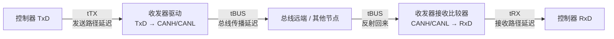
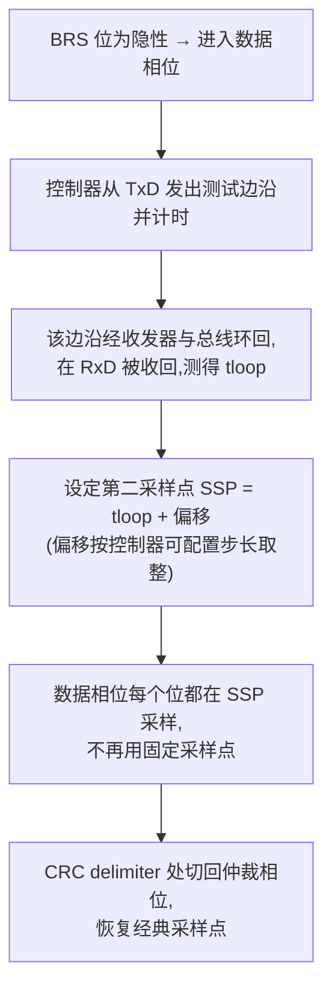

## 适用读者 / 前置知识

- **适用读者**:嵌入式工程师与模拟 IC 工程师——特别是想知道"为什么 2 Mbit/s 以上必须开 TDC""TDC 到底在补偿什么"的人。
- **前置知识**:先读完[位定时入门](03-bit-timing-basics.md)(位时间四段、采样点、相位裕度)和[位定时配置实战](06-bit-timing-config.md)(双相位配置)。对收发器的发送/接收两条路径有基本概念即可。

## 正文

### BRS 之后,时间预算变紧张了

CAN FD 靠 **BRS(Bit Rate Switch)** 把数据相位切到高速率:仲裁相位用经典速率保证多节点竞争兼容,数据相位提速提升吞吐。一切看起来只是"把时钟调快"。但快起来之后,一个此前被忽视的量开始占据位时间的大头——**环回延迟(loop delay)**。

回顾数据位时间:一位只有 `1 / 数据相位速率` 那么长。以 5 Mbit/s 为例,**一位只有 200 ns**。而"控制器 TxD 发出 → 收发器驱动 → 总线传播 → 接收比较器 → 回到 RxD"这条完整环路的延迟,以典型 CAN FD 收发器为例可达**约 210 ns**(如 NXP TJA1044GT 数据手册给出的典型环回延迟)。也就是说:环回延迟已经**超过一个数据位时间**。

控制器在数据相位既要发送、又要回读总线确认自己发的内容(发送方同样要采样,仲裁/错误检测依赖回读),如果它还按仲裁相位那套"固定采样点"采样,采样时刻要么落在自己发出去的位还没绕回来的时候,要么被上一位的回波干扰——结果就是错误帧。

### 环路延迟从哪来:三段分解

环回延迟可以分解成三段,看这张图:



- **tTX(发送路径延迟)**:TxD 电平变化到总线差分电平建立所需的时间,由驱动级、输出级整形等决定;
- **tBUS(总线传播延迟)**:信号沿双绞线从本节点到最远节点的传播时间,取决于线缆长度与传播速度(约 5 ns/m 量级,具体以线缆为准);
- **tRX(接收路径延迟)**:总线差分电平变化到 RxD 逻辑电平建立所需的时间,由接收比较器与滤波决定。

**环回延迟 t_loop = tTX + tBUS + tRX**。在仲裁相位,这个值必须被位时间的**传播段(Prop Seg)**吸收,所以它直接限制了总线长度和仲裁速率;在数据相位,传播段被压缩到很小(见[位定时配置实战](06-bit-timing-config.md)),环回延迟反而超过了位时间——这就是必须引入 TDC 的原因。

### TDC:把采样推迟到环回完成之后

**TDC(Transmitter Delay Compensation,收发器延迟补偿)** 的思路非常直接:与其祈祷"延迟别超过传播段",不如**把延迟测出来,然后把采样点推迟到环回完成之后**。

具体流程:



- **SSP(Secondary Sample Point,第二采样点)** 是数据相位实际采样的时刻,位置由控制器根据实测环回延迟动态算出,而不是按位时间百分比固定配置;
- TDC 只用于**数据相位**;仲裁相位仍用经典采样点(仲裁竞争、ACK 需要所有节点在同一套规则下工作);
- TDC 补偿掉的是**延迟的大小**。它无法补偿的是延迟的**变化**——这正是收发器传播延迟**对称性**和环回延迟**稳定性**重要的原因,详见[传播延迟对称性教程](09-delay-symmetry.md)。

> **TDC 首见于 Bosch 2012 年 CAN FD 规范**:规范第 8 章 *Bit Timing Requirements* 第 8.1 节 *Transceiver Delay Compensation* 首次定义了该机制,后被 ISO 11898-1 标准化。想读第一手定义,直接看这份免费 PDF 的第 8 章。

### 一句话理解"谁该为高速数据相位负责"

| 环节 | 负责什么 | 失效后果 |
|---|---|---|
| 控制器 | 使能 TDC、按收发器手册设 SSP 偏移 | 不使能则数据相位 ≥2 Mbit/s 基本不可用 |
| 收发器 | 环回延迟尽量小、稳定;Tx/Rx 对称 | 对称性差 → TDC 补偿误差大 → 裕度不足 |
| 系统 | 拓扑尽量短、桩线短、终端正确 | 反射/振铃叠加到采样点,边沿抖动 |

三条缺一不可:控制器不补偿,高速上不去;收发器不对称,补偿了也不准;网络不干净,采样点还是会踩到振铃。

## 关键结论

1. BRS 切到数据相位后,位时间(5 Mbit/s 时 200 ns)与典型收发器环回延迟(约 200 ns 量级)同量级,固定采样点必然失效,必须依赖 TDC。
2. 环回延迟 = tTX + tBUS + tRX;仲裁相位靠传播段吸收它,数据相位靠 TDC 补偿它。
3. TDC 的要点:测出实际环回延迟,把数据相位采样推迟到**第二采样点 SSP**;只作用于数据相位,仲裁相位不变。
4. TDC 概念最早出现在 **Bosch CAN FD Specification v1.0(2012)第 8 章**,后标准化进 ISO 11898-1;它补偿的是延迟大小,补偿精度取决于收发器延迟对称性与稳定性。

## 动手验证

**① 用数据手册做一次"不使能 TDC 会怎样"的推算**(不需要硬件):

1. 查你用的收发器数据手册,找到**环回延迟(loop delay / loop delay symmetry)**典型值与最大值(例如 TJA1044GT 数据手册给出约 210 ns 量级);
2. 算 5 Mbit/s 数据位时间:1 / 5 Mbit/s = 200 ns;
3. 对比:环回延迟已超出一个位时间。再算 2 Mbit/s:位时间 500 ns,环回延迟约占 40%——如果控制器固定采样点设在 80% 位时间处,采样时自己发出的边沿还没回来,必错;
4. 结论落到纸上:数据相位 ≥2 Mbit/s 时,控制器必须使能 TDC。

**② 在真实控制器上开关 TDC 对比**(嵌入式):

```bash
# 数据相位 5 Mbit/s
sudo ip link set can0 up type can bitrate 500000 sample-point 75% \
  dbitrate 5000000 dsample-point 80% fd on

# 回环抓错误统计
ip -s -details link show can0
candump can0 -n 20 &
cansend can0 123##11122334455667788        # FD + BRS
```

观察:若控制器驱动允许关闭 TDC(或采样点远超环回延迟),错误计数立刻增长;开启 TDC 后恢复。不同控制器的 TDC 开关与 SSP 偏移寄存器名不同,**以控制器数据手册为准**。

**③ 推导题**:把上面①里的收发器换成一个环回延迟 110 ns 的器件,重算它在 2 Mbit/s(500 ns)和 5 Mbit/s(200 ns)下的"环回延迟占位时间比",并判断哪个速率必须依赖 TDC。(答案:2 M 约占 22%,5 M 约占 55%,都要 TDC;但 5 M 下固定采样点完全不可行。)

## 参见

- 词条:[TDC](../glossary/tdc.md)、[BRS](../glossary/brs.md)、[环路延迟](../glossary/loop-delay.md)、[采样点](../glossary/sample-point.md)、[相位裕度](../glossary/phase-margin.md)、[传播延迟对称性](../glossary/propagation-delay-symmetry.md)、[传播段](../glossary/propagation-segment.md)
- 标准规范:[Bosch CAN FD Specification v1.0(第 8 章 TDC 源头)](../resources/_entries/standards/bosch-2012-canfd-spec.md)、[ISO 11898-1 (2024)](../resources/_entries/standards/iso-11898-1-2024.md)、[CiA 601-3(位定时配置与评估工具)](../resources/_entries/standards/cia-601-3-bit-timing.md)、[CiA 601-1(物理接口实现与延迟对称性)](../resources/_entries/standards/cia-601-1-physical-interface.md)
- 论文:[Hartwich 2012: CAN with Flexible Data-Rate](../resources/_entries/papers/2012-hartwich-can-fd.md)
- 教程:[位定时入门](03-bit-timing-basics.md)、[位定时配置实战](06-bit-timing-config.md)、[收发器传播延迟对称性:概念、预算与测量](09-delay-symmetry.md)
