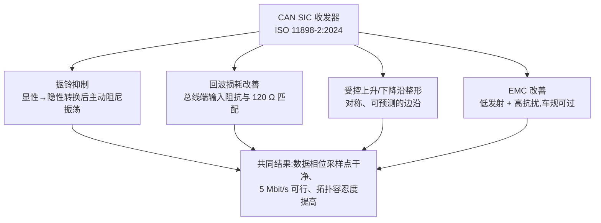
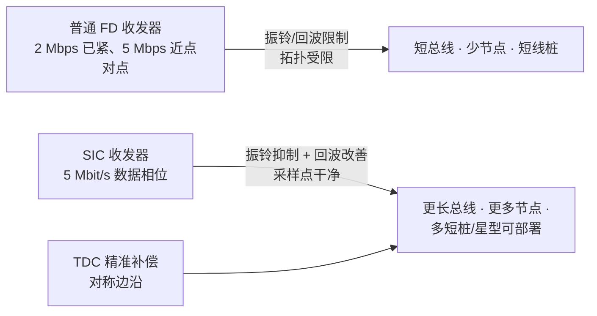

## 适用读者 / 前置知识

- **适用读者**:模拟 IC 工程师为主,也适合想搞清楚"SIC 到底改善了什么"的嵌入式工程师。
- **前置知识**:读过[位定时入门](03-bit-timing-basics.md)与 [BRS 与 TDC](04-brs-tdc.md),知道数据相位高速率为什么难;对收发器概念有基本认识(可先看[收发器词条](../glossary/transceiver.md))。

## 正文

### SIC 是一个"能力等级",不是一种新协议

**CAN SIC(Signal Improvement Capability,信号改善能力)** 描述的是**收发器物理层的信号质量能力**,不改变 CAN FD 帧格式本身。它的规范本体是 **ISO 11898-2:2024**(前身为 CiA 601-4,2023 年撤回、内容并入 ISO 标准)。同一条标准里,ISO 11898-2:2024 同时规定了经典 HS、CAN FD、CAN SIC 与 CAN SIC XL 全部高速 PMA 选项——SIC 是其中信号要求最高的那一档。

一句话记忆:

> **帧格式的进步归 ISO 11898-1(CAN FD),物理层信号质量的进步归 ISO 11898-2:2024 的 SIC 条款。**

### 为什么要 SIC:普通 CAN FD 收发器在高数据率下的瓶颈

普通 CAN FD 收发器按 **ISO 11898-2:2016** 设计,在 ≤2 Mbit/s 数据相位时工作良好;但到了 **5 Mbit/s 数据相位**(位时间仅 200 ns),问题集中爆发:

- **显性→隐性转换后总线会振铃**:总线由线缆电感和分布式电容构成,显性→隐性转换时驱动器"放手",残留电荷与电感形成欠阻尼 LC 振荡。振铃幅度可能越过接收器阈值,被误判成新的显性位,或落在采样点上造成位错误;
- **阻抗失配放大反射**:长桩线、非理想终端、星型拓扑下,反射波叠加到原信号上,眼图收窄;
- **TDC 抖动**:振铃使边沿位置抖动,控制器 TDC 测到的环回延迟不再稳定,补偿不准。

Adamson 等(NXP)在 2020 年的论文里明确描述:传统 HS-CAN 收发器在 5 Mbps 下**基本只能点对点工作**,多节点网络的反射/振铃限制了拓扑。SIC 正是为解除这个限制而生。

### SIC 的四大能力

1. **振铃抑制(核心)**:在显性→隐性转换后,把振铃幅度与持续时间压到规范限值内(ISO 11898-2:2024 对转换后的振铃幅度与"振铃抑制窗口"提出量化要求)。这是 SIC 与普通 FD 收发器在**波形层面**最直观的区别,单独成篇:[振铃抑制原理与测量](08-ringing-suppression.md)。
2. **回波损耗改善**:收发器总线端阻抗与总线特征阻抗(120 Ω)的匹配程度用 dB 表示,数值越大反射越少;SIC 要求在高数据率相关频率范围内保持足够好的回波损耗,否则高速边沿的高频成分会被反射回来叠加成振铃。
3. **受控上升/下降沿整形**:对称、受控的边沿既保证高速采样时刻信号已稳定,又避免过陡沿带来过多高频分量;沿整形同时是 EMC 与时序的折衷点。
4. **EMC 改善**:更干净的输出与受控沿,配合共模扼流圈等外部措施,使网络更容易通过 IEC 62228-3 / CISPR 25 的车规 EMC 评估。

### 普通 CAN FD 收发器 vs SIC:一表看懂

| 维度 | 普通 CAN FD(ISO 11898-2:2016) | CAN SIC(ISO 11898-2:2024) |
|---|---|---|
| 规范依据 | ISO 11898-2:2016(已撤回,存量设计参考) | ISO 11898-2:2024(前身 CiA 601-4) |
| 显性→隐性转换后 | 振铃自然衰减,幅度/时长不受限 | 主动抑制,幅度与窗口受量化约束 |
| 回波损耗 | 基本要求 | 更严格的高频回波损耗要求 |
| 输出沿 | 常规驱动 | 受控/整形,兼顾时序与 EMC |
| 数据相位目标 | 稳健支撑 ≤2 Mbit/s | 支持 5 Mbit/s(器件可至 8 Mbit/s) |
| 拓扑容忍 | 短线、简单拓扑 | 更长总线、多短桩、星型可容 |

> 具体数值一律以 ISO 11898-2:2024 条款与器件数据手册为准;本表只做定性与能力等级对比,不替代规范原文。

### SIC 换来的系统级收益:5 Mbit/s 与更大的网络

- **数据相位 5 Mbit/s**:配合控制器 TDC,数据吞吐较 2 Mbit/s 翻倍以上;
- **拓扑自由度**:同一套 SIC 网络里可以容忍更长的桩线与更多节点,整车的网络设计、接插件与线束要求可以放宽——这是"信号改善能力"在系统层面真正的价值;
- **部署成本**:无需为高速率把网络改成纯点对点,节省线束与中继/网关。

### SIC 在物理层演进中的位置

CAN FD 收发器代际:经典 HS → CAN FD(ISO 11898-2:2016)→ **CAN SIC(ISO 11898-2:2024)** → CAN SIC XL(与 CAN XL 配套的物理层选项)。SIC 是"CAN FD 时代物理层的最高要求",也是通往 CAN XL 物理层的过渡平台;NXP TJA1463、TI TCAN1463-Q1 等车规器件即按 SIC 设计。

## 关键结论

1. SIC 是收发器的**信号改善能力等级**,不改帧格式;规范本体是 **ISO 11898-2:2024**(前身 CiA 601-4,2023 年撤回并入)。
2. 四大能力:振铃抑制、回波损耗改善、受控沿整形、EMC 协同;其中振铃抑制是波形层面的标志性区别。
3. 传统 FD 收发器 5 Mbit/s 基本只能点对点;SIC 通过让采样点干净,支撑 **5 Mbit/s 数据相位**与更大拓扑(多节点、多短桩、星型)。
4. 判断一颗收发器是不是 SIC:看它宣称符合的规范(ISO 11898-2:2024 / CiA 601-4)以及数据手册中的振铃抑制特性;普通 FD 器件只写 ISO 11898-2:2016。

## 动手验证

**① 对照两份数据手册**(无需硬件,可上网下载 PDF):

1. 打开 [NXP TJA1044(ISO 11898-2:2016,普通 FD)](../resources/_entries/vendors/nxp-tja1044.md)与 [NXP TJA1463(ISO 11898-2:2024 SIC)](../resources/_entries/vendors/nxp-tja1463.md)(或 TI 对偶器件)的数据手册;
2. 在"电气特性"里分别找:环回延迟/位时序对称性、振铃抑制(ringing suppression)、压摆率(上升/下降沿)相关参数;
3. 对比:哪些参数在 SIC 器件上出现了普通 FD 器件没有的**指标/测试条款**(如振铃抑制的幅度与窗口、更紧的对称性);
4. 把发现的差异列成表,这就是"SIC 比普通 FD 多测了哪些东西"的第一手答案。

**② 示波器对比(有硬件时)**:同一块 120 Ω 终端的总线板上,先后装 TJA1044 与 TJA1463,用差分探头抓**显性→隐性转换**后的波形,对比振铃幅度与衰减时间(方法见[振铃抑制教程](08-ringing-suppression.md))。

**③ 阅读原文**:通读 [TI SLLA581 白皮书(中文要点见资源条目)](../resources/_entries/vendors/ti-slla581.md)与 [Adamson 2020 论文](../resources/_entries/papers/2020-adamson-5mbps-networks.md),提炼"为什么 5 Mbps 需要 SIC"的 3 个系统层面理由。

## 参见

- 词条:[CAN SIC](../glossary/can-sic.md)、[振铃抑制](../glossary/ringing-suppression.md)、[回波损耗](../glossary/return-loss.md)、[压摆率](../glossary/slew-rate.md)、[收发器](../glossary/transceiver.md)、[EMI/EMC](../glossary/emi-emc.md)
- 标准规范:[ISO 11898-2 (2024)](../resources/_entries/standards/iso-11898-2-2024.md)、[ISO 11898-2 (2016,历史版)](../resources/_entries/standards/iso-11898-2-2016.md)、[CiA 601-4(SIC,已撤回并入 ISO)](../resources/_entries/standards/cia-601-4-sic.md)
- 厂商资料:[NXP TJA1463 CAN SIC 数据手册](../resources/_entries/vendors/nxp-tja1463.md)、[NXP TJA1044(普通 FD,对标基线)](../resources/_entries/vendors/nxp-tja1044.md)、[TI TCAN1463-Q1 CAN SIC 数据手册](../resources/_entries/vendors/ti-tcan1463-q1.md)、[TI SLLA581 白皮书](../resources/_entries/vendors/ti-slla581.md)
- 论文:[Adamson 2020: CAN signal improvement and designing 5-Mbps networks](../resources/_entries/papers/2020-adamson-5mbps-networks.md)
- 教程:[BRS 与 TDC](04-brs-tdc.md)、[振铃抑制原理与测量](08-ringing-suppression.md)、[收发器传播延迟对称性](09-delay-symmetry.md)
